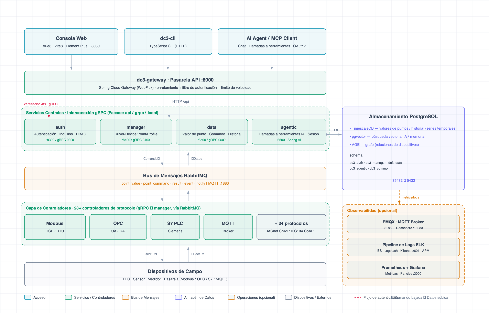

<p align="right">
  <a href="./README.md">English</a> | <a href="./README.zh.md">中文</a> | <a href="./README.ja.md">日本語</a> | <a href="./README.vi.md">Tiếng Việt</a> | <a href="./README.ko.md">한국어</a> | <a href="./README.es.md">Español</a> | <a href="./README.ru.md">Русский</a>
</p>

> **Asistentes de IA:** Lea primero [README.ai.md](./README.ai.md) para obtener una descripción general concisa y
> amigable para IA de IoT DC3.

<p align="center">
  
</p>

<p align="center">
  <a href="https://github.com/pnoker/iot-dc3/stargazers">
    
  </a>
  <a href="https://gitee.com/pnoker/iot-dc3/stargazers">
    
  </a>
  <a href="https://gitee.com/pnoker/iot-dc3/members">
    
  </a>
  <a href="https://github.com/pnoker/iot-dc3/graphs/contributors">
    
  </a>
  
  
  
</p>

<p align="center">
  <strong>
    IoT DC3 — plataforma de código abierto de IoT industrial, multiprotocolo, impulsada por IA y nativa de la nube.<br>
    Microservicios nativos de la nube · Conectividad multiprotocolo · Operaciones asistidas por IA · 28 controladores listos para usar
  </strong>
</p>

<p align="center">
  <a href="https://docs.dc3.site">https://docs.dc3.site</a>
</p>

<p align="center">
  🔌 <strong>Conectividad multiprotocolo</strong> &nbsp;·&nbsp;
  🤖 <strong>AI Agentic Center</strong> &nbsp;·&nbsp;
  ☁️ <strong>Microservicios nativos de la nube</strong>
</p>

---

## 📸 Vista previa del producto

<table>
  <tr>
    <th width="33%">📸 Resumen de la plataforma</th>
    <th width="33%">📸 Gestión de dispositivos</th>
    <th width="33%">📸 Chat con IA</th>
  </tr>
  <tr>
    <td align="center">
      
      <br>
      <strong>Inicio / Panel de control</strong><br>
      <em>Resumen del sistema · Métricas de dispositivos en línea · Gráficos de tendencias de datos</em>
    </td>
    <td align="center">
      
      <br>
      <strong>Gestión de dispositivos</strong><br>
      <em>Lista de dispositivos · Estado en línea · Búsqueda y filtrado</em>
    </td>
    <td align="center">
      
      <br>
      <strong>Chat con IA</strong><br>
      <em>Consultas de dispositivos en lenguaje natural · Análisis de datos · Asistencia inteligente</em>
    </td>
  </tr>
</table>

## 🏗️ Resumen de arquitectura

### Arquitectura de un vistazo



Arquitectura de microservicios en seis capas de un vistazo: clientes → puerta de enlace → cuatro servicios centrales →
bus de mensajes → 28 controladores de protocolo → dispositivos de campo. PostgreSQL (TimescaleDB + pgvector + AGE) para
persistencia y stack de observabilidad opcional (ELK + Prometheus + Grafana) presentados en una sola vista.

🧱 **Principios de diseño** — Las llamadas entre servicios siempre se realizan a través de interfaces Facade; el modelo
de tres niveles DO/BO/VO mantiene estrictamente separadas la persistencia, la lógica de negocio y las formas de API; y
el aislamiento de inquilinos se aplica de extremo a extremo en las rutas de base de datos, caché y API. Límites claros
que escalan entre servicios y equipos.

> 📖 Para la documentación completa de la arquitectura,
> consulte [Descripción general de la arquitectura del sistema](https://docs.dc3.site/en/architecture/).

## ✨ Características principales

### 🔌 Conectividad de dispositivos multiprotocolo

IoT DC3 incluye **28 módulos de controladores de acceso** para automatización industrial, comunicaciones IoT, puenteo de
datos, comunicaciones básicas y escenarios de simulación/depuración, reduciendo el costo de conectar dispositivos y
fuentes de datos comunes:

| Categoría                                      | Módulos de controladores                                                                                                                           |
|------------------------------------------------|----------------------------------------------------------------------------------------------------------------------------------------------------|
| 🏭 **Protocolos industriales**                 | Modbus TCP · Modbus RTU · OPC UA · OPC DA · Siemens S7 · BACnet/IP · EtherNet/IP · Omron FINS · Mitsubishi MELSEC · IEC 60870-5-104 · SL651 · DLMS |
| 📡 **Protocolos IoT**                          | MQTT · CoAP · LwM2M · HTTP · BLE · Zigbee                                                                                                          |
| 🗄️ **Puenteo de datos**                       | MySQL · PostgreSQL · Oracle · SQL Server                                                                                                           |
| 🔧 **Comunicaciones básicas y gestión de red** | TCP/UDP · Serial · SNMP · CAN                                                                                                                      |
| 🧪 **Simulación y depuración**                 | Virtual · Listening Virtual                                                                                                                        |

El **Driver SDK** permite el desarrollo rápido de controladores de protocolo personalizados y su registro en la
plataforma de ejecución.

### 🤖 Integración de capacidades de IA

El centro de agentes inteligentes está construido sobre **Spring AI** y conecta modelos de lenguaje de gran tamaño en
los flujos de trabajo de operaciones de IoT:

- **Operaciones asistidas por lenguaje natural** — a través de Tool Calling y bajo control de acceso, los LLM pueden
  consultar dispositivos, leer/escribir puntos de datos y ayudar con la ejecución de comandos
- **Análisis inteligente de alarmas** — la IA ayuda con el análisis de causa raíz y sugerencias de respuesta
- **Perspectivas de datos** — consulta de datos de dispositivos en lenguaje natural y generación de gráficos de
  visualización
- **Soporte multi-modelo** — compatible con proveedores estilo API de OpenAI y modelos principales como GPT, Claude,
  DeepSeek y Qwen
- **Memoria de conversación** — conversaciones de múltiples turnos y memoria de contexto persistida en la base de datos

### 🏗️ Microservicios nativos de la nube

Arquitectura de microservicios distribuida basada en **Spring Boot 4 + Spring Cloud 2025**:

- **Gobernanza de servicios** — Spring Cloud Gateway como punto de entrada unificado, con enrutamiento estático y
  variables de entorno flexibles
- **Comunicación eficiente** — llamadas entre servicios mediante gRPC con serialización Protobuf
- **Escalado horizontal** — diseño sin estado para escalar servicios individuales según la carga de trabajo
- **Resiliencia** — nodos de servicio reemplazables y aislamiento de fallos

### 📊 Motor de datos en tiempo real

- **Recopilación de datos** — los controladores recopilan telemetría de dispositivos y la envían de forma asíncrona a
  través de RabbitMQ
- **Almacenamiento de series temporales** — consultas eficientes para datos en tiempo real e históricos
- **Motor de reglas** — reglas de alarma flexibles con alarmas multinivel y notificaciones
- **Trazabilidad de eventos** — historial completo de comandos y eventos

### 🔐 Seguridad empresarial y multiinquilinos

- **Aislamiento de inquilinos** — aislamiento a nivel de inquilinos en las rutas de base de datos, caché y API
- **Autenticación y autorización** — JWT + Spring Security con modelo RBAC
- **Cifrado en tránsito** — soporte para comunicación TLS/SSL
- **Seguimiento de auditoría** — registros de operaciones de usuarios y eventos del sistema

### 🧩 Amigable para desarrolladores

- **Driver SDK** — un kit de herramientas completo para el desarrollo de controladores. Consulte
  la [Guía de creación de controladores](https://docs.dc3.site/en/development/driver-authoring)
- **Frontend y backend separados** — frontend Vue 3 + TypeScript, APIs RESTful y gRPC
- **Despliegue contenedorizado** — inicio con un comando mediante Podman / Docker Compose, con camino hacia Kubernetes y
  otras plataformas contenedorizadas
- **Documentación completa** — documentación en línea, guía de inicio rápido y guía de solución de problemas

## ⚡ Inicio rápido

Para el desarrollo local basado en fuente, inicie PostgreSQL y RabbitMQ, cargue las variables de entorno locales y luego
compile:

```bash
make up-db
source dc3/env/dev.env.sh
mvn -s .mvn/settings.xml clean package
```

Use `make up-db-cn` si prefiere el registro de Alibaba Cloud en China continental.

> 📖 Para el orden de inicio de servicios, configuración de IDE, comandos de verificación y problemas comunes,
> consulte el [Inicio rápido completo](https://docs.dc3.site/en/quickstart/).

## 🛠️ Stack tecnológico

IoT DC3 está construido sobre Java 21, Spring Boot 4, Spring Cloud 2025, Spring AI 2, PostgreSQL, RabbitMQ, gRPC, Vue 3,
TypeScript y Vite.

Consulte [Stack tecnológico](https://docs.dc3.site/en/introduction/technology-stack) para obtener detalles de los
componentes y dónde se utiliza cada tecnología.

## 📖 Documentación y comunidad

| Recurso                        | Enlace                                                                                     |
|--------------------------------|--------------------------------------------------------------------------------------------|
| 📚 Documentación en línea      | [docs.dc3.site](https://docs.dc3.site/)                                                    |
| 🚀 Inicio rápido               | [Guía de inicio rápido](https://docs.dc3.site/en/quickstart/)                              |
| 🛠️ Stack tecnológico          | [Technology Stack](https://docs.dc3.site/en/introduction/technology-stack)                 |
| 🏗️ Arquitectura               | [Módulos y dependencias](https://docs.dc3.site/en/architecture/modules)                    |
| 🔧 Desarrollo de controladores | [Guía de creación de controladores](https://docs.dc3.site/en/development/driver-authoring) |
| 🐛 Solución de problemas       | [Solución de problemas](https://docs.dc3.site/en/guide/troubleshooting)                    |
| 📋 Registro de cambios         | [Registro de cambios de versión](https://docs.dc3.site/en/development/changelog)           |
| 🐛 Reporte de problemas        | [GitHub Issues](https://github.com/pnoker/iot-dc3/issues)                                  |
| 🇨🇳 Espejo de Gitee           | [Proyecto GVP de Gitee](https://gitee.com/pnoker/iot-dc3)                                  |

## 🌍 Casos de uso

<table>
  <tr>
    <td align="center" width="60">🏭</td>
    <td><strong>Fábrica inteligente</strong></td>
    <td>Monitoreo de equipos en líneas de producción, recopilación de parámetros de proceso, mantenimiento predictivo y análisis OEE</td>
  </tr>
  <tr>
    <td align="center">⚡</td>
    <td><strong>Monitoreo de energía</strong></td>
    <td>Medición remota de electricidad, agua y gas; análisis de tendencias energéticas; alarmas anómalas</td>
  </tr>
  <tr>
    <td align="center">🌾</td>
    <td><strong>Agricultura inteligente</strong></td>
    <td>Monitoreo ambiental de invernaderos, control automático de riego, alertas de plagas y enfermedades, pronóstico de rendimiento</td>
  </tr>
  <tr>
    <td align="center">🏙️</td>
    <td><strong>Ciudad inteligente</strong></td>
    <td>Gestión de alumbrado público, monitoreo de calidad ambiental, operación de instalaciones municipales, monitoreo de seguridad</td>
  </tr>
</table>

## 🤝 Contribuir

Se da la bienvenida a todo tipo de contribuciones. Siga este flujo de trabajo:

1. **Fork y rama** — Cree una rama desde `main`, usando el formato `feature/your_name/feature_description`
   (por ejemplo: `feature/pnoker/mqtt_driver`)
2. **Desarrollar y confirmar** — Complete sus cambios en la nueva rama y siga la
   especificación [Conventional Commits](https://www.conventionalcommits.org/)
3. **Abrir un PR** — Envíe un Pull Request a la rama `develop` para revisión y fusión por parte de los mantenedores

## 📄 Licencia

IoT DC3 es de código abierto bajo la licencia [AGPL 3.0](./LICENSE-AGPL.txt).

- ✅ **Aprendizaje personal, investigación y uso interno** — Gratis
- ✅ **Modificar el código y publicar sus cambios como código abierto** — Bienvenido
- ⚠️ **Ofrecerlo como servicio comercial a terceros sin publicar las modificaciones como código abierto** — Requiere
  licencia comercial

Para detalles de licenciamiento comercial, consulte [LICENSE.txt](./LICENSE.txt).

## ⭐ Historial de estrellas

[](https://star-history.com/#pnoker/iot-dc3&Date)
