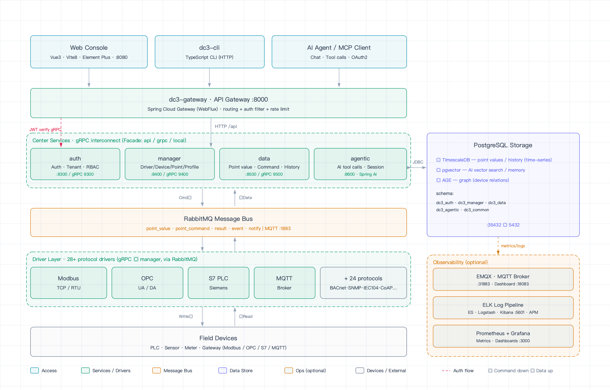
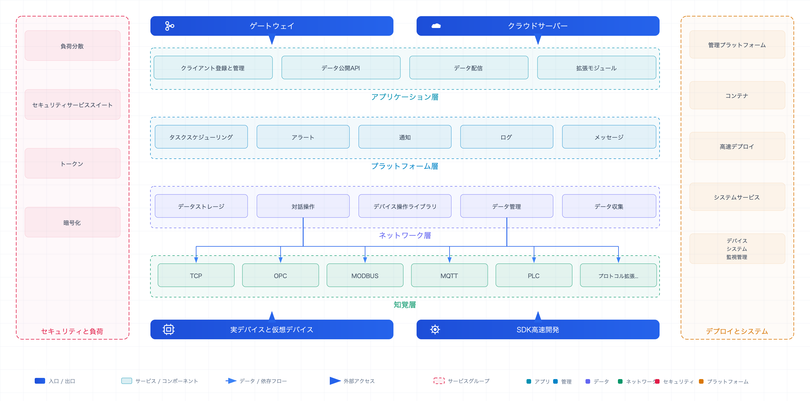

<p align="right">
  <a href="./README.md">English</a> | <a href="./README.zh.md">中文</a> | <a href="./README.ja.md">日本語</a> | <a href="./README.vi.md">Tiếng Việt</a>
</p>

> **AI アシスタント：** IoT DC3 の簡潔な AI 向け概要については、最初に [README.ai.md](./README.ai.md) をお読みください。

<p align="center">
  
</p>

<p align="center">
  <a href="https://github.com/pnoker/iot-dc3/stargazers">
    
  </a>
  <a href="https://gitee.com/pnoker/iot-dc3/stargazers">
    
  </a>
  <a href="https://gitee.com/pnoker/iot-dc3/members">
    
  </a>
  <a href="https://github.com/pnoker/iot-dc3/graphs/contributors">
    
  </a>
  
  
  
</p>

<p align="center">
  <strong>
    IoT DC3 — マルチプロトコル接続・AI 活用・クラウドネイティブなオープンソース産業 IoT プラットフォーム<br>
    クラウドネイティブマイクロサービス · マルチプロトコル接続 · AI 支援運用 · 28 個のすぐ使えるドライバー
  </strong>
</p>

<p align="center">
  🔌 <strong>マルチプロトコル接続</strong> &nbsp;·&nbsp;
  🤖 <strong>AI Agentic Center</strong> &nbsp;·&nbsp;
  ☁️ <strong>クラウドネイティブマイクロサービス</strong>
</p>

---

## 📸 プロダクトプレビュー

<table>
  <tr>
    <th width="33%">📸 プラットフォーム概要</th>
    <th width="33%">📸 デバイス管理</th>
    <th width="33%">📸 AI チャット</th>
  </tr>
  <tr>
    <td align="center">
      
      <br>
      <strong>ホーム / ダッシュボード</strong><br>
      <em>システム概要 · デバイスオンライン統計 · データトレンドチャート</em>
    </td>
    <td align="center">
      
      <br>
      <strong>デバイス管理</strong><br>
      <em>デバイス一覧 · オンライン状態 · 検索とフィルタ</em>
    </td>
    <td align="center">
      
      <br>
      <strong>AI チャット</strong><br>
      <em>自然言語によるデバイス照会 · データ分析 · インテリジェント支援</em>
    </td>
  </tr>
</table>

## ✨ 主な機能

### 🔌 マルチプロトコルデバイス接続

IoT DC3 は **28 個の接続ドライバーモジュール**を内蔵し、産業オートメーション、IoT
通信、データブリッジ、基本通信、シミュレーションとデバッグのシナリオをカバーします。一般的なデバイスやデータソースの接続コストを下げます。

| 分類                   | ドライバーモジュール                                                                                                                                         |
|----------------------|----------------------------------------------------------------------------------------------------------------------------------------------------|
| 🏭 **産業プロトコル**       | Modbus TCP · Modbus RTU · OPC UA · OPC DA · Siemens S7 · BACnet/IP · EtherNet/IP · Omron FINS · Mitsubishi MELSEC · IEC 60870-5-104 · SL651 · DLMS |
| 📡 **IoT プロトコル**     | MQTT · CoAP · LwM2M · HTTP · BLE · Zigbee                                                                                                          |
| 🗄️ **データブリッジ**      | MySQL · PostgreSQL · Oracle · SQL Server                                                                                                           |
| 🔧 **基本通信とネットワーク管理** | TCP/UDP · Serial · SNMP · CAN                                                                                                                      |
| 🧪 **シミュレーションとデバッグ** | Virtual · Listening Virtual                                                                                                                        |

**Driver SDK** により、カスタムプロトコルドライバーをすばやく開発し、実行中のプラットフォームへ登録できます。

### 🤖 AI 機能統合

**Spring AI** ベースの Agentic Center により、大規模言語モデルを IoT 運用ワークフローへ接続します。

- **自然言語による運用支援** - LLM が Tool Calling を通じて、権限管理のもとでデバイス照会、ポイント読み書き、コマンド実行を支援します
- **インテリジェントなアラーム分析** - AI が原因分析と対応提案を支援します
- **データインサイト** - 自然言語でデバイスデータを照会し、可視化チャートを生成します
- **複数モデル対応** - OpenAI API 互換プロバイダーや GPT、Claude、DeepSeek、Qwen などの主要モデルに対応します
- **会話メモリ** - 複数ターンの会話とコンテキストメモリをデータベースへ永続化します

### 🏗️ クラウドネイティブマイクロサービス

**Spring Boot 4 + Spring Cloud 2025** を基盤とする分散マイクロサービスアーキテクチャです。

- **サービスガバナンス** - Spring Cloud Gateway を統一入口とし、静的ルーティングと環境変数で柔軟に設定できます
- **効率的な通信** - gRPC によるサービス間呼び出しと Protobuf シリアライズ
- **水平スケール** - ステートレス設計により、業務負荷に応じてサービスを個別にスケールできます
- **レジリエンス** - 交換可能なサービスノードと障害分離

### 📊 リアルタイムデータエンジン

- **データ収集** - ドライバー層がデバイステレメトリを収集し、RabbitMQ 経由で非同期に転送します
- **時系列ストレージ** - リアルタイムデータと履歴データを効率的にクエリできます
- **ルールエンジン** - 柔軟なアラームルール、多段階アラーム、通知をサポートします
- **イベント追跡** - コマンドとイベントの履歴を保持します

### 🔐 エンタープライズセキュリティとマルチテナンシー

- **テナント分離** - データベース、キャッシュ、API パスでテナント単位の分離を行います
- **認証と認可** - JWT + Spring Security、RBAC 権限モデル
- **通信暗号化** - TLS/SSL 通信をサポートします
- **監査追跡** - ユーザー操作とシステムイベントのログを保持します

### 🧩 開発者フレンドリー

- **Driver SDK** -
  充実したドライバー開発ツールキットです。[ドライバー開発ガイド](https://pnoker.github.io/iot-dc3/development/driver-authoring)
  を参照してください
- **フロントエンド / バックエンド分離** - Vue 3 + TypeScript フロントエンド、RESTful + gRPC API
- **コンテナ化デプロイ** - Podman / Docker Compose でワンコマンド起動でき、Kubernetes などのコンテナプラットフォームへ移行しやすい構成です
- **ドキュメント整備** - オンラインドキュメント、クイックスタート、トラブルシューティングガイド

## ⚡ クイックスタート

### 前提条件

| 依存関係              | バージョン |
|-------------------|-------|
| Java (JDK)        | 21+   |
| Maven             | 3.9+  |
| Podman または Docker | 最新安定版 |

### 3 ステップで起動

**① リポジトリをクローン**

```bash
git clone https://github.com/pnoker/iot-dc3.git
cd iot-dc3
```

**② 基本依存関係を起動**（PostgreSQL + RabbitMQ）

```bash
# グローバルレジストリ
make up-db

# 中国大陸のユーザー向け（Alibaba Cloud レジストリ）
make up-db-cn
```

**③ ローカル環境変数を読み込み、ビルドして起動**

```bash
source dc3/env/dev.env.sh
mvn -s .mvn/settings.xml clean package
```

`dc3/env/dev.env.sh` は、ローカル Java プロセスを `localhost` に公開された PostgreSQL、RabbitMQ、gRPC ポートへ接続します。
以降の `java -jar` コマンドは同じターミナルセッションで実行してください。

順番にサービスを起動します。

```bash
java -jar dc3-gateway/target/dc3-gateway.jar                          # API ゲートウェイ
java -jar dc3-center/dc3-center-auth/target/dc3-center-auth.jar        # 認証センター
java -jar dc3-center/dc3-center-manager/target/dc3-center-manager.jar  # 管理センター
java -jar dc3-center/dc3-center-data/target/dc3-center-data.jar        # データセンター
java -jar dc3-center/dc3-center-agentic/target/dc3-center-agentic.jar  # AI Agentic Center
java -jar dc3-driver/dc3-driver-virtual/target/dc3-driver-virtual.jar  # デモ用仮想ドライバー
```

> 📖 詳細なローカル環境構築については、[クイックスタート](https://pnoker.github.io/iot-dc3/quickstart/)と
> [環境変数](https://pnoker.github.io/iot-dc3/quickstart/environment)を参照してください。

<details>
<summary>🔧 その他の起動オプション（任意依存関係、単一サービス起動、環境変数）</summary>

**任意のインフラを起動**（EMQX、ELK/APM、Prometheus、Grafana など）:

```bash
make up-optional-cn              # 任意依存関係を起動
make up-db-cn && make up-optional-cn && make up-dev-cn  # すべての依存関係を起動
```

**必要なサービスだけ起動**（フロントエンド / API テスト向け）:

```bash
make up SERVICES=agentic REGISTRY=cn               # 単一サービス
make up SERVICES="gateway agentic" REGISTRY=cn      # 複数サービス
make up GROUP=core REGISTRY=cn                      # コアサービスグループ
make up GROUP=drivers REGISTRY=cn                   # ドライバーサービスグループ
make logs SERVICES="gateway agentic"                # ログを確認
```

**Compose 環境変数の上書き**:

```bash
cp .env.example .env    # テンプレートをコピー
```

ルート `.env` は、イメージレジストリ、イメージタグ、公開ポートなど Compose の変数展開に使われます。
アプリケーション実行時の変数は `dc3/env/dev.env`
で設定します。詳しくは[環境変数ドキュメント](https://pnoker.github.io/iot-dc3/quickstart/environment)を参照してください。

</details>

## 🏗️ アーキテクチャ概要

### 製品アーキテクチャ全景



6層マイクロサービスアーキテクチャの全体像：クライアント → ゲートウェイ → 4つのセンターサービス → メッセージバス → 28
プロトコルドライバー → フィールドデバイス。PostgreSQL（TimescaleDB + pgvector + AGE）永続層とオプションの可観測性スタック（ELK

+ Prometheus + Grafana）を一望。

### 4層リファレンスアーキテクチャマッピング



IoT業界標準の4層リファレンスアーキテクチャ — アプリケーション、プラットフォーム、ネットワーク、知覚 — に加え、4層を横断するセキュリティ。

| 層             | IoT リファレンス責務                   | DC3 実装                            |
|---------------|--------------------------------|-----------------------------------|
| **アプリケーション層** | 運用 · アラート · データ分析 · AIoT       | 運用 · Agentic センター · MCP           |
| **プラットフォーム層** | デバイス管理 · データ保存 · ルールと計算        | センターサービス · データプレーン · TimescaleDB  |
| **ネットワーク層**   | フィールドバス · IoT プロトコル · 無線 / WAN | 28 プロトコルドライバー · ゲートウェイ · RabbitMQ |
| **知覚層**       | センシング · 自動識別 · アクチュエータ         | プロファイル · デバイス · ポイント              |

🧱 **設計原則** — サービス間呼び出しは常に Facade インターフェース経由；DO/BO/VO の三層モデルで永続化・ビジネス・API
の形を厳密に分離；テナント分離をデータベース・キャッシュ・API パスまで一貫して適用。境界が明確で、サービスとチームの規模拡大に強い設計です。

> 📖
>
完全なアーキテクチャドキュメントについては、[システムアーキテクチャ概要](https://pnoker.github.io/iot-dc3/architecture/)
> を参照してください。

## 🛠️ 技術スタック

| 分類                     | 技術                                                          |
|------------------------|-------------------------------------------------------------|
| **言語とフレームワーク**         | Java 21 · Spring Boot 4 · Spring Cloud 2025 · Spring AI 2.0 |
| **データ、キャッシュ、スケジューリング** | PostgreSQL · Caffeine · MyBatis-Plus · Quartz               |
| **メッセージングと通信**         | RabbitMQ · gRPC · MQTT (Paho + EMQX) · Protobuf             |
| **セキュリティと認証**          | Spring Security · JWT · BouncyCastle                        |
| **可観測性**               | Micrometer · Prometheus · Grafana · ELK                     |
| **フロントエンド**            | Vue 3 · TypeScript 6 · Vite 8 · Element Plus · AntV G2/G6   |
| **デスクトップ**             | Tauri 2                                                     |
| **デプロイ**               | Podman · Docker Compose                                     |

> 💡 フロントエンドのソースコードは本リポジトリの `dc3-web/` ディレクトリにあります（旧スタンドアロンリポジトリ
`iot-dc3-web` はアーカイブ済み）。

## 📖 ドキュメントとコミュニティ

| リソース           | リンク                                                                         |
|----------------|-----------------------------------------------------------------------------|
| 📚 オンラインドキュメント | [pnoker.github.io/iot-dc3](https://pnoker.github.io/iot-dc3/)               |
| 🚀 クイックスタート    | [クイックスタートガイド](https://pnoker.github.io/iot-dc3/quickstart/)                 |
| 🏗️ アーキテクチャ    | [モジュールと依存関係](https://pnoker.github.io/iot-dc3/architecture/modules)         |
| 🔧 ドライバー開発     | [ドライバー開発ガイド](https://pnoker.github.io/iot-dc3/development/driver-authoring) |
| 🐛 トラブルシューティング | [よくある問題と解決策](https://pnoker.github.io/iot-dc3/guide/troubleshooting)        |
| 📋 変更履歴        | [リリース変更履歴](https://pnoker.github.io/iot-dc3/development/changelog)          |
| 🐛 問題報告        | [GitHub Issues](https://github.com/pnoker/iot-dc3/issues)                   |
| 🇨🇳 Gitee ミラー | [Gitee GVP プロジェクト](https://gitee.com/pnoker/iot-dc3)                        |

## 🌍 ユースケース

<table>
  <tr>
    <td align="center" width="60">🏭</td>
    <td><strong>スマートファクトリー</strong></td>
    <td>生産ライン設備の状態監視、工程パラメータ収集、予知保全、OEE 分析</td>
  </tr>
  <tr>
    <td align="center">⚡</td>
    <td><strong>エネルギー監視</strong></td>
    <td>電力 / 水道 / ガスの遠隔検針、エネルギー傾向分析、異常アラーム</td>
  </tr>
  <tr>
    <td align="center">🌾</td>
    <td><strong>スマート農業</strong></td>
    <td>温室環境監視、自動灌漑制御、病害虫警告、収量予測</td>
  </tr>
  <tr>
    <td align="center">🏙️</td>
    <td><strong>スマートシティ</strong></td>
    <td>街路灯管理、環境品質監視、公共施設運用、安全監視</td>
  </tr>
</table>

## 🤝 コントリビューション

あらゆる形のコントリビューションを歓迎します。以下の流れに従ってください。

1. **Fork とブランチ作成** - `main` からブランチを作成し、`feature/your_name/feature_description` 形式で命名します
   （例: `feature/pnoker/mqtt_driver`）
2. **開発とコミット** - 新しいブランチで変更を完了し、[Conventional Commits](https://www.conventionalcommits.org/)
   仕様に従います
3. **PR 作成** - `develop` ブランチへ Pull Request を提出し、メンテナーのレビューとマージを受けます

## 📄 ライセンス

IoT DC3 は [AGPL 3.0](./LICENSE-AGPL.txt) ライセンスの下でオープンソースとして公開されています。

- ✅ **個人学習、研究、内部利用** - 無料
- ✅ **コードを変更し、その変更をオープンソース化すること** - 歓迎します
- ⚠️ **変更を公開せず第三者向け商用サービスとして提供する場合** - 商用ライセンスが必要です

商用ライセンスの詳細は [LICENSE.txt](./LICENSE.txt) を参照してください。

## ⭐ Star 履歴

[](https://star-history.com/#pnoker/iot-dc3&Date)
