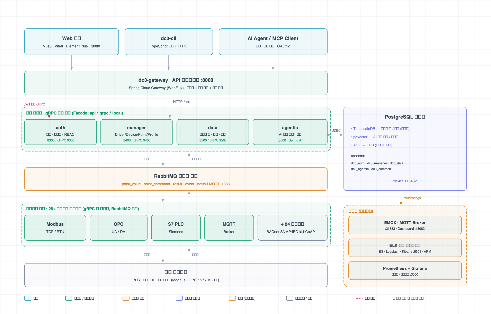

<p align="right">
  <a href="./README.md">English</a> | <a href="./README.zh.md">中文</a> | <a href="./README.ja.md">日本語</a> | <a href="./README.vi.md">Tiếng Việt</a> | <a href="./README.ko.md">한국어</a> | <a href="./README.es.md">Español</a> | <a href="./README.ru.md">Русский</a>
</p>

> **AI 어시스턴트:** IoT DC3의 간결한 AI 친화적 개요를 보려면 먼저 [README.ai.md](./README.ai.md)를 읽어주세요.

<p align="center">
  
</p>

<p align="center">
  <a href="https://github.com/pnoker/iot-dc3/stargazers">
    
  </a>
  <a href="https://gitee.com/pnoker/iot-dc3/stargazers">
    
  </a>
  <a href="https://gitee.com/pnoker/iot-dc3/members">
    
  </a>
  <a href="https://github.com/pnoker/iot-dc3/graphs/contributors">
    
  </a>
  
  
  
</p>

<p align="center">
  <strong>
    IoT DC3 — 멀티 프로토콜, AI 기반, 클라우드 네이티브 오픈소스 산업용 IoT 플랫폼<br>
    클라우드 네이티브 마이크로서비스 · 멀티 프로토콜 연결 · AI 지원 운영 · 28개 즉시 사용 가능한 드라이버
  </strong>
</p>

<p align="center">
  <a href="https://docs.dc3.site">https://docs.dc3.site</a>
</p>

<p align="center">
  🔌 <strong>멀티 프로토콜 연결</strong> &nbsp;·&nbsp;
  🤖 <strong>AI Agentic Center</strong> &nbsp;·&nbsp;
  ☁️ <strong>클라우드 네이티브 마이크로서비스</strong>
</p>

---

## 📸 제품 미리보기

<table>
  <tr>
    <th width="33%">📸 플랫폼 개요</th>
    <th width="33%">📸 디바이스 관리</th>
    <th width="33%">📸 AI 채팅</th>
  </tr>
  <tr>
    <td align="center">
      
      <br>
      <strong>홈 / 대시보드</strong><br>
      <em>시스템 개요 · 디바이스 온라인 통계 · 데이터 트렌드 차트</em>
    </td>
    <td align="center">
      
      <br>
      <strong>디바이스 관리</strong><br>
      <em>디바이스 목록 · 온라인 상태 · 검색 및 필터링</em>
    </td>
    <td align="center">
      
      <br>
      <strong>AI 채팅</strong><br>
      <em>자연어 디바이스 쿼리 · 데이터 분석 · 지능형 지원</em>
    </td>
  </tr>
</table>

## 🏗️ 아키텍처 개요

### 아키텍처 한눈에 보기



6계층 마이크로서비스 아키텍처: 클라이언트 → 게이트웨이 → 4개 센터 서비스 → 메시지 버스 → 28개 프로토콜 드라이버 → 현장 디바이스. PostgreSQL(TimescaleDB + pgvector + AGE)
영속성 계층과 선택적 관찰 가능성 스택(ELK + Prometheus + Grafana)이 한눈에 보입니다.

🧱 **설계 원칙** — 서비스 간 호출은 항상 Facade 인터페이스를 통해 이루어집니다. DO/BO/VO 3계층 모델은 영속성, 비즈니스, API 형태를 엄격히 분리합니다. 테넌트 격리는 데이터베이스, 캐시,
API 경로 전체에 걸쳐 적용됩니다. 서비스와 팀 전반에 걸쳐 확장 가능한 명확한 경계입니다.

> 📖 전체 아키텍처 문서는 [시스템 아키텍처 개요](https://docs.dc3.site/en/architecture/)를 참조하세요.

## ✨ 핵심 기능

### 🔌 멀티 프로토콜 디바이스 연결

IoT DC3는 산업 자동화, IoT 통신, 데이터 브리징, 기본 통신, 시뮬레이션/디버깅 시나리오를 위한 **28개의 접근 드라이버 모듈**을 포함하여 일반적인 디바이스와 데이터 소스의 연결 비용을 줄입니다:

| 카테고리                   | 드라이버 모듈                                                                                                                                            |
|------------------------|----------------------------------------------------------------------------------------------------------------------------------------------------|
| 🏭 **산업 프로토콜**         | Modbus TCP · Modbus RTU · OPC UA · OPC DA · Siemens S7 · BACnet/IP · EtherNet/IP · Omron FINS · Mitsubishi MELSEC · IEC 60870-5-104 · SL651 · DLMS |
| 📡 **IoT 프로토콜**        | MQTT · CoAP · LwM2M · HTTP · BLE · Zigbee                                                                                                          |
| 🗄️ **데이터 브리징**        | MySQL · PostgreSQL · Oracle · SQL Server                                                                                                           |
| 🔧 **기본 통신 및 네트워크 관리** | TCP/UDP · Serial · SNMP · CAN                                                                                                                      |
| 🧪 **시뮬레이션 및 디버깅**     | Virtual · Listening Virtual                                                                                                                        |

**Driver SDK**를 통해 커스텀 프로토콜 드라이버를 빠르게 개발하고 실행 중인 플랫폼에 등록할 수 있습니다.

### 🤖 AI 기능 통합

**Spring AI** 기반의 에이전틱 센터는 대규모 언어 모델을 IoT 운영 워크플로에 연결합니다:

- **자연어 기반 운영 지원** — Tool Calling을 통해 LLM이 권한 관리 하에 디바이스를 쿼리하고, 포인트를 읽/쓰고, 명령 실행을 지원합니다
- **지능형 알람 분석** — AI가 근본 원인 분석과 대응 제안을 지원합니다
- **데이터 인사이트** — 자연어로 디바이스 데이터를 쿼리하고 시각화 차트를 생성합니다
- **멀티 모델 지원** — OpenAI API 스타일 프로바이더와 GPT, Claude, DeepSeek, Qwen 같은 주요 모델을 호환합니다
- **대화 메모리** — 다중 턴 대화와 컨텍스트 메모리를 데이터베이스에 영속화합니다

### 🏗️ 클라우드 네이티브 마이크로서비스

**Spring Boot 4 + Spring Cloud 2025** 기반의 분산 마이크로서비스 아키텍처:

- **서비스 거버넌스** — Spring Cloud Gateway를 통합 진입점으로 사용하며, 정적 라우팅과 유연한 환경 변수 설정
- **효율적인 통신** — gRPC 서비스 간 호출과 Protobuf 직렬화
- **수평적 확장** — 무상태 설계로 비즈니스 부하에 따라 개별 서비스를 독립적으로 확장
- **복원력** — 교체 가능한 서비스 노드와 장애 격리

### 📊 실시간 데이터 엔진

- **데이터 수집** — 드라이버 계층이 디바이스 원격 측정 데이터를 수집하고 RabbitMQ를 통해 비동기적으로 전송
- **시계열 저장** — 실시간 및 이력 데이터의 효율적인 쿼리
- **규칙 엔진** — 유연한 알람 규칙, 다중 수준 알람 및 알림 지원
- **이벤트 추적** — 전체 명령 및 이벤트 이력

### 🔐 엔터프라이즈 보안 및 멀티테넌시

- **테넌트 격리** — 데이터베이스, 캐시, API 경로 전체에 걸친 테넌트 수준 격리
- **인증 및 인가** — JWT + Spring Security, RBAC 권한 모델
- **전송 암호화** — TLS/SSL 통신 지원
- **감사 추적** — 사용자 작업 및 시스템 이벤트 로그

### 🧩 개발자 친화적

- **Driver SDK** — 완비된 드라이버 개발 도구 키트. [드라이버 작성 가이드](https://docs.dc3.site/en/development/driver-authoring) 참조
- **프론트엔드/백엔드 분리** — Vue 3 + TypeScript 프론트엔드, RESTful + gRPC API
- **컨테이너화된 배포** — Podman / Docker Compose로 원커맨드 시작, Kubernetes 등 컨테이너 플랫폼으로 쉽게 마이그레이션
- **완전한 문서** — 온라인 문서, 퀵스타트 가이드, 문제 해결 가이드

## ⚡ 퀵스타트

소스 기반 로컬 개발을 위해 PostgreSQL과 RabbitMQ를 시작하고, 로컬 환경 변수를 로드한 뒤 빌드합니다:

```bash
make up-db
source dc3/env/dev.env.sh
mvn -s .mvn/settings.xml clean package
```

중국 본토에서는 Alibaba Cloud 레지스트리를 사용하려면 `make up-db-cn`을 사용하세요.

> 📖 서비스 시작 순서, IDE 설정, 검증 명령 및 흔한 주의사항은 [전체 퀵스타트](https://docs.dc3.site/en/quickstart/)를 참조하세요.

## 🛠️ 기술 스택

IoT DC3는 Java 21, Spring Boot 4, Spring Cloud 2025, Spring AI 2, PostgreSQL, RabbitMQ, gRPC, Vue 3, TypeScript, Vite
기반으로 구축되었습니다.

구성 요소 세부 정보와 사용 위치는 [기술 스택](https://docs.dc3.site/en/introduction/technology-stack)을 참조하세요.

## 📖 문서 및 커뮤니티

| 리소스           | 링크                                                                         |
|---------------|----------------------------------------------------------------------------|
| 📚 온라인 문서     | [docs.dc3.site](https://docs.dc3.site/)                                    |
| 🚀 퀵스타트       | [퀵스타트 가이드](https://docs.dc3.site/en/quickstart/)                           |
| 🛠️ 기술 스택     | [Technology Stack](https://docs.dc3.site/en/introduction/technology-stack) |
| 🏗️ 아키텍처      | [모듈 및 의존성](https://docs.dc3.site/en/architecture/modules)                  |
| 🔧 드라이버 개발    | [드라이버 작성 가이드](https://docs.dc3.site/en/development/driver-authoring)       |
| 🐛 문제 해결      | [문제 해결](https://docs.dc3.site/en/guide/troubleshooting)                    |
| 📋 변경 로그      | [릴리스 변경 로그](https://docs.dc3.site/en/development/changelog)                |
| 🐛 이슈 피드백     | [GitHub Issues](https://github.com/pnoker/iot-dc3/issues)                  |
| 🇨🇳 Gitee 미러 | [Gitee GVP 프로젝트](https://gitee.com/pnoker/iot-dc3)                         |

## 🌍 사용 사례

<table>
  <tr>
    <td align="center" width="60">🏭</td>
    <td><strong>스마트 팩토리</strong></td>
    <td>생산 라인 설비 모니터링, 공정 파라미터 수집, 예측 유지보수, OEE 분석</td>
  </tr>
  <tr>
    <td align="center">⚡</td>
    <td><strong>에너지 모니터링</strong></td>
    <td>전력/수도/가스 원격 검침, 에너지 트렌드 분석, 이상 알람</td>
  </tr>
  <tr>
    <td align="center">🌾</td>
    <td><strong>스마트 농업</strong></td>
    <td>온실 환경 모니터링, 자동 관개 제어, 병충해 경고, 수확량 예측</td>
  </tr>
  <tr>
    <td align="center">🏙️</td>
    <td><strong>스마트 시티</strong></td>
    <td>가로등 관리, 환경 품질 모니터링, 시설 운영, 안전 모니터링</td>
  </tr>
</table>

## 🤝 기여하기

모든 형태의 기여를 환영합니다. 다음 워크플로를 따라주세요:

1. **Fork 및 브랜치** — `main`에서 브랜치를 만들고 `feature/your_name/feature_description` 형식으로 이름을 지정하세요
   (예: `feature/pnoker/mqtt_driver`)
2. **개발 및 커밋** — 새 브랜치에서 변경을 완료하고 [Conventional Commits](https://www.conventionalcommits.org/) 사양을 따르세요
3. **PR 열기** — `develop` 브랜치에 Pull Request를 제출하여 관리자에게 리뷰와 머지를 받으세요

## 📄 라이선스

IoT DC3는 [AGPL 3.0](./LICENSE-AGPL.txt) 라이선스 하에 오픈소스로 제공됩니다.

- ✅ **개인 학습, 연구, 내부 사용** — 무료
- ✅ **코드 수정 및 수정 사항 오픈소스화** — 환영합니다
- ⚠️ **수정 사항을 오픈소스화하지 않고 제3자에게 상업 서비스로 제공하는 경우** — 상업 라이선스 필요

상업 라이선스 세부 정보는 [LICENSE.txt](./LICENSE.txt)를 참조하세요.

## ⭐ Star History

[](https://star-history.com/#pnoker/iot-dc3&Date)
