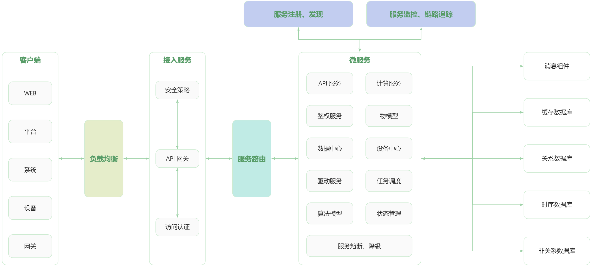

	
 
<a href='https://gitee.com/pnoker/iot-dc3/stargazers'>
    </img>
</a>
<a href='https://gitee.com/pnoker/iot-dc3/members'>
    </img>
</a>
 
<strong>DC3 是基于 Spring Cloud 的开源可分布式物联网 (IOT) 平台,用于快速开发、部署物联设备接入项目,是一整套物联系统解决方案。</strong>

---

# 1 DC3 架构设计

## 1.1 DC3 模块划分，四层架构

-   [x] 驱动层：用于提供标准或者私有协议连接物理设备的 `SDK`，负责南向设备的数据采集和指令控制，基于 `SDK` 可实现驱动的快速开发;
-   [x] 数据层：负责设备数据的收集和入库，并提供数据管理接口服务;
-   [x] 管理层：用于提供微服务注册中心、设备指令接口、设备注册与关联配对、数据管理中心，是所有微服务交互的核心部分，负责各类配置数据的管理，并对外提供接口服务;
-   [ ] 应用层(部分完成)：用于提供数据开放、任务调度、报警与消息通知、日志管理等，具备对接第三方平台能力。

## 1.2 DC3 功能设计，定位目标

-   [x] 可伸缩：水平可伸缩的平台,构建使用领先的 `Spring Cloud` 开源技术;
-   [x] 容错：没有单点故障弱,集群中的每个节点是相同的;
-   [x] 健壮和高效：单一服务器节点可以处理甚至数百成千上万的设备根据用例;
-   [x] 可定制：添加新的设备协议,并注册到服务中心;
-   [x] 跨平台：使用 `Java` 环境可异地、分布式多平台部署;
-   [x] 自主可控：私有云、公有云、边缘部署;
-   [x] 完善性：设备快速接入、注册、权限校验;
-   [x] 安全：数据加密传输;
-   [x] 多租户：命名空间，多租户化;
-   [x] 云原生：Kubernetes;
-   [x] 容器化：Docker。

# 2 DC3 技术实现

`DC3` 平台是基于 `Spring Cloud` 架构开发的,是一系列松耦合、开源的微服务集合。
微服务集合由 4 个微服务层和两个增强的基础系统服务组成,提供从物理域数据采集到信息域数据处理等一系列的服务。

# 3 项目文档

> 详情请阅读 [`IOT DC3 Wiki (https://doc.dc3.site)`](https://doc.dc3.site) 文档
>
> **其中包括：安装配置文档、部署文档、项目结构说明、平台介绍等内容。**

# 4 谁在使用

> 我们由衷的感谢所有正在使用、即将使用、研究学习和支持 DC3 的用户！我们将开足马力，继续迭代动能，为广大用户提供更好的开源产品。
>
> 我们愿意倾听您的声音，在这里（[Gitee](https://gitee.com/pnoker/iot-dc3/issues/I6I15G)
> ），您可以登记相关信息, 不限于：使用场景、建议、公司等更多信息。
> 仅展示已授权名称，排名不分先后。

德琪医药(6996.HK)、榕湾科技、德数科技、Mars 数据库(工业实时数据库)、德沛数据。

# 5 讨论区

我们正在使用讨论作为与我们社区其他成员联系的地方。您可以在（[Gitee](https://gitee.com/pnoker/iot-dc3/issues/I6IKAL)
下方发表你的评论，告诉大家你要讨论的问题、关于 DC3 好的发展建议、一些奇思妙想 🚀🛸🚤！

# 6 协助计划

如果你在使用或者部署过程遇到任何问题，请在 QQ 群讨论或者联系作者微信。

🌟 请记住我们不收费，代码完全开源，如果你觉得很不错，请点个 Start 鼓励我们吧！🌟

# 7 开源贡献

- 从 `main` 分支 `checkout` 一个新分支（**注**：请务必保证 `main` 代码是最新的）
- 新分支命名格式：`feature/username/description`，例如：`feature/pnoker/mqtt_driver`
- 在新分支上编辑文档、代码，并提交代码
- 提交 `PR` 合并到 `develop` 分支，等待作者合并即可
- 合并通过后我们会添加你的 UserID 到 [鸣谢](https://doc.dc3.site/contributor)

# 8 开源协议

`IOT DC3` 开源平台遵循 [Apache 2.0 协议](https://www.apache.org/licenses/LICENSE-2.0.html)。 允许商业使用，但务必保留类作者、Copyright
信息。
