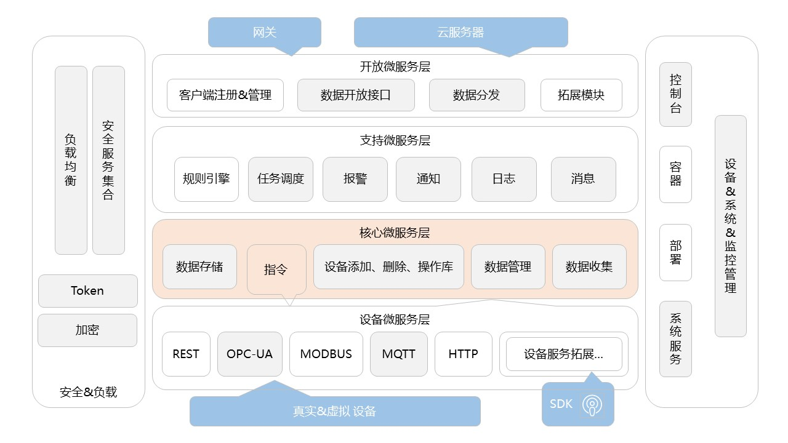
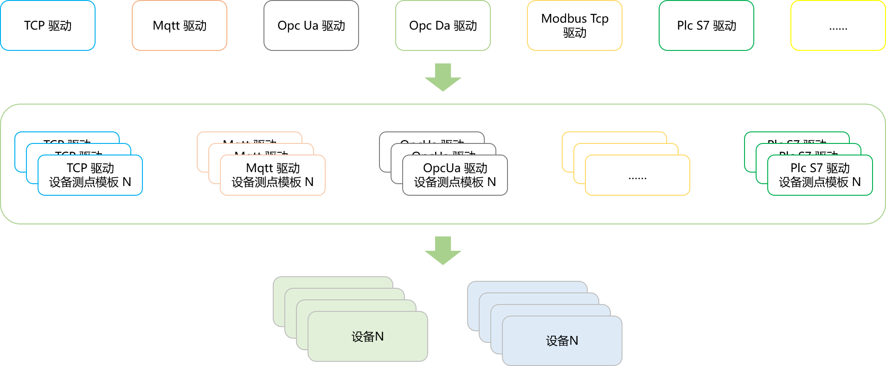
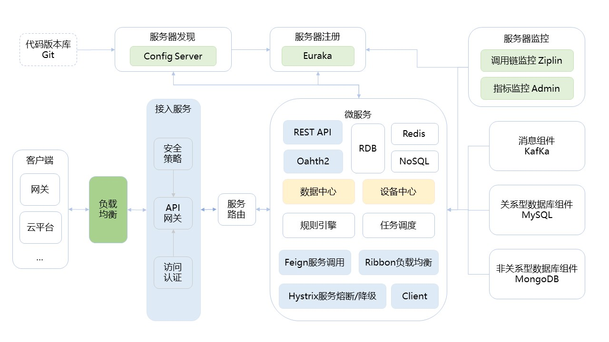
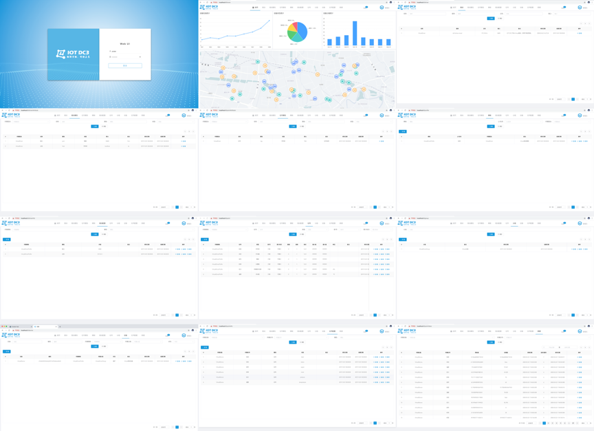

 :boom:  你的 `Star` 是我开发的动力，下载源码 `git clone https://gitee.com/pnoker/iot-dc3.git` ！ 

 :rocket: 非常欢迎广大兴趣爱好者的加入，第一时间 [联系作者](#5-联系作者)，`show me you code`，让我们肩并肩 :alien:！

 :seedling: 为了便于你的二次开发和理解，`DC3` 开源了 `Demo Web UI` ， https://gitee.com/pnoker/dc3-web

     
    
    
     
	
	
	
		
	 <strong>DC3是基于Spring Cloud的开源可分布式物联网(IOT)平台,用于快速开发、部署物联设备接入项目,是一整套物联系统解决方案。 IOT DC3 is an open source, distributed Internet of Things (IOT) platform based on Spring Cloud. It is used for rapid development of IOT projects and management of IOT devices. It is a set of solutions for IOT system.</strong>

------

### 1 DC3 架构设计

 

#### DC3 模块划分，四层架构

 * [x] 驱动层：用于提供标准或者私有协议连接物理设备的 `SDK`，负责南向设备的数据采集和指令控制，基于 `SDK` 可实现驱动的快速开发；
 * [x] 数据层：负责设备数据的收集和入库，并提供数据管理接口服务；
 * [x] 管理层：用于提供微服务注册中心、设备指令接口、设备注册与关联配对、数据管理中心，是所有微服务交互的核心部分，负责各类配置数据的管理，并对外提供接口服务；
 * [ ] 应用层：用于提供数据开放、任务调度、报警与消息通知、日志管理等，具备对接第三方平台能力。

#### DC3 驱动、测点、设备分层

#### DC3 功能设计，定位目标

 * [x] 可伸缩：水平可伸缩的平台,构建使用领先的 `Spring Cloud` 开源技术；
 * [x] 容错：没有单点故障弱,集群中的每个节点是相同的；
 * [x] 健壮和高效：单一服务器节点可以处理甚至数百成千上万的设备根据用例；
 * [x] 可定制：添加新的设备协议,并注册到服务中心；
 * [x] 跨平台：使用`Java`环境可异地、分布式多平台部署；
 * [ ] 完善性：设备快速接入、注册、权限校验；
 * [ ] 安全：数据加密传输；
 * [ ] 多租户：命名空间，多租户化；
 * [ ] 云原生；
 * [x] Docker：容器化。

### 2 DC3 技术实现 

`DC3` 平台是基于 `Spring Cloud` 架构开发的,是一系列松耦合、开源的微服务集合。
微服务集合由4个微服务层和两个增强的基础系统服务组成,提供从物理域数据采集到信息域数据处理等一系列的服务。

[`Spring Cloud Netflix`](https://cloud.spring.io/spring-cloud-netflix)、[`Spring Cloud Gateway`](https://cloud.spring.io/spring-cloud-gateway)、[`Spring Cloud Security`](https://cloud.spring.io/spring-cloud-security)、[`Spring Cloud OpenFeign`](https://cloud.spring.io/spring-cloud-openfeign) 等微服务模块。

### 3 项目文档

> 详情请阅读 [`WiKi`](https://gitee.com/pnoker/iot-dc3/wikis/Home) 文档

**其中包括：安装配置文档、部署文档、项目结构说明、平台介绍等内容。**

### 4 Demo 文档

> 详情请阅读 [`Demo`](https://gitee.com/pnoker/iot-dc3/wikis/2.1%20%E5%90%AF%E5%8A%A8Demo%E6%BC%94%E7%A4%BA?sort_id=2150201) 文档

 

### 5 联系作者

:whale2: 邮箱:pnokers@icloud.com

:speech_balloon: 如果感兴趣可以加入`DC3` 微信技术交流群，开源免费（微信：18304071393，请备注：DC3微信技术交流群）

**:mega: 非常欢迎**

 - 遇到任何问题，请提交  [issue](https://gitee.com/pnoker/iot-dc3/issues) ，标明遇到的问题、开发环境和如何复现，作者每周会进行定期处理；
 - 提交`pull request`改进 `iot-dc3` 的代码；
 - 提出新想法和设计方案。

:lollipop: 感谢: `lombok`、`netty`、`spring boot`、`spring cloud`、`s7connector` 、 `modbus4j`、`jinterop`、`eclipse.milo` 等提供的工具以及源码。

### 6 大家关心的问题

#### 6.1 DC3 项目情况

- **开发进度**

  > 目前开源的版本已实现全部常规功能。
  >
  > **目前阶段**：有完整的管理后台接口，完成了常规标准协议驱动的，可实现从南到北的设备数据采集、管理和存储功能。
  >
  > *备注：项目目前没有管理平台，处于规划和收集建议阶段* ；
  >
  > *为了便于二次开发和理解整体框架，`DC3` 提供了一个基于后台接口开发的  `Demo UI` 可供参考，详情请阅读  [https://gitee.com/pnoker/dc3-web]( https://gitee.com/pnoker/dc3-web) 。*
  
- **开源版本的规划**

  > 私有云 & 边缘网关 & 管理平台

- **高级版本的规划**

  > 暂无规划，现阶段以开源版本的开发为主，在此期间也会收集广大爱好者的建议，并展开后去的开发工作。

#### 6.2 项目目前支持的协议有哪些？

> 已完成的协议驱动：`rtmp`、`plcs7`、`socket`（`client`模式、`server`模式）、`mqtt`、`opcda`、`opcua`、`modbus-tcp` 。
>
> *备注：需要根据实际项目情况，适当调整，当然驱动中有些逻辑存在不合理性，还需要调整和优化，也非常欢迎你提交代码*。

#### 6.3 项目文档？

> 目前项目文档主要以 `Gitee` 的  [`WiKi`](https://gitee.com/pnoker/iot-dc3/wikis/Home) 为主，部署或者二次开发过程中遇到问题可以提交 [issue](https://gitee.com/pnoker/iot-dc3/issues) 或者 在交流群 中进行提问。