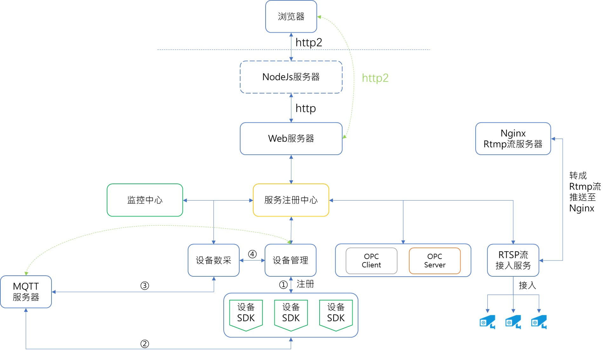
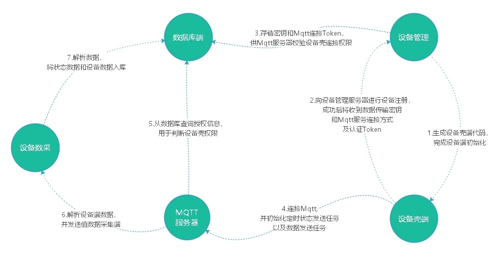

<p align="center">
	
</p>
<p align="center">
	<strong>DC3是一个基于Spring Cloud的开源的、分布式的物联网(IOT)平台,用于快速开发物联网项目和管理拓展。</strong>
</p>
<p align="center">
    <a>
		</img>
	</a>
    <a>
    	</img>
    </a>
	<a target="_blank" href="https://github.com/pnoker/iot-dc3/blob/master/LICENSE">
		</img>
	</a>
</p>
<p align="center">
    <span>GitHub:</span>
    <a href="https://github.com/pnoker/iot-dc3">https://github.com/pnoker/iot-dc3</a>
</p>
<p align="center">
    <span>码云:</span>
    <a href="https://gitee.com/pnoker/iot-dc3">https://gitee.com/pnoker/iot-dc3</a>
</p>

---

 ### 什么是DC3 IOT平台？
 
 DC3致力于：
 
 * 设备端代码一键生成，快速接入设备；
 * 多协议、多设备连接与管理；
 * 终端物联设备数据采集、处理与数据存储；
 * 接入数据可支持加密/明文传输；
 * 接入设备远程指令控制；
 * 支持Rtsp\Rtmp\Mqtt\Opc\OpcUa\Socket\Http\Https等协议；
 * 数据可视化、数据过滤、阈值报警等等。

DC3设计为：

* 可伸缩:水平可伸缩的平台,构建使用领先的Spring Cloud开源技术；
* 容错:没有单点故障弱,集群中的每个节点是相同的；
* 健壮和高效:单一服务器节点可以处理甚至数百成千上万的设备根据用例；
* 可定制:添加新的设备协议，并注册到服务中心；
* 跨平台、可异地部署；
* 设备快速接入、注册、权限校验；
* 数据加密传输。
 
### DC3 IOT平台架构？

DC3平台是基于Spring Cloud架构开发的，是一系列松耦合、开源的微服务集合。
微服务集合由4个微服务层和两个增强的基础系统服务组成，提供从物理域数据采集到信息域数据处理等一系列的服务。

[`Spring Cloud Netflix`](https://cloud.spring.io/spring-cloud-netflix)、
[`Spring Cloud Gateway`](https://cloud.spring.io/spring-cloud-gateway)、
[`Spring Cloud Security`](https://cloud.spring.io/spring-cloud-security)、
[`Spring Cloud OpenFeign`](https://cloud.spring.io/spring-cloud-openfeign)、
[`Spring Cloud Config`](https://cloud.spring.io/spring-cloud-config)、
[`Spring Cloud Bus`](https://cloud.spring.io/spring-cloud-bus) 
等微服务模块。

### 模块

* 设备微服务层:用于提供标准或者私有协议连接物理设备的SDK；
* 核心微服务层:用于提供微服务注册中心、配置管理中心、设备指令接口、设备注册与关联配对、数据管理中心，是所有微服务交互的核心部分；
* 支持微服务层:用于提供规则引擎、任务调度、报警与消息通知、日志管理、数据清理；
* 开放微服务层:用于提供数据开放等服务...

### 架构设计

* 功能模块结构图


* 技术框架架构图


* 逻辑处理流程图




### 联系作者

邮箱：pnokers@icloud.com

感谢：`lombok`、`netty`、`spring boot`、`spring cloud`、[`s7connector`](https://github.com/s7connector/s7connector) 等提供的工具以及源码

### Git强制覆盖本地

```bash
git fetch --all && git reset --hard origin/master && git pull
```

### 参与贡献

1. Fork项目到自己的repo
2. clone到本地
3. 修改代码(dev分支)
4. commit后push到自己的库（dev分支）
5.  pull request
6. 等待作者合并