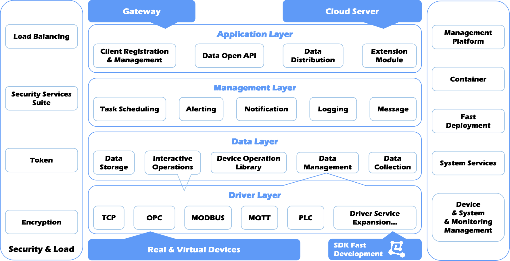

  <a href="./README.md">English</a> | <a href="./README.zh.md">中文</a>

	
 

 
<strong>
IoT DC3 is a fully open-source distributed Internet of Things (IoT) platform built on Spring Cloud.
It accelerates IoT project development and simplifies IoT device management, providing comprehensive solutions for building robust IoT systems.
All components and code are open-source, ensuring transparency, flexibility, and community-driven innovation.
</strong>

---

# 1 Architecture

- **Driver Layer**: Offers SDKs to facilitate seamless connectivity with physical devices using both standard and proprietary protocols. This layer is responsible for southbound
  data acquisition and command execution, enabling rapid driver development through its comprehensive SDK;
- **Data Layer**: Manages the collection, storage, and retrieval of device data, providing robust data management interface services to ensure efficient data handling;
- **Management Layer**: Acts as the core hub for microservice interactions, offering essential services such as microservice registration, device command interfaces, device
  registration and pairing, and a centralized data management system. It oversees various configuration data and provides external interface services for seamless integration;
- **Application Layer**: Delivers advanced functionalities including data openness, task scheduling, alarm and message notifications, log management, and the
  ability to integrate with third-party platforms, enhancing the platform's versatility and usability.

# 2 Objectives

- **Scalability**: Designed for horizontal scaling, leveraging the power of Spring Cloud, a leading open-source technology;
- **Fault Tolerance**: Ensures no single point of failure, with each cluster node being identical and interchangeable;
- **Performance**: Capable of handling hundreds of thousands of devices on a single server node, depending on the specific use case;
- **Customizability**: Easily integrate new device protocols and register them within the service center;
- **Cross-Platform Compatibility**: Fully compatible with Java environments, enabling seamless distributed deployment across multiple platforms;
- **Deployment Flexibility**: Supports private cloud, public cloud, and edge deployments, offering full control over your infrastructure;
- **Efficiency**: Streamlines device onboarding, registration, and permission validation processes;
- **Security**: Ensures data transmission is encrypted, safeguarding sensitive information;
- **Multi-Tenancy**: Supports namespaces and multi-tenancy, making it ideal for diverse user environments;
- **Cloud-Native**: Optimized for Kubernetes, ensuring smooth integration with modern cloud infrastructures;
- **Containerization**: Fully containerized with Docker, simplifying deployment and management.

# 3 Contribution

- **Branch Creation**: Start by creating a new branch from the `main` branch. Ensure that the `main` branch is up-to-date before branching out;
- **Branch Naming**: Follow the naming convention for the new branch: `feature/your_name/feature_description`. For example: `feature/pnoker/mqtt_driver`;
- **Code and Documentation**: Make your changes to the code or documentation on the new branch. Once done, commit your changes;
- **Pull Request**: Submit a `Pull Request` (PR) to merge your changes into the `develop` branch. Your PR will be reviewed and merged by the maintainers.

# 4 License

The `IoT DC3` open-source platform is licensed under the [AGPL 3.0 License](./LICENSE-AGPL.txt). This license allows for commercial use while
mandating the retention of author and copyright information.
