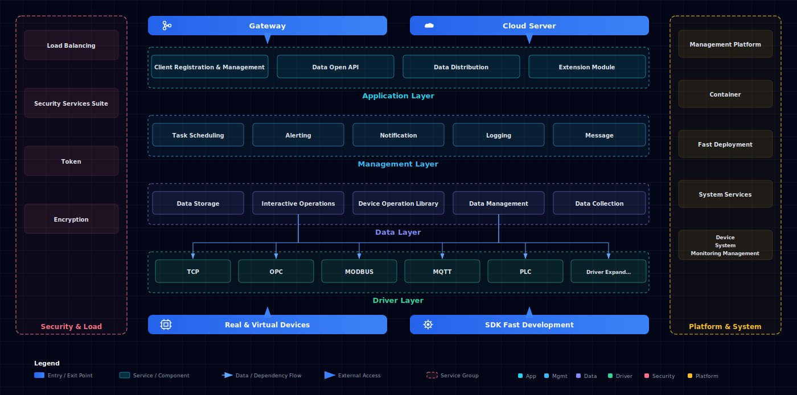

<p align="right">
  <a href="./README.md">English</a> | <a href="./README.zh.md">中文</a> | <a href="./README.ja.md">日本語</a> | <a href="./README.vi.md">Tiếng Việt</a>
</p>

<p align="center">
	
<br>
<a href='https://gitee.com/pnoker/iot-dc3/stargazers'>
    
</a>
<a href='https://gitee.com/pnoker/iot-dc3/members'>
    
</a>
<br>
<strong>
IoT DC3 is a fully open-source, AI-ready distributed IoT platform.
It connects devices, collects data organized for AI, and orchestrates the closed loop — turning intelligence into action, not just insight.
</strong>
</p>

---



# 1 Architecture

The architecture is designed for end-to-end IoT capabilities across device connectivity, data services, operational
management, and extensible application integration.

- **Driver Layer**: Provides SDKs for rapid driver development and seamless connectivity to physical devices through
  standard or proprietary protocols. This layer handles southbound data acquisition and command execution;
- **Data Layer**: Supports reliable collection, storage, and retrieval of device data, exposing robust interfaces for
  real-time and historical data services;
- **Management Layer**: Serves as the core hub for distributed microservice collaboration, including service
  registration, device/driver management, command orchestration, and centralized configuration governance;
- **Application Layer**: Enables data openness, scheduling, alarms, messaging, logging, third-party integrations, and
  AI-enhanced automation scenarios.

# 2 Objectives

- **Scalability**: Supports horizontal scaling with Spring Cloud for distributed, high-throughput IoT workloads;
- **Resilience**: Minimizes single-point-of-failure risk with interchangeable service nodes and fault-tolerant design;
- **Performance**: Handles large-scale device access and telemetry workloads for demanding IoT scenarios;
- **Extensibility**: Accelerates integration of new protocols and custom drivers through SDK and service registration;
- **Deployment Flexibility**: Runs across private cloud, public cloud, and edge environments with Java compatibility;
- **Operational Efficiency**: Streamlines onboarding, registration, and permission validation for devices and services;
- **Security and Multi-Tenancy**: Enforces encrypted communication, namespace isolation, and tenant-level separation;
- **Cloud-Native Delivery**: Optimized for Kubernetes and containerized with Docker for consistent deployments;
- **AI-Ready Evolution**: Enables integration of intelligent automation and data-driven operational workflows.

# 3 Development

## 3.1 Startup Dependencies

> Choose one
>
> This base stack starts PostgreSQL and RabbitMQ. If you need a database SQL script, connect directly to the started
> database in the container for export.

```bash
# Global access with standard container registry service
podman compose -f dc3/docker-compose-db.yml up -d

# Optimized registry service for users in mainland China
DC3_IMAGE_REGISTRY=registry.cn-beijing.aliyuncs.com/dc3 podman compose -f dc3/docker-compose-db.yml up -d
```

Optional helper targets:

```bash
make dev-db
make dev-optional
make dev
make dev-all
```

Use `REGISTRY=cn` when you want the mainland China image registry variants:

```bash
make dev-db REGISTRY=cn
make dev-all REGISTRY=cn
make app-all REGISTRY=cn
make compose-up STACK=optional REGISTRY=cn
make compose-logs STACK=dev REGISTRY=global
```

Service-level shortcuts for frontend and API testing:

```bash
# Start base dependencies first
make dev-db REGISTRY=cn

# Start one service, multiple services, or a predefined group
make up SERVICES=agentic REGISTRY=cn
make up SERVICES="gateway agentic" REGISTRY=cn
make up GROUP=core REGISTRY=cn
make up GROUP=drivers REGISTRY=cn

# Follow logs for the services under test
make logs SERVICES="gateway agentic"
```

### Compose Environment Overrides

Copy the example file before changing any published ports, image tags, or observability settings:

```bash
cp .env.example .env
```

For the difference between root `.env` and `dc3/env/dev.env(.sh)`, see
[`dc3/doc/ENVIRONMENT.md`](dc3/doc/ENVIRONMENT.md).

The root `.env` is used by Compose only for variables referenced by Compose files, such as image registry, image tag,
published ports, logging options, and optional observability settings. Local source-run Java processes should use
`dc3/env/dev.env` or `dc3/env/dev.env.sh`. Agentic providers are normally stored in the database; configure
`AGENTIC_FALLBACK_OPENAI_BASE_URL`, `AGENTIC_FALLBACK_OPENAI_API_KEY`, and `AGENTIC_FALLBACK_OPENAI_MODEL` only as
fallback values for the process or container.

## 3.2 Preparation

```bash
source dc3/env/dev.env.sh
mvn -s .mvn/settings.xml clean package
```

> **Module Overview**: See [`dc3/doc/MODULES.md`](dc3/doc/MODULES.md) for the full module dependency map and runtime
> flow
> diagram.

> **Local Dev Guide**: See [`dc3/doc/QUICKSTART.md`](dc3/doc/QUICKSTART.md) for a one-stop local setup workflow.

> **Troubleshooting**: See [`dc3/doc/TROUBLESHOOTING.md`](dc3/doc/TROUBLESHOOTING.md) for common build/runtime issues
> and
> resolutions.

## 3.3 Start Services

> Start in order

```bash
# Gateway
java -jar dc3-gateway/target/dc3-gateway.jar

# Auth Center
java -jar dc3-center/dc3-center-auth/target/dc3-center-auth.jar

# Data Center
java -jar dc3-center/dc3-center-data/target/dc3-center-data.jar

# Manager Center
java -jar dc3-center/dc3-center-manager/target/dc3-center-manager.jar

# Agentic Center
java -jar dc3-center/dc3-center-agentic/target/dc3-center-agentic.jar

# Virtual Driver
java -jar dc3-driver/dc3-driver-virtual/target/dc3-driver-virtual.jar

# Other driver: Listening Virtual Driver, Modbus TCP Driver, MQTT Driver, OPC DA Driver, OPC UA Driver, Siemens S7 Driver
```

# 4 Technology Stack

- [Java 21](https://www.java.com)
- [Spring Boot 3.5.5](https://spring.io/projects/spring-boot)
- [Spring Cloud 2025.0.0](https://spring.io/projects/spring-cloud)

# 5 Contribution

- **Branch Creation**: Start by creating a new branch from the `main` branch. Ensure that the `main` branch is
  up-to-date before branching out;
- **Branch Naming**: Follow the naming convention for the new branch: `feature/your_name/feature_description`. For
  example: `feature/pnoker/mqtt_driver`;
- **Code and Documentation**: Make your changes to the code or documentation on the new branch. Once done, commit your
  changes;
- **Pull Request**: Submit a `Pull Request` (PR) to merge your changes into the `develop` branch. Your PR will be
  reviewed and merged by the maintainers.

# 6 License

The `IoT DC3` open-source platform is licensed under the [AGPL 3.0 License](./LICENSE-AGPL.txt).
See [LICENSE.txt](./LICENSE.txt) for the repository license notice and commercial licensing clarification.
