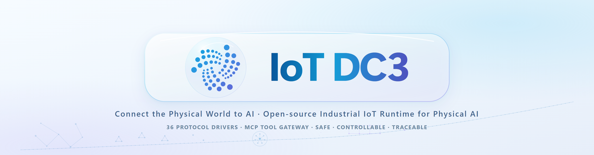

<p align="right">
  <a href="./README.md">English</a> | <a href="./README.zh.md">中文</a> | <a href="./README.ja.md">日本語</a> | <a href="./README.vi.md">Tiếng Việt</a> | <a href="./README.ko.md">한국어</a> | <a href="./README.es.md">Español</a> | <a href="./README.ru.md">Русский</a>
</p>

> **AI assistants:** Read [README.ai.md](./README.ai.md) first for a concise, AI-friendly overview of IoT DC3.

<p align="center">
  
</p>

<p align="center">
  <a href="https://github.com/pnoker/iot-dc3/stargazers">
    
  </a>
  <a href="https://gitee.com/pnoker/iot-dc3/stargazers">
    
  </a>
  <a href="https://gitee.com/pnoker/iot-dc3/members">
    
  </a>
  <a href="https://github.com/pnoker/iot-dc3/graphs/contributors">
    
  </a>
  
  
  
</p>

<p align="center">
  <strong>
    IoT DC3 — the multi-protocol, cloud-native, open-source industrial IoT platform.<br>
    AI-powered — from device connectivity to industrial agents
  </strong>
</p>

<p align="center">
  <a href="https://dc3.site">https://dc3.site</a>
</p>

<p align="center">
  🔌 <strong>Multi-protocol connectivity</strong> &nbsp;·&nbsp;
  🤖 <strong>AI Agentic Center</strong> &nbsp;·&nbsp;
  ☁️ <strong>Cloud-native microservices</strong>
</p>

---

## 📸 Product Preview

<table>
  <tr>
    <th width="33%">📸 Platform Overview</th>
    <th width="33%">📸 Device Management</th>
    <th width="33%">📸 AI Chat</th>
  </tr>
  <tr>
    <td align="center">
      
      <br>
      <strong>Home / Dashboard</strong><br>
      <em>System overview · Online device metrics · Data trend charts</em>
    </td>
    <td align="center">
      
      <br>
      <strong>Device Management</strong><br>
      <em>Device list · Online status · Search and filtering</em>
    </td>
    <td align="center">
      
      <br>
      <strong>AI Chat</strong><br>
      <em>Natural-language device queries · Data analysis · Intelligent assistance</em>
    </td>
  </tr>
</table>

## 🏗️ Architecture Overview

### Architecture at a Glance


Six-layer microservice architecture at a glance: clients → gateway → four center services → message bus → 36 protocol
drivers → field devices. PostgreSQL (TimescaleDB + pgvector + AGE) persistence and optional observability stack (ELK +
Prometheus + Grafana) laid out in one view.

🧱 **Design principles** — cross-service calls always go through Facade interfaces; the DO/BO/VO three-tier model keeps
persistence, business, and API shapes strictly separated; and tenant isolation runs end to end across database, cache,
and API paths. Clear boundaries that scale across services and teams.

> 📖 For the full architecture documentation,
> see [System Architecture Overview](https://docs.dc3.site/en/architecture/).

## ✨ Core Features

### 🔌 Multi-Protocol Device Connectivity

IoT DC3 includes **36 access driver modules** for industrial automation, IoT communication, data bridging, basic
communication, and simulation/debugging scenarios, reducing the cost of connecting common devices and data sources:

| Category                                      | Driver Modules                                                                                                                                                                                      |
|-----------------------------------------------|-----------------------------------------------------------------------------------------------------------------------------------------------------------------------------------------------------|
| 🏭 **Industrial protocols**                   | Modbus TCP · Modbus RTU · OPC UA · OPC DA · Siemens S7 · BACnet/IP · EtherNet/IP · Omron FINS · Mitsubishi MELSEC · IEC 60870-5-104 · IEC 61850 · DNP3 · DLMS · DLT645 · KNX · M-Bus · SL651 |
| 📡 **IoT protocols**                          | MQTT · CoAP · LwM2M · HTTP · BLE · Zigbee · LoRaWAN                                                                                                                                                 |
| 🗄️ **Data bridging**                          | MySQL · PostgreSQL · Oracle · SQL Server · Redis                                                                                                                                                    |
| 🔧 **Basic communication, messaging and NMS** | TCP/UDP · Serial · SNMP · CAN · Kafka                                                                                                                                                               |
| 🧪 **Simulation and debugging**               | Virtual · Listening Virtual                                                                                                                                                                         |

The **Driver SDK** supports fast development of custom protocol drivers and registration into the runtime platform.

### 🤖 AI Capability Integration

The agentic center is built on **Spring AI** and connects large language models into IoT operations workflows:

- **Natural-language assisted operations** - through Tool Calling and under access control, LLMs can query devices,
  read/write points, and assist with command execution
- **Intelligent alarm analysis** - AI assists with root-cause analysis and response suggestions
- **Data insights** - Query device data in natural language and generate visual charts
- **Multi-model support** - Compatible with OpenAI API-style providers and mainstream models such as GPT, Claude,
  DeepSeek, and Qwen
- **Conversation memory** - Multi-turn conversations and context memory persisted to the database

### 🏗️ Cloud-Native Microservices

Distributed microservice architecture based on **Spring Boot 4 + Spring Cloud 2025**:

- **Service governance** - Spring Cloud Gateway as the unified entrypoint, with static routes and flexible environment
  variables
- **Efficient communication** - gRPC service calls with Protobuf serialization
- **Horizontal scaling** - Stateless design for scaling individual services by workload
- **Resilience** - Replaceable service nodes and fault isolation

### 📊 Real-Time Data Engine

- **Data collection** - Drivers collect device telemetry and send it asynchronously through RabbitMQ
- **Time-series storage** - Efficient queries for real-time and historical data
- **Rule engine** - Flexible alarm rules with multi-level alarms and notifications
- **Event traceability** - Full command and event history

### 🔐 Enterprise Security and Multi-Tenancy

- **Tenant isolation** - Tenant-level isolation across database, cache, and API paths
- **Authentication and authorization** - JWT + Spring Security with RBAC
- **Transport encryption** - TLS/SSL communication support
- **Audit tracking** - User operation and system event logs

### 🧩 Developer Friendly

- **Driver SDK** - A complete driver development toolkit. See
  the [Driver Authoring Guide](https://docs.dc3.site/en/development/driver-authoring)
- **Separated frontend and backend** - Vue 3 + TypeScript frontend, RESTful and gRPC APIs
- **Containerized deployment** - One-command startup with Podman / Docker Compose, plus compose
  scaling, Docker Swarm, Kubernetes and Helm deployment configs. See
  the [Deployment Guide](dc3/doc/DEPLOYMENT.md).
- **Complete documentation** - Online docs, quickstart guide, and troubleshooting guide

## ⚡ Quick Start

For source-based local development, start PostgreSQL and RabbitMQ, load local environment variables, then build:

```bash
make up-db
source dc3/env/dev.env.sh
mvn -s .mvn/settings.xml clean package
```

Use `make up-db-cn` if you prefer the Alibaba Cloud registry in Mainland China.

> 📖 For service startup order, IDE setup, verification commands, and common pitfalls,
> see the [full Quickstart](https://docs.dc3.site/en/quickstart/).

## 🛠️ Technology Stack

IoT DC3 is built on Java 21, Spring Boot 4, Spring Cloud 2025, Spring AI 2, PostgreSQL, RabbitMQ, gRPC, Vue 3,
TypeScript, and Vite.

See [Technology Stack](https://docs.dc3.site/en/development/technology-stack) for component details and where each
technology is used.

## 📖 Documentation and Community

| Resource              | Link                                                                            |
|-----------------------|---------------------------------------------------------------------------------|
| 📚 Online docs        | [docs.dc3.site](https://docs.dc3.site/)                                         |
| 🚀 Quickstart         | [Quickstart Guide](https://docs.dc3.site/en/quickstart/)                        |
| 🛠️ Technology stack   | [Technology Stack](https://docs.dc3.site/en/development/technology-stack)       |
| 🏗️ Architecture       | [Modules and Dependencies](https://docs.dc3.site/en/architecture/modules)       |
| 🔧 Driver development | [Driver Authoring Guide](https://docs.dc3.site/en/development/driver-authoring) |
| 🐛 Troubleshooting    | [Troubleshooting](https://docs.dc3.site/en/guide/troubleshooting)               |
| 📋 Changelog          | [Release Changelog](https://docs.dc3.site/en/development/changelog)             |
| 🐛 Issue feedback     | [GitHub Issues](https://github.com/pnoker/iot-dc3/issues)                       |
| 🇨🇳 Gitee mirror       | [Gitee GVP Project](https://gitee.com/pnoker/iot-dc3)                           |

## 🌍 Use Cases

<table>
  <tr>
    <td align="center" width="60">🏭</td>
    <td><strong>Smart Factory</strong></td>
    <td>Production-line device monitoring, process parameter collection, predictive maintenance, and OEE analysis</td>
  </tr>
  <tr>
    <td align="center">⚡</td>
    <td><strong>Energy Monitoring</strong></td>
    <td>Remote metering for power, water, and gas; energy trend analysis; anomaly alarms</td>
  </tr>
  <tr>
    <td align="center">🌾</td>
    <td><strong>Smart Agriculture</strong></td>
    <td>Greenhouse monitoring, automatic irrigation control, pest and disease warnings, yield forecasting</td>
  </tr>
  <tr>
    <td align="center">🏙️</td>
    <td><strong>Smart City</strong></td>
    <td>Streetlight management, environmental monitoring, municipal facility operations, safety monitoring</td>
  </tr>
</table>

## 🤝 Contributing

Contributions of all kinds are welcome. Please follow this workflow:

1. **Fork and branch** - Create a branch from `main`, using the format `feature/your_name/feature_description`
   (for example: `feature/pnoker/mqtt_driver`)
2. **Develop and commit** - Complete your changes on the new branch and follow
   the [Conventional Commits](https://www.conventionalcommits.org/) specification
3. **Open a PR** - Submit a Pull Request to the `develop` branch for maintainer review and merge

## 📄 License

IoT DC3 is open source under the [AGPL 3.0](./LICENSE-AGPL.txt) license.

- ✅ **Personal learning, research, and internal use** - Free
- ✅ **Modify the code and open source your changes** - Welcome
- ⚠️ **Offering it as a commercial service to third parties without open-sourcing modifications** - Requires a
  commercial license

For commercial licensing details, see [LICENSE.txt](./LICENSE.txt).
