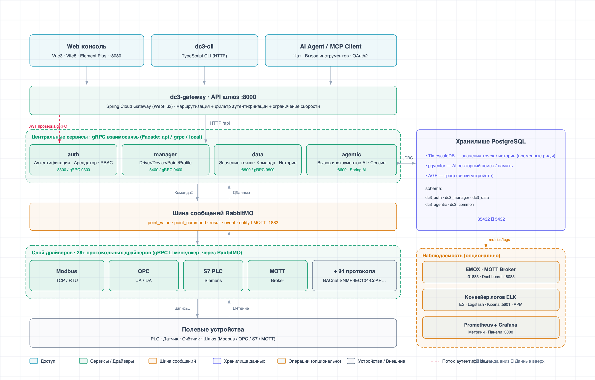

<p align="right">
  <a href="./README.md">English</a> | <a href="./README.zh.md">中文</a> | <a href="./README.ja.md">日本語</a> | <a href="./README.vi.md">Tiếng Việt</a> | <a href="./README.ko.md">한국어</a> | <a href="./README.es.md">Español</a> | <a href="./README.ru.md">Русский</a>
</p>

> **ИИ-ассистенты:** Сначала прочитайте [README.ai.md](./README.ai.md) для краткого обзора IoT DC3, оптимизированного
> для ИИ.

<p align="center">
  
</p>

<p align="center">
  <a href="https://github.com/pnoker/iot-dc3/stargazers">
    
  </a>
  <a href="https://gitee.com/pnoker/iot-dc3/stargazers">
    
  </a>
  <a href="https://gitee.com/pnoker/iot-dc3/members">
    
  </a>
  <a href="https://github.com/pnoker/iot-dc3/graphs/contributors">
    
  </a>
  
  
  
</p>

<p align="center">
  <strong>
    IoT DC3 — многопротокольная, ИИ-управляемая, облачная открытая платформа промышленного Интернета вещей.<br>
    Облачные микросервисы · Многопротокольное подключение · ИИ-помощь в эксплуатации · 28 готовых драйверов
  </strong>
</p>

<p align="center">
  <a href="https://docs.dc3.site">https://docs.dc3.site</a>
</p>

<p align="center">
  🔌 <strong>Многопротокольное подключение</strong> &nbsp;·&nbsp;
  🤖 <strong>AI Agentic Center</strong> &nbsp;·&nbsp;
  ☁️ <strong>Облачные микросервисы</strong>
</p>

---

## 📸 Превью продукта

<table>
  <tr>
    <th width="33%">📸 Обзор платформы</th>
    <th width="33%">📸 Управление устройствами</th>
    <th width="33%">📸 ИИ-чат</th>
  </tr>
  <tr>
    <td align="center">
      
      <br>
      <strong>Главная / Панель управления</strong><br>
      <em>Обзор системы · Статистика онлайн-устройств · Графики трендов данных</em>
    </td>
    <td align="center">
      
      <br>
      <strong>Управление устройствами</strong><br>
      <em>Список устройств · Статус онлайн · Поиск и фильтрация</em>
    </td>
    <td align="center">
      
      <br>
      <strong>ИИ-чат</strong><br>
      <em>Запросы устройств на естественном языке · Анализ данных · Интеллектуальная помощь</em>
    </td>
  </tr>
</table>

## 🏗️ Обзор архитектуры

### Архитектура на одном экране



Шестиуровневая микросервисная архитектура: клиенты → шлюз → четыре центральных сервиса → шина сообщений → 28
протокольных драйверов → полевые устройства. PostgreSQL (TimescaleDB + pgvector + AGE) для хранения и опциональный
стек наблюдаемости (ELK + Prometheus + Grafana) — всё на одном чертеже.

🧱 **Принципы проектирования** — межсервисные вызовы всегда через интерфейсы Facade; трёхслойная модель DO/BO/VO
строго разделяет хранение, бизнес-логику и API; изоляция арендаторов от базы данных и кэша до API。Чёткие границы,
масштабируемые между сервисами и командами.

> 📖 Подробная документация по архитектуре:
> [Обзор системной архитектуры](https://docs.dc3.site/en/architecture/).

## ✨ Основные возможности

### 🔌 Многопротокольное подключение устройств

IoT DC3 включает **28 модулей драйверов доступа** для промышленной автоматизации, IoT-коммуникаций, мостовой
передачи данных, базовых коммуникаций и сценариев моделирования/отладки, снижая стоимость подключения распространённых
устройств и источников данных:

| Категория                                | Модули драйверов                                                                                                                                   |
|------------------------------------------|----------------------------------------------------------------------------------------------------------------------------------------------------|
| 🏭 **Промышленные протоколы**            | Modbus TCP · Modbus RTU · OPC UA · OPC DA · Siemens S7 · BACnet/IP · EtherNet/IP · Omron FINS · Mitsubishi MELSEC · IEC 60870-5-104 · SL651 · DLMS |
| 📡 **IoT-протоколы**                     | MQTT · CoAP · LwM2M · HTTP · BLE · Zigbee                                                                                                          |
| 🗄️ **Мостовая передача данных**         | MySQL · PostgreSQL · Oracle · SQL Server                                                                                                           |
| 🔧 **Базовые коммуникации и управление** | TCP/UDP · Serial · SNMP · CAN                                                                                                                      |
| 🧪 **Моделирование и отладка**           | Virtual · Listening Virtual                                                                                                                        |

**Driver SDK** поддерживает быструю разработку пользовательских протокольных драйверов и их регистрацию в среде
выполнения платформы.

### 🤖 Интеграция ИИ-возможностей

Центр интеллектуальных агентов построен на **Spring AI** и подключает большие языковые модели к рабочим процессам
эксплуатации IoT:

- **Операционная поддержка на естественном языке** — LLM через Tool Calling и под контролем доступа может запрашивать
  устройства, читать/записывать точки данных и помогать с выполнением команд
- **Интеллектуальный анализ аварий** — ИИ помогает с анализом корневых причин и предложениями по реагированию
- **Аналитика данных** — запросы данных устройств на естественном языке с генерацией визуальных графиков
- **Поддержка нескольких моделей** — совместимость с провайдерами в стиле OpenAI API и ведущими моделями, такими как
  GPT,
  Claude, DeepSeek и Qwen
- **Память диалога** — многошаговые диалоги и контекстная память, сохраняемые в базе данных

### 🏗️ Облачные микросервисы

Распределённая микросервисная архитектура на базе **Spring Boot 4 + Spring Cloud 2025**:

- **Управление сервисами** — Spring Cloud Gateway как единая точка входа со статическими маршрутами и гибкой
  настройкой через переменные окружения
- **Эффективная коммуникация** — межсервисные вызовы через gRPC с сериализацией Protobuf
- **Горизонтальное масштабирование** — бездизайновый дизайн для масштабирования отдельных сервисов по нагрузке
- **Отказоустойчивость** — заменяемые узлы сервисов и изоляция сбоев

### 📊 Движок данных реального времени

- **Сбор данных** — драйверы собирают телеметрию устройств и передают асинхронно через RabbitMQ
- **Хранение временных рядов** — эффективные запросы для данных реального времени и истории
- **Движок правил** — гибкие правила аварий с многоуровневыми уведомлениями
- **Проследимость событий** — полная история команд и событий

### 🔐 Корпоративная безопасность и мультитенантность

- **Изоляция арендаторов** — изоляция на уровне арендаторов от базы данных и кэша до API
- **Аутентификация и авторизация** — JWT + Spring Security с моделью RBAC
- **Шифрование передачи** — поддержка TLS/SSL
- **Аудиторский трекинг** — журналы операций пользователей и системных событий

### 🧩 Удобство для разработчиков

- **Driver SDK** — полный набор инструментов для разработки драйверов. См.
  [Руководство по созданию драйверов](https://docs.dc3.site/en/development/driver-authoring)
- **Разделение фронтенда и бэкенда** — фронтенд на Vue 3 + TypeScript, API RESTful и gRPC
- **Контейнеризированное развёртывание** — запуск одной командой через Podman / Docker Compose, с возможностью
  миграции на Kubernetes и другие контейнерные платформы
- **Полная документация** — онлайн-документация, руководство по быстрому старту и руководство по устранению неполадок

## ⚡ Быстрый старт

Для локальной разработки из исходного кода запустите PostgreSQL и RabbitMQ, загрузите локальные переменные окружения,
затем соберите проект:

```bash
make up-db
source dc3/env/dev.env.sh
mvn -s .mvn/settings.xml clean package
```

Если вы находитесь в материковом Китае, используйте `make up-db-cn` для реестра Alibaba Cloud.

> 📖 Порядок запуска сервисов, настройка IDE, команды верификации и типичные подводные камни см. в
> [Полное руководство по быстрому старту](https://docs.dc3.site/en/quickstart/).

## 🛠️ Технологический стек

IoT DC3 построен на Java 21, Spring Boot 4, Spring Cloud 2025, Spring AI 2, PostgreSQL, RabbitMQ, gRPC, Vue 3,
TypeScript и Vite.

Подробности о компонентах и их использовании см.
в [Технологический стек](https://docs.dc3.site/en/introduction/technology-stack).

## 📖 Документация и сообщество

| Ресурс                   | Ссылка                                                                                     |
|--------------------------|--------------------------------------------------------------------------------------------|
| 📚 Онлайн-документация   | [docs.dc3.site](https://docs.dc3.site/)                                                    |
| 🚀 Быстрый старт         | [Руководство по быстрому старту](https://docs.dc3.site/en/quickstart/)                     |
| 🛠️ Технологический стек | [Technology Stack](https://docs.dc3.site/en/introduction/technology-stack)                 |
| 🏗️ Архитектура          | [Модули и зависимости](https://docs.dc3.site/en/architecture/modules)                      |
| 🔧 Разработка драйверов  | [Руководство по созданию драйверов](https://docs.dc3.site/en/development/driver-authoring) |
| 🐛 Устранение неполадок  | [Устранение неполадок](https://docs.dc3.site/en/guide/troubleshooting)                     |
| 📋 Журнал изменений      | [Журнал релизов](https://docs.dc3.site/en/development/changelog)                           |
| 🐛 Сообщить об ошибке    | [GitHub Issues](https://github.com/pnoker/iot-dc3/issues)                                  |
| 🇨🇳 Зеркало Gitee       | [Gitee GVP проект](https://gitee.com/pnoker/iot-dc3)                                       |

## 🌍 Сценарии применения

<table>
  <tr>
    <td align="center" width="60">🏭</td>
    <td><strong>Умное производство</strong></td>
    <td>Мониторинг оборудования на производственных линиях, сбор параметров процесса, предиктивное обслуживание, анализ OEE</td>
  </tr>
  <tr>
    <td align="center">⚡</td>
    <td><strong>Мониторинг энергии</strong></td>
    <td>Дистанционный учёт электроэнергии, воды и газа; анализ трендов энергопотребления; аномальные оповещения</td>
  </tr>
  <tr>
    <td align="center">🌾</td>
    <td><strong>Умное сельское хозяйство</strong></td>
    <td>Мониторинг теплиц, автоматическое управление поливом, предупреждение о вредителях и болезнях, прогноз урожайности</td>
  </tr>
  <tr>
    <td align="center">🏙️</td>
    <td><strong>Умный город</strong></td>
    <td>Управление уличным освещением, мониторинг качества окружающей среды, эксплуатация муниципальных объектов, мониторинг безопасности</td>
  </tr>
</table>

## 🤝 Участие в разработке

Мы приветствуем вклад в любом виде. Пожалуйста, следуйте этому рабочему процессу:

1. **Fork и ветка** — создайте ветку от `main`, используя формат `feature/your_name/feature_description`
   (например: `feature/pnoker/mqtt_driver`)
2. **Разработка и коммит** — завершите изменения на новой ветке и следуйте спецификации
   [Conventional Commits](https://www.conventionalcommits.org/)
3. **Открытие PR** —подайте Pull Request в ветку `develop` для рецензирования и слияния сопровождающими

## 📄 Лицензия

IoT DC3 — проект с открытым исходным кодом под лицензией [AGPL 3.0](./LICENSE-AGPL.txt).

- ✅ **Личное обучение, исследования и внутреннее использование** — бесплатно
- ✅ **Изменение кода и публикация ваших изменений** — приветствуется
- ⚠️ **Предоставление в качестве коммерческой услуги третьим лицам без публикации изменений** — требуется коммерческая
  лицензия

Подробности о коммерческой лицензии см. в [LICENSE.txt](./LICENSE.txt).

## ⭐ История звёзд

[](https://star-history.com/#pnoker/iot-dc3&Date)
