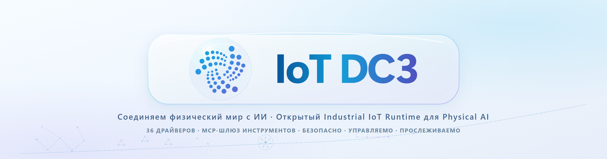

<p align="right">
  <a href="./README.md">English</a> | <a href="./README.zh.md">中文</a> | <a href="./README.ja.md">日本語</a> | <a href="./README.vi.md">Tiếng Việt</a> | <a href="./README.ko.md">한국어</a> | <a href="./README.es.md">Español</a> | <a href="./README.ru.md">Русский</a>
</p>

> **ИИ-ассистенты:** Сначала прочитайте [README.ai.md](./README.ai.md) для краткого обзора IoT DC3, оптимизированного
> для ИИ.

<p align="center">
  
</p>

<p align="center">
  <a href="https://github.com/pnoker/iot-dc3/stargazers">
    
  </a>
  <a href="https://gitee.com/pnoker/iot-dc3/stargazers">
    
  </a>
  <a href="https://gitee.com/pnoker/iot-dc3/members">
    
  </a>
  <a href="https://github.com/pnoker/iot-dc3/graphs/contributors">
    
  </a>
  
  
  
</p>

<p align="center">
  <strong>
    IoT DC3 — соединяем физический мир с ИИ<br>
    Открытый Industrial IoT Runtime для Physical AI
  </strong>
</p>

<p align="center">
  <a href="https://dc3.site">https://dc3.site</a>
</p>

<p align="center">
  🔌 <strong>Многопротокольное подключение</strong> &nbsp;·&nbsp;
  🤖 <strong>MCP-шлюз инструментов</strong> &nbsp;·&nbsp;
  ☁️ <strong>Облачные микросервисы</strong>
</p>

<p align="center">
  <em>
    IoT DC3 отделяет <strong>устройства</strong> от <strong>приложений</strong>: драйверы отправляют нормализованные
    данные точек в шину сообщений, а приложения потребляют их через единый API — можно добавлять и менять устройства,
    не затрагивая приложения, и создавать новые приложения, не затрагивая устройства.
  </em>
</p>

---

## 📸 Превью продукта

<table>
  <tr>
    <th width="33%">📸 Обзор платформы</th>
    <th width="33%">📸 Управление устройствами</th>
    <th width="33%">📸 ИИ-агент</th>
  </tr>
  <tr>
    <td align="center">
      
      <br>
      <strong>Главная / Панель управления</strong><br>
      <em>Обзор системы · Статистика онлайн-устройств · Графики трендов данных</em>
    </td>
    <td align="center">
      
      <br>
      <strong>Управление устройствами</strong><br>
      <em>Список устройств · Статус онлайн · Поиск и фильтрация</em>
    </td>
    <td align="center">
      
      <br>
      <strong>ИИ-агент-помощник</strong><br>
      <em>Запросы устройств на естественном языке · Аналитика данных · Управляемое выполнение</em>
    </td>
  </tr>
</table>

## 🏗️ Обзор архитектуры

### Архитектура на одном экране


Шестиуровневая микросервисная архитектура: клиенты → шлюз → четыре центральных сервиса → шина сообщений → 36
протокольных драйверов → полевые устройства. PostgreSQL (TimescaleDB + pgvector + AGE) для хранения и опциональный стек
наблюдаемости (ELK + Prometheus + Grafana) — всё на одном чертеже.

🧱 **Принципы проектирования** — межсервисные вызовы всегда через интерфейсы Facade; трёхслойная модель DO/BO/VO строго
разделяет хранение, бизнес-логику и API; изоляция арендаторов от базы данных и кэша до API。Чёткие границы,
масштабируемые между сервисами и командами.

> 📖 Подробная документация по архитектуре:
> [Обзор системной архитектуры](https://docs.dc3.site/en/architecture/).

## ✨ Основные возможности

### 🔌 Многопротокольное подключение устройств

IoT DC3 включает **36 модулей драйверов доступа** для промышленной автоматизации, IoT-коммуникаций, мостовой передачи
данных, базовых коммуникаций и сценариев моделирования/отладки, снижая стоимость подключения распространённых устройств
и источников данных:

| Категория                                | Модули драйверов                                                                                                                                                                             |
|------------------------------------------|----------------------------------------------------------------------------------------------------------------------------------------------------------------------------------------------|
| 🏭 **Промышленные протоколы**            | Modbus TCP · Modbus RTU · OPC UA · OPC DA · Siemens S7 · BACnet/IP · EtherNet/IP · Omron FINS · Mitsubishi MELSEC · IEC 60870-5-104 · IEC 61850 · DNP3 · DLMS · DLT645 · KNX · M-Bus · SL651 |
| 📡 **IoT-протоколы**                     | MQTT · CoAP · LwM2M · HTTP · BLE · Zigbee · LoRaWAN                                                                                                                                          |
| 🗄️ **Мостовая передача данных**          | MySQL · PostgreSQL · Oracle · SQL Server · Redis                                                                                                                                             |
| 🔧 **Базовые коммуникации и управление** | TCP/UDP · Serial · SNMP · CAN · Kafka                                                                                                                                                        |
| 🧪 **Моделирование и отладка**           | Virtual · Listening Virtual                                                                                                                                                                  |

**Driver SDK** поддерживает быструю разработку пользовательских протокольных драйверов и их регистрацию в среде
выполнения платформы.

### 🤖 От данных устройств к Physical AI

Центр интеллектуальных агентов построен на **Spring AI**, а платформа открывает MCP-шлюз инструментов, чтобы ИИ-агенты
могли действовать в физическом мире в одном **безопасном, управляемом и прослеживаемом** контуре:

- **MCP-шлюз инструментов** — внешние ИИ-агенты подключаются по Model Context Protocol: регистрация OAuth-клиентов,
  авторизация на уровне инструментов и полный аудит каждой операции
- **Операционная поддержка на естественном языке** — LLM через Tool Calling и под контролем доступа может запрашивать
  устройства, читать/записывать точки данных и помогать с выполнением команд
- **Интеллектуальный анализ аварий** — ИИ помогает с анализом корневых причин и предложениями по реагированию
- **Аналитика данных** — запросы данных устройств на естественном языке с генерацией визуальных графиков
- **Поддержка нескольких моделей** — совместимость с провайдерами в стиле OpenAI API и ведущими моделями, такими как
  GPT, Claude, DeepSeek и Qwen
- **Память диалога** — многошаговые диалоги и контекстная память, сохраняемые в базе данных

### 🏗️ Облачные микросервисы

Распределённая микросервисная архитектура на базе **Spring Boot 4 + Spring Cloud 2025**:

- **Управление сервисами** — Spring Cloud Gateway как единая точка входа со статическими маршрутами и гибкой настройкой
  через переменные окружения
- **Эффективная коммуникация** — межсервисные вызовы через gRPC с сериализацией Protobuf
- **Горизонтальное масштабирование** — бездизайновый дизайн для масштабирования отдельных сервисов по нагрузке
- **Отказоустойчивость** — заменяемые узлы сервисов и изоляция сбоев

### 📊 Движок данных реального времени

- **Сбор данных** — драйверы собирают телеметрию устройств и передают асинхронно через внутренний брокер сообщений; выбор на уровне развертывания: RabbitMQ (по умолчанию), Kafka, Pulsar или любой MQTT 5 брокер ([руководство по брокерам](docs/mq-brokers.md))
- **Хранение временных рядов** — эффективные запросы для данных реального времени и истории
- **Движок правил** — гибкие правила аварий с многоуровневыми уведомлениями
- **Проследимость событий** — полная история команд и событий

### 🔐 Корпоративная безопасность и мультитенантность

- **Изоляция арендаторов** — изоляция на уровне арендаторов от базы данных и кэша до API
- **Аутентификация и авторизация** — JWT + Spring Security с моделью RBAC
- **Шифрование передачи** — поддержка TLS/SSL
- **Аудиторский трекинг** — журналы операций пользователей и системных событий

### 🧩 Удобство для разработчиков

- **Driver SDK** — полный набор инструментов для разработки драйверов. См.
  [Руководство по созданию драйверов](https://docs.dc3.site/en/development/driver-authoring)
- **Разделение фронтенда и бэкенда** — фронтенд на Vue 3 + TypeScript, API RESTful и gRPC
- **Контейнеризированное развёртывание** — запуск одной командой через Podman / Docker Compose, с возможностью миграции
  на Kubernetes и другие контейнерные платформы
- **Полная документация** — онлайн-документация, руководство по быстрому старту и руководство по устранению неполадок

## ⚡ Быстрый старт

Для локальной разработки из исходного кода запустите PostgreSQL и RabbitMQ, загрузите локальные переменные окружения,
затем соберите проект:

```bash
make up-db
source dc3/env/dev.env.sh
mvn -s .mvn/settings.xml clean package
```

Если вы находитесь в материковом Китае, используйте `make up-db-cn` для реестра Alibaba Cloud.

> 📖 Порядок запуска сервисов, настройка IDE, команды верификации и типичные подводные камни см. в
> [Полное руководство по быстрому старту](https://docs.dc3.site/en/quickstart/).

## 🛠️ Технологический стек

IoT DC3 построен на Java 21, Spring Boot 4, Spring Cloud 2025, Spring AI 2, PostgreSQL, подключаемом брокере сообщений
(RabbitMQ, Kafka, Pulsar или MQTT 5 — [руководство по выбору](docs/mq-brokers.md)), gRPC, Vue 3, TypeScript и Vite.

Подробности о компонентах и их использовании см.
в [Технологический стек](https://docs.dc3.site/en/development/technology-stack).

## 📖 Документация и сообщество

| Ресурс                  | Ссылка                                                                                     |
|-------------------------|--------------------------------------------------------------------------------------------|
| 📚 Онлайн-документация  | [docs.dc3.site](https://docs.dc3.site/)                                                    |
| 🎬 Живое демо           | [demo.dc3.site](https://demo.dc3.site/)                                                    |
| 🏭 Отраслевые демо      | [dc3.site/en/demo](https://dc3.site/en/demo/)                                              |
| 🚀 Быстрый старт        | [Руководство по быстрому старту](https://docs.dc3.site/en/quickstart/)                     |
| 🛠️ Технологический стек | [Technology Stack](https://docs.dc3.site/en/development/technology-stack)                  |
| 🏗️ Архитектура          | [Модули и зависимости](https://docs.dc3.site/en/architecture/modules)                      |
| 🔧 Разработка драйверов | [Руководство по созданию драйверов](https://docs.dc3.site/en/development/driver-authoring) |
| 🐛 Устранение неполадок | [Устранение неполадок](https://docs.dc3.site/en/guide/troubleshooting)                     |
| 📋 Журнал изменений     | [Журнал релизов](https://docs.dc3.site/en/development/changelog)                           |
| 💰 Тарифы и лицензии    | [Тарифы и коммерческая лицензия](https://dc3.site/en/pricing/)                             |
| 🐛 Сообщить об ошибке   | [GitHub Issues](https://github.com/pnoker/iot-dc3/issues)                                  |
| 🇨🇳 Зеркало Gitee        | [Gitee GVP проект](https://gitee.com/pnoker/iot-dc3)                                       |

## 🌍 Сценарии применения

Двенадцать наглядных отраслевых дашбордов (демо-данные), построенных на IoT DC3, показывают, как платформа применяется
в каждом сценарии. [Смотреть все демо](https://dc3.site/en/demo/).

| | | |
|---|---|---|
| 🏭 [Умный завод](https://dc3.site/en/demo/smart-factory/) — мониторинг OEE | 💧 [Водопроводная сеть](https://dc3.site/en/demo/water-network/) — цифровой двойник | ⚡ [Микросеть](https://dc3.site/en/demo/microgrid/) — фото-аккумуляторный баланс |
| 🌾 [Точное земледелие](https://dc3.site/en/demo/precision-agri/) — микроклимат теплиц | 🏢 [Умное здание](https://dc3.site/en/demo/smart-building/) — климат и заполняемость | 🚦 [Умный трафик](https://dc3.site/en/demo/smart-traffic/) — заторы и светофоры |
| 🛢️ [Нефтегазовые трубопроводы](https://dc3.site/en/demo/oil-gas/) — давление в трубе | ⛏️ [Умный рудник](https://dc3.site/en/demo/smart-mine/) — газ и вентиляция | ❄️ [Холодовая цепь](https://dc3.site/en/demo/cold-chain/) — трассировка температуры |
| 🌿 [Мониторинг среды](https://dc3.site/en/demo/eco-monitor/) — воздух и вода | ⚓ [Умный порт](https://dc3.site/en/demo/smart-port/) — причалы и площадки | 🔌 [Зарядка EV](https://dc3.site/en/demo/ev-charging/) — нагрузка и накопители |

## 🤝 Участие в разработке

Мы приветствуем вклад в любом виде. Пожалуйста, следуйте этому рабочему процессу:

1. **Fork и ветка** — создайте ветку от `main`, используя формат `feature/your_name/feature_description`
   (например: `feature/pnoker/mqtt_driver`)
2. **Разработка и коммит** — завершите изменения на новой ветке и следуйте спецификации
   [Conventional Commits](https://www.conventionalcommits.org/)
3. **Открытие PR** —подайте Pull Request в ветку `develop` для рецензирования и слияния сопровождающими

## 📄 Лицензия

IoT DC3 — проект с открытым исходным кодом под лицензией [AGPL 3.0](./LICENSE-AGPL.txt).

- ✅ **Личное обучение, исследования и внутреннее использование** — бесплатно
- ✅ **Изменение кода и публикация ваших изменений** — приветствуется
- ⚠️ **Предоставление в качестве коммерческой услуги третьим лицам без публикации изменений** — требуется коммерческая
  лицензия

Подробности о коммерческой лицензии см. в [LICENSE.txt](./LICENSE.txt).
