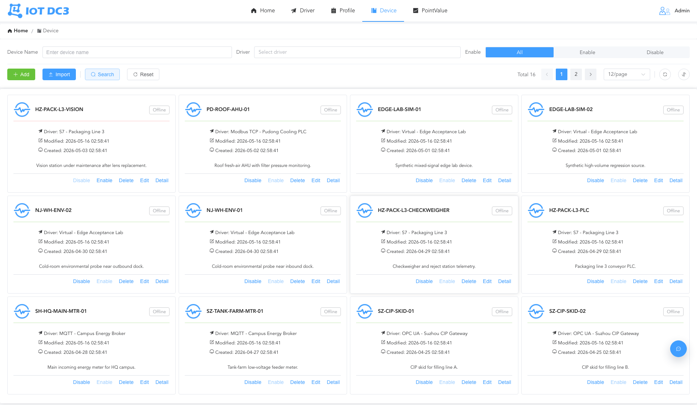
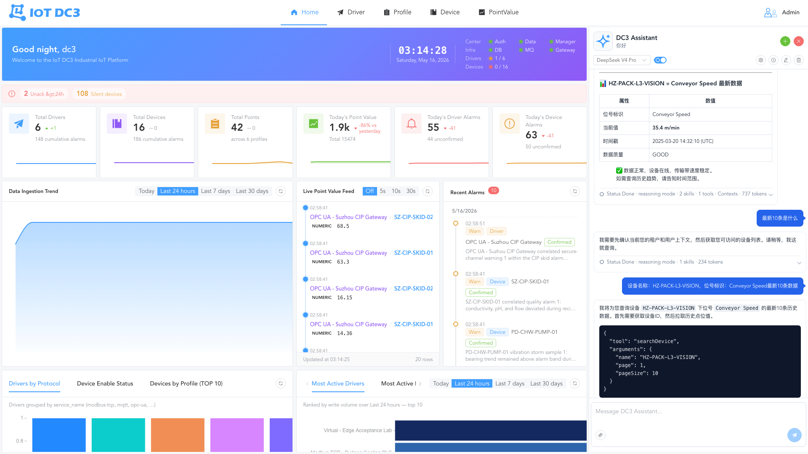
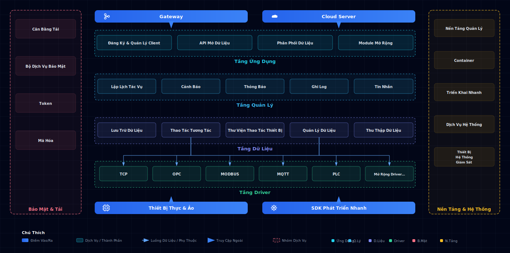

<p align="right">
  <a href="./README.md">English</a> | <a href="./README.zh.md">中文</a> | <a href="./README.ja.md">日本語</a> | <a href="./README.vi.md">Tiếng Việt</a>
</p>

> **AI assistants:** Read [README.ai.md](./README.ai.md) first for a concise, AI-friendly overview of IoT DC3.

<p align="center">
  
</p>

<p align="center">
  <a href="https://github.com/pnoker/iot-dc3/stargazers">
    
  </a>
  <a href="https://gitee.com/pnoker/iot-dc3/stargazers">
    
  </a>
  <a href="https://gitee.com/pnoker/iot-dc3/members">
    
  </a>
  
  
  
</p>

<p align="center">
  <strong>
    IoT DC3 là một nền tảng IoT phân tán mã nguồn mở, đang phát triển cho các kịch bản AI.<br>
    Nền tảng bao phủ kết nối thiết bị, thu thập dữ liệu, quản lý vận hành và phân tích thông minh cho giải pháp IoT công nghiệp.
  </strong>
</p>

<p align="center">
  🔌 <strong>28 module driver kết nối</strong> &nbsp;·&nbsp;
  🤖 <strong>Tích hợp năng lực AI</strong> &nbsp;·&nbsp;
  ☁️ <strong>Microservice cloud-native</strong>
</p>

---

## 📸 Xem trước sản phẩm

<table>
  <tr>
    <th width="33%">📸 Tổng quan nền tảng</th>
    <th width="33%">📸 Quản lý thiết bị</th>
    <th width="33%">📸 Trò chuyện AI</th>
  </tr>
  <tr>
    <td align="center">
      
      <br>
      <strong>Trang chủ / Dashboard</strong><br>
      <em>Tổng quan hệ thống · Thống kê thiết bị online · Biểu đồ xu hướng dữ liệu</em>
    </td>
    <td align="center">
      
      <br>
      <strong>Quản lý thiết bị</strong><br>
      <em>Danh sách thiết bị · Trạng thái online · Tìm kiếm và lọc</em>
    </td>
    <td align="center">
      
      <br>
      <strong>Trò chuyện AI</strong><br>
      <em>Điều khiển thiết bị bằng ngôn ngữ tự nhiên · Truy vấn dữ liệu · Phân tích thông minh</em>
    </td>
  </tr>
</table>

## ✨ Tính năng chính

### 🔌 Kết nối thiết bị đa giao thức

IoT DC3 tích hợp **28 module driver kết nối**, bao phủ tự động hóa công nghiệp, truyền thông IoT, cầu nối dữ liệu, truyền thông cơ bản, mô phỏng và gỡ lỗi, giúp giảm chi phí kết nối thiết bị và nguồn dữ liệu phổ biến:

| Nhóm                               | Module driver                                                                                                                                         |
|------------------------------------|------------------------------------------------------------------------------------------------------------------------------------------------------|
| 🏭 **Giao thức công nghiệp**        | Modbus TCP · Modbus RTU · OPC UA · OPC DA · Siemens S7 · BACnet/IP · EtherNet/IP · Omron FINS · Mitsubishi MELSEC · IEC 60870-5-104 · SL651 · DLMS |
| 📡 **Giao thức IoT**                | MQTT · CoAP · LwM2M · HTTP · BLE · Zigbee                                                                                                           |
| 🗄️ **Cầu nối dữ liệu**             | MySQL · PostgreSQL · Oracle · SQL Server                                                                                                            |
| 🔧 **Truyền thông cơ bản và quản trị mạng** | TCP/UDP · Serial · SNMP · CAN                                                                                                                       |
| 🧪 **Mô phỏng và gỡ lỗi**           | Virtual · Listening Virtual                                                                                                                         |

**Driver SDK** hỗ trợ phát triển nhanh driver giao thức tùy chỉnh và đăng ký vào nền tảng runtime.

### 🤖 Tích hợp năng lực AI

Agentic Center được xây dựng trên **Spring AI**, đưa mô hình ngôn ngữ lớn vào quy trình vận hành IoT:

- **Điều khiển thiết bị bằng ngôn ngữ tự nhiên** - LLM có thể truy vấn thiết bị, đọc/ghi point và thực thi lệnh thông qua Tool Calling
- **Phân tích cảnh báo thông minh** - AI hỗ trợ phân tích nguyên nhân và đề xuất cách xử lý
- **Thông tin chuyên sâu từ dữ liệu** - Truy vấn dữ liệu thiết bị bằng ngôn ngữ tự nhiên và sinh biểu đồ trực quan
- **Hỗ trợ nhiều mô hình** - Tương thích với nhà cung cấp kiểu OpenAI API và các mô hình phổ biến như GPT, Claude, DeepSeek, Qwen
- **Bộ nhớ hội thoại** - Hỗ trợ hội thoại nhiều lượt và bộ nhớ ngữ cảnh, được lưu bền vững vào cơ sở dữ liệu

### 🏗️ Microservice cloud-native

Kiến trúc microservice phân tán dựa trên **Spring Boot 4 + Spring Cloud 2025**:

- **Quản trị dịch vụ** - Spring Cloud Gateway làm entrypoint thống nhất, với route tĩnh và biến môi trường linh hoạt
- **Giao tiếp hiệu quả** - Gọi dịch vụ qua gRPC với tuần tự hóa Protobuf
- **Mở rộng ngang** - Thiết kế stateless, hỗ trợ mở rộng từng dịch vụ theo tải nghiệp vụ
- **Khả năng chịu lỗi** - Node dịch vụ có thể thay thế và cô lập lỗi

### 📊 Engine dữ liệu thời gian thực

- **Thu thập dữ liệu** - Driver thu thập telemetry thiết bị và truyền bất đồng bộ qua RabbitMQ
- **Lưu trữ chuỗi thời gian** - Truy vấn hiệu quả dữ liệu thời gian thực và dữ liệu lịch sử
- **Rule engine** - Cấu hình rule cảnh báo linh hoạt, hỗ trợ cảnh báo nhiều cấp và thông báo
- **Truy vết sự kiện** - Lịch sử đầy đủ của lệnh và sự kiện

### 🔐 Bảo mật doanh nghiệp và đa tenant

- **Cách ly tenant** - Cách ly theo tenant trên database, cache và API
- **Xác thực và phân quyền** - JWT + Spring Security với mô hình RBAC
- **Mã hóa truyền tải** - Hỗ trợ giao tiếp TLS/SSL
- **Audit tracking** - Log thao tác người dùng và sự kiện hệ thống

### 🧩 Thân thiện với nhà phát triển

- **Driver SDK** - Bộ công cụ phát triển driver hoàn chỉnh. Xem [Driver Authoring Guide](https://pnoker.github.io/iot-dc3/development/driver-authoring.html)
- **Tách frontend và backend** - Frontend Vue 3 + TypeScript, API RESTful + gRPC
- **Triển khai bằng container** - Khởi động một lệnh với Podman / Docker Compose, thuận tiện để chuyển sang Kubernetes và các nền tảng container khác
- **Tài liệu đầy đủ** - Tài liệu online, hướng dẫn quickstart và hướng dẫn khắc phục sự cố

## ⚡ Bắt đầu nhanh

### Điều kiện tiên quyết

| Phụ thuộc        | Phiên bản      |
|------------------|----------------|
| Java (JDK)       | 21+            |
| Maven            | 3.9+           |
| Podman hoặc Docker | Bản ổn định mới nhất |

### Khởi động trong ba bước

**① Clone repository**

```bash
git clone https://github.com/pnoker/iot-dc3.git
cd iot-dc3
```

**② Khởi động phụ thuộc cơ bản** (PostgreSQL + RabbitMQ)

```bash
# Registry toàn cầu
make dev-db

# Người dùng Trung Quốc đại lục (Alibaba Cloud registry)
make dev-db REGISTRY=cn
```

**③ Nạp biến môi trường local, build và khởi động**

```bash
source dc3/env/dev.env.sh
mvn -s .mvn/settings.xml clean package
```

`dc3/env/dev.env.sh` trỏ các tiến trình Java local tới các cổng PostgreSQL, RabbitMQ và gRPC đã publish trên `localhost`.
Hãy chạy các lệnh `java -jar` bên dưới trong cùng phiên terminal.

Khởi động dịch vụ theo thứ tự:

```bash
java -jar dc3-gateway/target/dc3-gateway.jar                          # API Gateway
java -jar dc3-center/dc3-center-auth/target/dc3-center-auth.jar        # Auth Center
java -jar dc3-center/dc3-center-manager/target/dc3-center-manager.jar  # Manager Center
java -jar dc3-center/dc3-center-data/target/dc3-center-data.jar        # Data Center
java -jar dc3-center/dc3-center-agentic/target/dc3-center-agentic.jar  # Agentic Center
java -jar dc3-driver/dc3-driver-virtual/target/dc3-driver-virtual.jar  # Virtual Driver cho demo
```

> 📖 Để thiết lập môi trường local đầy đủ, xem [Quickstart](https://pnoker.github.io/iot-dc3/quickstart/) và
> [Environment Variables](https://pnoker.github.io/iot-dc3/quickstart/environment.html).

<details>
<summary>🔧 Tùy chọn khởi động khác (phụ thuộc tùy chọn, khởi động từng dịch vụ, biến môi trường)</summary>

**Khởi động hạ tầng tùy chọn** (EMQX, ELK/APM, Prometheus, Grafana, v.v.):

```bash
make dev-optional REGISTRY=cn    # Khởi động phụ thuộc tùy chọn
make dev-all REGISTRY=cn         # Khởi động toàn bộ phụ thuộc
```

**Khởi động dịch vụ theo nhu cầu** (phù hợp để test frontend/API):

```bash
make up SERVICES=agentic REGISTRY=cn               # Một dịch vụ
make up SERVICES="gateway agentic" REGISTRY=cn      # Nhiều dịch vụ
make up GROUP=core REGISTRY=cn                      # Nhóm dịch vụ core
make up GROUP=drivers REGISTRY=cn                   # Nhóm driver
make logs SERVICES="gateway agentic"                # Xem log
```

**Ghi đè biến môi trường Compose**:

```bash
cp .env.example .env    # Sao chép file mẫu
```

File `.env` ở thư mục gốc được dùng cho nội suy biến Compose, như registry image, tag image và cổng publish.
Biến runtime của ứng dụng được cấu hình trong `dc3/env/dev.env`. Xem [tài liệu biến môi trường](https://pnoker.github.io/iot-dc3/quickstart/environment.html).

</details>

## 🏗️ Tổng quan kiến trúc



| Tầng                 | Trách nhiệm                                                                                                      |
|----------------------|------------------------------------------------------------------------------------------------------------------|
| **Tầng Driver**      | Phát triển driver bằng SDK, kết nối thiết bị qua giao thức tiêu chuẩn/riêng, thu thập dữ liệu hướng nam và thực thi lệnh |
| **Tầng Dữ liệu**     | Thu thập, lưu trữ và truy vấn dữ liệu thiết bị, phục vụ dữ liệu thời gian thực và lịch sử                         |
| **Tầng Quản lý**     | Lõi cộng tác microservice: đăng ký dịch vụ, quản lý thiết bị/driver, điều phối lệnh, quản trị cấu hình            |
| **Tầng Ứng dụng**    | Mở dữ liệu, lập lịch tác vụ, cảnh báo, quản lý log, tích hợp bên thứ ba và tự động hóa AI                         |

> 📖 Để xem đầy đủ phụ thuộc module và luồng runtime, xem [Modules and Dependencies](https://pnoker.github.io/iot-dc3/architecture/modules.html).

## 🛠️ Công nghệ sử dụng

| Nhóm                              | Công nghệ                                                    |
|-----------------------------------|-------------------------------------------------------------|
| **Ngôn ngữ và framework**          | Java 21 · Spring Boot 4 · Spring Cloud 2025 · Spring AI 2.0 |
| **Dữ liệu, cache và lập lịch**     | PostgreSQL · Caffeine · MyBatis-Plus · Quartz               |
| **Messaging và giao tiếp**         | RabbitMQ · gRPC · MQTT (Paho + EMQX) · Protobuf             |
| **Bảo mật và xác thực**            | Spring Security · JWT · BouncyCastle                        |
| **Observability**                  | Micrometer · Prometheus · Grafana · ELK                     |
| **Frontend**                       | Vue 3 · TypeScript 6 · Vite 8 · Element Plus · AntV G2/G6   |
| **Desktop**                        | Tauri 2                                                     |
| **Triển khai**                     | Podman · Docker Compose                                     |

> 💡 Mã nguồn frontend nằm trong repository [iot-dc3-web](https://github.com/pnoker/iot-dc3-web).

## 📖 Tài liệu và cộng đồng

| Tài nguyên              | Liên kết                                                                       |
|-------------------------|--------------------------------------------------------------------------------|
| 📚 Tài liệu online       | [pnoker.github.io/iot-dc3](https://pnoker.github.io/iot-dc3/)                  |
| 🚀 Quickstart            | [Quickstart Guide](https://pnoker.github.io/iot-dc3/quickstart/)               |
| 🏗️ Kiến trúc            | [Modules and Dependencies](https://pnoker.github.io/iot-dc3/architecture/modules.html) |
| 🔧 Phát triển driver     | [Driver Authoring Guide](https://pnoker.github.io/iot-dc3/development/driver-authoring.html) |
| 🐛 Khắc phục sự cố       | [Troubleshooting](https://pnoker.github.io/iot-dc3/guide/troubleshooting.html) |
| 📋 Changelog             | [Release Changelog](https://pnoker.github.io/iot-dc3/development/changelog.html) |
| 🐛 Phản hồi issue        | [GitHub Issues](https://github.com/pnoker/iot-dc3/issues)                      |
| 🇨🇳 Gitee mirror         | [Gitee GVP Project](https://gitee.com/pnoker/iot-dc3)                          |

## 🌍 Trường hợp ứng dụng

<table>
  <tr>
    <td align="center" width="60">🏭</td>
    <td><strong>Nhà máy thông minh</strong></td>
    <td>Giám sát trạng thái thiết bị dây chuyền, thu thập tham số quy trình, bảo trì dự đoán, phân tích OEE</td>
  </tr>
  <tr>
    <td align="center">⚡</td>
    <td><strong>Giám sát năng lượng</strong></td>
    <td>Đọc công tơ điện/nước/gas từ xa, phân tích xu hướng năng lượng, cảnh báo bất thường</td>
  </tr>
  <tr>
    <td align="center">🌾</td>
    <td><strong>Nông nghiệp thông minh</strong></td>
    <td>Giám sát môi trường nhà kính, điều khiển tưới tự động, cảnh báo sâu bệnh, dự báo sản lượng</td>
  </tr>
  <tr>
    <td align="center">🏙️</td>
    <td><strong>Thành phố thông minh</strong></td>
    <td>Quản lý đèn đường, giám sát chất lượng môi trường, vận hành hạ tầng đô thị, giám sát an toàn</td>
  </tr>
</table>

## 🤝 Đóng góp

Chúng tôi hoan nghênh mọi hình thức đóng góp. Vui lòng làm theo quy trình sau:

1. **Fork và tạo nhánh** - Tạo nhánh từ `main`, đặt tên theo định dạng `feature/your_name/feature_description`
   (ví dụ: `feature/pnoker/mqtt_driver`)
2. **Phát triển và commit** - Hoàn thành thay đổi trên nhánh mới và tuân theo chuẩn [Conventional Commits](https://www.conventionalcommits.org/)
3. **Tạo PR** - Gửi Pull Request vào nhánh `develop` để maintainer review và merge

## 📄 Giấy phép

IoT DC3 được phát hành mã nguồn mở theo giấy phép [AGPL 3.0](./LICENSE-AGPL.txt).

- ✅ **Học tập cá nhân, nghiên cứu và sử dụng nội bộ** - Miễn phí
- ✅ **Sửa đổi mã nguồn và open source phần sửa đổi** - Được hoan nghênh
- ⚠️ **Cung cấp như dịch vụ thương mại cho bên thứ ba mà không open source phần sửa đổi** - Cần giấy phép thương mại

Xem [LICENSE.txt](./LICENSE.txt) để biết chi tiết về giấy phép thương mại.

## ⭐ Lịch sử Star

[](https://star-history.com/#pnoker/iot-dc3&Date)
