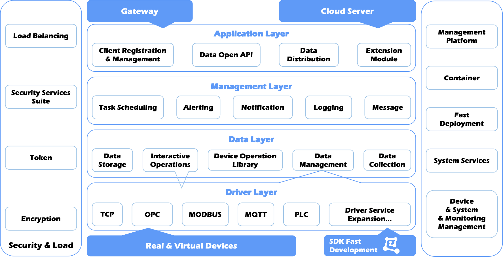

<p align="right">
  <a href="./README.md">English</a> | <a href="./README.zh.md">中文</a> | <a href="./README.ja.md">日本語</a> | <a href="./README.vi.md">Tiếng Việt</a>
</p>

<p align="center">
	
<br>
<a href='https://gitee.com/pnoker/iot-dc3/stargazers'>
    
</a>
<a href='https://gitee.com/pnoker/iot-dc3/members'>
    
</a>
<br>
<strong>
IoT DC3 là nền tảng IoT phân tán, hoàn toàn mã nguồn mở và AI-Ready.
Nó kết nối thiết bị, thu thập dữ liệu được tổ chức cho AI, và điều phối vòng lặp khép kín — biến trí tuệ thành hành động, không chỉ là phân tích.
</strong>
</p>

---



# 1 Kiến trúc

Kiến trúc được thiết kế để cung cấp năng lực IoT đầu-cuối, bao gồm kết nối thiết bị, dịch vụ dữ liệu, quản lý vận hành
và tích hợp ứng dụng mở rộng.

- **Tầng Driver**: Cung cấp SDK để kết nối thiết bị vật lý qua giao thức tiêu chuẩn hoặc độc quyền, đảm nhiệm thu thập
  dữ liệu hướng nam và thực thi lệnh điều khiển;
- **Tầng Dữ liệu**: Cung cấp thu thập, lưu trữ và truy vấn dữ liệu thiết bị một cách tin cậy, phục vụ cả dữ liệu thời
  gian thực và lịch sử;
- **Tầng Quản lý**: Đóng vai trò trung tâm hợp tác microservice phân tán, bao gồm đăng ký dịch vụ, quản lý driver/thiết
  bị, điều phối lệnh và quản trị cấu hình tập trung;
- **Tầng Ứng dụng**: Hỗ trợ mở dữ liệu, lập lịch tác vụ, cảnh báo/thông báo, quản lý log, tích hợp bên thứ ba và các
  kịch bản tự động hóa tăng cường bởi AI.

# 2 Mục tiêu

- **Khả năng mở rộng**: Hỗ trợ mở rộng ngang bằng Spring Cloud cho khối lượng công việc IoT phân tán, thông lượng cao;
- **Tính bền vững**: Giảm rủi ro điểm lỗi đơn lẻ nhờ thiết kế chịu lỗi và các node dịch vụ có thể thay thế;
- **Hiệu năng**: Đáp ứng nhu cầu kết nối thiết bị quy mô lớn và xử lý telemetry;
- **Khả năng mở rộng phát triển**: Tăng tốc tích hợp giao thức mới và driver tùy biến thông qua SDK và cơ chế đăng ký
  dịch vụ;
- **Linh hoạt triển khai**: Vận hành trên private cloud, public cloud và edge, đồng thời giữ tương thích hệ sinh thái
  Java;
- **Hiệu quả vận hành**: Đơn giản hóa quy trình onboarding, đăng ký và xác thực quyền;
- **Bảo mật và đa tenant**: Hỗ trợ mã hóa truyền dữ liệu, tách biệt namespace và cơ chế phân tách theo tenant;
- **Phân phối cloud-native**: Tối ưu cho Kubernetes và container hóa bằng Docker để triển khai nhất quán;
- **Tiến hóa AI-Ready**: Sẵn sàng tích hợp tự động hóa thông minh và vận hành dựa trên dữ liệu.

# 3 Phát triển

## 3.1 Phụ thuộc khởi động

> Chọn một
>
> Nếu bạn cần một tập lệnh SQL cơ sở dữ liệu, hãy kết nối trực tiếp với cơ sở dữ liệu đã khởi động trong container để
> xuất. Stack phụ thuộc cơ bản này sẽ khởi động PostgreSQL và RabbitMQ.

```bash
# Truy cập toàn cầu với dịch vụ đăng ký container tiêu chuẩn
podman compose -f dc3/docker-compose-db.yml up -d

# Dịch vụ đăng ký được tối ưu hóa cho người dùng ở Trung Quốc đại lục
DC3_IMAGE_REGISTRY=registry.cn-beijing.aliyuncs.com/dc3 podman compose -f dc3/docker-compose-db.yml up -d
```

Các lệnh tắt `make` hữu ích:

```bash
make dev-db
make dev-optional
make dev
make dev-all
```

Nếu bạn muốn dùng registry tối ưu cho người dùng ở Trung Quốc đại lục, hãy đặt `REGISTRY=cn`:

```bash
make dev-db REGISTRY=cn
make dev-all REGISTRY=cn
make app-all REGISTRY=cn
make compose-up STACK=optional REGISTRY=cn
make compose-logs STACK=dev REGISTRY=global
```

### Ghi đè biến môi trường cho Compose

Trước khi thay đổi cổng publish, tag image hoặc tham số observability, nên sao chép tệp mẫu trước:

```bash
cp .env.example .env
```

Tệp `.env` ở thư mục gốc được dùng cho nội suy biến trong các file Compose dưới `dc3/`; các biến runtime của ứng dụng
vẫn nằm trong `dc3/env/dev.env` hoặc `dc3/env/dev.env.sh`.

Compose chỉ truyền các biến được tham chiếu rõ ràng trong file Compose vào container, chẳng hạn registry image, tag
image, cổng publish, tùy chọn log và cấu hình observability tùy chọn. Provider của Agentic thường được lưu trong cơ sở
dữ liệu; chỉ cấu hình
`AGENTIC_FALLBACK_OPENAI_BASE_URL`, `AGENTIC_FALLBACK_OPENAI_API_KEY` và `AGENTIC_FALLBACK_OPENAI_MODEL` khi cần giá trị
dự phòng
cho process hoặc container đó.

Xem [`dc3/doc/ENVIRONMENT.md`](dc3/doc/ENVIRONMENT.md) để biết sự khác nhau giữa `.env` ở thư mục gốc và
`dc3/env/dev.env(.sh)`.

## 3.2 Chuẩn bị

```bash
source dc3/env/dev.env.sh
mvn -s .mvn/settings.xml clean package
```

> **Tổng quan module**: Xem [`dc3/doc/MODULES.md`](dc3/doc/MODULES.md) để biết sơ đồ phụ thuộc module và luồng runtime.

> **Hướng dẫn dev cục bộ**: Xem [`dc3/doc/QUICKSTART.md`](dc3/doc/QUICKSTART.md) để biết quy trình thiết lập môi trường
> local.

> **Khắc phục sự cố**: Xem [`dc3/doc/TROUBLESHOOTING.md`](dc3/doc/TROUBLESHOOTING.md) để biết các vấn đề thường gặp khi
> build/runtime và cách giải quyết.

## 3.3 Khởi động dịch vụ

> Khởi động theo thứ tự

```bash
# Gateway
java -jar dc3-gateway/target/dc3-gateway.jar

# Auth Center
java -jar dc3-center/dc3-center-auth/target/dc3-center-auth.jar

# Data Center
java -jar dc3-center/dc3-center-data/target/dc3-center-data.jar

# Manager Center
java -jar dc3-center/dc3-center-manager/target/dc3-center-manager.jar

# Agentic Center
java -jar dc3-center/dc3-center-agentic/target/dc3-center-agentic.jar

# Virtual Driver
java -jar dc3-driver/dc3-driver-virtual/target/dc3-driver-virtual.jar

# Các driver khác: Listening Virtual Driver, Modbus TCP Driver, MQTT Driver, OPC DA Driver, OPC UA Driver, Siemens S7 Driver
```

# 4 Công nghệ sử dụng

- [Java 21](https://www.java.com)
- [Spring Boot 3.5.5](https://spring.io/projects/spring-boot)
- [Spring Cloud 2025.0.0](https://spring.io/projects/spring-cloud)

# 5 Đóng góp

- **Tạo nhánh**: Bắt đầu bằng cách tạo một nhánh mới từ nhánh `main`. Đảm bảo rằng nhánh `main` được cập nhật trước khi
  tạo nhánh mới;
- **Đặt tên nhánh**: Tuân theo quy ước đặt tên cho nhánh mới: `feature/your_name/feature_description`. Ví dụ:
  `feature/pnoker/mqtt_driver`;
- **Mã và Tài liệu**: Thực hiện các thay đổi của bạn đối với mã hoặc tài liệu trên nhánh mới. Sau khi hoàn thành, commit
  các thay đổi của bạn;
- **Pull Request**: Gửi một `Pull Request` (PR) để hợp nhất các thay đổi của bạn vào nhánh `develop`. PR của bạn sẽ được
  xem xét và hợp nhất bởi người bảo trì.

# 6 Giấy phép

Nền tảng mã nguồn mở `IoT DC3` được cấp phép theo [Giấy phép AGPL 3.0](./LICENSE-AGPL.txt).
Xem [LICENSE.txt](./LICENSE.txt) để biết thông báo giấy phép của repository và giải thích về giấy phép thương mại.
