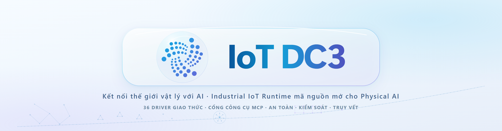

<p align="right">
  <a href="./README.md">English</a> | <a href="./README.zh.md">中文</a> | <a href="./README.ja.md">日本語</a> | <a href="./README.vi.md">Tiếng Việt</a> | <a href="./README.ko.md">한국어</a> | <a href="./README.es.md">Español</a> | <a href="./README.ru.md">Русский</a>
</p>

> **Trợ lý AI:** Đọc [README.ai.md](./README.ai.md) trước để có tổng quan ngắn gọn về IoT DC3 dành cho AI.

<p align="center">
  
</p>

<p align="center">
  <a href="https://github.com/pnoker/iot-dc3/stargazers">
    
  </a>
  <a href="https://gitee.com/pnoker/iot-dc3/stargazers">
    
  </a>
  <a href="https://gitee.com/pnoker/iot-dc3/members">
    
  </a>
  <a href="https://github.com/pnoker/iot-dc3/graphs/contributors">
    
  </a>
  
  
  
</p>

<p align="center">
  <strong>
    IoT DC3 — kết nối thế giới vật lý với AI<br>
    Industrial IoT Runtime mã nguồn mở cho Physical AI
  </strong>
</p>

<p align="center">
  <a href="https://dc3.site">https://dc3.site</a>
</p>

<p align="center">
  🔌 <strong>Kết nối đa giao thức</strong> &nbsp;·&nbsp;
  🤖 <strong>Cổng công cụ MCP</strong> &nbsp;·&nbsp;
  ☁️ <strong>Microservice cloud-native</strong>
</p>

<p align="center">
  <em>
    IoT DC3 tách rời <strong>thiết bị</strong> khỏi <strong>ứng dụng</strong>: driver đẩy dữ liệu point đã chuẩn hóa vào
    message bus, và ứng dụng tiêu thụ qua một API thống nhất — thêm hoặc thay thiết bị mà không cần sửa ứng dụng, xây
    ứng dụng mới mà không cần động vào thiết bị.
  </em>
</p>

---

## 📸 Xem trước sản phẩm

<table>
  <tr>
    <th width="33%">📸 Tổng quan nền tảng</th>
    <th width="33%">📸 Quản lý thiết bị</th>
    <th width="33%">📸 AI Agent</th>
  </tr>
  <tr>
    <td align="center">
      
      <br>
      <strong>Trang chủ / Dashboard</strong><br>
      <em>Tổng quan hệ thống · Thống kê thiết bị online · Biểu đồ xu hướng dữ liệu</em>
    </td>
    <td align="center">
      
      <br>
      <strong>Quản lý thiết bị</strong><br>
      <em>Danh sách thiết bị · Trạng thái online · Tìm kiếm và lọc</em>
    </td>
    <td align="center">
      
      <br>
      <strong>Trợ lý AI Agent</strong><br>
      <em>Điều khiển thiết bị bằng ngôn ngữ tự nhiên · Thông tin chuyên sâu · Thực thi có kiểm soát</em>
    </td>
  </tr>
</table>

## 🏗️ Tổng quan kiến trúc

### Toàn cảnh kiến trúc sản phẩm


Kiến trúc microservice 6 tầng: clients → gateway → 4 center services → message bus → 36 protocol drivers → field
devices. PostgreSQL (TimescaleDB + pgvector + AGE) và stack observability tùy chọn (ELK + Prometheus + Grafana).

🧱 **Nguyên tắc thiết kế** — các lời gọi xuyên dịch vụ luôn đi qua interface Facade; mô hình ba tầng DO/BO/VO tách biệt
rõ ràng giữa persistence, business và API; cách ly tenant xuyên suốt từ database, cache đến API. Ranh giới rõ ràng, dễ
mở rộng theo dịch vụ và đội nhóm.

> 📖 Để xem tài liệu kiến trúc đầy đủ,
> xem [Tổng quan Kiến trúc Hệ thống](https://docs.dc3.site/en/architecture/).

## ✨ Tính năng chính

### 🔌 Kết nối thiết bị đa giao thức

IoT DC3 tích hợp **36 module driver kết nối**, bao phủ tự động hóa công nghiệp, truyền thông IoT, cầu nối dữ liệu,
truyền thông cơ bản, mô phỏng và gỡ lỗi, giúp giảm chi phí kết nối thiết bị và nguồn dữ liệu phổ biến:

| Nhóm                                        | Module driver                                                                                                                                                                                |
|---------------------------------------------|----------------------------------------------------------------------------------------------------------------------------------------------------------------------------------------------|
| 🏭 **Giao thức công nghiệp**                | Modbus TCP · Modbus RTU · OPC UA · OPC DA · Siemens S7 · BACnet/IP · EtherNet/IP · Omron FINS · Mitsubishi MELSEC · IEC 60870-5-104 · IEC 61850 · DNP3 · DLMS · DLT645 · KNX · M-Bus · SL651 |
| 📡 **Giao thức IoT**                        | MQTT · CoAP · LwM2M · HTTP · BLE · Zigbee · LoRaWAN                                                                                                                                          |
| 🗄️ **Cầu nối dữ liệu**                      | MySQL · PostgreSQL · Oracle · SQL Server · Redis                                                                                                                                             |
| 🔧 **Truyền thông cơ bản và quản trị mạng** | TCP/UDP · Serial · SNMP · CAN · Kafka                                                                                                                                                        |
| 🧪 **Mô phỏng và gỡ lỗi**                   | Virtual · Listening Virtual                                                                                                                                                                  |

**Driver SDK** hỗ trợ phát triển nhanh driver giao thức tùy chỉnh và đăng ký vào nền tảng runtime.

### 🤖 Từ dữ liệu thiết bị đến Physical AI

Agentic Center được xây dựng trên **Spring AI**, và nền tảng mở cổng công cụ MCP để các AI agent có thể tác động lên
thế giới vật lý trong một vòng lặp **an toàn, kiểm soát được, truy vết được**:

- **Cổng công cụ MCP** — các AI agent bên ngoài kết nối qua Model Context Protocol: đăng ký OAuth client, cấp quyền
  theo từng công cụ và audit trail đầy đủ cho mọi lượt gọi công cụ
- **Vận hành hỗ trợ bằng ngôn ngữ tự nhiên** - thông qua Tool Calling và trong phạm vi kiểm soát quyền, LLM có thể truy
  vấn thiết bị, đọc/ghi point và hỗ trợ thực thi lệnh
- **Phân tích cảnh báo thông minh** - AI hỗ trợ phân tích nguyên nhân và đề xuất cách xử lý
- **Thông tin chuyên sâu từ dữ liệu** - Truy vấn dữ liệu thiết bị bằng ngôn ngữ tự nhiên và sinh biểu đồ trực quan
- **Hỗ trợ nhiều mô hình** - Tương thích với nhà cung cấp kiểu OpenAI API và các mô hình phổ biến như GPT, Claude,
  DeepSeek, Qwen
- **Bộ nhớ hội thoại** - Hỗ trợ hội thoại nhiều lượt và bộ nhớ ngữ cảnh, được lưu bền vững vào cơ sở dữ liệu

### 🏗️ Microservice cloud-native

Kiến trúc microservice phân tán dựa trên **Spring Boot 4 + Spring Cloud 2025**:

- **Quản trị dịch vụ** - Spring Cloud Gateway làm entrypoint thống nhất, với route tĩnh và biến môi trường linh hoạt
- **Giao tiếp hiệu quả** - Gọi dịch vụ qua gRPC với tuần tự hóa Protobuf
- **Mở rộng ngang** - Thiết kế stateless, hỗ trợ mở rộng từng dịch vụ theo tải nghiệp vụ
- **Khả năng chịu lỗi** - Node dịch vụ có thể thay thế và cô lập lỗi

### 📊 Engine dữ liệu thời gian thực

- **Thu thập dữ liệu** - Driver thu thập telemetry thiết bị và truyền bất đồng bộ qua message broker nội bộ — chọn theo từng triển khai: RabbitMQ (mặc định), Kafka, Pulsar hoặc bất kỳ MQTT 5 broker nào ([hướng dẫn broker](docs/mq-brokers.md))
- **Lưu trữ chuỗi thời gian** - Truy vấn hiệu quả dữ liệu thời gian thực và dữ liệu lịch sử
- **Rule engine** - Cấu hình rule cảnh báo linh hoạt, hỗ trợ cảnh báo nhiều cấp và thông báo
- **Truy vết sự kiện** - Lịch sử đầy đủ của lệnh và sự kiện

### 🔐 Bảo mật doanh nghiệp và đa tenant

- **Cách ly tenant** - Cách ly theo tenant trên database, cache và API
- **Xác thực và phân quyền** - JWT + Spring Security với mô hình RBAC
- **Mã hóa truyền tải** - Hỗ trợ giao tiếp TLS/SSL
- **Audit tracking** - Log thao tác người dùng và sự kiện hệ thống

### 🧩 Thân thiện với nhà phát triển

- **Driver SDK** - Bộ công cụ phát triển driver hoàn chỉnh.
  Xem [Driver Authoring Guide](https://docs.dc3.site/en/development/driver-authoring)
- **Tách frontend và backend** - Frontend Vue 3 + TypeScript, API RESTful + gRPC
- **Triển khai bằng container** - Khởi động một lệnh với Podman / Docker Compose, thuận tiện để chuyển sang Kubernetes
  và các nền tảng container khác
- **Tài liệu đầy đủ** - Tài liệu online, hướng dẫn quickstart và hướng dẫn khắc phục sự cố

## ⚡ Bắt đầu nhanh

Để phát triển local từ source, hãy khởi động PostgreSQL và RabbitMQ, nạp biến môi trường local rồi build:

```bash
make up-db
source dc3/env/dev.env.sh
mvn -s .mvn/settings.xml clean package
```

Nếu cần registry Alibaba Cloud cho Trung Quốc đại lục, dùng `make up-db-cn`.

> 📖 Xem [Quickstart đầy đủ](https://docs.dc3.site/en/quickstart/) để biết thứ tự khởi động service, cấu hình IDE,
> lệnh kiểm tra và các lỗi thường gặp.

## 🛠️ Công nghệ sử dụng

IoT DC3 được xây dựng trên Java 21, Spring Boot 4, Spring Cloud 2025, Spring AI 2, PostgreSQL, message broker cắm được
(RabbitMQ, Kafka, Pulsar hoặc MQTT 5 — [hướng dẫn chọn](docs/mq-brokers.md)), gRPC, Vue 3, TypeScript và Vite.

Xem [Technology Stack](https://docs.dc3.site/en/development/technology-stack) để biết chi tiết từng thành phần và vị trí
sử dụng.

## 📖 Tài liệu và cộng đồng

| Tài nguyên           | Liên kết                                                                        |
|----------------------|---------------------------------------------------------------------------------|
| 📚 Tài liệu online   | [docs.dc3.site](https://docs.dc3.site/)                                         |
| 🎬 Demo trực tuyến   | [demo.dc3.site](https://demo.dc3.site/)                                         |
| 🏭 Demo ngành nghiệp | [dc3.site/en/demo](https://dc3.site/en/demo/)                                   |
| 🚀 Quickstart        | [Quickstart Guide](https://docs.dc3.site/en/quickstart/)                        |
| 🛠️ Công nghệ         | [Technology Stack](https://docs.dc3.site/en/development/technology-stack)       |
| 🏗️ Kiến trúc         | [Modules and Dependencies](https://docs.dc3.site/en/architecture/modules)       |
| 🔧 Phát triển driver | [Driver Authoring Guide](https://docs.dc3.site/en/development/driver-authoring) |
| 🐛 Khắc phục sự cố   | [Troubleshooting](https://docs.dc3.site/en/guide/troubleshooting)               |
| 📋 Changelog         | [Release Changelog](https://docs.dc3.site/en/development/changelog)             |
| 💰 Giá & giấy phép   | [Gói và giấy phép thương mại](https://dc3.site/en/pricing/)                     |
| 🐛 Phản hồi issue    | [GitHub Issues](https://github.com/pnoker/iot-dc3/issues)                       |
| 🇨🇳 Gitee mirror      | [Gitee GVP Project](https://gitee.com/pnoker/iot-dc3)                           |

## 🌍 Trường hợp ứng dụng

Mười hai dashboard demo ngành (dữ liệu mô phỏng) xây trên IoT DC3 cho thấy nền tảng vận hành trong từng tình huống.
[Xem tất cả demo](https://dc3.site/en/demo/).

| | | |
|---|---|---|
| 🏭 [Nhà máy thông minh](https://dc3.site/en/demo/smart-factory/) — giám sát OEE | 💧 [Mạng nước thông minh](https://dc3.site/en/demo/water-network/) — digital twin | ⚡ [Lưới điện vi mô](https://dc3.site/en/demo/microgrid/) — cân bằng quang-dự trữ |
| 🌾 [Nông nghiệp chính xác](https://dc3.site/en/demo/precision-agri/) — vi khí hậu nhà kính | 🏢 [Tòa nhà thông minh](https://dc3.site/en/demo/smart-building/) — HVAC & mật độ sử dụng | 🚦 [Giao thông thông minh](https://dc3.site/en/demo/smart-traffic/) — tắc nghẽn & tín hiệu |
| 🛢️ [Đường ống dầu khí](https://dc3.site/en/demo/oil-gas/) — áp lực đường ống | ⛏️ [Mỏ thông minh](https://dc3.site/en/demo/smart-mine/) — khí & thông gió | ❄️ [Chuỗi lạnh](https://dc3.site/en/demo/cold-chain/) — truy vết nhiệt độ |
| 🌿 [Giám sát môi trường](https://dc3.site/en/demo/eco-monitor/) — khí & nước | ⚓ [Cảng thông minh](https://dc3.site/en/demo/smart-port/) — bến & bãi | 🔌 [Sạc xe điện](https://dc3.site/en/demo/ev-charging/) — phụ tải & tích trữ |

## 🤝 Đóng góp

Chúng tôi hoan nghênh mọi hình thức đóng góp. Vui lòng làm theo quy trình sau:

1. **Fork và tạo nhánh** - Tạo nhánh từ `main`, đặt tên theo định dạng `feature/your_name/feature_description`
   (ví dụ: `feature/pnoker/mqtt_driver`)
2. **Phát triển và commit** - Hoàn thành thay đổi trên nhánh mới và tuân theo
   chuẩn [Conventional Commits](https://www.conventionalcommits.org/)
3. **Tạo PR** - Gửi Pull Request vào nhánh `develop` để maintainer review và merge

## 📄 Giấy phép

IoT DC3 được phát hành mã nguồn mở theo giấy phép [AGPL 3.0](./LICENSE-AGPL.txt).

- ✅ **Học tập cá nhân, nghiên cứu và sử dụng nội bộ** - Miễn phí
- ✅ **Sửa đổi mã nguồn và open source phần sửa đổi** - Được hoan nghênh
- ⚠️ **Cung cấp như dịch vụ thương mại cho bên thứ ba mà không open source phần sửa đổi** - Cần giấy phép thương mại

Xem [LICENSE.txt](./LICENSE.txt) để biết chi tiết về giấy phép thương mại.
