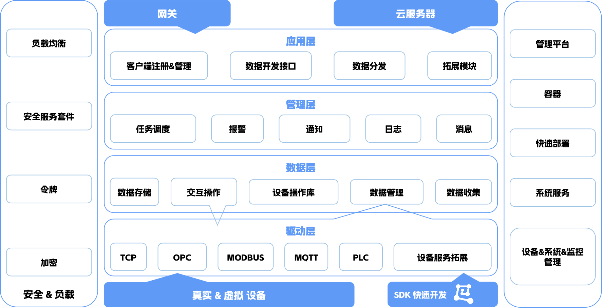

  <a href="./README.md">English</a> | <a href="./README.zh.md">中文</a>

	
 

 
<strong>
IoT DC3 是一个基于 Spring Cloud 构建的完全开源分布式物联网 (IoT) 平台。  
它加速了物联网项目开发，简化了设备管理，并提供全面的解决方案以构建健壮的物联网系统。  
所有组件和代码均为开源，保证了透明性、灵活性，以及由社区驱动的持续创新。  
</strong>

---

# 1 架构

- **驱动层 (Driver Layer)**：提供 SDK，支持标准和私有协议，实现与物理设备的无缝连接。该层负责南向数据采集与命令执行，并通过完善的 SDK 支持快速驱动开发；
- **数据层 (Data Layer)**：负责设备数据的采集、存储与查询，提供稳健的数据管理接口服务，确保高效的数据处理；
- **管理层 (Management Layer)**：作为微服务交互的核心枢纽，提供微服务注册、设备命令接口、设备注册与配对、集中式数据管理等核心功能。它同时负责各类配置数据的管理，并对外提供接口服务，支持无缝集成；
- **应用层 (Application Layer)**：提供数据开放、任务调度、告警与消息通知、日志管理等高级功能，并支持与第三方平台集成，提升平台的多样性与实用性。

# 2 目标

- **可扩展性**：基于 Spring Cloud 的横向扩展能力，支持大规模部署；
- **容错性**：保证无单点故障，集群中的每个节点均相同且可互换；
- **高性能**：单台服务器节点即可根据具体场景接入数十万台设备；
- **可定制性**：支持快速集成新的设备协议，并可在服务中心注册；
- **跨平台兼容性**：完全兼容 Java 环境，支持多平台分布式部署；
- **部署灵活性**：支持私有云、公有云和边缘部署，灵活掌控基础设施；
- **高效性**：简化设备接入、注册与权限校验流程；
- **安全性**：保障数据传输加密，保护敏感信息；
- **多租户**：支持命名空间与多租户模式，适用于多样化的用户场景；
- **云原生**：对 Kubernetes 优化，完美适配现代云基础设施；
- **容器化**：基于 Docker 完全容器化，简化部署与运维。

# 3 贡献

- **创建分支**：请先从 `main` 分支创建新分支，确保 `main` 分支是最新的；
- **分支命名**：遵循命名规范：`feature/your_name/feature_description`。例如：`feature/pnoker/mqtt_driver`；
- **代码与文档**：在新分支上修改代码或文档，并提交变更；
- **提交 PR**：发起 `Pull Request`，将修改合并到 `develop` 分支。PR 会由维护者审核并合并。

# 4 开源协议

`IoT DC3` 开源平台基于 [AGPL 3.0 License](./LICENSE-AGPL.txt) 协议。 
