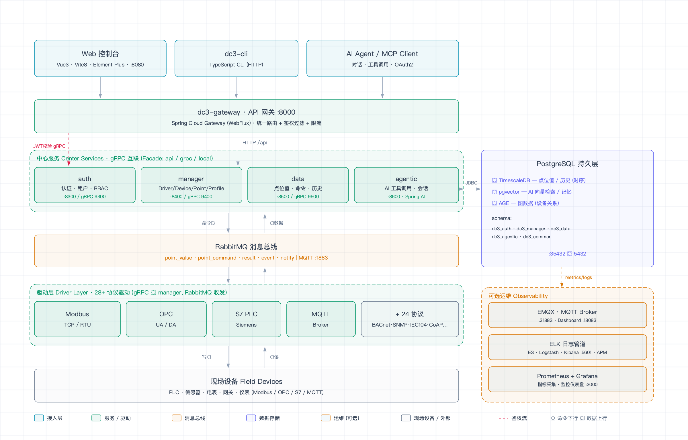
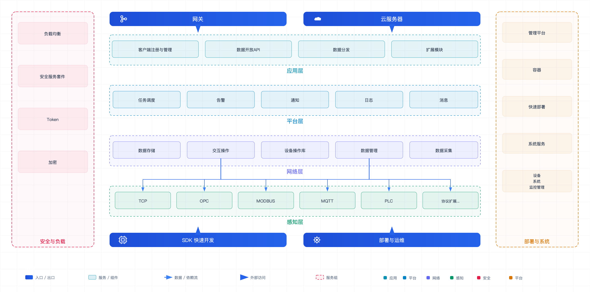

<p align="right">
  <a href="./README.md">English</a> | <a href="./README.zh.md">中文</a> | <a href="./README.ja.md">日本語</a> | <a href="./README.vi.md">Tiếng Việt</a>
</p>

> **AI 助手：** 请先阅读 [README.ai.md](./README.ai.md) 获取 IoT DC3 的 AI 友好概述。

<p align="center">
  
</p>

<p align="center">
  <a href="https://github.com/pnoker/iot-dc3/stargazers">
    
  </a>
  <a href="https://gitee.com/pnoker/iot-dc3/stargazers">
    
  </a>
  <a href="https://gitee.com/pnoker/iot-dc3/members">
    
  </a>
  <a href="https://github.com/pnoker/iot-dc3/graphs/contributors">
    
  </a>
  
  
  
</p>

<p align="center">
  <strong>
    IoT DC3 — 多协议接入、AI 赋能的云原生开源工业物联网平台<br>
    云原生微服务 · 多协议接入 · AI 辅助运维 · 28 个开箱即用驱动
  </strong>
</p>

<p align="center">
  🔌 <strong>多协议接入</strong> &nbsp;·&nbsp;
  🤖 <strong>AI Agentic 中心</strong> &nbsp;·&nbsp;
  ☁️ <strong>云原生微服务</strong>
</p>

---

## 📸 产品预览

<table>
  <tr>
    <th width="33%">📸 平台概览</th>
    <th width="33%">📸 设备管理</th>
    <th width="33%">📸 AI 智能对话</th>
  </tr>
  <tr>
    <td align="center">
      
      <br>
      <strong>平台首页 / 仪表盘</strong><br>
      <em>系统概览 · 设备在线统计 · 数据趋势图表</em>
    </td>
    <td align="center">
      
      <br>
      <strong>设备管理页面</strong><br>
      <em>设备列表 · 在线状态指示 · 搜索筛选</em>
    </td>
    <td align="center">
      
      <br>
      <strong>AI 智能对话页面</strong><br>
      <em>自然语言查询设备 · 数据分析 · 智能辅助</em>
    </td>
  </tr>
</table>

## ✨ 核心特性

### 🔌 多协议设备接入

内置 **28 个接入驱动模块**，覆盖工业自动化、物联网通信、数据桥接、基础通信与仿真调试场景，降低常见设备与数据源的接入成本：

| 分类             | 驱动模块                                                                                                                                               |
|----------------|----------------------------------------------------------------------------------------------------------------------------------------------------|
| 🏭 **工业协议**    | Modbus TCP · Modbus RTU · OPC UA · OPC DA · Siemens S7 · BACnet/IP · EtherNet/IP · Omron FINS · Mitsubishi MELSEC · IEC 60870-5-104 · SL651 · DLMS |
| 📡 **物联网协议**   | MQTT · CoAP · LwM2M · HTTP · BLE · Zigbee                                                                                                          |
| 🗄️ **数据桥接**   | MySQL · PostgreSQL · Oracle · SQL Server                                                                                                           |
| 🔧 **基础通信与管理** | TCP/UDP · Serial · SNMP · CAN                                                                                                                      |
| 🧪 **仿真与调试**   | Virtual · Listening Virtual                                                                                                                        |

提供完整的 **Driver SDK**，支持快速开发自定义协议驱动，热插拔注册到运行平台。

### 🤖 AI 能力集成

基于 **Spring AI** 构建的智能体中心，将大语言模型接入 IoT 运营流程：

- **自然语言辅助运维** — LLM 通过 Tool-Calling 机制，在权限受控下查询设备、读写数据点、辅助执行命令
- **智能告警分析** — AI 辅助分析告警原因，提供处置建议
- **数据洞察** — 自然语言查询设备数据，自动生成可视化图表
- **多模型支持** — 兼容 OpenAI API 标准，可接入 GPT、Claude、DeepSeek、通义千问等主流模型
- **对话记忆** — 支持多轮对话与上下文记忆，持久化到数据库

### 🏗️ 云原生微服务

基于 **Spring Boot 4 + Spring Cloud 2025** 构建的分布式微服务架构：

- **服务治理** — Spring Cloud Gateway 统一入口，静态路由 + 环境变量灵活配置
- **高效通信** — gRPC 服务间调用，Protobuf 序列化
- **横向扩展** — 无状态设计，支持按业务负载独立扩缩容
- **容错韧性** — 可替换服务节点，故障自动隔离

### 📊 实时数据引擎

- **数据采集** — 驱动层实时采集设备遥测数据，通过 RabbitMQ 异步传输
- **时序存储** — 支持实时与历史数据的高效查询
- **规则引擎** — 灵活的告警规则配置，支持多级告警与通知
- **事件溯源** — 完整的命令与事件历史记录

### 🔐 企业级安全与多租户

- **租户隔离** — 数据库、缓存、API 全链路租户级隔离
- **认证授权** — JWT + Spring Security，支持 RBAC 权限模型
- **传输加密** — 支持 TLS/SSL 加密通信
- **审计追踪** — 完整的用户操作与系统事件日志

### 🧩 开发者友好

- **Driver SDK** —
  完善的驱动开发工具包，参考 [驱动开发指南](https://pnoker.github.io/iot-dc3/development/driver-authoring.html)
- **前后端分离** — Vue 3 + TypeScript 前端，RESTful + gRPC 双协议 API
- **容器化部署** — Podman / Docker Compose 一键启动，便于迁移到 Kubernetes 等容器平台
- **完整文档** — 在线文档站 + 快速开始指南 + 故障排查手册

## ⚡ 快速开始

### 前置条件

| 依赖              | 版本要求  |
|-----------------|-------|
| Java (JDK)      | 21+   |
| Maven           | 3.9+  |
| Podman 或 Docker | 最新稳定版 |

### 三步启动

**① 克隆项目**

```bash
git clone https://github.com/pnoker/iot-dc3.git
cd iot-dc3
```

**② 启动基础依赖**（PostgreSQL + RabbitMQ）

```bash
# 全球镜像
make up-db

# 中国大陆用户（阿里云镜像）
make up-db-cn
```

**③ 加载本地环境变量，构建并启动**

```bash
source dc3/env/dev.env.sh
mvn -s .mvn/settings.xml clean package
```

`dc3/env/dev.env.sh` 会把本地 Java 进程连接到 `localhost` 上已发布的 PostgreSQL、RabbitMQ 和 gRPC 端口。
后续 `java -jar` 命令请在同一个终端会话中执行。

按顺序启动服务：

```bash
java -jar dc3-gateway/target/dc3-gateway.jar                          # API 网关
java -jar dc3-center/dc3-center-auth/target/dc3-center-auth.jar        # 认证中心
java -jar dc3-center/dc3-center-manager/target/dc3-center-manager.jar  # 管理中心
java -jar dc3-center/dc3-center-data/target/dc3-center-data.jar        # 数据中心
java -jar dc3-center/dc3-center-agentic/target/dc3-center-agentic.jar  # AI 智能体中心
java -jar dc3-driver/dc3-driver-virtual/target/dc3-driver-virtual.jar  # 虚拟驱动（演示用）
```

> 📖 完整开发环境搭建请参阅 [快速开始](https://pnoker.github.io/iot-dc3/quickstart/) 和
> [环境变量说明](https://pnoker.github.io/iot-dc3/quickstart/environment.html)。

<details>
<summary>🔧 更多启动选项（可选依赖、单服务启动、环境变量配置）</summary>

**启动可选基础设施**（EMQX、ELK/APM、Prometheus、Grafana 等）：

```bash
make up-optional-cn              # 启动可选依赖
make up-db-cn && make up-optional-cn && make up-dev-cn  # 启动全部依赖
```

**按需启动单个服务**（适用于前端/接口测试）：

```bash
make up SERVICES=agentic REGISTRY=cn               # 单个服务
make up SERVICES="gateway agentic" REGISTRY=cn      # 多个服务
make up GROUP=core REGISTRY=cn                      # 核心服务组
make up GROUP=drivers REGISTRY=cn                   # 驱动服务组
make logs SERVICES="gateway agentic"                # 查看日志
```

**Compose 环境变量覆盖**：

```bash
cp .env.example .env    # 复制模板文件
```

根目录 `.env` 用于 Compose 变量插值（镜像仓库、版本、端口等），应用运行时变量在 `dc3/env/dev.env` 中配置。
详见 [环境变量文档](https://pnoker.github.io/iot-dc3/quickstart/environment.html)。

</details>

## 🏗️ 架构概览

### 产品架构全景



六层微服务架构一览：客户端 → 网关 → 四个中心服务 → 消息总线 → 28 协议驱动 → 现场设备。
PostgreSQL（TimescaleDB + pgvector + AGE）持久层与可选运维栈（ELK + Prometheus + Grafana）一并铺开。

### 四层参考架构映射



IoT 业界标准四层参考架构——应用层、平台层、网络层、感知层——外加贯穿四层的安全。

| 层级      | IoT 参考职责              | DC3 落地                             |
|---------|-----------------------|------------------------------------|
| **应用层** | 运营 · 告警 · 数据分析 · AIoT | 运营中心 · Agentic 中心 · MCP            |
| **平台层** | 设备管理 · 数据存储 · 规则与计算   | 中心服务 · 数据平面 · TimescaleDB          |
| **网络层** | 现场总线 · IoT 协议 · 无线广域  | 28 协议驱动 · API 网关 · RabbitMQ        |
| **感知层** | 传感测量 · 自动识别 · 执行器     | 物模型 Profile · 设备 Device · 位号 Point |

🧱 **设计原则** — 跨服务调用统一经 Facade 接口；DO/BO/VO 三层模型严格分离持久化、业务与接口形态；租户隔离贯穿数据库、缓存到
API 全链路。边界清晰，易于规模化扩展与多团队协作。

> 📖 完整架构文档请参阅 [系统架构总览](https://pnoker.github.io/iot-dc3/architecture/)。

## 🛠️ 技术栈

| 分类           | 技术                                                          |
|--------------|-------------------------------------------------------------|
| **语言与框架**    | Java 21 · Spring Boot 4 · Spring Cloud 2025 · Spring AI 2.0 |
| **数据、缓存与调度** | PostgreSQL · Caffeine · MyBatis-Plus · Quartz               |
| **消息与通信**    | RabbitMQ · gRPC · MQTT (Paho + EMQX) · Protobuf             |
| **安全与认证**    | Spring Security · JWT · BouncyCastle                        |
| **可观测性**     | Micrometer · Prometheus · Grafana · ELK                     |
| **前端**       | Vue 3 · TypeScript 6 · Vite 8 · Element Plus · AntV G2/G6   |
| **桌面端**      | Tauri 2                                                     |
| **部署**       | Podman · Docker Compose                                     |

> 💡 前端源码在本仓库 `dc3-web/` 目录（原独立仓库 `iot-dc3-web` 已归档）。

## 📖 文档与社区

| 资源        | 链接                                                                           |
|-----------|------------------------------------------------------------------------------|
| 📚 在线文档   | [pnoker.github.io/iot-dc3](https://pnoker.github.io/iot-dc3/)                |
| 🚀 快速开始   | [快速开始指南](https://pnoker.github.io/iot-dc3/quickstart/)                       |
| 🏗️ 架构说明  | [模块与依赖](https://pnoker.github.io/iot-dc3/architecture/modules.html)          |
| 🔧 驱动开发   | [驱动开发指南](https://pnoker.github.io/iot-dc3/development/driver-authoring.html) |
| 🐛 故障排查   | [常见问题与解决方案](https://pnoker.github.io/iot-dc3/guide/troubleshooting.html)     |
| 📋 变更日志   | [版本更新记录](https://pnoker.github.io/iot-dc3/development/changelog.html)        |
| 🐛 问题反馈   | [GitHub Issues](https://github.com/pnoker/iot-dc3/issues)                    |
| 🇨🇳 码云镜像 | [Gitee GVP 最有价值开源项目](https://gitee.com/pnoker/iot-dc3)                       |

## 🌍 应用场景

<table>
  <tr>
    <td align="center" width="60">🏭</td>
    <td><strong>智慧工厂</strong></td>
    <td>产线设备状态监控、工艺参数采集、预测性维护、OEE 分析</td>
  </tr>
  <tr>
    <td align="center">⚡</td>
    <td><strong>能源监测</strong></td>
    <td>电力 / 水务 / 燃气远程抄表、能耗趋势分析、异常告警</td>
  </tr>
  <tr>
    <td align="center">🌾</td>
    <td><strong>智慧农业</strong></td>
    <td>温室环境监测、自动灌溉控制、病虫害预警、产量预测</td>
  </tr>
  <tr>
    <td align="center">🏙️</td>
    <td><strong>智慧城市</strong></td>
    <td>路灯照明管理、环境质量监测、市政设施运维、安全监控</td>
  </tr>
</table>

## 🤝 参与贡献

我们欢迎任何形式的贡献！请遵循以下流程：

1. **Fork & 分支** — 从 `main` 创建分支，命名格式：`feature/your_name/feature_description`
   （例：`feature/pnoker/mqtt_driver`）
2. **开发 & 提交** — 在新分支上完成修改并提交，遵循 [Conventional Commits](https://www.conventionalcommits.org/) 规范
3. **发起 PR** — 提交 Pull Request 到 `develop` 分支，维护者会审核并合并

## 📄 开源协议

IoT DC3 基于 [AGPL 3.0](./LICENSE-AGPL.txt) 协议开源。

- ✅ **个人学习、研究、内部使用** — 完全免费
- ✅ **修改代码并开源你的修改** — 欢迎
- ⚠️ **作为商业服务提供给第三方且未开源修改** — 需要商业授权

商业授权详情请参阅 [LICENSE.txt](./LICENSE.txt)。

## ⭐ Star 历史

[](https://star-history.com/#pnoker/iot-dc3&Date)
