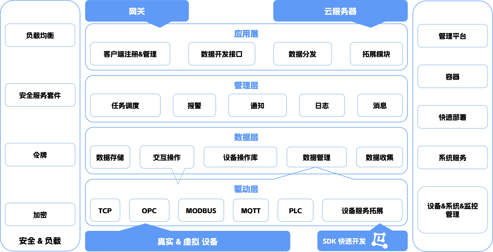

<p align="right">
  <a href="./README.md">English</a> | <a href="./README.zh.md">中文</a> | <a href="./README.ja.md">日本語</a> | <a href="./README.vi.md">Tiếng Việt</a>
</p>

<p align="center">
	
<br>
<a href='https://gitee.com/pnoker/iot-dc3/stargazers'>
    
</a>
<a href='https://gitee.com/pnoker/iot-dc3/members'>
    
</a>
<br>
<strong>
IoT DC3 是一个完全开源、AI 就绪的分布式物联网平台。
它连接设备，以 AI 可消费的方式组织数据，并编排闭环回路 —— 将智能转化为行动，而非仅仅洞察。
</strong>
</p>

---



# 1 架构

该架构面向端到端 IoT 能力建设，覆盖设备连接、数据服务、运营管理与可扩展应用集成。

- **驱动层 (Driver Layer)**：提供 SDK，支持标准与私有协议的设备接入，负责南向数据采集与命令执行，提升驱动开发与接入效率；
- **数据层 (Data Layer)**：提供可靠的设备数据采集、存储与查询能力，支撑实时与历史数据服务；
- **管理层 (Management Layer)**：作为分布式微服务协作核心，承担服务注册、设备/驱动管理、命令编排与配置治理；
- **应用层 (Application Layer)**：支持数据开放、任务调度、告警消息、日志管理、第三方集成及 AI 增强自动化场景。

# 2 目标

- **可扩展性**：基于 Spring Cloud 支持横向扩展，满足分布式高吞吐 IoT 场景；
- **韧性**：通过可替换服务节点与容错设计，降低单点故障风险；
- **性能**：面向大规模设备接入与遥测数据处理需求；
- **可扩展开发**：通过 SDK 与服务注册机制，快速集成新协议和自定义驱动；
- **部署灵活性**：支持私有云、公有云与边缘部署，并保持 Java 生态兼容；
- **运营效率**：简化设备接入、注册与权限校验流程；
- **安全与多租户**：支持传输加密、命名空间隔离与租户级隔离；
- **云原生交付**：面向 Kubernetes 优化，并通过 Docker 容器化实现一致部署；
- **AI-Ready 演进**：支持智能自动化与数据驱动运营能力集成。

# 3 开发

## 3.1 启动依赖

> 二选一
>
> 该基础依赖栈会启动 PostgreSQL 和 RabbitMQ。如果需要数据库 SQL 脚本，请直接连接到容器中已启动的数据库进行导出

```bash
# 全球可访问的标准镜像仓库服务
podman compose -f dc3/docker-compose-db.yml up -d

# 针对中国大陆用户优化的镜像仓库服务
DC3_IMAGE_REGISTRY=registry.cn-beijing.aliyuncs.com/dc3 podman compose -f dc3/docker-compose-db.yml up -d
```

可选的 `make` 快捷命令：

```bash
make dev-db
make dev-optional
make dev
make dev-all
```

如果你需要使用中国大陆镜像源，可以使用 `REGISTRY=cn`：

```bash
make dev-db REGISTRY=cn
make dev-all REGISTRY=cn
make app-all REGISTRY=cn
make compose-up STACK=optional REGISTRY=cn
make compose-logs STACK=dev REGISTRY=global
```

前端页面测试和接口测试时，可以只启动当前需要的后端服务：

```bash
# 先启动基础依赖
make dev-db REGISTRY=cn

# 启动单个服务、多个服务或预设服务组
make up SERVICES=agentic REGISTRY=cn
make up SERVICES="gateway agentic" REGISTRY=cn
make up GROUP=core REGISTRY=cn
make up GROUP=drivers REGISTRY=cn

# 查看测试服务日志
make logs SERVICES="gateway agentic"
```

### Compose 环境变量覆盖

在修改发布端口、镜像版本或观测栈参数前，建议先复制模板文件：

```bash
cp .env.example .env
```

根目录 `.env` 用于 `dc3/` 下 Compose 文件的变量插值；镜像仓库可通过 `DC3_IMAGE_REGISTRY` 切换，应用运行时环境变量仍然位于
`dc3/env/dev.env` 或 `dc3/env/dev.env.sh`。Agentic provider 通常存储在数据库中；只有需要兜底配置时，才在 `.env`
或当前 shell 中配置 `AGENTIC_FALLBACK_OPENAI_BASE_URL`、`AGENTIC_FALLBACK_OPENAI_API_KEY`、
`AGENTIC_FALLBACK_OPENAI_MODEL` 等 OpenAI 兼容参数。

Compose 只会注入 Compose 文件显式引用的变量，例如镜像仓库、镜像版本、发布端口、日志选项和可选观测栈参数。本地源码方式启动
Java
进程时，请使用 `dc3/env/dev.env` 或 `dc3/env/dev.env.sh`。

根目录 `.env` 与 `dc3/env/dev.env(.sh)` 的具体区别见 [`dc3/doc/ENVIRONMENT.md`](dc3/doc/ENVIRONMENT.md)。

## 3.2 准备工作

```bash
source dc3/env/dev.env.sh
mvn -s .mvn/settings.xml clean package
```

> **模块概览**: 完整的模块依赖关系和运行时流程图请参阅 [`dc3/doc/MODULES.md`](dc3/doc/MODULES.md)。

> **本地开发指南**: 一站式本地环境搭建流程请参阅 [`dc3/doc/QUICKSTART.md`](dc3/doc/QUICKSTART.md)。

> **常见问题排查**: 常见的构建/运行时问题及解决方案请参阅 [`dc3/doc/TROUBLESHOOTING.md`](dc3/doc/TROUBLESHOOTING.md)。

## 3.3 启动服务

> 依次启动

```bash
# 网关服务
java -jar dc3-gateway/target/dc3-gateway.jar

# 认证中心
java -jar dc3-center/dc3-center-auth/target/dc3-center-auth.jar

# 数据中心
java -jar dc3-center/dc3-center-data/target/dc3-center-data.jar

# 管理中心
java -jar dc3-center/dc3-center-manager/target/dc3-center-manager.jar

# Agentic 中心
java -jar dc3-center/dc3-center-agentic/target/dc3-center-agentic.jar

# 虚拟驱动
java -jar dc3-driver/dc3-driver-virtual/target/dc3-driver-virtual.jar

# 启动其他驱动：监听虚拟驱动、Modbus TCP 驱动、MQTT 驱动、OPC DA 驱动、OPC UA 驱动、Siemens S7 驱动
```

# 4 技术栈

- [Java 21](https://www.java.com)
- [Spring Boot 3.5.5](https://spring.io/projects/spring-boot)
- [Spring Cloud 2025.0.0](https://spring.io/projects/spring-cloud)

# 5 贡献

- **创建分支**：请先从 `main` 分支创建新分支，确保 `main` 分支是最新的；
- **分支命名**：遵循命名规范：`feature/your_name/feature_description`。例如：`feature/pnoker/mqtt_driver`；
- **代码与文档**：在新分支上修改代码或文档，并提交变更；
- **提交 PR**：发起 `Pull Request`，将修改合并到 `develop` 分支。PR 会由维护者审核并合并。

# 6 开源协议

`IoT DC3` 开源平台基于 [AGPL 3.0 License](./LICENSE-AGPL.txt) 协议。
仓库许可证说明和商业授权关系请参阅 [LICENSE.txt](./LICENSE.txt)。
