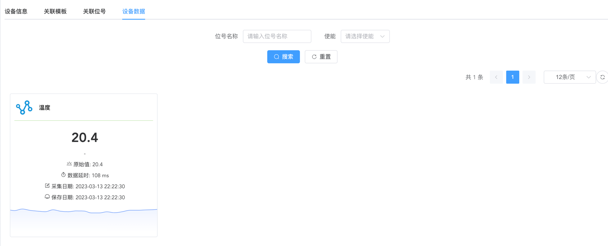

# Lwm2m驱动使用说明

## 功能列表

- 读取资源
- 写入资源
- 订阅资源
- 取消订阅
- 执行程序
- 注册监听
- 注册认证(待实现)
- 标准资源(待实现)

## 快速开始

1. 启动驱动
2. 配置模板

> 模板的意思是该设备有哪些属性可以采集,比如温湿度传感器可以采集温度,湿度

3. 新增设备
4. 配置设备位号属性

> 位号属性的意思是该设备的该属性通过哪个值去采集,例如在demo中,温度属性的采集路径为/3303/0/5700

5. 启动设备

> 找到/resource/lib/leshan-client-demo.jar  
> java -jar leshan-client-demo.jar -n 平台设备id -u 服务器地址(不指定则默认localhost:5683)

6. 查看数据
   

## FAQ

Q: 消息上行,消息下行,命令下行是什么意思?  
A:  
消息上行代表驱动读取设备的资源路径(读取数据)  
消息下行代表驱动写入设备的资源路径(写入数据)  
命令下行指驱动执行设备方法的资源路径(执行某些方法列如设备静音)

