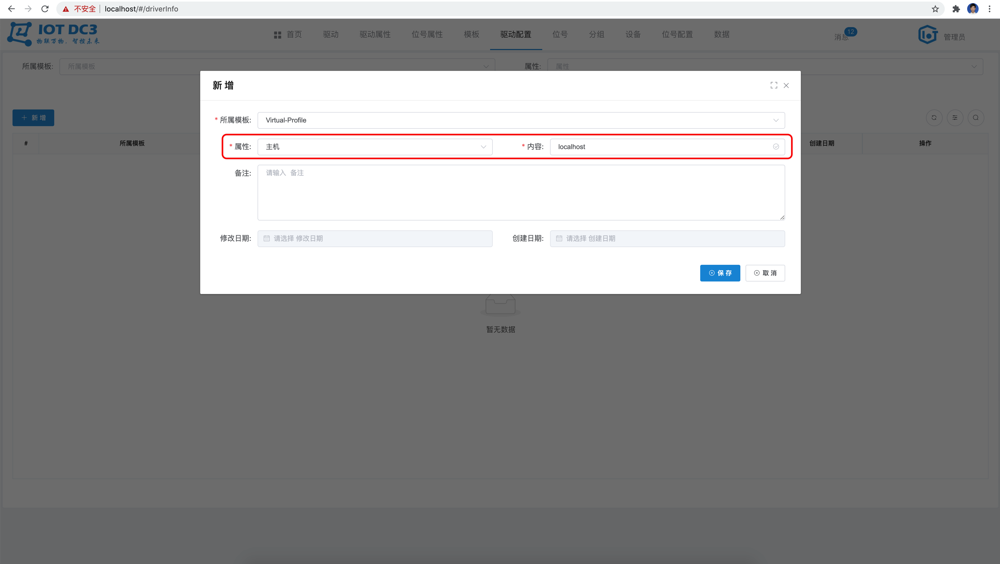
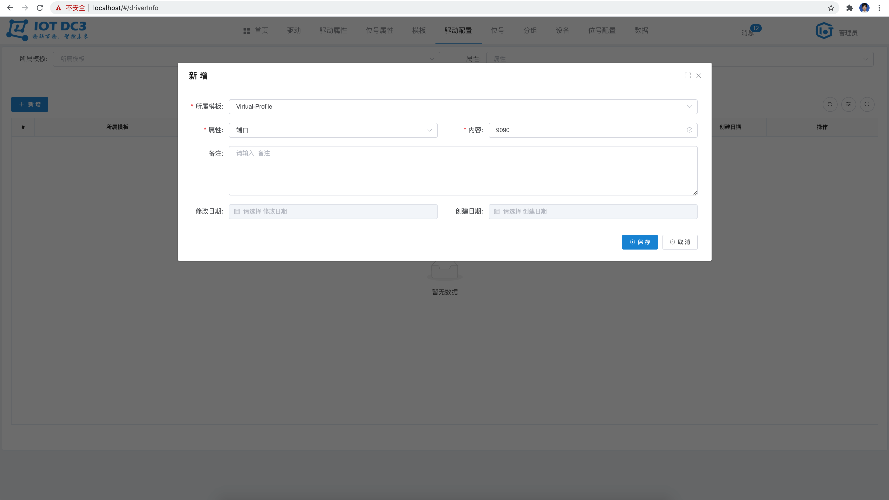
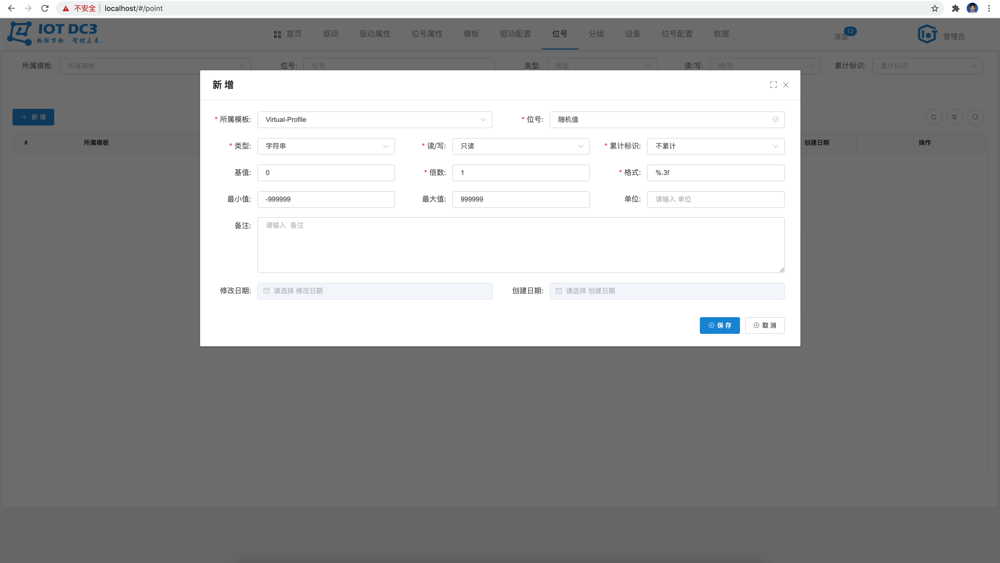
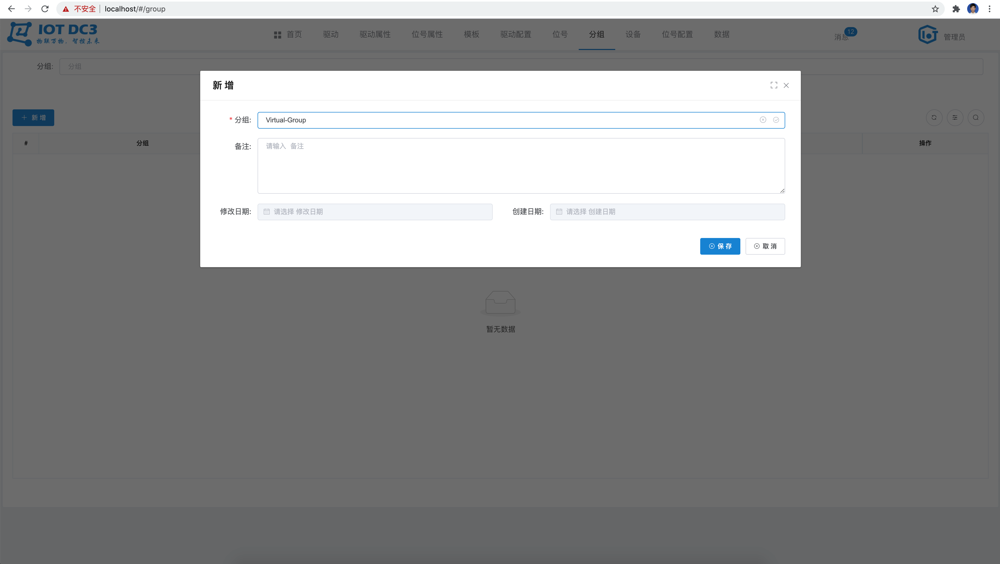
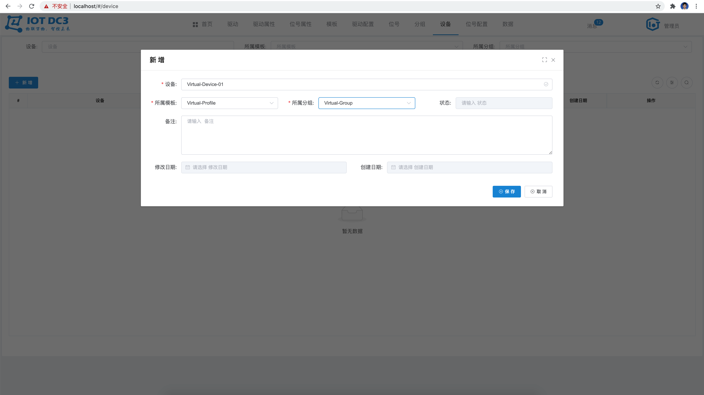
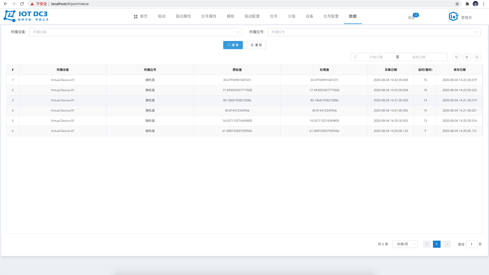

### 一睹为快

> **前提：** 必须保证安装了 `docker` 和 `docker-compose`
>
> **配置要求：** 至少需要给docker分配：2核 CPU 以及 4G 以上的运行内存
>
> **端口说明：** Demo 仅对外暴露 `443` 一个端口，且不可修改为其他端口，所以请务必保证 `443` 端口不被占用，如需特殊化，请使用开发环境启动

15 分钟，快速启动一个，Demo Application ！

``` bash
git clone https://gitee.com/pnoker/iot-dc3.git
cd iot-dc3/dc3

#启动
docker-compose -f docker-compose-demo.yml up -d

#停止
docker-compose -f docker-compose-demo.yml down
```

> 该 Demo 将在 Docker 中启动 MySQL、Redis、MongoDB、RabbitMQ、DC3-Register、DC3-Manager、DC3-Auth、DC3-Data、DC3-Driver-Virtual、DC3-Web 服务。


### 登陆

> 根据机器的性能情况，启动时间有所不同，请务必耐心等待。

执行完之后，**需要等待一会，等服务都启动起来了**，访问 [https://localhost](https://localhost) 即可进入登陆页面，点击登陆即可，⚠️请注意是 **https** 哈，如图：


### 模版

切换至“**模版**”菜单，点击“**新增**”，新增一个模版，然后“**保存**”，例如模版名称为：“**Virtual-Profile**”，所属驱动选择：“**VirturlDriver**”，如图：


### 驱动配置

切换至“**驱动配置**”菜单，点击“**新增**”，选择所属模版“**Virtual-Profile**”，分别新增两个配置，分别是“**主机**”和”**端口**“，然后"**保存**"，例如：“**localhost**”和“**9090**”，如图：




### 位号

切换至“**位号**”菜单，点击“**新增**”，选择所属模版“**Virtual-Profile**”，新增一个测点，然后”**保存**“，例如：位号是“**随机值**“，如图：



### 分组

切换至“**分组**”菜单，点击“**新增**”，新增一个设备分组，然后“**保存**”，例如：设备分组为“**Virtual-Group**”，如图：



### 设备

切换至“**设备**”菜单，点击“**新增**”，选择所属模版“**Virtual-Profile**”，所属分组“**Virtual-Group**”，新增一个设备，然后“**保存**”，例如：设备名称为：“**Virtual-Device-01**”，如图：



### 位号配置

切换至“**位号配置**”菜单，点击“**新增**”，选择所属设备“**Virtual-Device-01**”，所属位号“**随机值**”，属性“**位号**”，新增一个位号配置，然后“**保存**”，例如：位号的属性值为“**random**”，如图：


### 数据

最后切换至“**数据**”菜单，数据会**30秒**周期性的采集到平台上来。

