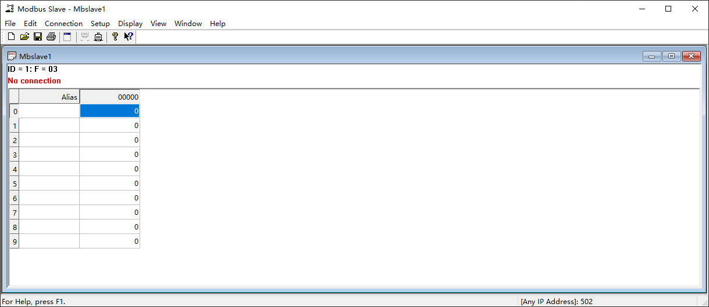
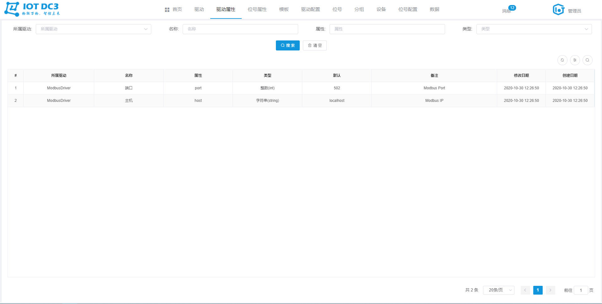
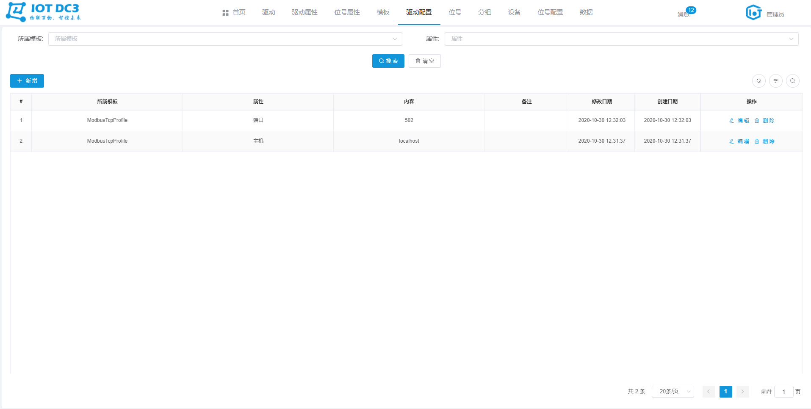
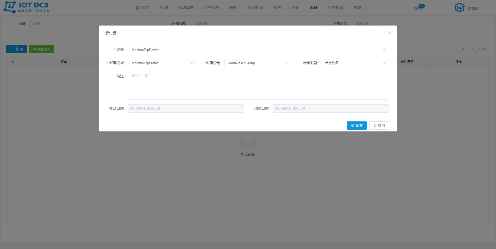

### DC3 Modbus Tcp 驱动模块

> **位置**：iot-dc3\dc3-driver\dc3-driver-modbus-tcp
>
> **依赖服务**（参考Idea开发环境启动即可）：dc3-mysql、dc3-mongo、dc3-redis、dc3-rabbitmq、dc3-register、dc3-manager、dc3-data、dc3-auth、dc3-web
>
> **开源工具**：Spring Cloud、Modbus4j
>
> **Modbus Tcp**：MODBUS/TCP 使 MODBUS_RTU 协议运行于以太网，MODBUS TCP使用 TCP/IP 和以太网在站点间传送 MODBUS 报文，MODBUS TCP 结合了以太网物理网络和网络标准 TCP/IP以及以 MODBUS 作为应用协议标准的数据表示方法。MODBUS TCP 通信报文被封装于以太网 TCP/IP 数据包中。与传统的串口方式，MODBUS TCP 插入一个标准的 MODBUS 报文到 TCP 报文中，不再带有数据校验和地址。


### 配置文件

> **位置**：iot-dc3\dc3-driver\dc3-driver-modbus-tcp\src\main\resources\application.yml


#### 1. driver.driver-attribute

> *driver-attribute 用于配置连接一个 Modbus Tcp 服务所需要的基本参数*
>
> 
>
> **连接一个 Modbus Tcp 服务需要：主机、端口，那么 `dc3-modbus-tcp` 驱动模块此处的 `driver-attribute` 就应该如下：**

```yaml
  driver-attribute:
    - displayName: 主机
      name: host
      type: string
      value: localhost
      description: Modbus IP
    - displayName: 端口
      name: port
      type: int
      value: 502
      description: Modbus Port
```


#### 2. driver.point-attribute

> *point-attribute 用于配置读取一个 Modbus Tcp 点位值所需要的基本参数*
>
> 
>
> **读取一个 Modbus Tcp 服务的点位值需要：从站编号、功能码、偏移量信息，那么  `dc3-modbus-tcp` 驱动模块此处的 `point-attribute` 就应该如下:**

```yaml
  point-attribute:
    - displayName: 从站编号
      name: slaveId
      type: int
      value: 1
      description: 从站编号
    - displayName: 功能码
      name: functionCode
      type: int
      value: 1
      description: 功能码 [1、2、3、4]
    - displayName: 偏移量
      name: offset
      type: int
      value: 0
      description: 偏移量
```


#### 3. driver.schedule

> *schedule 用于设置 读 和 自定义方法的调度*
>
> 
>
> **read**：用于配置周期性调用 iot-dc3\dc3-driver\dc3-driver-modbus-tcp\src\main\java\com\dc3\driver\service\impl\CustomDriverServiceImpl.java （read方法）
>
> **custom**：用于配置周期性调用 iot-dc3\dc3-driver\dc3-driver-modbus-tcp\src\main\java\com\dc3\driver\service\impl\CustomDriverServiceImpl.java（schedule方法）
>
> **enable**：是否启动
>
> **corn**：corn 表达式，用于设置调度规则

```yaml
  schedule:
    read:
      enable: true
      corn: '0/30 * * * * ?'
    custom:
      enable: true
      corn:  '0/5 * * * * ?'
```


### 小试牛刀

#### 1. 启动依赖服务

- 参考Idea开发环境启动 dc3-mysql、dc3-mongo、dc3-redis、dc3-rabbitmq、dc3-register、dc3-manager、dc3-data、dc3-auth、dc3-web
- 启动 dc3-driver-modbus-tcp


#### 2. 启动 Modbus Tcp 调试工具

 安装并启动 Modbus Slave 软件

下载链接：[百度云盘 Modbus Slave](https://pan.baidu.com/s/1fwRjc1Im1pIZfV9nLwjtbg)

验证码：`eatt`




#### 3. 驱动

切换到 ''**驱动**" 菜单，当前 `Modbus Tcp` 启动启动成功，并处于 **在线** 状态


#### 4. 驱动属性

切换到 ''**驱动属性**" 菜单，当前 驱动属性 列表如下




#### 5. 位号属性

切换到 “**位号属性**” 菜单，当前 位号属性 列表如下


#### 6. 模板

切换到 “**模板**” 菜单，新建一个 `私有` 的 `ModbusTcpProfile` 模板，如下


#### 7. 驱动配置

切换到 “**驱动配置**” 菜单，为刚刚新建的 `模板` 配置一个连接到 `第2步启动的 Modbus Tcp 模拟服务` 的驱动配置，如下

- **主机** 属性值为：`localhost`，以 `Modbus Slave` 启动为主


- **端口** 属性值为：`502`，以 `Modbus Slave` 启动为主


- 以上的 主机和端口均配置完之后，列表如下




#### 8. 位号

切换到 “**位号**” 菜单，为刚刚新建的 `模板` 配置待读取的 位号，这里以一个 `Integer` 类型的为例，如下

> 同时也需要在 Modbus Slave 软件中设置一下


#### 9. 分组

切换到 “**分组**” 菜单，新建一个设备分组，如下


#### 10. 设备

切换到 “**设备**” 菜单，在刚刚新建的分组下，新建一个设备，如下




#### 11. 位号配置

切换到 “**位号配置**” 菜单，为新建的 `设备` ，配置 `位号` 的的 **属性值**，从而是 `dc3-modbus-tcp` 模块能读取到 `Modbus Slave` 软件中的真实点位值，如下

- **从站编号**：第8步骤中的 `ID` 值


- **功能码**：第8步骤中的 `F` 值


- **偏移量**：第8步骤中的 `0-9` 值


- 以上的 命名空间和位号均配置完之后，列表如下


#### 12. 数据

切换到 “数据” 菜单，30秒左右会采集一个值

