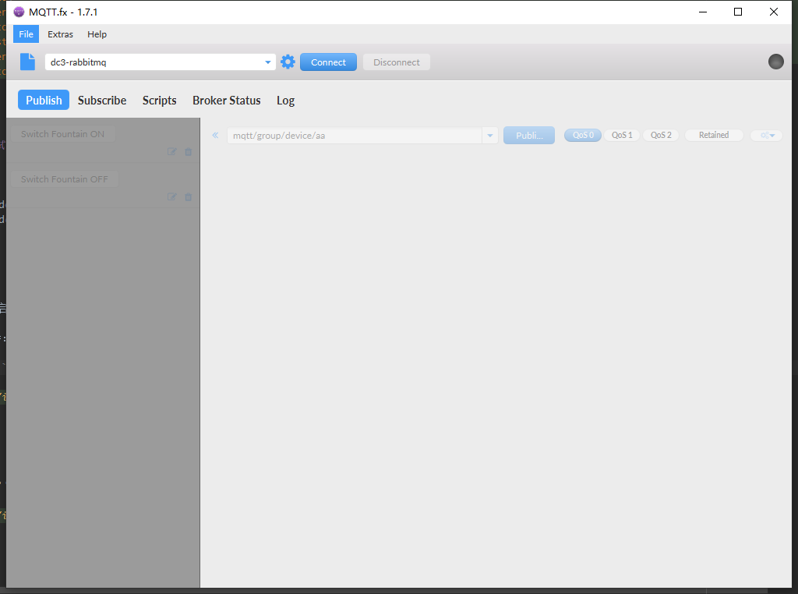
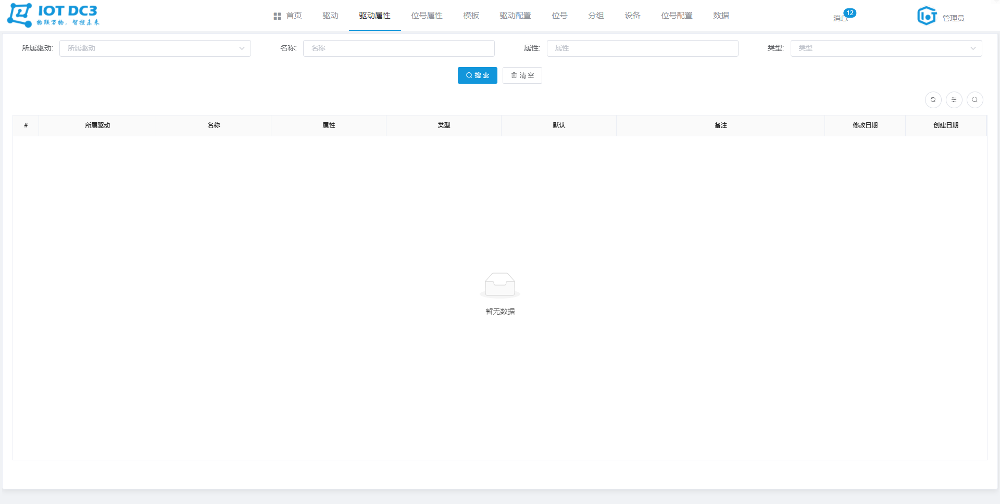
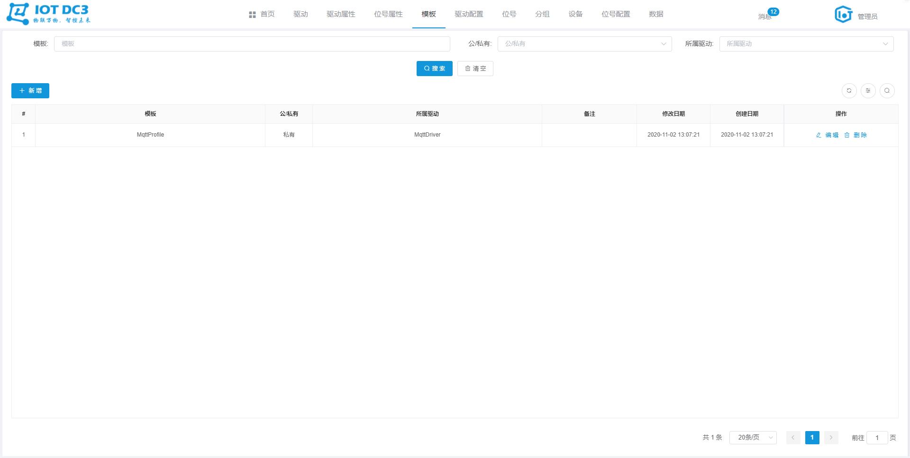
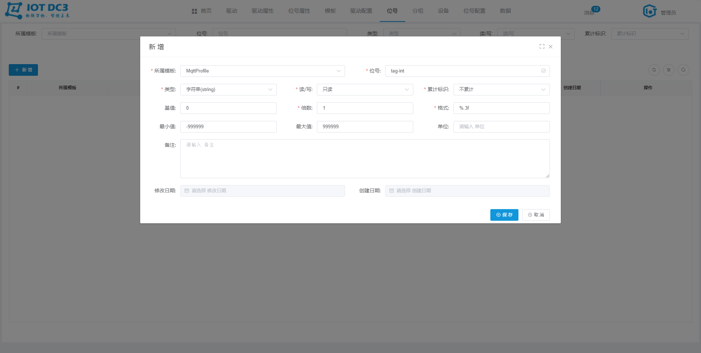
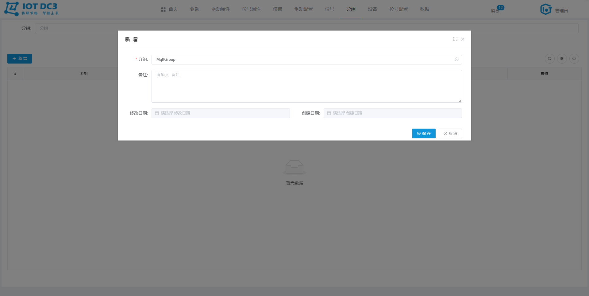
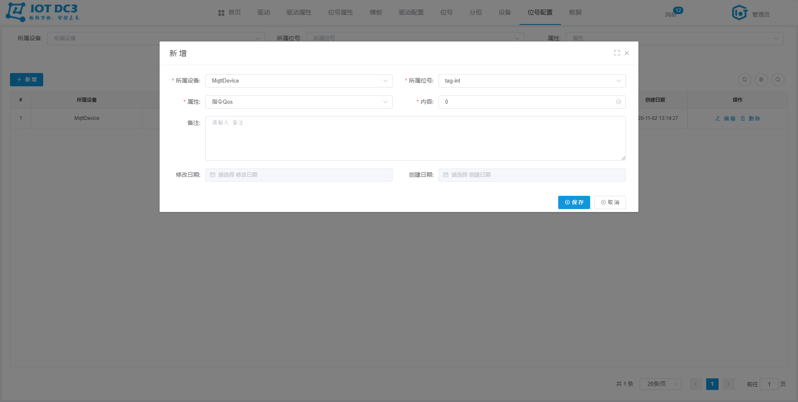
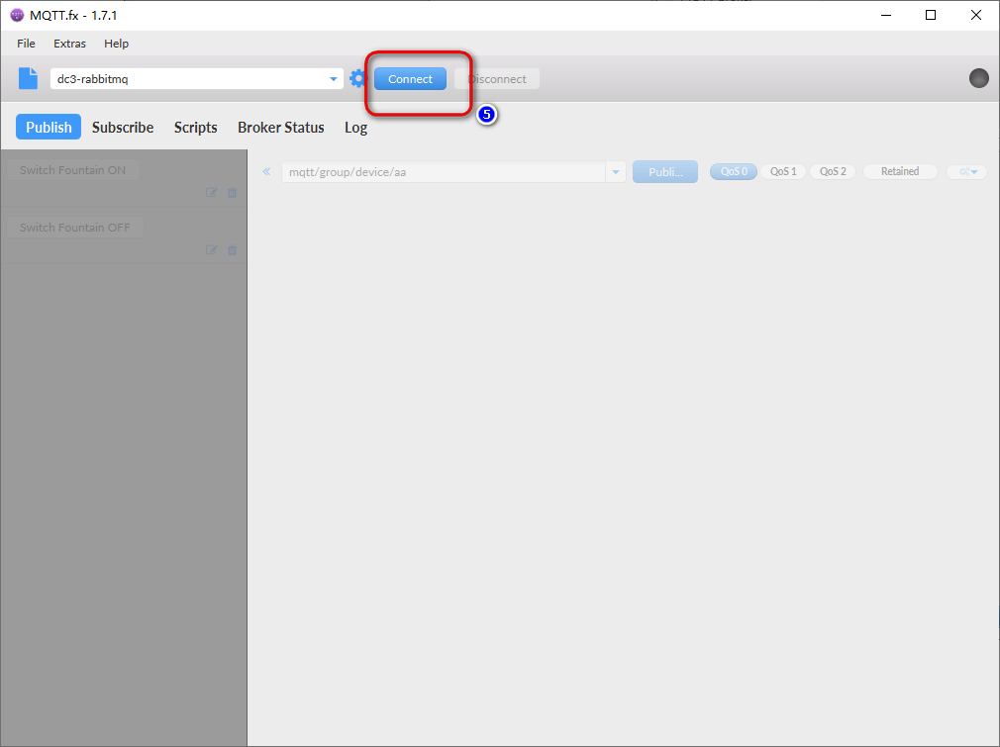
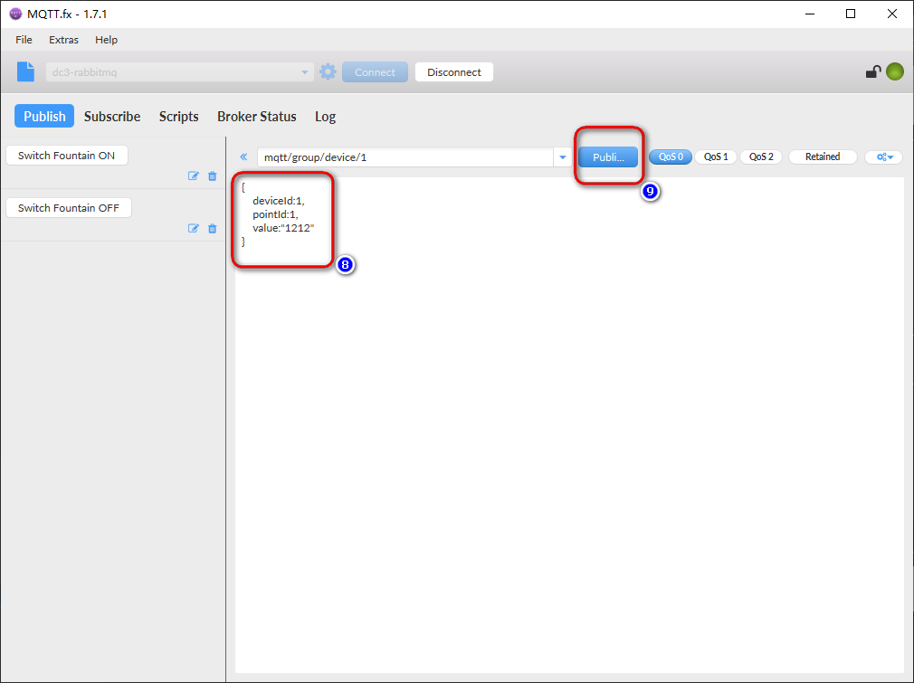
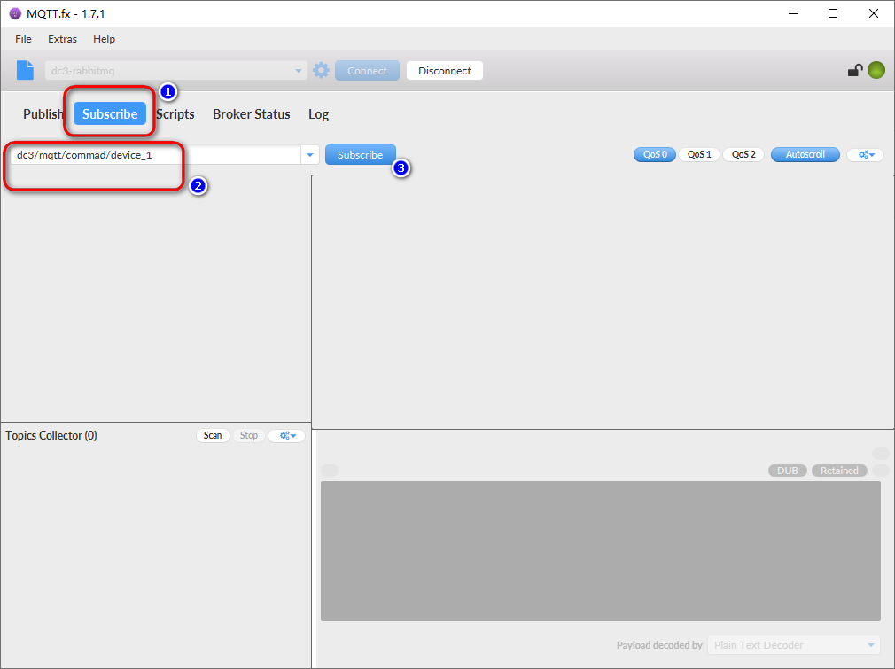

### DC3 Mqtt 驱动模块

> **位置**：iot-dc3\dc3-driver\dc3-driver-mqtt
>
> **依赖服务**（参考Idea开发环境启动即可）：dc3-mysql、dc3-mongo、dc3-redis、dc3-rabbitmq、dc3-register、dc3-manager、dc3-data、dc3-auth、dc3-web
>
> **开源工具**：Spring Cloud
>
> **Mqtt**：基于客户端-服务器的消息发布/订阅传输协议。MQTT协议是轻量、简单、开放和易于实现的，这些特点使它适用范围非常广泛。在很多情况下，包括受限的环境中，如：机器与机器（M2M）通信和物联网（IoT）。其在，通过卫星链路通信传感器、偶尔拨号的医疗设备、智能家居、及一些小型化设备中已广泛使用。


### 配置文件

> **位置**：iot-dc3\dc3-driver\dc3-driver-mqtt\src\main\resources\application.yml


#### 1. mqtt 服务器连接配置

> *mqtt 用于配置连接一个 Mqtt 服务所需要的基本参数*

```yaml
  mqtt:
    # 用户名
    username: dc3
    # 密码
    password: dc3
    # Mqtt 服务URL
    url: tcp://dc3-rabbitmq:1883
    # qos（0,1,2），与下面的 topics 一一对应
    qos:
      - 0
    # topics，订阅主题
    topics:
      - mqtt/group/device/#
    # 客户端连接标识
    client:
      id: dc3-mqtt-client
    # 默认配置，用于调试使用，创建一个 dc3-mqtt-topic 主题
    default:
      topic: dc3-mqtt-topic
      qos: 1
    # 设置是否接收默认主题发送的数据
      receive:
        enable: true
    # 心跳和超时设置
    keep-alive: 5
    completion-timeout: 3000
```


#### 2. driver.point-attribute

> *point-attribute 用于配置读取一个 Mqtt 点位值所需要的基本参数*
>
> 
>
> **读取一个 Mqtt 服务的点位值需要：指令Topic、指令Qos，那么  `dc3-mqtt` 驱动模块此处的 `point-attribute` 就应该如下:**

```yaml
  point-attribute:
    - displayName: 指令Topic
      name: commandTopic
      type: string
      value: commandTopic
      description: 测点/设备接收下行指令的Mqtt主题
    - displayName: 指令Qos
      name: commandQos
      type: int
      value: 2
      description: 测点/设备接收下行指令的Mqtt主题的Qos
```


#### 3. driver.schedule

> *schedule 用于设置 读 和 自定义方法的调度*
>
> 
>
> **read**：用于配置周期性调用 iot-dc3\dc3-driver\dc3-driver-mqtt\src\main\java\com\dc3\driver\service\impl\CustomDriverServiceImpl.java （read方法）
>
> **custom**：用于配置周期性调用 iot-dc3\dc3-driver\dc3-driver-mqtt\src\main\java\com\dc3\driver\service\impl\CustomDriverServiceImpl.java（schedule方法）
>
> **enable**：是否启动
>
> **corn**：corn 表达式，用于设置调度规则

```yaml
  schedule:
    read:
      enable: true
      corn: '0/30 * * * * ?'
    custom:
      enable: true
      corn:  '0/5 * * * * ?'
```


### 小试牛刀

#### 1. 启动依赖服务

- 参考Idea开发环境启动 dc3-mysql、dc3-mongo、dc3-redis、dc3-rabbitmq、dc3-register、dc3-manager、dc3-data、dc3-auth、dc3-web
- 启动 dc3-driver-mqtt


#### 2. 启动 Mqtt 调试工具

 安装并启动 Mqtt.fx 软件

下载链接：[百度云盘 Mqtt.fx](https://pan.baidu.com/s/1zcdKpBiYLOdwanqxn-GZWA)

验证码：`wona`




#### 3. 驱动

切换到 ''**驱动**" 菜单，当前 `Mqtt` 启动启动成功，并处于 **在线** 状态


#### 4. 驱动属性

切换到 ''**驱动属性**" 菜单，当前 驱动属性 , Mqtt 模块是没有驱动配置，如图列表为空




#### 5. 位号属性

切换到 “**位号属性**” 菜单，当前 位号属性 列表如下


#### 6. 模板

切换到 “**模板**” 菜单，新建一个 `私有` 的 `MqttProfile` 模板，如下





#### 7. 位号

切换到 “**位号**” 菜单，为刚刚新建的 `模板` 配置待读取的 位号，这里以一个 `Integer` 类型的为例，如下

> 同时也需要在 Mqtt.fx 软件中设置一下




#### 8. 分组

切换到 “**分组**” 菜单，新建一个设备分组，如下




#### 9. 设备

切换到 “**设备**” 菜单，在刚刚新建的分组下，新建一个设备，如下


#### 10. 位号配置

> 提示：如果不需要控制设备，该位号配置可以不用配置


切换到 “**位号配置**” 菜单，为新建的 `设备` ，配置 `位号` 的的 **属性值**，从而是 `dc3-mqtt` 模块能下发控制指令到 `Mqtt.fx` 软件，如下

- **指令Topic**：用于向设备发送控制指令的 topic，例如： `dc3/mqtt/commad/device_1`


- **指令Qos**：用于向设备发送控制指令的 topic 的 qos，例如：0



- 以上的 命名空间和位号均配置完之后，列表如下


#### 11. Mqtt.fx 设置





#### 12. 数据

切换到 “数据” 菜单，在 `Mqtt.fx` 中 publish 就会采集到一条数据

*例如：*
```json
{
    deviceId:1,
    pointId:1,
    value:"1212"
}
```




#### 13. 下发控制指令到设备

`Mqtt.fx` 配置如下：




使用 接口调用指令下发，向设备端写入数据

请注意，设备ID（deviceId）和位号ID（pointId），如实际数据库中的数据为准，以下为例子：


在 `Mqtt.fx` 中收到发送过来的控制指令，如图：
