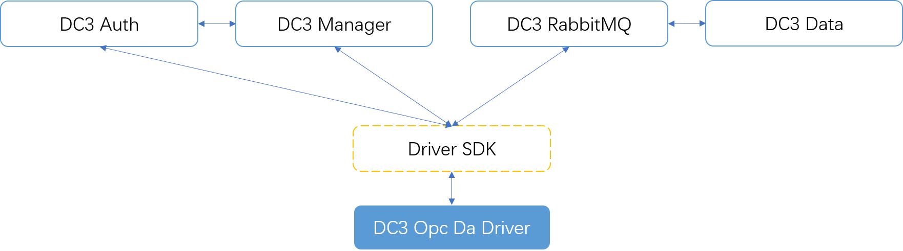
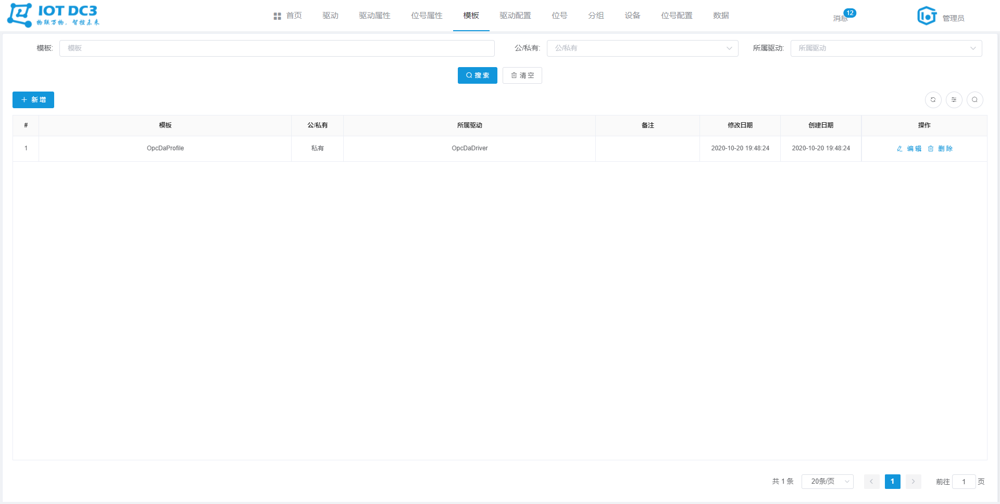
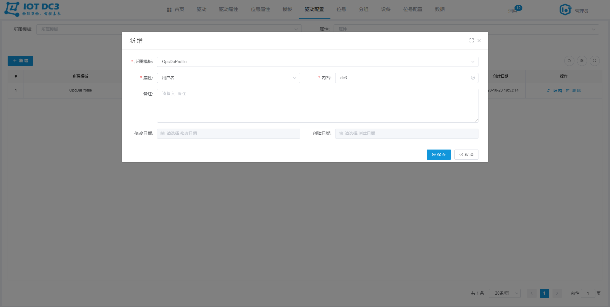
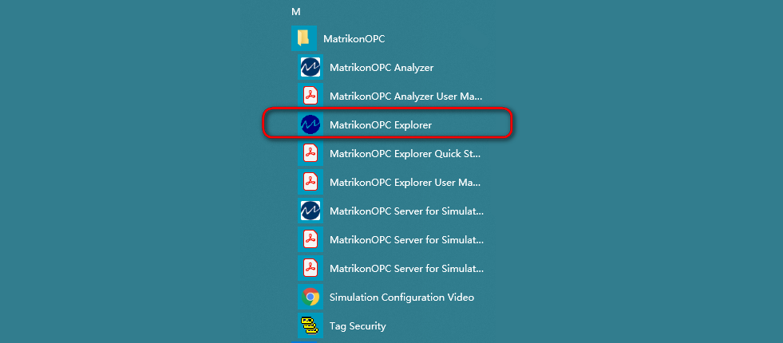
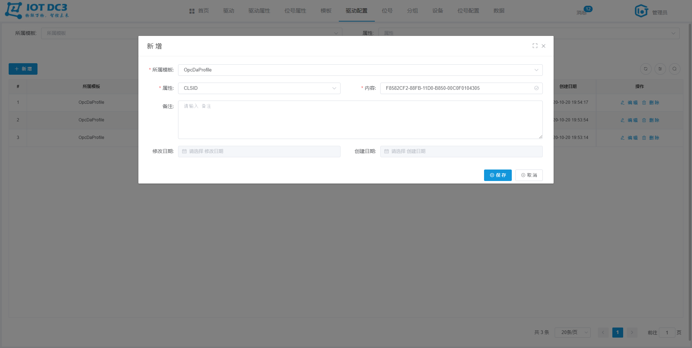
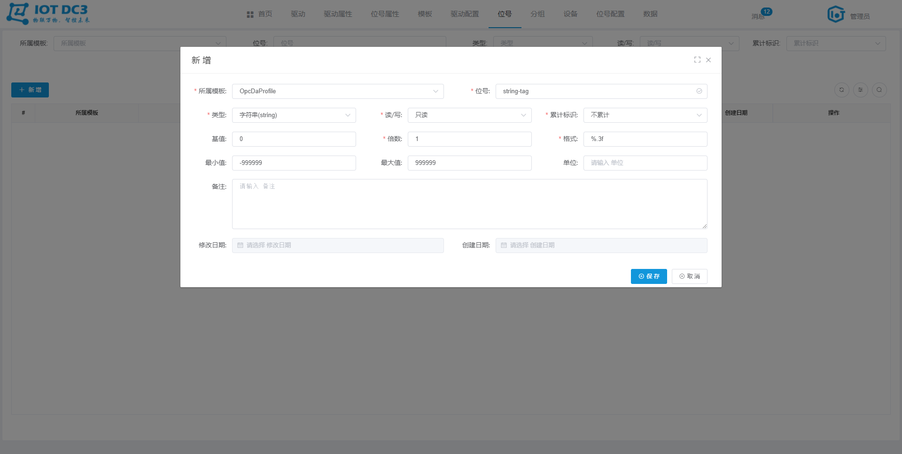
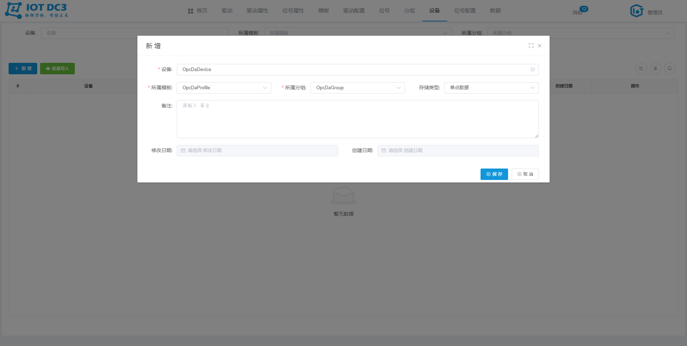
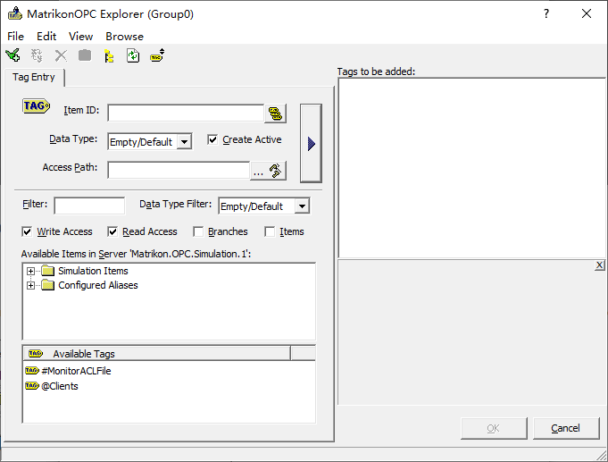
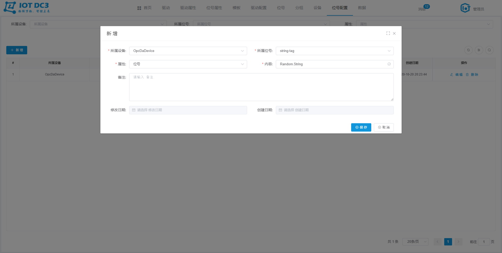
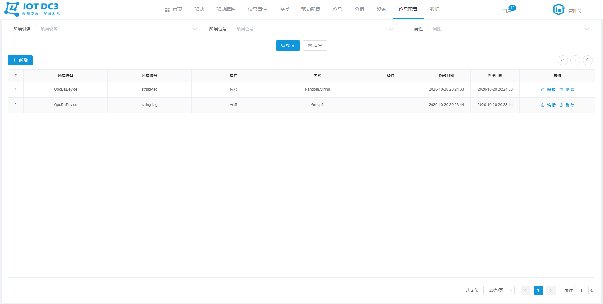

### DC3 Opc Da 驱动模块

> **位置**：iot-dc3\dc3-driver\dc3-driver-opc-da
>
> **依赖服务**（参考Idea开发环境启动即可）：dc3-mysql、dc3-mongo、dc3-redis、dc3-rabbitmq、dc3-register、dc3-manager、dc3-data、dc3-auth、dc3-web
>
> **开源工具**：Spring Cloud、Utgard（不兼容opc da 3.0）
>
> **OPC DA**：简化不同总线标准间的数据访问机制，为不同总线标准提供了通过标准接口访问现场数据的基本方法。OPCDA服务器屏蔽了不同总线通信协议之间的差异，为上层应用程序提供统一的访问接口，可以很容易的在应用程序层实现对不同总线协议的设备进行互操作。
>
> **DCOM**：*Microsoft Distributed Component Object Model*，网络传输数据的COM协议，客户端也可以通过互联网分布在各个角落。




### 配置文件

> **位置**：iot-dc3\dc3-driver\dc3-driver-opc-da\src\main\resources\application.yml


#### 1. driver.driver-attribute

> *driver-attribute 用于配置连接一个 Opc Da 服务所需要的基本参数*
>
> 
>
> **连接一个 Opc Da 服务需要：主机、CLSID、用户名和密码信息，那么 `dc3-opc-da` 驱动模块此处的 `driver-attribute` 就应该如下：**

```yaml
  driver-attribute:
    - displayName: 主机
      name: host
      type: string
      value: localhost
      description: Opc Da Host
    - displayName: CLSID
      name: clsId
      type: string
      value: F8582CF2-88FB-11D0-B850-00C0F0104305
      description: Opc Da Server CLAID
    - displayName: 用户名
      name: username
      type: string
      value: dc3
      description: Opc Da UserName
    - displayName: 密码
      name: password
      type: string
      value: dc3dc3
      description: Opc Da Passward
```


#### 2. driver.point-attribute

> *point-attribute 用于配置读取一个 Opc Da 点位值所需要的基本参数*
>
> 
>
> **读取一个 Opc Da 服务的点位值需要：分组、点位名称信息，那么  `dc3-opc-da` 驱动模块此处的 `point-attribute` 就应该如下:**

```yaml
  point-attribute:
    - displayName: 分组
      name: group
      type: string
      value: GROUP
      description: 分组名称
    - displayName: 位号
      name: tag
      type: string
      value: TAG
      description: 位号名称
```


#### 3. driver.schedule

> *schedule 用于设置 读 和 自定义方法的调度*
>
> 
>
> **read**：用于配置周期性调用 iot-dc3\dc3-driver\dc3-driver-opc-da\src\main\java\com\dc3\driver\service\impl\CustomDriverServiceImpl.java （read方法）
>
> **custom**：用于配置周期性调用 iot-dc3\dc3-driver\dc3-driver-opc-da\src\main\java\com\dc3\driver\service\impl\CustomDriverServiceImpl.java（schedule方法）
>
> **enable**：是否启动
>
> **corn**：corn 表达式，用于设置调度规则

```yaml
  schedule:
    read:
      enable: true
      corn: '0/30 * * * * ?'
    custom:
      enable: true
      corn:  '0/5 * * * * ?'
```


### 小试牛刀

#### 1. 启动依赖服务

- 参考Idea开发环境启动 dc3-mysql、dc3-mongo、dc3-redis、dc3-rabbitmq、dc3-register、dc3-manager、dc3-data、dc3-auth、dc3-web
- 启动 dc3-driver-opc-da


#### 2. 启动 Opc Da 调试工具

 安装并启动 Matrikon OPC Simulation Server 软件

下载链接：[百度云盘 Matrikon OPC Simulation Server](https://pan.baidu.com/s/1R9Cp6eeTdYQmv-Wz9W5UEQ)

验证码：`2aub`


#### 3. 驱动

切换到 ''**驱动**" 菜单，当前 `Opc Da` 启动启动成功，并处于 **在线** 状态


#### 4. 驱动属性

切换到 ''**驱动属性**" 菜单，当前 驱动属性 列表如下


#### 5. 位号属性

切换到 “**位号属性**” 菜单，当前 位号属性 列表如下


#### 6. 模板

切换到 “**模板**” 菜单，新建一个 `私有` 的 `OpcDaProfile` 模板，如下





#### 7. 驱动配置

切换到 “**驱动配置**” 菜单，为刚刚新建的 `模板` 配置一个连接到 `第2步启动的 Opc Da 模拟服务` 的驱动配置，如下

- **主机** 属性值为：`localhost`，以 `Matrikon OPC Simulation Server` 启动为主，该宿主机的IP（请以实际情况为主）


- **用户名** 属性值为：`dc3`，以 `Matrikon OPC Simulation Server` 启动为主，该宿主机的登录用户名（请以实际情况为主）



-  **密码** 属性值为：`dc3dc3`，以 `Matrikon OPC Simulation Server` 启动为主，该宿主机的登录密码（请以实际情况为主）


- **CLSID** 属性值为：`F8582CF2-88FB-11D0-B850-00C0F0104305`，以 `Matrikon OPC Simulation Server` 启动为主，该宿主机上OpcDaServer的CLSID（请以实际情况为主）

  > **常见问题**：如何查看 CLSID ，打开 `MatrikonOPC Explorer` ,查看 Simulation Server 属性即可
  >
  > 
  >
  > 
  >
  > 
  >
  > 

 填写上述查询到的 CLSID 即可



- 以上的 主机、用户名、密码和CLSID均配置完之后，列表如下


#### 8. 位号

切换到 “**位号**” 菜单，为刚刚新建的 `模板` 配置待读取的 位号，这里以一个 `String` 类型的为例，如下

> 同时也需要在 Matrikon OPC Simulation Server 软件中新建一个位号（第11,13步骤）




#### 9. 分组

切换到 “**分组**” 菜单，新建一个设备分组，如下


#### 10. 设备

切换到 “**设备**” 菜单，在刚刚新建的分组下，新建一个设备，如下




#### 11. 在Matrikon OPC Simulation Server中新建监控点位

如图所示





最后点击 OK 即可。


#### 12. 位号配置

切换到 “**位号配置**” 菜单，为新建的 `设备` ，配置 `位号` 的的 **属性值**，从而是 `dc3-opc-da` 模块能读取到 `Matrikon OPC Simulation Server` 软件中的真实点位值，如下

- **分组**：第11步骤中的 `group` 值


- **位号**：第11步骤中的 `tag` 值



- 以上的 分组和位号均配置完之后，列表如下



#### 13. 数据

切换到 “数据” 菜单，30秒左右会采集一个值

> **常见问题：**
>
> ```java
> INFO  org.openscada.opc.lib.da.Server - Failed to connect to server
> org.jinterop.dcom.common.JIException: Access is denied, please check whether the [domain-username-password] are correct. Also, if not already done please check the GETTING STARTED and FAQ sections in readme.htm. They provide information on how to correctly configure the Windows machine for DCOM access, so as to avoid such exceptions.  [0x00000005]
>     at org.jinterop.winreg.smb.JIWinRegStub.winreg_OpenKey(Unknown Source) ~[org.openscada.jinterop.core_2.0.8.201303051454.jar:na]
>     at org.jinterop.dcom.core.JIProgId.getIdFromWinReg(Unknown Source) ~[org.openscada.jinterop.core_2.0.8.201303051454.jar:na]
>     at org.jinterop.dcom.core.JIProgId.getCorrespondingCLSID(Unknown Source) ~[org.openscada.jinterop.core_2.0.8.201303051454.jar:na]
>     at org.jinterop.dcom.core.JIComServer.<init>(Unknown Source) ~[org.openscada.jinterop.core_2.0.8.201303051454.jar:na]
>     at org.openscada.opc.lib.da.Server.connect(Server.java:123) ~[org.openscada.opc.lib_1.0.0.201303051455.jar:na]
>     at org.openscada.opc.tutorial.UtgardTutorial1.main(UtgardTutorial1.java:32) [bin/:na]
> Caused by: org.jinterop.dcom.common.JIRuntimeException: Access is denied, please check whether the [domain-username-password] are correct. Also, if not already done please check the GETTING STARTED and FAQ sections in readme.htm. They provide information on how to correctly configure the Windows machine for DCOM access, so as to avoid such exceptions.  [0x00000005]
>     at org.jinterop.winreg.IJIWinReg$openKey.read(Unknown Source) ~[org.openscada.jinterop.core_2.0.8.201303051454.jar:na]
>     at ndr.NdrObject.decode(Unknown Source) ~[org.openscada.jinterop.deps_1.0.0.201303051454.jar:na]
>     at rpc.ConnectionOrientedEndpoint.call(Unknown Source) ~[org.openscada.jinterop.deps_1.0.0.201303051454.jar:na]
>     at rpc.Stub.call(Unknown Source) ~[org.openscada.jinterop.deps_1.0.0.201303051454.jar:na]
> ```
>
> 进行如下设置即可：
>
> - HKEY_LOCAL_MACHINE\SOFTWARE\Microsoft\Windows\CurrentVersion\Policies\System
> - create or modify 32-bit DWORD: LocalAccountTokenFilterPolicy
> - set the value to: 1

