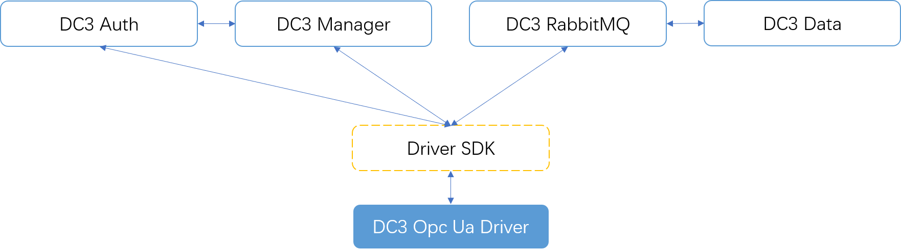
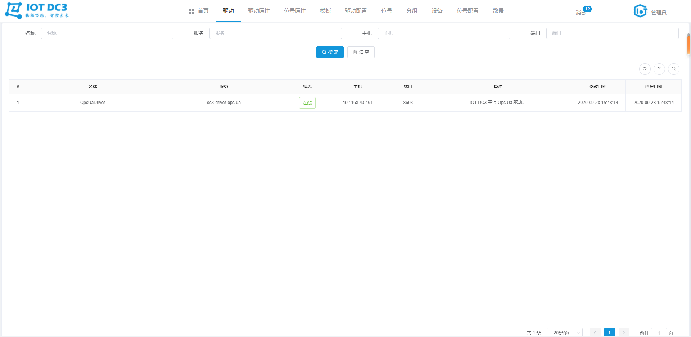
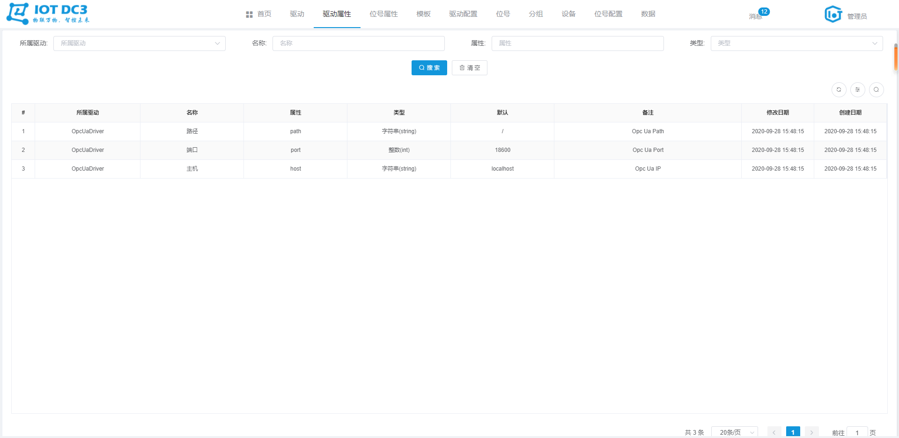
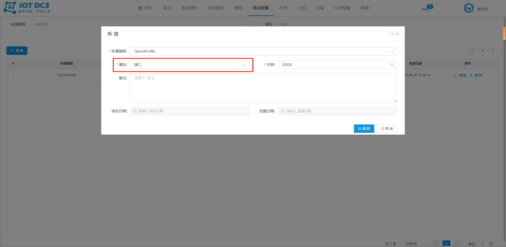
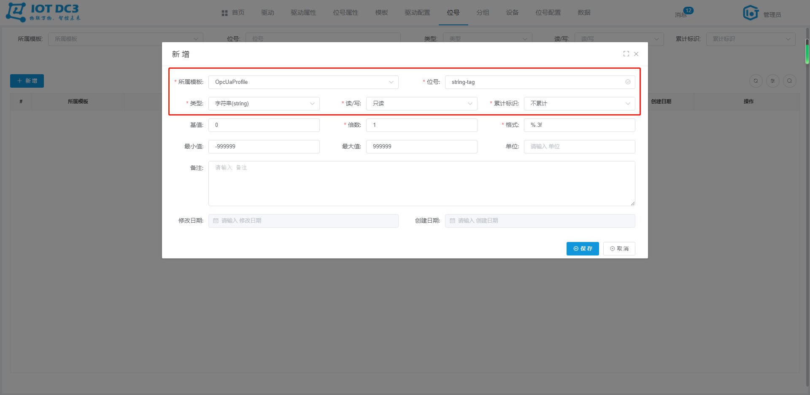
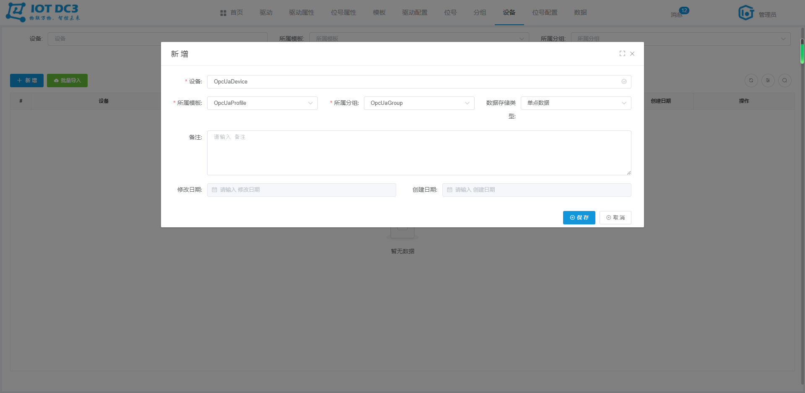
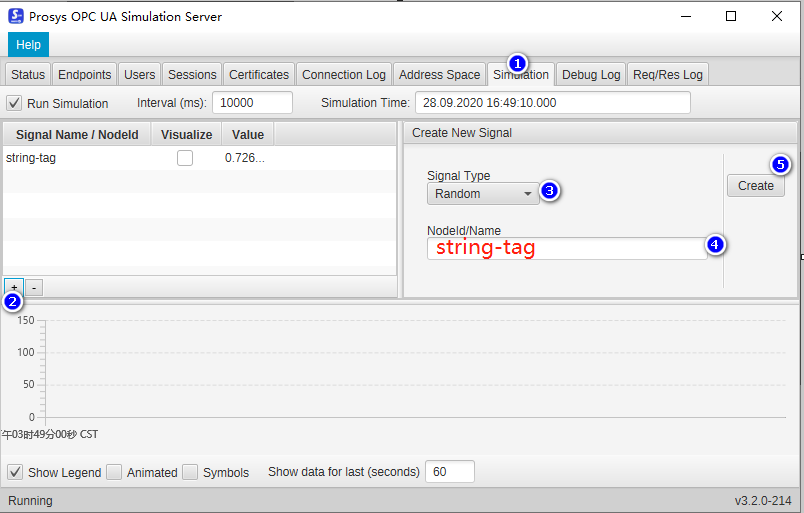
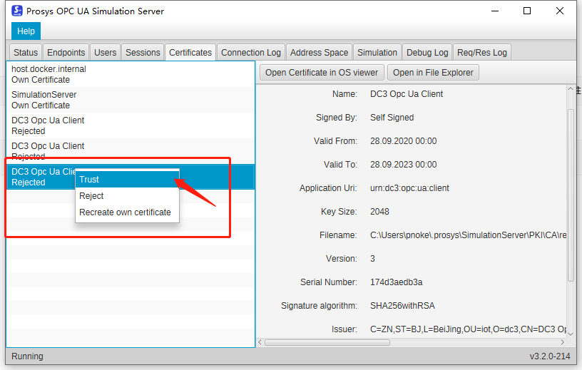

### DC3 Opc Ua 驱动模块

> **位置**：iot-dc3\dc3-driver\dc3-driver-opc-ua
>
> **依赖服务**（参考Idea开发环境启动即可）：dc3-mysql、dc3-mongo、dc3-redis、dc3-rabbitmq、dc3-register、dc3-manager、dc3-data、dc3-auth、dc3-web
>
> **开源工具**：Spring Cloud、Eclipse Milo
>
> **OPC UA**：Unified Architecture，统一架构，是下一代的OPC 标准，通过提供一个完整的，安全和可靠的跨平台的架构，以获取实时和历史数据和时间。它是基于OPC基金会提供的新一代技术，提供安全，可靠和独立于厂商的，实现原始数据和预处理的信息从制造层级到生产计划或ERP层级的传输。通过OPC UA，所有需要的信息在任何时间，任何地点对每个授权的应用，每个授权的人员都可用。这种功能独立于制造厂商的原始应用，编程语言和操作系统。 OPC UA是目前已经使用的OPC 工业标准的补充，提供重要的一些特性，包括如平台独立性，扩展性，高可靠性和连接互联网的能力。 OPC UA不再依靠DCOM，而是基于面向服务的架构(SOA),OPC UA的使用更简便。现在，OPC UA已经成为独立于微软,UNIX或其他的操作系统企业层和嵌入式自动组建之间的桥梁。




### 配置文件

> **位置**：iot-dc3\dc3-driver\dc3-driver-opc-ua\src\main\resources\application.yml


#### 1. driver.driver-attribute

> *driver-attribute 用于配置连接一个 Opc Ua 服务所需要的基本参数*
>
> 
>
> **连接一个 Opc Ua 服务需要：主机、端口、路径信息，那么 `dc3-opc-ua` 驱动模块此处的 `driver-attribute` 就应该如下：**

```yaml
  driver-attribute:
    - displayName: 主机
      name: host
      type: string
      value: localhost
      description: Opc Ua IP
    - displayName: 端口
      name: port
      type: int
      value: 18600
      description: Opc Ua Port
    - displayName: 路径
      name: path
      type: string
      value: /
      description: Opc Ua Path
```


#### 2. driver.point-attribute

> *point-attribute 用于配置读取一个 Opc Ua 点位值所需要的基本参数*
>
> 
>
> **读取一个 Opc Ua 服务的点位值需要：命名空间、点位名称信息，那么  `dc3-opc-ua` 驱动模块此处的 `point-attribute` 就应该如下:**

```yaml
  point-attribute:
    - displayName: 命名空间
      name: namespace
      type: int
      value: 5
      description: 命名空间索引
    - displayName: 位号
      name: tag
      type: string
      value: TAG
      description: 位号名称
```


#### 3. driver.schedule

> *schedule 用于设置 读 和 自定义方法的调度*
>
> 
>
> **read**：用于配置周期性调用 iot-dc3\dc3-driver\dc3-driver-opc-ua\src\main\java\com\dc3\driver\service\impl\CustomDriverServiceImpl.java （read方法）
>
> **custom**：用于配置周期性调用 iot-dc3\dc3-driver\dc3-driver-opc-ua\src\main\java\com\dc3\driver\service\impl\CustomDriverServiceImpl.java（schedule方法）
>
> **enable**：是否启动
>
> **corn**：corn 表达式，用于设置调度规则

```yaml
  schedule:
    read:
      enable: true
      corn: '0/30 * * * * ?'
    custom:
      enable: true
      corn:  '0/5 * * * * ?'
```


### 小试牛刀

#### 1. 启动依赖服务

- 参考Idea开发环境启动 dc3-mysql、dc3-mongo、dc3-redis、dc3-rabbitmq、dc3-register、dc3-manager、dc3-data、dc3-auth、dc3-web
- 启动 dc3-driver-opc-ua


#### 2. 启动 Opc Ua 调试工具

 安装并启动 Prosys OPC UA Simulation Server 软件

下载链接：[百度云盘 Prosys OPC UA Simulation Server](https://pan.baidu.com/s/1vKcyTWQi0gihjLPluFIvKQ)

验证码：`5ffs`


#### 3. 驱动

切换到 ''**驱动**" 菜单，当前 `Opc Ua` 启动启动成功，并处于 **在线** 状态




#### 4. 驱动属性

切换到 ''**驱动属性**" 菜单，当前 驱动属性 列表如下




#### 5. 位号属性

切换到 “**位号属性**” 菜单，当前 位号属性 列表如下


#### 6. 模板

切换到 “**模板**” 菜单，新建一个 `私有` 的 `OpcUaProfile` 模板，如下


#### 7. 驱动配置

切换到 “**驱动配置**” 菜单，为刚刚新建的 `模板` 配置一个连接到 `第2步启动的 Opc Ua 模拟服务` 的驱动配置，如下

- **主机** 属性值为：`localhost`，以 `Prosys OPC UA Simulation Server` 启动为主


- **端口** 属性值为：`53530`，以 `Prosys OPC UA Simulation Server` 启动为主



-  **路径** 属性值为：`/OPCUA/SimulationServer`，以 `Prosys OPC UA Simulation Server` 启动为主


- 以上的 主机、端口和路径均配置完之后，列表如下


#### 8. 位号

切换到 “**位号**” 菜单，为刚刚新建的 `模板` 配置待读取的 位号，这里以一个 `String` 类型的为例，如下

> 同时也需要在 Prosys OPC UA Simulation Server 软件中新建一个位号，并进行证书授权（第11,13步骤）




#### 9. 分组

切换到 “**分组**” 菜单，新建一个设备分组，如下


#### 10. 设备

切换到 “**设备**” 菜单，在刚刚新建的分组下，新建一个设备，如下




#### 11. 在Prosys OPC UA Simulation Server中新建点位

如图所示

- 切换到 “**Simulation**” 菜单，点击右下的 "+" 新建一个模拟点位，类型选择随机，名称添加 `string-tag`，最后点击 "**Create**"，即可



- 切换到 “**Address Space**” 菜单，即可查看点位的详细信息，包括：命名空间和点位名称


#### 12. 位号配置

切换到 “**位号配置**” 菜单，为新建的 `设备` ，配置 `位号` 的的 **属性值**，从而是 `dc3-opc-ua` 模块能读取到 `Prosys OPC UA Simulation Server` 软件中的真实点位值，如下

- **命名空间**：第11步骤中的 `ns` 值


- **位号**：第11步骤中的 `s` 值


- 以上的 命名空间和位号均配置完之后，列表如下


#### 13. 在Prosys OPC UA Simulation Server中授权证书

切换到 “**Certificates**” 菜单，如图所示进行授权 “**Trust**”



#### 14. 数据

切换到 “数据” 菜单，30秒左右会采集一个值

