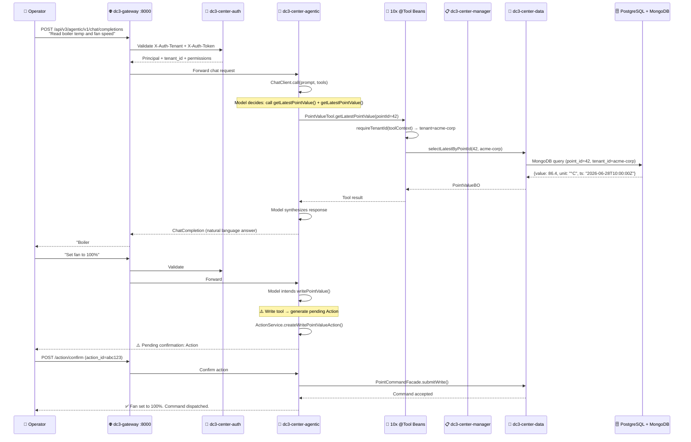

# Why Spring AI: How DC3 Lets LLMs Operate Your Factory

In 2025, large language models stopped being chatbots and started becoming operators. GPT-4o, Claude 4, DeepSeek,
Qwen — these models can already read sensor data, reason about equipment status, and decide whether to open a valve.
What was missing was a bridge between "the model understands" and "the model acts." That bridge is Spring AI, and
that's why IoT DC3 chose it as the foundation for the Agentic Center.

## The problem: AI wants to act, but platforms say no

Traditional IoT platforms treat data and commands as separate worlds. Data flows northbound from device to dashboard;
commands flow southbound from operator to device. These two directions rarely meet in a single API call, and never
in a single natural-language sentence.

Consider a real scenario: an operator notices a temperature anomaly on Boiler #3. In a conventional platform, the
workflow looks like this:

1. Navigate to the dashboard, find Boiler #3, note the temperature.
2. Switch to the history page, query the last 2 hours of temperature data.
3. Mentally assess: is this a trend or a spike?
4. Navigate to the command page, select "Fan Speed," enter the new value.
5. Submit, wait for confirmation, verify the temperature starts dropping.

That's five context switches across three pages. Each switch costs 15–30 seconds. Multiply by 200 devices, and
operational friction becomes the bottleneck.

With DC3's Agentic Center, the operator types one sentence:

> "Boiler #3 temperature is rising. Check the last 2 hours and slow down the exhaust fan to 60% if it's been
> climbing for more than 30 minutes."

The model decomposes this into tool calls, executes reads and a conditional write, and reports back — all in a
single conversational turn. This isn't a demo; it's running in production on DC3's Spring AI tool-calling
infrastructure.

## Why Spring AI, not LangChain or a custom solution

The team evaluated three approaches before committing to Spring AI:

| Approach                     | Pros                                                                               | Cons                                                                     | Verdict                             |
|------------------------------|------------------------------------------------------------------------------------|--------------------------------------------------------------------------|-------------------------------------|
| **LangChain (Python)**       | Huge ecosystem, fast prototyping                                                   | Python/JVM interop overhead, separate deployment, security boundary blur | Too heavy for a JVM-native platform |
| **Custom `@Tool` framework** | Full control, zero dependency                                                      | Months of engineering, maintenance burden, no community                  | Reinventing the wheel               |
| **Spring AI**                | Native JVM, Spring Boot integration, OpenAI-compatible, type-safe tool definitions | Newer ecosystem (2024+)                                                  | ✅ Best fit                          |

Spring AI won on three decisive points:

### 1. Native JVM, no Python bridge

DC3 is a pure Java 21 / Spring Boot 4 platform. Every service runs on the JVM. Introducing a Python runtime for AI
would mean a separate container, a separate deployment, and a fragile network bridge between two language runtimes.
Spring AI runs in-process — the `ChatClient` is a Spring bean, tool calls are regular Java method invocations, and
authentication context flows through the same Spring Security filter chain as any other request.

```java
// A @Tool method in DC3 — plain Java, type-safe, tenant-aware
@Tool(description = "Get the latest value of a specific point")
public PointValueBO getLatestPointValue(
        @ToolParam(description = "Point ID") Long pointId,
        ToolContext toolContext) {
    var tenantId = AgenticToolContextUtil.requireTenantId(toolContext);
    return pointValueService.getLatestByPointId(pointId, tenantId);
}
```

No serialization across language boundaries. No separate authentication. No gRPC or HTTP between the AI and the
data — it's a direct Java call to the service layer, with tenant isolation enforced at the method level.

### 2. OpenAI-compatible by design

Spring AI's `ChatClient` speaks the OpenAI Chat Completions protocol. This means DC3 works with *any* model
provider that exposes an OpenAI-compatible endpoint: OpenAI (GPT-4o, GPT-5), Anthropic (Claude via compatible
proxy), DeepSeek, Qwen, Groq, Together AI, Ollama (local models), vLLM — the list is constantly growing.

For operators, this translates to freedom: start with a cloud model for convenience, switch to a self-hosted
model for data sovereignty, or run a hybrid where sensitive queries stay on-premises. The Agentic Center's
`dc3_model_provider` table lets you configure multiple providers and switch per-conversation.

### 3. Type-safe tool definitions with compile-time validation

In Python-based tool-calling frameworks, tool definitions are typically JSON schemas or decorators with string-based
descriptions. A typo in a parameter name is a runtime error. In Spring AI, `@Tool` and `@ToolParam` annotations are
verified by the Java compiler. If you rename a parameter in the method signature without updating the annotation,
the IDE flags it before the code even compiles.

This matters when you have 10 tool classes, 30+ tool methods, and a team of contributors. The compiler becomes a
safety net that Python tool-calling frameworks cannot provide.

## The architecture: how a chat message becomes a device command

Here's the full path of a typical AI-assisted operation in DC3, end to end:



Four things make this architecture production-grade:

1. **Tenant isolation at every layer.** Before any tool executes, `requireTenantId(toolContext)` extracts the
   caller's tenant ID. Every database query, every cache key, every facade call carries that tenant ID. If the
   model incorrectly guesses a device ID from another tenant, the query returns empty — not the wrong data.

2. **Write commands require human confirmation.** The model can *propose* a write, but it cannot execute one.
   `PointValueTool.writePointValue()` generates a pending `Action` with a 10-minute expiry. Only a human
   `POST /action/confirm` (or the equivalent UI button click) releases it. This is not a suggestion — it's
   enforced at the service layer, not the UI.

3. **Conversations survive restarts.** Every turn — user message, tool call, tool result, assistant response —
   lands in the `dc3_message` table. If the Agentic Center restarts, the `MessageChatMemoryRepository` replays
   the most recent 30 turns (configurable) and the conversation resumes seamlessly. This is critical for
   multi-turn diagnostic sessions that span hours.

4. **The model never sees another tenant's data.** Tenant IDs are injected by the gateway (from the JWT), not
   by the model. Even if a prompt says "show me all devices," the tools' SQL queries carry `WHERE tenant_id = ?`
   bound to the gateway-injected value. The model cannot bypass this — there's no API that queries across
   tenants.

## The 10 built-in tools: a complete operational surface

The Agentic Center ships with 10 tool classes covering every domain object in the platform. Each tool method wraps
an existing service-layer method — there's no duplicated business logic.

| Tool Class       | Domain      | Key Methods                                                                                | Risk             |
|------------------|-------------|--------------------------------------------------------------------------------------------|------------------|
| `TenantTool`     | Tenant      | `getCurrentTenantInfo()`                                                                   | Low              |
| `UserTool`       | User        | `getCurrentUserProfile()`                                                                  | Low              |
| `DeviceTool`     | Device      | `lookupDeviceById()`, `searchDevices()`                                                    | Low              |
| `DriverTool`     | Driver      | `lookupDriverById()`, `searchDrivers()`                                                    | Low              |
| `ProfileTool`    | Profile     | `lookupProfileById()`, `searchProfiles()`                                                  | Low              |
| `PointTool`      | Point       | `lookupPointById()`, `searchPoints()`                                                      | Low              |
| `PointValueTool` | Point Value | `getLatestPointValue()`, `getPointValueHistory()`, `readPointValue()`, `writePointValue()` | **High (write)** |
| `SystemTool`     | System      | `getSystemHealth()`                                                                        | Low              |
| `CommandTool`    | Command     | `lookupCommandById()`, `searchCommands()`                                                  | Low              |
| `EventTool`      | Event       | `lookupEventById()`, `searchEvents()`                                                      | Low              |

The tool methods deliberately use different naming from the REST/gRPC layer. REST endpoints follow the project's
`getXxx`/`listXxx` convention; tool methods use `lookupXxx`/`searchXxx`. This separation lets the model
disambiguate between "fetch one by ID" (`lookupDeviceById`) and "paginated search" (`searchDevices`), which
is essential for the model to choose the right tool.

## Why this matters for industrial IoT

Industrial environments are the perfect use case for AI-assisted operations:

- **High cognitive load.** A factory floor operator monitors dozens of screens, hundreds of data points, and
  must react to anomalies within seconds. The model can watch all of them simultaneously.

- **Structured, well-defined actions.** Unlike open-ended creative tasks, industrial operations have clear
  boundaries: read a sensor, check a threshold, adjust an actuator. These map perfectly to tool-calling.

- **Auditability is non-negotiable.** Every AI-assisted action in DC3 is logged to `dc3_message` and
  `dc3_action` tables. Who asked what, what the model decided, which tools it called, what the results were,
  and who confirmed the write — all auditable.

- **Multi-vendor reality.** Factories have devices from Siemens, Rockwell, Mitsubishi, and a dozen other
  vendors. DC3's 28 protocol drivers abstract this heterogeneity behind a uniform device model, and the AI
  tools query that uniform model — the model doesn't need to know about Modbus register maps or OPC UA
  node IDs.

## The roadmap: where this is going

The Agentic Center today handles descriptive and diagnostic operations: "what's the temperature," "why is it
rising," "show me the trend." The next frontier is *prescriptive* operations:

- **Anomaly-to-action pipelines.** The model detects an anomaly in the data stream, diagnoses the root cause
  through tool calls, and proposes a corrective action — all before the operator opens the dashboard.

- **Scheduled health reports.** Every morning at 07:00, the Agentic Center generates a natural-language shift
  report: which devices went offline overnight, which points trended abnormally, what maintenance actions
  are recommended.

- **Multi-model routing.** Route simple queries to a fast, cheap model (GPT-4o mini); route complex diagnostics
  to a reasoning model (GPT-5 or Claude); route sensitive on-premises queries to a local Ollama instance.
  The `dc3_model_provider` table and per-conversation model selection already support this — the routing
  logic is the next layer.

- **MCP for external agents.** While the Agentic Center is for human operators, the MCP endpoint (OAuth 2.1 +
  JSON-RPC 2.0) lets external AI agents access the same tool surface — and the upcoming MCP ↔ Agentic bridge
  will let a conversation escalate from an automated agent to a human operator seamlessly.

---

> **Next steps:** See [Agentic Center](./agentic) for the complete tool reference and configuration guide.
> See [AI Agent / MCP](./mcp) to connect external agents.
> See [Quick Start](../quickstart/first-device) to get your first device online.
