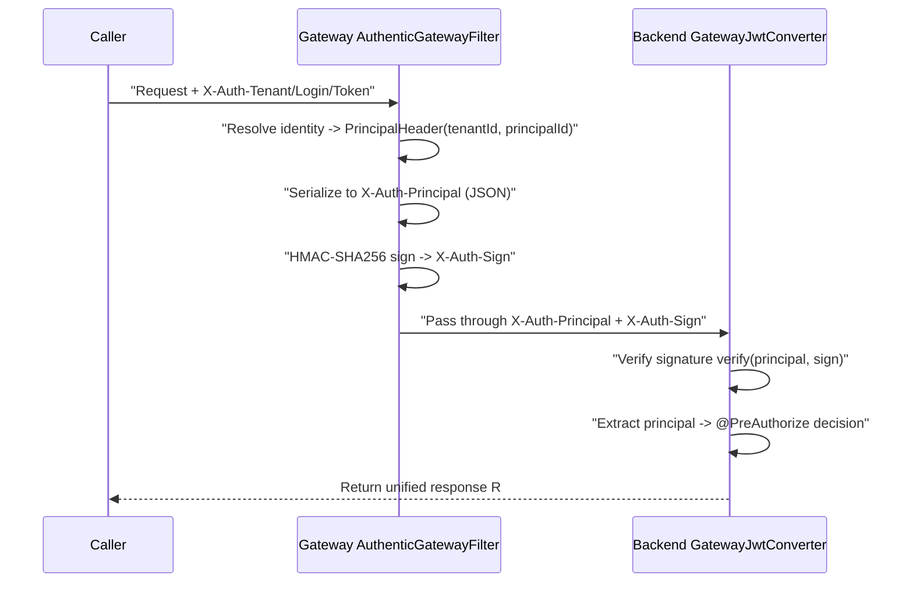
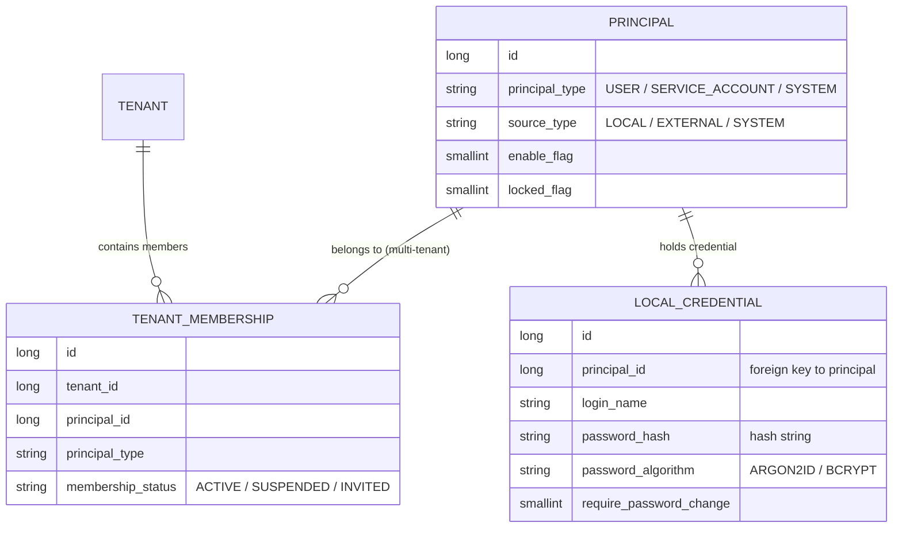
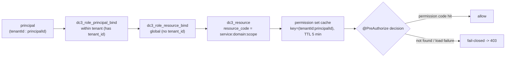

# Authentication · Tenancy · RBAC

Only the gateway faces the outside world. But every protected call still has to answer three questions before it reaches
a backend service: who you are, which tenant you belong to, and whether you're allowed to do this. This page covers how
a login becomes a token, how the gateway signs that identity and passes it downstream, how the identity model is laid
out, and how RBAC and tenant isolation together close off both privilege escalation and cross-tenant access. By the end
you'll know the full path a request takes from `X-Auth-Token` to `@PreAuthorize`, and which settings must be in place
before you ship to production.

> You are here: you already know the tenant boundary from [Core Concepts](../introduction/concepts) and want to see how
> it's enforced at the auth layer. Read it alongside [Services & Topology](./services)
> and [Domain Model](./domain-model).

## Why authentication splits into "gateway signing + backend verification"

Center services talk to each other over gRPC facades, and each backend service (Manager, Data, Agentic) has its own HTTP
port — they just aren't exposed externally by default. That leaves a gap: any caller that can reach a backend port
directly only needs to forge a header that claims "I'm the admin of tenant A." If the backend trusts headers
unconditionally, it's been impersonated.

IoT DC3 closes that gap by separating *authenticated* identity from *trusted* identity:

- **Authentication** happens exactly once, at the gateway `dc3-gateway`. The gateway takes the `X-Auth-Tenant` /
  `X-Auth-Login` / `X-Auth-Token` headers from the frontend, checks them against the auth center, and resolves the real
  principal (tenant ID + identity ID).
- **Trust** travels as an HMAC-SHA256 signature. The gateway serializes the resolved identity into `X-Auth-Principal` (
  JSON), signs it with a shared secret to produce `X-Auth-Sign`, and forwards both to the backend. The backend trusts an
  identity header only when its signature checks out; if verification fails, the request is treated as anonymous.

So the backend never repeats the login check, and it can't be fooled by a bare forged header either — the signature can
only come from the secret shared between the gateway and the backend.

## Login and token issuance

Login is a two-step handshake: fetch a one-time salt, then hash the password with that salt to trade for a token. The
salt stops a plaintext password or a fixed hash from being replayed over the wire.

<AuthFlowDiagram lang="en" />

Both endpoints are public and need no authentication:

- `POST /api/v3/auth/token/salt`: send `tenant` and `name`. It first confirms the tenant exists, then returns a random
  salt (a UUID), **valid for 5 minutes**.
- `POST /api/v3/auth/token/generate`: send `tenant`, `name`, `salt`, and the `password` hashed with the salt. On success
  it returns an access token, **valid for 12 hours** (`TOKEN_CACHE_TIMEOUT = 12` hours).

`generateToken` runs its checks in a fixed order. Any failure returns the same "no available authentication" error, so
the caller can't tell which step failed:

1. **Tenant**: `tenantCode` must resolve to an existing tenant.
2. **Credential**: locate `dc3_local_credential` by `loginName`.
3. **Membership**: the credential's `principalId` must be a member of the tenant (looked up via
   `dc3_tenant_membership`).
4. **Salt**: the salt must not be empty.
5. **Password**: verification dispatches on the algorithm recorded in the stored hash (`ARGON2ID` or `BCRYPT`). The
   default seed user `dc3` stores its password with BCrypt (cost=12), so the golden-path login actually runs BCrypt
   verification. Only a newly encoded password prefers Argon2id (falling back to bcrypt when unavailable). A failure
   records one failed login.
6. **Password expiry / forced change**: when `password_expire_time` has passed or `require_password_change=1`, it
   throws "password change required" instead of issuing a token.

Only when all checks pass does it sign a JWT with `KeyUtil.generateToken(principalId, salt, tenantId)`. The token binds
to **principal_id + tenant_id**, not to the username. On logout, `(tenantCode:principalId)` goes onto a Caffeine
denylist, so later requests carrying an old token are rejected — even with a valid signature — because the token was
issued before the logout point.

```bash [curl login golden path]
# 1) Fetch salt
curl -s -X POST http://localhost:8000/api/v3/auth/token/salt \
  -H 'Content-Type: application/json' \
  -d '{"tenant":"default","name":"dc3"}'
# Example response (valid for 5 minutes): "a1b2c3d4-...-e5f6"

# 2) Hash password with salt, then exchange for token
curl -s -X POST http://localhost:8000/api/v3/auth/token/generate \
  -H 'Content-Type: application/json' \
  -d '{"tenant":"default","name":"dc3","salt":"a1b2c3d4-...-e5f6","password":"<hashed>"}'
# Example response (valid for 12 hours): a JWT string

# 3) All subsequent protected requests carry the three headers
curl -s -X POST http://localhost:8000/api/v3/manager/device/add \
  -H 'X-Auth-Tenant: default' \
  -H 'X-Auth-Login: dc3' \
  -H 'X-Auth-Token: <token>' \
  -H 'Content-Type: application/json' \
  -d '{"deviceName":"...","driverId":...,"profileId":...}'
```

## Gateway request and HMAC signature pass-through

Once you hold a token, every protected call sends the three headers `X-Auth-Tenant` / `X-Auth-Login` / `X-Auth-Token` to
the gateway. The gateway's `AuthenticGatewayFilter` turns those three headers into a signed identity the backend can
trust.



On the gateway side (`AuthenticGatewayFilter`): identity resolution is a blocking gRPC call, so it runs on the
`boundedElastic` thread pool to keep the Netty event loop free. After resolving `PrincipalHeader`, it's serialized into
`X-Auth-Principal`. If HMAC is enabled, `X-Auth-Sign` is written too. **If HMAC is off, any inbound `X-Auth-Sign` header
is stripped**, so a client can't sneak a fake signature past the gateway to the downstream.

On the backend side (`GatewayJwtConverter`):

- No `X-Auth-Principal` → continue as anonymous.
- With HMAC enabled, recompute the HMAC over the principal payload with the same secret and compare against
  `X-Auth-Sign` in **constant time**. Mismatch → reject.
- Once verification passes, parse the principal. If `tenantId` or `principalId` is missing, reject outright. Otherwise
  load the permission set and hand it to `@PreAuthorize` for the decision.

The shared signing secret comes from `dc3.auth.hmac.secret` (or the `AUTH_HMAC_SECRET` environment variable). Its
default behavior depends on the environment — lenient in development, strict in production:

::: danger HMAC production fail-fast
In `pre` / `pro` environments, if `AUTH_HMAC_SECRET` is empty or still the default value `io.github.pnoker.dc3`, the
service **fails to start** (throws `IllegalStateException`). The decision logic lives in
`HmacAuthConfig.isProtectedEnvironment()`: it reads `spring.profiles.active` and `spring.env`, and turns on strict
validation when either matches `pre`/`pro`. Set it to a strong random value before you deploy.
:::

::: warning An empty key in dev/test only warns
When the key is empty in a non-protected environment, `HmacAuthSigner` doesn't error. It disables signing and prints a
prominent WARNING. At that point the backend **trusts `X-Auth-Principal` unconditionally**. That's fine for local
self-testing, but no externally reachable deployment should be left in this state.
:::

## Identity model: the principal is the root

Many platforms make the "user" the root object of authentication, so service accounts and system identities end up
crammed into the user table. IoT DC3 flips that: the root identity is **`dc3_principal`**, and a user is just one of its
types.



- **`dc3_principal`** is the unified identity table. `principal_type` is one of `USER` (a person), `SERVICE_ACCOUNT` (a
  service account), or `SYSTEM` (a system identity).
- **Credentials attach to the principal**: `dc3_local_credential.principal_id` points at a principal, not at some
  `user_id`. Password hashing defaults to Argon2id (BCRYPT is also supported). So the same identity model carries both
  human and machine callers.
- **Tenant membership is explicit**: an identity's tenant isn't hardcoded on the identity. It's declared row by row in
  `dc3_tenant_membership`. The unique index sits on `(tenant_id, principal_id)`, so **a USER can belong to several
  tenants** (multiple rows). At login, `name + tenant` together pinpoint the membership. **SERVICE_ACCOUNT is
  single-tenant by design**.

::: info External identity (identity provider) not yet implemented
The two tables `dc3_identity_provider` (external IdP configuration, e.g. OIDC/SAML) and `dc3_external_identity` (binding
of external identities to local principals) already exist in `02-iot-dc3-auth.sql`, and `principal.source_type` reserves
the `EXTERNAL` value. But the corresponding **login endpoint is not implemented and is disabled**. The only working
login path right now is the local-credentials flow above (`POST /api/v3/auth/token/salt` +
`/api/v3/auth/token/generate`).
:::

## RBAC: from identity to resource code

Once verification yields the principal, the next question is "what can it do." IoT DC3 uses the classic three-way "
subject — role — resource" binding, but deliberately splits the scope of two legs: role assignment is **per tenant**,
while resource authorization is **global**.



The chain is: `dc3_role_principal_bind` (carries `tenant_id`, so it picks the roles this principal has *within that
tenant*) → `dc3_role_resource_bind` (no `tenant_id`, so it maps roles to resources) → `dc3_resource` (a resource is a
permission code). Scoping role assignment to a tenant while keeping resources global means one role definition is reused
across tenants, and "who has this role in which tenant" never crosses wires.

A resource code is a three-segment `{spring.application.name}:{domain}:{scope}`, assembled at runtime by `@perm.can`
from the hosting service. For example, `@perm.can('device', 'add')` on `DeviceController` actually checks the string
`dc3-center-manager:device:add`, and `@perm.can('point_command', 'list')` on `PointCommandController` checks
`dc3-center-data:point_command:list`. Note that the seed data doesn't add a row for every API-level permission; the
default admin's resource code is the wildcard `*`, which covers every endpoint.

`AuthPermissionProvider` resolves permissions behind a short-lived cache:

- The cache key is **`(tenantId:principalId)`** with a TTL of **5 minutes** (`CACHE_TTL_MS = 300_000`). So after you
  change an authorization, it can take up to 5 minutes to land on in-flight sessions.
- During resolution, every resource code that principal holds under that tenant is gathered into a set. When
  `@PreAuthorize` decides, a hit on either a specific code or a wildcard lets the call through.

The most important part is the failure behavior — **fail-closed**:

::: danger No permission found = deny, not allow
When permission loading hits a transient failure, `GatewayJwtConverter` still builds an "authenticated but
permission-less" token (an empty authorities set). That's intentional fail-closed behavior: the caller counts as logged
in but with no permissions at all, and every `@PreAuthorize` guard returns **403** rather than dressing up a backend
hiccup as a 401 or letting the call slip through. When permissions can't be loaded, the default is no permission — never
the other way around.
:::

## Tenant isolation: controller-layer enforcement

RBAC decides "can you perform this kind of operation." Tenant isolation decides "can you touch this piece of data." The
two are orthogonal and both required — having `device:get` doesn't mean you can fetch another tenant's device. Isolation
lands at the controller layer (the database query layer does no automatic tenant pruning today; `MybatisPlusConfig`
registers only the pagination plugin):

**Controller layer `BaseController.requireTenant()`**: after looking up an entity by ID, it compares the entity's
`tenantId` against the caller's. On a mismatch (or if the entity doesn't exist) it throws `NotFoundException` and
returns **404** to the outside — deliberately "does not exist" rather than "no permission," so a cross-tenant probe
can't tell whether the resource is there. Batch queries go through `filterTenant()`, which drops any item that doesn't
belong to the current tenant.

::: warning There is no database-layer tenant safety net
Don't assume the SQL layer will fill in a missing tenant condition — the current implementation has **no** MyBatis-Plus
tenant-line interceptor; isolation relies entirely on the controller layer's `requireTenant` / `filterTenant`. When you
add a single or batch query, you must call these methods yourself to enforce the tenant scope, otherwise the query is
not pruned by tenant.
:::

```java
// Controller layer: if the entity looked up by ID does not belong to the current tenant, return 404 instead of 403
default <T extends TenantOwned> T requireTenant(Long tenantId, T entity) {
    if (Objects.isNull(entity) || !Objects.equals(tenantId, entity.getTenantId())) {
        throw new NotFoundException("Resource does not exist");
    }
    return entity;
}
```

::: tip Preserve tenant scope when adding queries
Any new query, gRPC request, or cache key must carry tenant context: queries keep `tenantId`, cache keys include the
tenant, and cross-service fetches validate ownership first. Unless the data model explicitly defines a record as global,
don't write bypasses like `tenant_id IS NULL`.
:::

## Constraints and boundaries at a glance

The hard constraints scattered through the page, gathered in one place for a pre-deployment check:

| Item                         | Value / behavior                                                            | Source                           |
|------------------------------|-----------------------------------------------------------------------------|----------------------------------|
| Salt validity                | 5 minutes                                                                   | `POST /api/v3/auth/token/salt`   |
| Token validity               | 12 hours                                                                    | `TOKEN_CACHE_TIMEOUT=12` hours   |
| JWT binding                  | `principal_id` + `tenant_id`                                                | `generateToken`                  |
| HMAC secret                  | `AUTH_HMAC_SECRET` / `dc3.auth.hmac.secret`, default `io.github.pnoker.dc3` | `HmacAuthConfig`                 |
| HMAC production check        | empty or equal to default under `pre`/`pro` fails startup                   | `HmacAuthConfig`                 |
| Permission cache             | key=`(tenantId:principalId)`, TTL 5 minutes                                 | `AuthPermissionProvider`         |
| Permission failure semantics | fail-closed -> empty permissions -> 403                                     | `GatewayJwtConverter`            |
| Cross-tenant ID query        | returns 404 (not 403)                                                       | `BaseController.requireTenant()` |
| External identity login      | tables created, endpoint unimplemented/disabled                             | `02-iot-dc3-auth.sql`            |

## Further reading

- [Services & Topology](./services) — how the gateway, the four centers, and drivers are distributed, plus ports and
  startup order
- [Domain Model](./domain-model) — the DO/BO/VO layering and how `TenantOwned` and the tenant field thread through
  entities
- [API Documentation](../development/api-documentation) — OpenAPI, authentication headers, and the CRUD verb convention
- [IoT Security](../foundations/security) — a systematic view of device, comms, platform and data security
