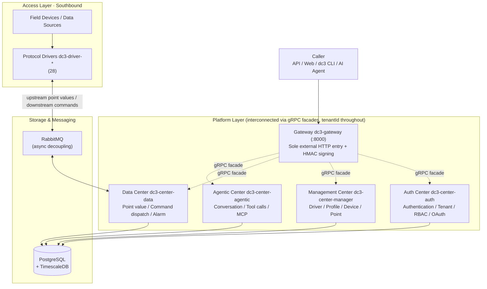

# System Architecture Overview

IoT DC3 runs the "collect → normalize → analyze → act → feedback" loop as a layered, multi-tenant microservice
architecture. A single gateway is the only northbound entry point. Four center services each own one segment of the
chain. Protocol drivers connect field devices southbound. This page starts with a layered diagram to give you the global
picture, then walks through the four key design decisions — what problem each one solves and how they work together —
and finally points to the deep-dive pages for every link in the chain.

> You are here: you have read [Platform Positioning](../introduction/) and [Core Concepts](../introduction/concepts),
> and now you're breaking the loop down into a concrete layered structure. From here you can jump into any plane (data /
> command / auth / domain model).

## Architecture at a Glance

This panorama lays out all six layers, the four center services with their ports, the message-bus exchanges, and the
optional observability stack in one view — get the whole picture first, then read the logical drill-down below. The
diagram adapts to the site's light/dark theme.

<TopologyDiagram lang="en" />

## Four-Layer Reference Architecture Mapping

The industry-standard IoT four-layer reference architecture — Perception, Network, Platform, Application — plus security
as a cross-cutting concern — every DC3 component maps onto this framework. This diagram helps you quickly see where DC3
stands on the "from sensor to AI operations" full map.

<LayeredDiagram lang="en" />

Legend colors: purple=Application · green=Platform · orange=Network · cyan=Perception · amber=Security.

| Layer | IoT Reference Responsibilities | DC3 Implementation |
|-------|--------------------------------|--------------------|
| **Application** | Operations, alarms, analytics, AIoT, and third-party system integration | Web console, public APIs, dc3 CLI, Agentic Center, MCP tools, and alarm analysis |
| **Platform** | Device management, storage, rule computation, identity, and business orchestration | Gateway, Auth / Manager / Data / Agentic center services, PostgreSQL, TimescaleDB, domain model, and command state machine |
| **Network** | Fieldbus, IoT protocols, wireless / WAN, and message transport | 28 protocol drivers, RabbitMQ async message bus, gRPC facades, and southbound read/write command channels |
| **Perception** | Sensing, auto-ID, actuators, field devices, and data sources | Profile / Device / Point normalize physical equipment, measurement points, and raw signals into semantic platform data |
| **Cross-cutting Security** | Identity, authorization, tenant isolation, trusted transport, and call integrity | JWT, RBAC, tenantId propagation, HMAC gateway signing, TLS / secret configuration, and audit logs |

Read this diagram as a **responsibility view**, not as a process deployment diagram. For example, the Gateway is both a
northbound entry point and part of platform governance; RabbitMQ supports protocol decoupling in the network layer and
load buffering in the platform layer; Agentic Center is an application-layer capability that is made safe by the
platform's auth, command, and data planes. For a systematic walkthrough of the IoT four-layer reference, see
[IoT Technology Overview](../foundations/).

## Three-Layer Structure: Access, Platform, Storage & Messaging

The platform isn't one monolith. It's a set of services split by responsibility. From the caller's perspective, there's
a single entry point — the gateway `dc3-gateway` (HTTP `8000`), the only externally exposed HTTP port. The HTTP and gRPC
ports of the other center services are reachable only on the internal network. The gateway routes requests to the four
center services, which don't call each other over HTTP but cooperate cross-process through gRPC facades.

Southbound runs to a different rhythm. Field devices are connected by protocol drivers (`dc3-driver-*`, 28 in total),
and drivers and the data center **never call each other directly**. They exchange messages asynchronously through
RabbitMQ — point values flow northbound (upstream), commands flow southbound (downstream). All persistence lands in
PostgreSQL, where time-series data (point value history) is stored in TimescaleDB hypertables.

The dashed lines are gRPC facade calls; the bidirectional solid lines are RabbitMQ exchanges. The difference between
those two connection styles is exactly what the four designs below explain. For each service's ports, startup order, and
health checks, see [Services & Topology](./services).

::: info Monolithic and Distributed Deployment Forms
The diagram shows the default distributed form (four centers as independent processes). The platform can also merge the
centers into a single process (`dc3-center-single`) running on one machine. That's just a deployment topology choice —
the business chain doesn't change. The switch is governed by `DC3_FACADE_MODE`; see [Facade Modes](./facade-modes).
:::

## gRPC Facade: How Centers Call One Another

The four center services frequently need data from each other. Before the data center dispatches a command, for
instance, it has to confirm with the management center that the device and point exist and are enabled. If business code
assembled HTTP URLs to call peers directly, service boundaries would leak transport details, and the monolithic and
distributed deployments couldn't share one codebase.

IoT DC3 solves this with **facade interfaces**. Cross-service calls program against the contract interfaces in
`dc3-common-facade-api`, so business code knows the interface, not the transport. At runtime, `DC3_FACADE_MODE` picks
the implementation behind the interface:

- `grpc` (distributed default) — the implementation comes from `dc3-common-facade-grpc`, and calls go cross-process via
  gRPC to the target center.
- `local` (single process) — the implementation comes from `dc3-common-facade-local-*`, and calls are direct in-process
  method invocations with no network hop.

In other words, "distributed or monolithic" is a deployment switch, not two codebases. The same business logic moves
between the two forms just by changing `DC3_FACADE_MODE`.

::: warning Read the Facade Mode Defaults Carefully
In a distributed setup each center defaults to `grpc`. The management center's `application.yml` declares
`dc3.facade.mode: ${DC3_FACADE_MODE:grpc}`, and `dc3/env/dev.env` also sets `DC3_FACADE_MODE=grpc`. The auth center's
base `application.yml` contains a line `dc3.facade.mode: local`, but that's a local override for the single-process
scenario — it does not mean the distributed default is `local`. Go by the environment variable and the manager's
declaration. For the full distinction, see [Facade Modes](./facade-modes).
:::

## RabbitMQ Async Decoupling: Why Drivers and the Data Center Aren't Directly Connected

Point values are high-frequency and bursty. A single round of collection by a Modbus driver can produce hundreds or
thousands of values in an instant. If a driver called the data center synchronously to write to the database, any
slowdown along the way would back-pressure the collection thread — drivers would drop offline and data points would be
lost. Command downlink is the same: an HTTP request shouldn't block indefinitely while waiting for a device to finish
writing registers.

So a layer of RabbitMQ sits between the drivers and the data center, decoupling "production" from "consumption" in time:

- **Upstream (data)**: drivers publish collection results to the topic exchange `dc3.e.value` with routing key
  `dc3.r.value.point.{driverServiceName}`, landing in the durable queue `dc3.q.value.point` (7-day TTL, with dead-letter
  exchange `dc3.e.point_value_dead`). The data center's `PointValueReceiver` consumes asynchronously and writes to the
  database in batches or immediately.
- **Downstream (command)**: commands are delivered via the exchange `dc3.e.point_command` to the corresponding driver
  queue (30-second TTL + dead letter). After the driver executes, it sends the result back to
  `dc3.e.point_command_result` (60-second TTL), where the data center's result receiver collects it.

This way point-value writes never block collection, and command dispatch returns a `commandId` immediately for polling.
Messages use durable delivery + manual ack + publisher confirm, with failures handled via redelivery and dead-letter.
For the complete exchange, queue, and acknowledgment chain, see [Data Plane](./data-plane)
and [Command Plane](./command-plane).

::: danger A Failed Write Command Never Returns a Fabricated Value
A write command counts as successful only when the driver's `write()` returns `Boolean.TRUE`. On failure the result
`responseValue=null`, and **no** "looks-successful" value is ever filled in. That's deliberate, to keep false success
from misleading the upper layers. A command's `PointCommandDTO.expireAt` defaults to `now + 10s`, and the timeout is
judged as `EXPIRED` by the driver at consumption time.
:::

## Multi-Tenant Isolation: How tenantId Runs Through Every Layer

The platform is multi-tenant by design. Isolation is enforced at the interface layer; `tenantId` is carried along "
gateway → center service → gRPC call → cache key," and both single-ID and batch queries are checked at the controller
layer so cross-tenant access is blocked.

The enforcement points in practice:

- **Interface layer (single by ID)**: `BaseController.requireTenant()` compares the entity's `tenantId` after fetching
  it, returning 404 (rather than leaking data) for cross-tenant access.
- **Interface layer (batch)**: `BaseController.filterTenant()` strips records that don't belong to the current tenant
  from batch results. The database query layer does no automatic tenant pruning today (`MybatisPlusConfig` registers
  only the pagination plugin); isolation is applied at the controller layer.
- **Cross-service**: gRPC facade calls carry the tenant ID where the contract supports it, and cache keys also include
  tenant context.

So when you write a new query, a new gRPC call, or a new cache key, you have to preserve the tenant scope. That's a hard
requirement, not an optional optimization. For how isolation is enforced layer by layer and how it works with RBAC,
see [Auth · Tenant · RBAC](./auth-rbac).

## HMAC Gateway Signing: How the Backend Trusts Who the Caller Is

After authentication, the gateway packs the resolved identity (tenant, login name, principal) into an `X-Auth-Principal`
JSON header and forwards it to the backend center services. The backend makes authorization decisions based on it. The
question is: why should the backend trust that this header wasn't forged? Anyone who bypasses the gateway to hit an
internal port directly could construct a fake principal header.

The answer is **HMAC-SHA256 signing**. The gateway signs the principal content with the secret `AUTH_HMAC_SECRET` (
config key `dc3.auth.hmac.secret`) and puts the signature in the `X-Auth-Sign` header. The backend verifies it with the
same secret and rejects anything that fails. Only the gateway holding the secret can sign a valid request, so a forged
principal header is blocked at the backend.

::: danger The Production Secret Must Be Changed, or Startup Fails
The factory default of `AUTH_HMAC_SECRET` is `io.github.pnoker.dc3`, for development only. When the Spring profile
contains `pre` or `pro`, if the secret is empty or still equals that default, the service throws `IllegalStateException`
at startup and **fail-fast**s — refusing to go to production with a weak secret. `DC3_SECURITY_KEY` (login token
signing) must likewise be changed to an environment-specific, strong random value.
:::

## Consistency and Scalability

The four center services are themselves **stateless**. Hot data such as sessions, token denylists, and latest values
live in the Caffeine cache or the database, so requests aren't pinned to a particular instance. Each center can scale
horizontally: attach a few more instances of the same kind behind the gateway to share the load. No shared memory is
needed.

The data center's throughput bottleneck is on the consumption side, and consumption concurrency is tunable.
`PointValueReceiver` consumes `dc3.q.value.point` with a high-throughput listener container, switching between "
immediate write" and "`PointValueJob` batch write" based on the inbound rate. The batch threshold is controlled by
`POINT_BATCH_SPEED` (default 100 records) and `POINT_BATCH_INTERVAL` (default 5 ms) — whichever is met first flushes to
disk. Under a collection flood, RabbitMQ absorbs the burst first, and concurrent consumption plus batch writes then
handle it.

::: info Strong Consistency and Eventual Consistency Coexist
Steps on the request path — tenant isolation, authorization decisions, the command state machine — are strongly
consistent (synchronous validation, immediate rejection). Upstream persistence of point values is eventually consistent
via MQ: a value is treated as reliably delivered once it enters the queue, while the database write and alarm evaluation
complete asynchronously. Understanding this boundary helps when troubleshooting timing issues like "the command is
acknowledged but the history query is still a beat behind."
:::

## Further Reading

- [Services & Topology](./services) — six deployable units, port allocation, startup dependencies, and health checks
- [Facade Modes](./facade-modes) — the trade-off between `grpc` and `local`, switching between monolithic and
  distributed
- [Data Plane](./data-plane) — every hop a point value takes from device to TimescaleDB, and the MQ topology
- [Command Plane](./command-plane) — dispatch of read/write commands, the lifecycle state machine, and acknowledgments
- [Auth · Tenant · RBAC](./auth-rbac) — gateway signing, token issuance, permission resolution, and tenant propagation
- [Domain Model](./domain-model) — the fields of Profile / Point / Device and the DO/BO/VO layering
- [Module Map](./modules) — the Maven module structure, the 28 drivers, and their dependencies
