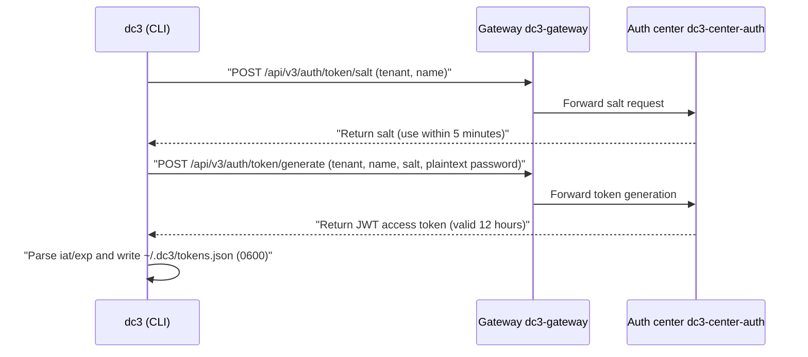
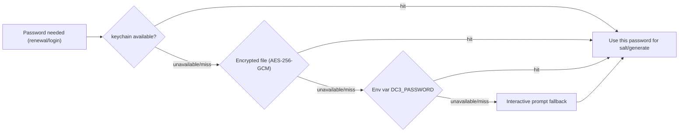
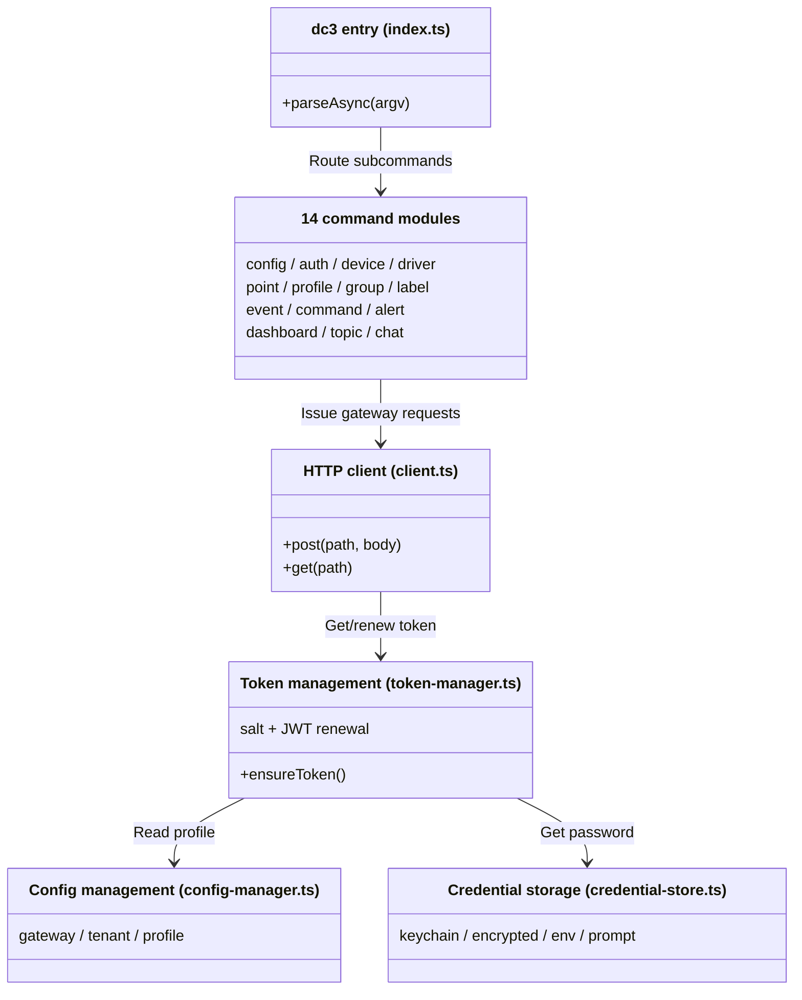

# CLI User Guide

`dc3-cli` is the command-line client for IoT DC3 — a standalone TypeScript package (Node ≥ 20) that exposes the platform
through the `dc3` command. It talks to the platform entirely through the gateway at `/api/v3/*`. By the end of this page
you'll have it installed, the gateway configured, a token in hand, and you'll have read devices, read point values, and
sent commands from the shell.

> You are here: you can already get [your first device](../quickstart/first-device) working through the frontend or
> curl, and now you want to drive the platform from the command line or inside an AI agent. If you want an AI tool to
> talk
> to the platform directly, head to [AI Agent / MCP Integration](../ai/mcp).

## What it is and who it's for

`dc3-cli` is not another backend. It's an HTTP client: every request goes to the gateway address you configure, with a
common `/api/v3/*` prefix (the gateway then routes to the auth, manager, data, and agentic centers). There is no Java or
build-time coupling — install one Node package and it runs standalone.

It serves three audiences: **operations and onboarding engineers** who want to inspect devices, read values, and send
commands from the terminal; **automation authors** who fold platform operations into scripts and pipelines; and **agent
integrators** who let AI coding tools (Claude Code, Codex, Gemini CLI, and others) call the platform through the shell.
Every command supports `--format json`, so the output is reliable for programs to parse.

```bash
npm install -g dc3-cli
```

Three steps to get going: configure the gateway, log in, then use it.

```bash
dc3 config set gateway http://localhost:8000   # gateway address (example: local default port 8000)
dc3 auth login                                 # interactive login
dc3 device list                                # list devices
```

## Authentication: the three-stage token and how it stays fresh

`dc3 auth login` runs a three-stage token chain built on the same pair of endpoints the
platform's [golden path](../quickstart/first-device) uses for curl login — the CLI just wires them together. First,
`POST /api/v3/auth/token/salt` exchanges a tenant name and username for a **salt**. The CLI then submits the **plaintext
password** together with the salt to `POST /api/v3/auth/token/generate`, which returns a JWT. From the JWT it parses the
embedded `iat` and `exp`, then writes `{ token, salt, tenant, username, issuedAt, expiresAt }` to `~/.dc3/tokens.json` (
file mode `0600`, one entry per profile).



Before each later API call, the CLI does two things so you almost never hit a 401:

- **Proactive renewal**: if the current token is within the renewal threshold of expiring, the CLI silently re-logs in
  to get a fresh token before the call runs. The threshold comes from the profile's `renewal_threshold_hours`, which
  defaults to **1 hour** — it renews once less than an hour of validity remains.
- **401 fallback**: if a 401 still slips through (clock drift, service restart, and so on), the CLI renews and then *
  *retries the request once**.

Requests to protected endpoints carry the platform's standard three headers — `X-Auth-Tenant`, `X-Auth-Login`,
`X-Auth-Token` — where `X-Auth-Token` carries `{ salt, token }`.

::: warning Renewal needs the password
Both proactive renewal and the 401 retry need the CLI to fetch the password and run the salt→generate flow again. If you
used `--no-save` or `--store prompt` (nothing persisted), there is no password to fetch once the token expires. The CLI
can't renew silently in that case, so you'll need to run `dc3 auth login` again.
:::

::: danger Never print real passwords or tokens
All passwords and tokens on this page are example placeholders. Don't paste real passwords or JWTs in plaintext into
scripts, logs, or issues. `dc3 auth token` is for local troubleshooting only — the token it prints is a live login
credential.
:::

## Where credentials live: a four-tier resolution chain

The password itself never lands in `tokens.json`. It goes to a **credential storage backend**. When renewing, the CLI
looks up the password in a fixed order: OS keychain first, then the encrypted file, then an environment variable, and
finally an interactive prompt. The first tier that's available and has a value wins. Set the backend for the current
profile with `dc3 config set auth.store <type>`.



What each of the four backends is for:

| Storage     | Location                                                                         | Use case                                  |
|-------------|----------------------------------------------------------------------------------|-------------------------------------------|
| `keychain`  | OS keychain (macOS Keychain / Linux Secret Service / Windows Credential Manager) | Everyday use (default)                    |
| `encrypted` | `~/.dc3/credentials.enc`, AES-256-GCM encrypted                                  | Fallback when the keychain is unavailable |
| `env`       | Reads the `DC3_PASSWORD` environment variable                                    | CI/CD, scripts                            |
| `prompt`    | Nothing persisted; prompts interactively every time                              | Highest security, cannot auto-renew       |

The encrypted-file backend uses `aes-256-gcm`, with the key derived from a machine identifier via `scrypt`. The password
is stored as `identifier → password` (`username@tenant`), never in plaintext.

```bash
# Choose the credential backend at login time
dc3 auth login --store keychain        # store in the OS keychain (good for everyday use)
dc3 auth login --store env             # read from DC3_PASSWORD (good for CI)
dc3 auth login --no-save               # don't save the password; re-login manually when it expires

# Non-interactive login (example value; never use a real password in plaintext)
dc3 auth login --tenant default --username dc3 --password '<example-password>'

dc3 auth status                        # check login state and remaining validity
dc3 auth token --header                # print the full auth headers as JSON (for troubleshooting)
```

## Command module overview

The CLI has 14 command modules, grouped by object and scenario. Config and auth are the entry points; the metadata
modules (device/driver/point/profile/group/label) map to CRUD in the manager center; event/command/alert/dashboard map
to data and runtime state; and `chat` forwards requests to the agentic center.

| Module    | Command prefix  | Purpose                                                                |
|-----------|-----------------|------------------------------------------------------------------------|
| Config    | `dc3 config`    | Gateway address, tenant, credential backend, profile switching         |
| Auth      | `dc3 auth`      | Login/logout, inspect login state and token                            |
| Device    | `dc3 device`    | Device CRUD, counts, online status                                     |
| Driver    | `dc3 driver`    | Driver list, detail, runtime status                                    |
| Point     | `dc3 point`     | Point CRUD, read latest value, history, write value                    |
| Profile   | `dc3 profile`   | Profile CRUD                                                           |
| Group     | `dc3 group`     | Device group management                                                |
| Label     | `dc3 label`     | Label management                                                       |
| Event     | `dc3 event`     | Event definition CRUD, event history                                   |
| Command   | `dc3 command`   | Command list, invocation, command history                              |
| Alert     | `dc3 alert`     | Alarm overview, list, acknowledge, trends, top sources                 |
| Dashboard | `dc3 dashboard` | Statistics, time series, topology, health, real-time stream            |
| Topic     | `dc3 topic`     | Topic list                                                             |
| Agentic   | `dc3 chat`      | Converse with the agentic center (optional streaming, model selection) |

Under the hood, the `dc3` entry point parses the command line into those 14 modules, and every module shares one set of
core components: the HTTP client, config management, token management, and credential storage. The modules only describe
what to do; the gateway requests, profile resolution, renewal, and password retrieval all live in the core layer.



Global options apply to every module: `--profile <name>` switches the config profile; `--format json|table|yaml` picks
the output format (table by default on a TTY, json by default in a pipe); `--verbose` prints request and response
details; `--ci` turns on CI mode (no color, json output, strict exit codes).

::: details Multiple profiles side by side (dev / prod switching)
Each profile keeps its own gateway, tenant, credential backend, and token, fully isolated from the rest:

```bash
dc3 config profile use prod
dc3 config set gateway https://iot.example.com   # example production address
dc3 auth login

dc3 config profile use default                    # switch back to local
dc3 device list
```

:::

## Hands-on: reading values, reading history, sending commands

The examples below cover common operations with real commands; all IDs and values are example placeholders. Reading the
latest value maps to the data center's `POST /api/v3/data/point_value/latest`, writing a point maps to
`POST /api/v3/data/point_command/write`, and a command receipt maps to
`GET /api/v3/data/point_command_history/get_by_command_id`.

::: code-group

```bash [dc3 CLI]
# Read a point's latest value
dc3 point read 456789 --format json

# Read a point's history
dc3 point history 456789 --device-id 123456 --count 100 --format json

# Send a write command to a writable point (the point must be WRITE_ONLY or READ_WRITE)
dc3 point write 456789 --device-id 123456 --value 25.5

# Invoke a device command
dc3 command call --device-id 123456 --command-id 789 --params '{"speed":1500}'

# Check the command execution receipt (use the recordId returned by call; example value)
dc3 command history 9a1f2c3d-0000-0000-0000-000000000000

# Device and system health
dc3 device status 123456 --format json
dc3 dashboard health --format json
```

```bash [Equivalent curl]
# The equivalent write command sent straight to the gateway (example values)
curl -X POST http://localhost:8000/api/v3/data/point_command/write \
  -H 'Content-Type: application/json' \
  -H 'X-Auth-Tenant: default' \
  -H 'X-Auth-Login: dc3' \
  -H 'X-Auth-Token: {"salt":"<example-salt>","token":"<example-JWT>"}' \
  -d '{"deviceId":123456,"pointId":456789,"value":"25.5"}'
```

:::

`dc3 point write` and `dc3 command call` both end up in the command pipeline. A write command runs asynchronously: once
the gateway or data center accepts it, the call returns a command ID right away, and the actual result has to be looked
up by that ID in the command history.

::: danger Write failures aren't echoed back, and commands have a TTL
Whether a point can be written depends on its `rwFlag` — writing to a `READ_ONLY` point is rejected. If a write command
fails, the receipt's `responseValue` is `null`. A failed value never comes back as a success. The command itself has a
validity window: `PointCommandDTO.expireAt` defaults to `now + 10s`, and if no driver consumes it before the timeout
it's discarded. These rules are the same for the CLI and for direct curl.
:::

## Exit codes: how to read the result in scripts

`dc3` tells success from failure through exit codes. Success exits `0`; any error — bad arguments, unreachable gateway,
rejected auth, API error — exits `1`. The CLI catches every exception at the top level and calls `process.exit(1)`. It
doesn't break exit codes out by error category, so to tell the cause apart, read the error message on stderr or add
`--verbose`.

| Exit code | Meaning                                                                                      |
|-----------|----------------------------------------------------------------------------------------------|
| `0`       | Success                                                                                      |
| `1`       | Any error (invalid arguments, network unreachable, rejected authentication, API error, etc.) |

```bash
# Decide by exit code in CI: non-zero means failure; read the cause from stderr
if ! dc3 device list --ci 2>err.log; then
  if grep -qE 'Authentication failed|Forbidden' err.log; then
    echo "login required"
  else
    echo "other error"; cat err.log
  fi
  exit 1
fi
```

::: tip Prefer `--format json` for AI agents
When AI coding tools call the platform through the shell, always add `--format json` (or `--ci`). The output fields are
stable and parseable, and the `0`/`1` exit code lets the agent first tell whether it succeeded, then read the error on
stderr to decide whether to re-login or retry. If you want AI tools to discover and call the platform's full API surface
directly, see how to wire up the gateway MCP endpoint in [AI Agent / MCP Integration](../ai/mcp).
:::

## Further reading

- [Automation](./) — where the CLI, scripts, and MCP fit in the overall automation picture
- [AI Agent / MCP Integration](../ai/mcp) — let AI tools discover and call platform tools through the gateway's `/mcp`
- [First Device](../quickstart/first-device) — the golden path: end-to-end flow from creating a driver to reading values
