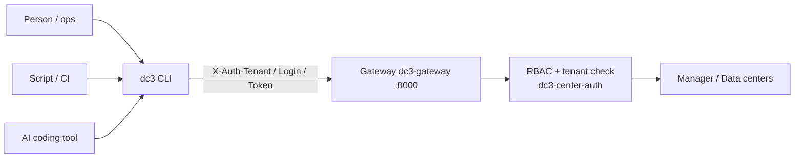

# Automation

Deterministic, repeatable, programmatic operations through the `dc3` CLI — no LLM involved, so results are predictable
and scriptable. Where the AI section (Agentic Center, MCP) is about "let the model decide," this section is about "let a
person or script execute."

## dc3 CLI

`dc3` is a standalone TypeScript CLI (Node ≥ 20) that talks to a running backend over the HTTP gateway, with no Java
build coupling. It wraps the three-step login, automatic token renewal, and credential storage, so what you actually run
are subcommands named by result cardinality: `dc3 device list`, `dc3 point history`, `dc3 driver add`.

It fits three audiences:

- **Local debugging** — read a point value, check a device, fire off a read command, all from the terminal.
- **Scripts and CI** — bulk-create devices, pull history on a schedule, wire platform operations into a deploy pipeline.
- **AI coding tools** — let Claude Code, Codex, Gemini CLI drive the platform through the shell; every command supports
  `--format json`, so the output is safe for programs to parse.

The CLI authenticates with a login token: fetch a salt, exchange it for a 12-hour access token, then send
`X-Auth-Tenant` / `X-Auth-Login` / `X-Auth-Token` on every request. Like the AI section, it gets no more privilege than
the logged-in account, and cross-tenant data stays invisible.

> Want a model rather than a script at the wheel? See the [AI section](../ai/) (conversational Agentic Center + MCP for
> external agents).

## Further reading

- [CLI Guide](./cli) — full command surface, three-step login, credential backends (keychain / encrypted file / env)
- [AI](../ai/) — conversational Agentic and MCP for external agents
- [Your first device](../quickstart/first-device) — a CLI walkthrough for the first device
