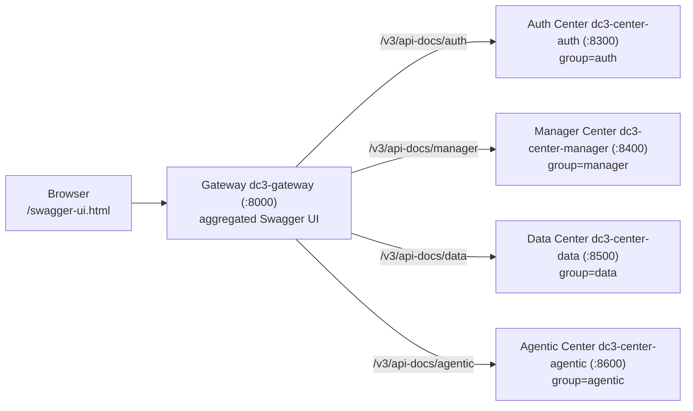
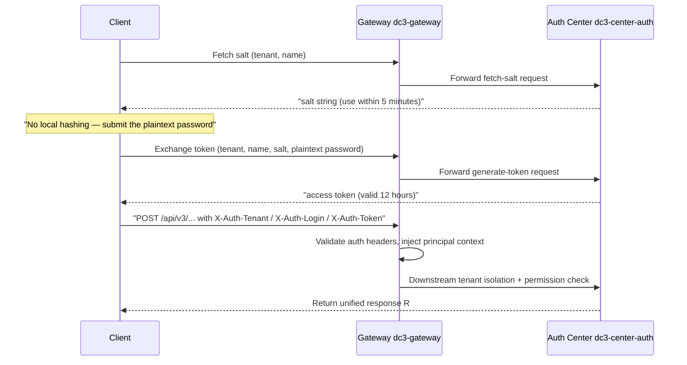

# API Documentation

IoT DC3's REST API docs are generated from code annotations, then aggregated by the gateway into a single Swagger UI. By
the end of this page you'll be able to open each center's online docs in development, walk through the login flow with
the default credentials (fetch salt → fetch token → call with auth headers), read the CRUD path conventions, and see how
the `x-dc3-ai` risk metadata on each endpoint feeds into AI/MCP tools.

> You're about to call or debug a backend API. If you need to get the environment running first,
> see [First Device](../quickstart/first-device). For the tenants and permissions behind those auth headers,
> see [Auth · Tenant · RBAC](../architecture/auth-rbac).

## Where the docs come from: annotation-generated, gateway-aggregated

There are no hand-written API spec files. Every endpoint's title, parameters, and request/response models come from
`springdoc-openapi` annotations on the Controllers (`@Tag`, `@Operation`, `@Parameter`, `@Schema`). Each center service
emits its own OpenAPI JSON at runtime on the WebFlux stack.

Four business centers expose their own docs — Auth Center (`dc3-center-auth`), Manager Center (`dc3-center-manager`),
Data Center (`dc3-center-data`), and Agentic Center (`dc3-center-agentic`). The Gateway (`dc3-gateway`) has no business
Controllers of its own; through `springdoc.swagger-ui.urls` it pulls all four documents into one Swagger UI with a
service dropdown, so only a single entry point faces outward.



Grouping works in two layers. `dc3-common-web`'s `SpringDocConfig` supplies the global metadata — title, version,
contact, license, security schemes. Each business module then declares a `GroupedOpenApi` Bean under its already-scanned
package, so only that module's Controllers are scanned. Each center service prepends its `spring.webflux.base-path` (
e.g. `/auth`, `/manager`) to the doc path, giving paths like `/auth/v3/api-docs`. The gateway's aggregation path
`/v3/api-docs/{svc}` flattens that away, so every service is reachable the same way.

::: info dc3-center-single mode
`dc3-center-single` packs multiple business modules into one process, so its Swagger UI shows several groups at once.
That's expected, not duplicated configuration.
:::

## Access entry points

In development, prefer the gateway aggregation entry point. When you're debugging a single center, you can also hit its
base-path docs directly.

| Target                              | URL                                             |
|-------------------------------------|-------------------------------------------------|
| Gateway aggregated UI (recommended) | `http://<gateway>:8000/swagger-ui.html`         |
| Auth Center direct                  | `http://<auth>:8300/auth/swagger-ui.html`       |
| Manager Center direct               | `http://<manager>:8400/manager/swagger-ui.html` |
| Data Center direct                  | `http://<data>:8500/data/swagger-ui.html`       |
| Agentic Center direct               | `http://<agentic>:8600/agentic/swagger-ui.html` |
| Single-center OpenAPI JSON          | `http://<center>:<port>/<svc>/v3/api-docs`      |

## Login and authentication: fetch salt → fetch token → send X-Auth-* headers

Public endpoints like `/api/v3/auth/token/**` (fetch salt, generate token, change password) are open. Every other
business API behind the gateway requires three auth headers: `X-Auth-Tenant`, `X-Auth-Login`, and `X-Auth-Token`.

Login is a two-step handshake. First, request a random salt from the server using the username and tenant (use within 5
minutes as a guideline; the server does not enforce the timeout). Then submit the **plaintext password** together with
that
salt to exchange for a token (valid 12 hours). The salt does not participate in the password hash — it is concatenated
with
the server-side `DC3_SECURITY_KEY` to derive the JWT's HMAC-SHA256 signing key. The password itself is submitted in
plaintext
(relies on HTTPS for transport protection) and verified by the backend `PasswordUtil.verify` using Argon2id (falling
back to
BCrypt when Argon2 is unavailable).



A real call looks like this (values are illustrative only; `default`/`dc3` are the tenant and user shipped in the seed
data):

::: code-group

```bash [curl]
# 1. Fetch salt
curl -X POST http://localhost:8000/api/v3/auth/token/salt \
  -H 'Content-Type: application/json' \
  -d '{"tenant":"default","name":"dc3"}'
# → R<String>: data is the salt (e.g. "f3a9c1..."), use within 5 minutes

# 2. Submit the plaintext password together with the salt (HTTPS protects transport) to exchange for a token
curl -X POST http://localhost:8000/api/v3/auth/token/generate \
  -H 'Content-Type: application/json' \
  -d '{"tenant":"default","name":"dc3","salt":"f3a9c1...","password":"<plaintext password>"}'
# → R<String>: data is the access token (e.g. "eyJ..."), valid 12 hours

# 3. Call a business API with the auth headers
curl -X POST http://localhost:8000/api/v3/manager/device/list \
  -H 'X-Auth-Tenant: default' \
  -H 'X-Auth-Login: dc3' \
  -H 'X-Auth-Token: {"salt":"f3a9c1...","token":"eyJ..."}' \
  -H 'Content-Type: application/json' \
  -d '{"current":1,"size":10}'
```

```bash [dc3 CLI]
# The CLI wraps the whole process: fetch salt → exchange token → save credentials
dc3 config set gateway http://localhost:8000
dc3 auth login --tenant default --username dc3
```

:::

To debug a protected endpoint in the Swagger UI, click **Authorize** in the top-right corner and fill in the auth
headers per the table below:

| Header          | Example value                  |
|-----------------|--------------------------------|
| `X-Auth-Tenant` | `default`                      |
| `X-Auth-Login`  | `dc3`                          |
| `X-Auth-Token`  | `{"salt":"...","token":"..."}` |

::: danger Never write real credentials into docs/logs/issues
Tokens, passwords, salts, and API keys must never be committed to documentation, commit history, or tickets. Hash values
and tokens in examples are replaced with placeholders.
:::

## CRUD path conventions: the verb reflects result cardinality

All business APIs follow one naming rule — the verb on the HTTP path, the Java method, the gRPC RPC, and the frontend
function all reflect the **cardinality of the returned result**. Use `getXxx` to read a single record, `listXxx` to read
a collection, and the write triad `add`/`update`/`delete` to write. The path alone tells you whether a call returns one
record or many, and whether it reads or writes.

| Action        | Java method    | HTTP path   | gRPC RPC  | Frontend function |
|---------------|----------------|-------------|-----------|-------------------|
| Single record | `getXxx(...)`  | `/get_xxx`  | `GetXxx`  | `getXxx(...)`     |
| Collection    | `listXxx(...)` | `/list_xxx` | `ListXxx` | `listXxx(...)`    |
| Create        | `add(BO)`      | `/add`      | n/a       | `addXxx(...)`     |
| Update        | `update(BO)`   | `/update`   | n/a       | `updateXxx(...)`  |
| Delete        | `delete(Long)` | `/delete`   | n/a       | `deleteXxx(...)`  |

::: tip Reserved verb semantics
`select*` is only for native MyBatis Mapper calls inside `*ManagerImpl`. `remove*` is only for Manager methods inherited
from MyBatis-Plus. Business deletion always uses `delete*`. `find*`/`query*`/`fetch*` aren't used as primary CRUD verbs.
:::

Here's a real example from Manager Center — the "add device" step of the golden path. The endpoint is
`POST /api/v3/manager/device/add`, the request body is `DeviceVO` with key fields `deviceName`, `driverId`, `profileId`,
`enableFlag`, and on success it returns `SuccessCode.ADD` ("Added successfully"). Note that `add` doesn't return the new
entity ID — if you need it afterward, query it back through `device/list` by name. The endpoint requires the
`device:add` permission. All APIs return a uniform `R<T>` envelope with four fields: `ok`, `code`, `message`, and
`data`.

## x-dc3-ai: risk annotations for AI/MCP tools

An endpoint's `@Operation` can carry an `x-dc3-ai` OpenAPI extension that describes, through four boolean/enum
properties, what risk a call carries for an AI agent. This metadata isn't a human-facing comment — the MCP tool catalog
aggregator reads it, persists it into the `dc3_mcp_tool_catalog` table, and from there decides whether a tool is visible
to a given AI connection in `tools/list` and whether invoking it needs a second confirmation.

```java
@Extension(name = "x-dc3-ai", properties = {
    @ExtensionProperty(name = "riskLevel",   value = "MEDIUM"),  // LOW / MEDIUM / HIGH
    @ExtensionProperty(name = "destructive", value = "false"),   // whether it destroys data/config
    @ExtensionProperty(name = "idempotent",  value = "false"),   // whether it is safe to retry
    @ExtensionProperty(name = "openWorld",   value = "true")     // whether it reaches the external/physical world
})
```

What each property means:

- `riskLevel`: `LOW`/`MEDIUM`/`HIGH`, **annotated by hand per verb-semantic convention** (not auto-derived from the HTTP
  method). By convention `delete` is `HIGH`, `add`/`update` are `MEDIUM`, and `get`/`list` are `LOW`. The final value
  comes from the hand-written annotation on each `@Operation`; the aggregator only falls back to `HIGH` when the
  annotation is missing or invalid. `HIGH`-risk tools are hidden from AI by default — they must be explicitly enabled
  and need a two-phase confirmation when invoked.
- `destructive`: whether the call destroys existing data or settings (e.g. changing a password, revoking a token).
- `idempotent`: whether repeating the call with the same parameters is safe (which decides whether it can be
  auto-retried after a failure).
- `openWorld`: whether it reaches external systems or physical devices beyond the platform (e.g. dispatching a write
  command).

Take Auth Center's `TokenController`. The fetch-salt endpoint is annotated
`riskLevel=LOW, destructive=false, idempotent=false, openWorld=false`, while generate-token is annotated
`riskLevel=HIGH`. Both are public endpoints hidden from the AI tool catalog (`hidden=true`), but their risk levels are
still faithfully distinguished. The Agentic Center's `POST /api/v3/agentic/v1/chat/completions` is annotated
`riskLevel=MEDIUM, destructive=false, idempotent=false, openWorld=true`.

The aggregator also derives `read_only_hint` from the HTTP method (`GET` → 1, `POST` → 0) and persists all hint bits (
`destructive_hint`/`idempotent_hint`/`open_world_hint`/`read_only_hint`, valued 0/1) alongside `risk_level`. The tool
risk an AI agent sees through MCP is the final rendering of these annotations. For the full MCP tool exposure,
filtering, and confirmation mechanism, see [AI Agent / MCP Integration](../ai/mcp).

## Exporting OpenAPI JSON

When you need an offline contract snapshot, or input for a client code generator, export each center's OpenAPI JSON from
a running dev/test stack with one command:

```bash
make openapi
```

Override the export entry point and output directory with variables:

```bash
make openapi OPENAPI_BASE=http://localhost:8000 OPENAPI_OUT=build/openapi
```

## Documentation requirements when adding an API

When you add a backend API, documentation isn't an afterthought — the annotations *are* the doc source:

1. Add `@Tag(name = "...", description = "...")` to the Controller class.
2. Add `@Operation(summary = "...", description = "...")` to the method. The summary should follow the CRUD verb
   convention (`add`/`delete`/`update`/`getXxx`/`listXxx`).
3. Add `@Parameter` for path, query, and request-body parameters.
4. Add `@Schema(description = ...)` to request/response DTO fields, with `example` and `requiredMode = REQUIRED` where
   needed.
5. For endpoints callable by AI/MCP, add the `x-dc3-ai` extension reflecting the real risk.
6. When adding a new business module, add the `GroupedOpenApi` Bean, the gateway aggregation config, and the Swagger UI
   group.

::: warning Annotation text must always be in English
The `summary`/`description` in annotations is user-visible code text and, per engineering rules, must be written in
English. Don't put sensitive values such as `apiKey`, `password`, `secret`, or `token` in `@Schema` `example` fields.
:::

::: danger Disable Swagger / OpenAPI exposure in production
API documentation is only available in the `dev`, `test`, and `pre` environments. In production (the `pro` profile) each
center service disables it in its own `application-pro.yml` (one each for auth/manager/data/agentic/single):

```yaml
springdoc:
  api-docs:
    enabled: false
  swagger-ui:
    enabled: false
```

The shared `application-web.yml` only sets springdoc's baseline paths — it isn't responsible for disabling, and its
comments say so. In production the springdoc endpoints simply don't exist, so no documentation content is ever exposed.
:::

## Further reading

- [Auth · Tenant · RBAC](../architecture/auth-rbac) — the salt/token/HMAC behind the auth headers, plus tenant isolation
  and the permission model
- [First Device](../quickstart/first-device) — walk the golden path with the `dc3` CLI and actually exercise these APIs
- [AI Agent / MCP Integration](../ai/mcp) — how the `x-dc3-ai` metadata becomes MCP tool risk policy and two-phase
  confirmation
- [Testing](./testing) — how API contract and integration tests verify these paths
