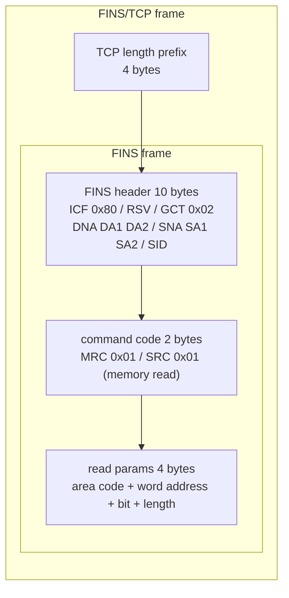

# FINS Driver

`dc3-driver-fins` onboards Omron PLCs into IoT DC3 over the FINS protocol: as a FINS client it actively opens a TCP connection to the PLC, periodically reads values by the memory area and word address configured on each [Point](../introduction/concepts/point), and supports commands that write values back to memory areas. By the end of this page you can onboard an Omron PLC and know exactly how far the current implementation goes.

- **Driver name / code**: `Omron FINS Driver` / `FinsDriver`
- **Type**: `DRIVER_CLIENT` (actively connects to the PLC)

## Protocol background

FINS (Factory Interface Network Service) is the native communication protocol of Omron PLCs, widely used across the CP/CJ/CS series. It partitions PLC memory by purpose into several **Memory Areas**, each addressed in units of one "word" (16 bits); a host accesses data by sending memory read/write command frames carrying a memory-area code plus a word address. FINS can run over UDP, TCP, Ethernet, or Omron's proprietary buses; this driver uses **FINS/TCP**, prepending a 4-byte length prefix to each FINS frame.

In the [four-layer IoT architecture](../foundations/fieldbus), FINS sits at the **network layer**: it defines how devices on the shop floor are addressed, how commands are encoded, and how bytes travel on the link. IoT DC3 normalizes on top of it, translating "read the word at `D100`" into a uniform [PointValue](../introduction/concepts/point-value).

::: tip A few FINS concepts first
**Memory Area**: a region of PLC data partitioned by purpose——`D` (data memory, the most common), `W` (work), `H` (holding), `C` (counter). This driver maps them to FINS area codes: `D`=0x82, `W`=0xB1, `H`=0xB0, `C`=0x83.
**Word Address**: an offset within a memory area in units of one "word" (16 bits), e.g. `D100` is the 100th word of the D area.
**Node/Unit number**: the source/destination addresses used to reach a PLC on the FINS network; for a single direct connection these usually stay at their defaults.
:::

### How one FINS read frame is assembled

The driver uses no third-party protocol library; it assembles FINS frames byte by byte. A request to read 1 word consists of a 4-byte TCP length prefix + a 10-byte FINS header + a 2-byte command code + 4 bytes of read parameters:

The response frame carries a 2-byte **end code** after the FINS header and command code: non-zero means the PLC rejected or errored, and the driver raises a `ReadPointException` accordingly; when it is zero, data starts at byte 14 and is decoded per `dataType` (see the implementation-status note below).

## Attribute configuration

FINS onboarding parameters fall into two groups: which PLC to connect to is set by device-level **driver attributes**; which word each point reads/writes is set by **point/command attributes**. The fields in the three tables below all come from the driver's `application.yml`, and the prose before each table explains what every attribute does and where its value comes from.

### Driver configuration (device-level `driver-attribute`)

When onboarding a FINS PLC, fill these [Attributes](../introduction/concepts/attribute-config) on the [Device](../introduction/concepts/device). `host`/`port` point at the PLC; `sourceNode`/`destNode`/`sourceUnit`/`destUnit` are the source/destination addressing bytes in the FINS header, fine at their defaults for a single direct connection; `timeout` serves as both the TCP connect timeout and the read timeout (`setSoTimeout`).

| Attribute | code | Type | Default | Description |
|---|---|---|---|---|
| Host | `host` | STRING | `127.0.0.1` | PLC host address |
| Port | `port` | INT | `9600` | FINS port (standard 9600) |
| Protocol | `protocol` | STRING | `TCP` | Transport protocol (the driver always uses FINS/TCP) |
| Source Node | `sourceNode` | INT | `1` | FINS source node number |
| Dest Node | `destNode` | INT | `2` | FINS destination node number |
| Source Unit | `sourceUnit` | INT | `0` | FINS source unit number |
| Dest Unit | `destUnit` | INT | `0` | FINS destination unit number |
| Timeout | `timeout` | INT | `5000` | Connect / request timeout (milliseconds) |

### Point configuration (`point-attribute`)

Fill the read target on each acquisition [Point](../introduction/concepts/point). `memoryArea` + `address` together locate one word (e.g. `memoryArea=D`, `address=100` corresponds to Omron's familiar `D100`); `dataType` declares the decoding; `bitPosition` is the bit offset within the word.

| Attribute | code | Type | Default | Description |
|---|---|---|---|---|
| Memory Area | `memoryArea` | STRING | `D` | Memory area, `D`/`W`/`H`/`C` |
| Address | `address` | INT | `0` | Word address within the memory area |
| Data Type | `dataType` | STRING | `UINT16` | `INT16`/`UINT16`/`INT32`/`UINT32`/`FLOAT`/`STRING`/`BCD` |
| Bit Position | `bitPosition` | INT | `0` | Bit offset within the word (unused on the current read path; treated as `0`) |

::: warning The current read path reads exactly 1 word; `dataType` does not decide how many words are read
A read always fetches exactly **1 word (2 bytes)**, regardless of `dataType`. So **only `INT16`/`UINT16` read back correctly**; for `INT32`/`UINT32`/`FLOAT`, `decodeValue` calls `getInt()`/`getFloat()` to read 4 bytes from a 2-byte buffer, triggering a BufferUnderflow, so no value is produced today; `STRING`/`BCD` likewise only receive 2 bytes. These are declared but pending protocol semantics. The driver decodes the returned bytes Big-Endian; the Point's data type ([Point](../introduction/concepts/point)'s `pointTypeFlag`) should match the `dataType` set here.
:::

### Write command configuration (`command-attribute`)

Writable points additionally need the target location and write type on the write command; the field meanings are the same as in the point configuration.

| Attribute | code | Type | Default | Description |
|---|---|---|---|---|
| Memory Area | `memoryArea` | STRING | `D` | Memory area, `D`/`W`/`H`/`C` |
| Address | `address` | INT | `0` | Word address within the memory area |
| Data Type | `dataType` | STRING | `UINT16` | Data type of the written value |

### Acquisition and health scheduling

These cadences are fixed in the `schedule`/`health` sections of `application.yml`; you do not re-enter them on the device:

- **Acquisition cycle**: default cron `0/30 * * * * ?` (reads once every 30 seconds).
- **Custom task**: default cron `0/5 * * * * ?`, but the FINS driver's `schedule()` is an empty implementation——the slot is reserved and currently does nothing.
- **Health / online**: the device health check defaults to cron `0/15 * * * * ?` with a lease timeout of `45 seconds`. The driver decides online status by whether the TCP connection is alive (`socket.isConnected() && !socket.isClosed()`); a dropped connection triggers a reconnect attempt, and a failed reconnect marks the device offline. For the online state mechanism see [Device](../introduction/concepts/device).

## Troubleshooting

::: warning address is a word address, not a region-prefixed string
`address` takes only the numeric offset within the memory area. To read Omron's familiar `D100`, set `memoryArea=D` and `address=100`——do **not** put `D100` as a whole into `address`. The area is specified separately by `memoryArea`. `memoryArea` only recognizes `D`/`W`/`H`/`C`; any other value is silently treated as `D` (0x82).
:::

- **Cannot connect / stuck offline**: first confirm the PLC has FINS/TCP enabled on port `9600` (the driver is TCP-only and does not fall back to UDP). On a failed connection the driver logs `Driver FINS connection failed` and marks the device offline, retrying on the next health-check cycle. Check `host`, network reachability, and whether the PLC limits the number of client connections.
- **Wrong value / BufferUnderflow**: usually `dataType` is set to `INT32`/`UINT32`/`FLOAT`/`STRING`/`BCD`——the current read path takes only 1 word (2 bytes), so only `INT16`/`UINT16` work. Multi-word types are pending implementation; validate the link with a 16-bit type first.
- **Non-zero endCode**: bytes 12–13 of the response frame are the FINS end code; non-zero means the PLC rejected the request (e.g. address out of range, memory area absent, insufficient permission). The driver throws `FINS command failed, endCode=0x...`; look the code up in the FINS manual and verify `memoryArea`/`address` fall within the PLC's actual memory range.
- **Float writes land wrong**: the write command parses `INT32`/`UINT32`/`FLOAT` all via `Integer.parseInt` before writing 4 big-endian bytes, and does **not** encode `12.5` as a float. To write a float, convert the target to its integer bit pattern yourself, or confirm the PLC actually expects an integer.
- **Frequent timeouts**: `timeout` governs both connect and read (default 5000ms). Increase it for a jittery link or a slow PLC; note that any read/write exception actively closes and evicts that device's cached connection, which is rebuilt on next access.
- **Node addressing fails**: FINS scenarios crossing gateways/routers need correct `sourceNode`/`destNode` (the header carries only a 1-byte node number; the network addresses DNA/SNA are fixed at 0). A single direct connection works with the defaults `1`/`2`; for multi-level networks fill in per the on-site FINS routing table.

## How It Lands in IoT DC3

- **dc3.driver.code**: `FinsDriver` (stable routing identifier used for registration and command dispatch; do not change it casually).
- **Read capability**: ✓ implemented——periodic single-word polling, `INT16`/`UINT16` work.
- **Write capability**: ✓ implemented——`INT16`/`UINT16`/`STRING` write correctly; 32-bit/float are encoded as integers (see Troubleshooting above).
- **Subscribe/report capability**: — not provided. FINS is active-poll only; the driver does not listen for device pushes, consistent with the [Driver Capability Matrix](./matrix).

::: warning Multi-word data types are not yet implemented
The read path always reads exactly 1 word; the `INT32`/`UINT32`/`FLOAT`/`STRING`/`BCD` decode branches are written but cannot produce correct values because only 2 bytes are fetched, and the write path encodes 32-bit/float as integers. The **usable range today is 16-bit integers (plus STRING writes)**; multi-word types are designed but pending, so do not treat them as supported.
:::

::: tip One driver instance can serve multiple PLCs
A single FINS driver process can serve multiple devices, each holding its own TCP connection (cached by device ID in `clientMap`). Multiple PLCs are distinguished by their own `host` and `destNode`; when a device is deleted or updated, the driver destroys the matching connection via a metadata event.
:::

### Minimal onboarding example

Onboard an Omron PLC at IP `192.168.1.20:9600` and acquire one 16-bit integer at `D100`:

1. Create a [Device](../introduction/concepts/device) with `Omron FINS Driver`, set driver attributes `host=192.168.1.20` and `port=9600`, and leave the rest (`protocol`, node/unit numbers, `timeout`) at their defaults.
2. Add a [Point](../introduction/concepts/point) (`pointTypeFlag=INT`, `READ_ONLY`) to the [Profile](../introduction/concepts/profile) bound to the device, with point attributes `memoryArea=D`, `address=100`, `dataType=INT16`.
3. Start the driver; within 30 seconds the `D100` value appears in [PointValue](../introduction/concepts/point-value).

## Further reading

- [Driver Overview](./index) — pick a protocol by category and open its driver page
- [Driver Capability Matrix](./matrix) — read/write/subscribe capabilities across drivers
- [Device Onboarding](../operation/device-onboarding) — a full onboarding walkthrough
- [Fieldbuses & Protocols](../foundations/fieldbus) — the network layer FINS belongs to: addressing, byte order, polling model
