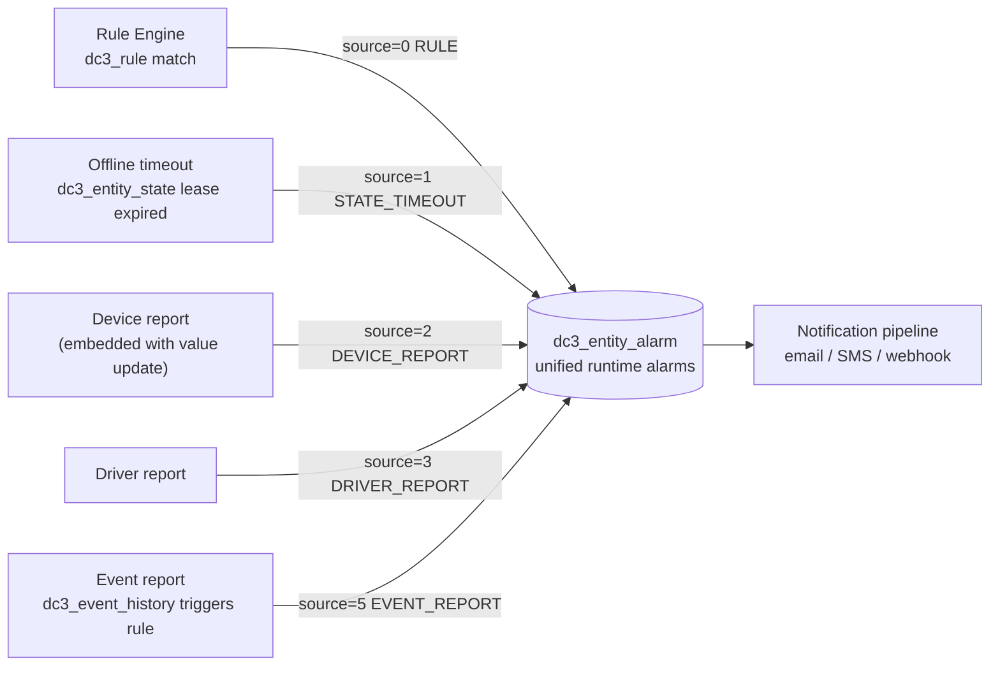
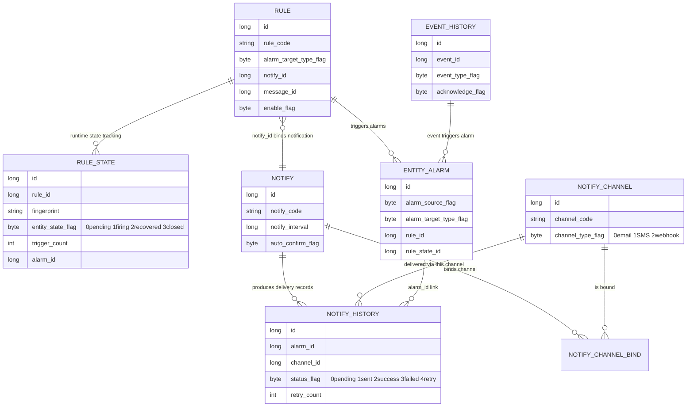
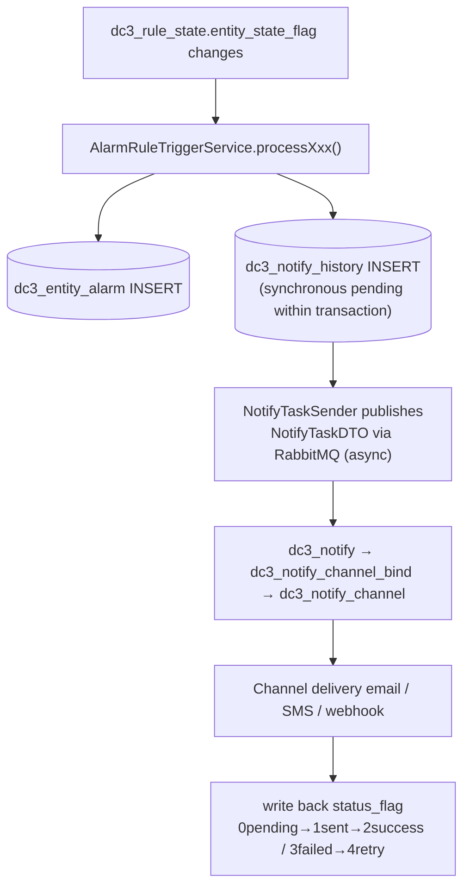

# Alarms and Notifications

IoT DC3 folds "something went wrong" and "who needs to know" into a single runtime alarm table and one notification
pipeline. This page covers how the five alarm sources all land in `dc3_entity_alarm`, how the three frontend alarm views
filter that same table, and how notifications go out over email, SMS, or webhook once a rule fires.

> You are here: you've already [onboarded a device](./device-onboarding) with data flowing, and now want to configure
> alarms and notifications for anomalies. To see where the data comes from, revisit
> the [Data Plane](../architecture/data-plane).

## Why one table and one pipeline

Things fail from many directions: a rule trips a threshold, a device or driver heartbeat times out, a device reports a
fault, a driver reports an anomaly, or a reported event triggers a rule. If every source had its own table and its own
delivery path, operations teams would juggle multiple pages to piece things together. IoT DC3 takes a different route: *
*every runtime alarm, no matter its source, lands in `dc3_entity_alarm`**. Two flags tell them apart —
`alarm_source_flag` (where it came from) and `alarm_target_type_flag` (which entity it targets) — and composite indexes
make views like Driver / Device / Point Alarm fast to filter.

That table pairs with a rule → state machine → notification pipeline. Together they are the two pillars of the alarm
subsystem: the table is the **record of fact**, the pipeline is the **trigger and delivery**.

## How the five sources flow into one table

All five alarm sources write to `dc3_entity_alarm`; only the flag value differs. The values come from
`AlarmSourceTypeEnum` — note that `EVENT_REPORT=5` and `SYSTEM=4` (5 is reserved for persistence compatibility and sits
after 4 in the enum):



`alarm_source_flag` (where it came from) and `alarm_type_flag` (what happened) are two independent dimensions — don't
conflate them:

- **Source `alarm_source_flag`**: `0=RULE`, `1=STATE_TIMEOUT`, `2=DEVICE_REPORT`, `3=DRIVER_REPORT`, `4=SYSTEM`,
  `5=EVENT_REPORT`.
- **Type `alarm_type_flag`**: `0=RULE` (rule match), `1=OFFLINE` (heartbeat timeout), `2=FAULT` (internal device fault),
  `3=STATE_FLIP` (entity state flip), `4=REPORT` (external event report).

### Three frontend views, one table

The three alarm pages under Settings all query `dc3_entity_alarm` (via `POST /api/v3/data/dashboard/alert/page`) and
differ only by the `source` string in the request body:

| View         | Route Path               | Filter Parameter |
|--------------|--------------------------|------------------|
| Driver Alarm | `/settings/alarm/driver` | `source=driver`  |
| Device Alarm | `/settings/alarm/device` | `source=device`  |
| Point Alarm  | `/settings/alarm/point`  | `source=point`   |

Filtering stays fast thanks to two composite indexes:
`idx_entity_alarm_source_time (tenant_id, alarm_source_flag, create_time DESC)` serves paging by source and time, and
`idx_entity_alarm_target (tenant_id, alarm_target_type_flag, entity_id, create_time DESC)` serves paging by entity
dimension. Both lead with `tenant_id`, so alarm data is strictly isolated per tenant.

## How rules, the state machine, and notifications fit together

Writing to `dc3_entity_alarm` only logs an entry. To make alarms "fire repeatedly without flooding, detect recovery, and
reach the right people," the pipeline does the work: `dc3_rule` (rule definition) → `dc3_rule_state` (runtime state
machine) → `dc3_notify` (notification config) → `dc3_notify_channel` (channel) → `dc3_notify_history` (delivery audit).
The diagram below shows how these tables relate to `dc3_event_history`. These are logical associations — linked by id
columns, with no foreign-key constraints in the database:



### Trigger state machine: pending → firing → recovered → closed

`dc3_rule_state` holds the runtime state of each rule for each entity (uniquely keyed by `fingerprint`), and
`entity_state_flag` is constrained by `CHECK (entity_state_flag BETWEEN 0 AND 3)`:

- `0=pending` awaiting trigger, `1=firing`, `2=recovered`, `3=closed`.
- On a state flip it records `first_trigger_time` / `last_trigger_time` / `last_recover_time` / `last_notify_time` plus
  `trigger_count`, and backfills the current alarm's `alarm_id`. So one anomaly firing continuously just increments the
  count instead of spamming — and recovery is still detected.

### From trigger to delivery

After a rule matches, alarm writing and notification sending run in this order. The pending record in
`dc3_notify_history` is persisted synchronously inside the transaction; only then does dispatch happen asynchronously
over RabbitMQ, with the status written back afterward:



`dc3_notify_channel.channel_type_flag` is constrained by `CHECK (channel_type_flag BETWEEN 0 AND 2)`, so `0=email`,
`1=SMS`, `2=webhook`. `dc3_notify_history.status_flag` is constrained by `CHECK (status_flag BETWEEN 0 AND 4)`, covering
the five states pending / sent / success / failed / retry — failures can be retried and increment `retry_count`.

## Event history vs runtime alarms: don't conflate them

`dc3_event_history` and `dc3_entity_alarm` come up together, but they aren't the same thing. Event history is the **raw
log of events a device reports on its own** — a device sends an `EventReportDTO`, which `EventReportReceiver` writes to
`dc3_event_history`. A runtime alarm is the **unified record produced when any source triggers**. The link between them:
an event report *may* trigger rule evaluation, which produces a runtime alarm with `alarm_source_flag=5` — but the event
history itself stays an independent log.

| Dimension         | `dc3_event_history` (Event History)                    | `dc3_entity_alarm` (Runtime Alarm)                                             |
|-------------------|--------------------------------------------------------|--------------------------------------------------------------------------------|
| Definition source | Event definitions in the template (`dc3_event` table)  | Alarms produced by any rule/state trigger                                      |
| Initiator         | Device reports via `EventReportDTO`                    | Rule engine, state timeout, device/driver/event report                         |
| Storage table     | `dc3_event_history` (raw log)                          | `dc3_entity_alarm` (unified record)                                            |
| State tracking    | `acknowledge_flag` (0 unacknowledged / 1 acknowledged) | `confirm_flag` (0/1) + `dc3_rule_state` lifecycle                              |
| Lifecycle         | Created once, acknowledged afterward                   | Linked to `dc3_rule_state`, tracking trigger_count, first/last times, recovery |

`dc3_event_history` also carries its own classification fields: `event_type_flag` (`0=info` / `1=alert` / `2=fault` /
`3=lifecycle`) and `event_level_flag` (`0=LOW` / `1=MEDIUM` / `2=HIGH` / `3=CRITICAL`). Each report is uniquely
identified by `record_id` (UUID).

## Hands-on: query and acknowledge

To query a tenant's alarms, hit the data center's dashboard endpoint. Below is the real path and the request/response
shape, with example values marked as such.

::: code-group

```bash [curl query alarms]
# Query runtime alarms via the gateway (8000), filtering by source/type/confirmation state
# The three X-Auth-* values are obtained after logging in via POST /api/v3/auth/token/generate
curl -X POST http://localhost:8000/api/v3/data/dashboard/alert/page \
  -H 'Content-Type: application/json' \
  -H 'X-Auth-Tenant: <example: your tenant>' \
  -H 'X-Auth-Login: <example: your login name>' \
  -H 'X-Auth-Token: <example: token returned on login>' \
  -d '{
        "current": 1,
        "size": 20,
        "source": "device",
        "alarmTypeFlag": 0,
        "confirmFlag": 0
      }'
```

```json [response shape (example)]
{
  "code": "R200",
  "data": {
    "current": 1,
    "size": 20,
    "total": 3,
    "records": [
      {
        "id": "example-snowflake-ID",
        "source": "device",
        "sourceId": "example-source-entity-ID",
        "pointId": "example-point-ID",
        "alarmTypeFlag": 0,
        "confirmFlag": 0,
        "message": "example-alarm-description",
        "createTime": "2026-06-22T10:00:00"
      }
    ]
  }
}
```

:::

::: tip The three views are just one source parameter
The Driver / Device / Point Alarm pages are the same endpoint with a different `source` (`driver` / `device` / `point`).
To replicate them with curl, you only switch that one field.
:::

## Constraints and boundaries

::: warning Alarm levels are P0–P3
`alarm_level_flag` takes `0=P0 … 3=P3`, where 0 is the highest priority — mind the direction when sorting or filtering.
:::

::: danger Alarms are strictly isolated by tenant
`dc3_entity_alarm`, `dc3_rule`, `dc3_rule_state`, and `dc3_notify*` all carry `tenant_id`, and every index leads with
`tenant_id`. When adding queries or cache keys, preserve tenant scope — never read across tenants or drop `tenant_id`.
:::

::: info Table associations are logical, with no foreign-key constraints
`rule_id`, `rule_state_id`, `alarm_id`, `notify_id`, `channel_id`, and the like are logical associations on id columns —
there are no FK constraints in the database. On delete or cleanup, keep consistency at the business layer; the DB does
not cascade.
:::

::: info Source code is authoritative
The flag values and constraints on this page come from `AlarmSourceTypeEnum` / `AlarmTargetTypeEnum` and the `CHECK`
constraints in `03-iot-dc3-data.sql` (repository path `dc3/dependencies/postgres/initdb/03-iot-dc3-data.sql`). Field
names match the DO models and SQL; the concrete notification triggering and async dispatch live in service classes like
`AlarmRuleTriggerService`.
:::

## Further reading

- [Device Onboarding](./device-onboarding) — the prerequisite for alarms: get the device in and values flowing first
- [Data Plane](../architecture/data-plane) — how device values are persisted, the data source for alarm rule evaluation
