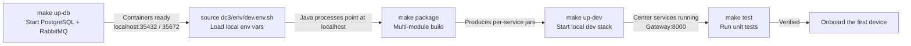

# Local Development from Source

This page walks you through running IoT DC3 from source: bring up PostgreSQL and RabbitMQ with Compose, point the Java
processes at your local ports, build, start, and run the tests. By the end you'll have the center services running on
your own machine, and you'll understand why startup has an order and why local processes can't read the root `.env`
directly.

> You are here because you want to develop or debug from source. If you just want to click through the shortest
> end-to-end loop once, see [First Device: End to End](./first-device). To understand how the services fit together,
> see [System Architecture Overview](../architecture/).

## Prerequisites

Local development is "semi-containerized": the infrastructure (database, message broker) runs in containers, while the
center services run as local Java processes, so you can set breakpoints and hot-restart freely. You'll need a JDK and
build toolchain plus a container runtime.

- **JDK 21** — the platform requires Java 21. Compiling on a lower version fails outright.
- **Maven 3.9+** — the repository ships `.mvn/settings.xml` and a parallel-build configuration; use it for multi-module
  packaging.
- **pnpm** — both the `iot-dc3-web` frontend and `dc3-cli` use pnpm (not npm or yarn). Skip this for backend-only work.
- **Podman** — every container operation in this repository uses `podman` (`make` defaults to `podman compose`).

## Why These Five Steps

The shortest path to a running local stack is five steps. Each step produces a concrete artifact, and each depends on
the previous one: you need the infrastructure up before you can load the environment variables that point at it; you
need the jars built before you can start the dev stack; and only once the services are up does it make sense to run
tests.



Each step is expanded below, with both what to do and how to verify it.

## Step 1: Start the Infrastructure

`make up-db` brings up the db stack with Compose — PostgreSQL and RabbitMQ. On first startup, PostgreSQL runs the initdb
scripts in filename order (extensions, common, auth, data, manager, history, agentic) and creates all the tenant, user,
menu, and metadata tables. So the first launch is slower than the ones that follow.

::: code-group

```bash [Global Registry]
make up-db
```

```bash [China Mainland Registry]
make up-db-cn
```

:::

The ports the containers publish to the host are fixed: PostgreSQL `localhost:35432`, RabbitMQ AMQP `localhost:35672` (
inside the containers they stay `5432` / `5672`). To verify:

```bash
podman ps                          # you should see dc3-postgres and dc3-rabbitmq running
podman exec dc3-postgres psql -U dc3 -d dc3 -c '\dt dc3_auth.*'   # if it lists the auth tables, it's ready
```

::: tip Optional Observability Stack
When you need EMQX, ELK, Prometheus, or Grafana, run `make up-optional`. Local core development doesn't need them. It's
best to start them only after the center services are stable, so you don't spin up too many containers at once.
:::

## Step 2: Load the Local Environment Variables

```bash
source dc3/env/dev.env.sh
```

This exports the development defaults into the current shell — the database, RabbitMQ, MQTT, and gRPC hosts, among
others. The part that matters here is pointing `POSTGRES_HOST=localhost`, `POSTGRES_PORT=35432`,
`RABBITMQ_HOST=localhost`, `RABBITMQ_PORT=35672`, and `CENTER_AUTH_HOST/MANAGER_HOST/DATA_HOST/AGENTIC_HOST=localhost`
at your local machine, so the local Java processes can reach the container ports published in Step 1.

::: warning .env Is for Compose Interpolation Only — Not for Local Java Processes
The root `.env` is Compose-specific. It's only used for variable interpolation when `docker compose` parses its files (
image registry, image tag, published ports) and is **not** injected into the Java processes you start locally. When you
run from source on your machine, you must `source dc3/env/dev.env.sh`. Otherwise the services fall back to in-container
DNS names like `dc3-postgres:5432`, which your host can't resolve, and the connection fails immediately.

In JetBrains IDEA, use the EnvFile plugin to load `dc3/env/dev.env` (the variant without `export`), or paste its
key-value pairs into the run configuration's environment variables.
:::

To verify: `echo $POSTGRES_PORT` should print `35432`.

## Step 3: Build

```bash
make package                       # equivalent to mvn -s .mvn/settings.xml clean package
```

The repository already has parallel builds, enforced JDK 21 / Maven 3.9+, and Spring Java Format validation set up. The
build produces the executable jar for each service module (for example, `dc3-gateway/target/dc3-gateway.jar`). This step
only validates compilation and packaging — it doesn't depend on the containers from Step 1.

::: tip Fast Compile Check
If you only want to confirm your changes compile, skip the full package and run
`mvn -s .mvn/settings.xml -q -DskipTests compile`, which is much faster.
:::

## Step 4: Start the Dev Stack

With the jars built, bring the center services up with the dev stack. `make up STACK=dev` (or the shorthand
`make up-dev`) starts the Gateway, Auth, Manager, Data, Agentic, and drivers in dependency order.

::: code-group

```bash [Global Registry]
make up-dev
```

```bash [China Mainland Registry]
make up-dev-cn
```

:::

Why the ordering? Because the services depend on each other:

- **The Auth center must be ready first** — it holds the tenant, user, RBAC, and token-issuing logic, and every other
  service plus the gateway authenticate against it.
- **The Gateway is the sole external HTTP entry point (8000)** — it aggregates the routes of Auth/Manager/Data/Agentic,
  extracts the auth headers, and injects the principal context. It can only forward correctly once the backend centers
  are reachable, so it comes after its dependencies.

::: details Full Startup Order and Ports
In distributed mode, calls go over gRPC by default (`DC3_FACADE_MODE=grpc`, already set in dev.env). Service ports:

| Service                                       | HTTP | gRPC |
|-----------------------------------------------|------|------|
| Gateway / `dc3-gateway` (sole external entry) | 8000 | —    |
| Auth Center / `dc3-center-auth`               | 8300 | 9300 |
| Manager Center / `dc3-center-manager`         | 8400 | 9400 |
| Data Center / `dc3-center-data`               | 8500 | 9500 |
| Agentic Center / `dc3-center-agentic`         | 8600 | —    |

Only the Gateway (the user entry) and listening-virtual's TCP 6270 / UDP 6271 (the device entry) are mapped to the host;
all other backend ports are internal.
:::

To verify: once the stack is up, run the login golden path against the gateway. Login takes two steps — first fetch the
salt, then exchange the salt-hashed password for a 12-hour access token:

```bash
# 1) Fetch the salt (public endpoint; use within 5 minutes)
curl -s -X POST http://localhost:8000/api/v3/auth/token/salt \
  -H 'Content-Type: application/json' \
  -d '{"tenant":"default","name":"dc3"}'      # returns the salt string (sample value)

# 2) Hash the password with the salt and exchange it for a token (public endpoint, access token valid for 12 hours)
curl -s -X POST http://localhost:8000/api/v3/auth/token/generate \
  -H 'Content-Type: application/json' \
  -d '{"tenant":"default","name":"dc3","salt":"<salt from the previous step>","password":"<salt-hashed password>"}'
```

Once you have the token, every protected endpoint goes through the gateway with the three auth headers `X-Auth-Tenant`,
`X-Auth-Login`, and `X-Auth-Token`. The full "create driver → create profile → create device → read/write point" loop is
covered in [First Device: End to End](./first-device).

## Step 5: Run the Tests

```bash
make test                          # unit test suite
```

For higher-level verification: `make test-it` runs the integration tests (needs a container runtime for Testcontainers),
and `make test-e2e` runs the backend E2E suite. For day-to-day development, run `make test` after a change to guard
against unit-level regressions.

## Common Pitfalls

- **Starting the services without `source dev.env.sh`** — the most common one. The local Java processes never see
  `localhost:35432` / `35672`, so they try the in-container DNS names and fail. Every new shell needs to `source`
  again — the variables only live in the current shell.
- **Podman not running** — if `make up-db` says it can't reach the container runtime, first check the `podman` daemon or
  machine is started (on macOS run `podman machine start`), then confirm with `podman ps`.
- **Ports in use** — startup fails when `35432` / `35672` / `8000` and friends are taken by other processes. Free the
  occupying process, or override the Compose published ports in the root `.env` (this only affects the container side);
  override the local process ports with the service-level environment variables.
- **First database startup is slow or tables are incomplete** — PostgreSQL runs initdb only on the first startup of an
  empty volume. If it was interrupted partway and the tables are incomplete, reset the volume and start over:
  `make reset STACK=db` (requires `CONFIRM_RESET_VOLUMES=true`, which deletes data — use with care).

::: danger Production Secrets Must Be Replaced
The `DC3_SECURITY_KEY` and `AUTH_HMAC_SECRET` in `dev.env.sh` are development defaults. In the `pre`/`pro` environments,
if `AUTH_HMAC_SECRET` is empty or still equals the default `io.github.pnoker.dc3`, the Gateway fails fast and refuses to
start. That's fine for local development, but before you go live you must replace it with an environment-specific random
value.
:::

## Further Reading

- [Environment Variables Explained](./environment) — the boundary between `.env` and `dev.env(.sh)`, and the scope and
  default value of each variable
- [First Device: End to End](./first-device) — the shortest loop from creating a driver to reading and writing points
  after login
- [System Architecture Overview](../architecture/) — how the five center services divide responsibilities, and how data
  and commands flow
