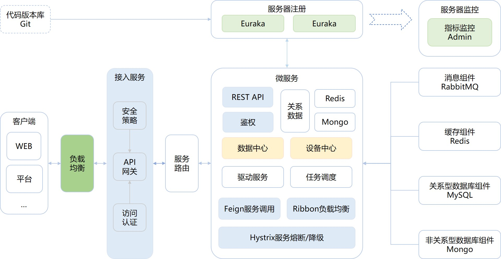

	 
  <a href='https://gitee.com/pnoker/iot-dc3/stargazers'></img></a>
	<a href='https://gitee.com/pnoker/iot-dc3/members'></img></a>
	 
	
	
	
		
	 <strong>DC3是基于Spring Cloud的开源可分布式物联网(IOT)平台,用于快速开发、部署物联设备接入项目,是一整套物联系统解决方案。 IOT DC3 is an open source, distributed Internet of Things (IOT) platform based on Spring Cloud. It is used for rapid development of IOT projects and management of IOT devices. It is a set of solutions for IOT system.</strong>

------

### DC3 架构设计

 

#### DC3 模块划分，四层架构

 * [x] 驱动层：用于提供标准或者私有协议连接物理设备的 `SDK`，负责南向设备的数据采集和指令控制，基于 `SDK` 可实现驱动的快速开发；
 * [x] 数据层：负责设备数据的收集和入库，并提供数据管理接口服务；
 * [x] 管理层：用于提供微服务注册中心、设备指令接口、设备注册与关联配对、数据管理中心，是所有微服务交互的核心部分，负责各类配置数据的管理，并对外提供接口服务；
 * [ ] 应用层：用于提供数据开放、任务调度、报警与消息通知、日志管理等，具备对接第三方平台能力。

#### DC3 驱动、测点、设备分层

#### DC3 功能设计，定位目标

 * [x] 可伸缩：水平可伸缩的平台,构建使用领先的 `Spring Cloud` 开源技术；
 * [x] 容错：没有单点故障弱,集群中的每个节点是相同的；
 * [x] 健壮和高效：单一服务器节点可以处理甚至数百成千上万的设备根据用例；
 * [x] 可定制：添加新的设备协议,并注册到服务中心；
 * [x] 跨平台：使用 `Java` 环境可异地、分布式多平台部署；
 * [x] 自主可控：私有云、公有云、边缘部署；
 * [X] 完善性：设备快速接入、注册、权限校验；
 * [ ] 安全(开发中...)：数据加密传输；
 * [ ] 多租户(开发中...)：命名空间，多租户化；
 * [X] 云原生：Kubernetes；
 * [x] 容器化：Docker。

### DC3 技术实现 

`DC3` 平台是基于 `Spring Cloud` 架构开发的,是一系列松耦合、开源的微服务集合。
微服务集合由4个微服务层和两个增强的基础系统服务组成,提供从物理域数据采集到信息域数据处理等一系列的服务。

[`Spring Cloud Netflix`](https://cloud.spring.io/spring-cloud-netflix)、[`Spring Cloud Gateway`](https://cloud.spring.io/spring-cloud-gateway)、[`Spring Cloud Security`](https://cloud.spring.io/spring-cloud-security)、[`Spring Cloud OpenFeign`](https://cloud.spring.io/spring-cloud-openfeign) 等微服务模块。

