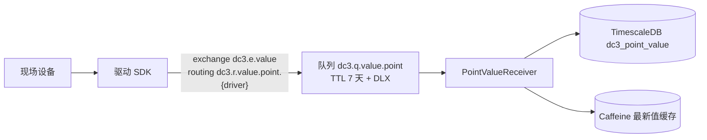

# IoT DC3 Docs Overhaul — 统一写作契约（Authoring Contract）

> 全站重构期间**所有页面**（无论由我直接撰写还是由子 agent 产出）必须遵守本契约，以保证**风格统一、可读、专业、图文并茂、事实准确**。配套：`2026-06-22-docs-overhaul-design.md`（设计/IA/图表清单）、`2026-06-22-docs-overhaul-dossier.md`（架构事实底座）、`2026-06-22-docs-overhaul-factspack.md`（驱动/API/env/告警/Agentic 事实）、`2026-06-22-docs-overhaul-presentation.md`（行业基准）。

## 0. 语言与受众

- **语言**：简体中文为主。技术标识符、命令、类名、表名、路由键、协议名、环境变量、HTTP 路径**保留原文**（如 `dc3-center-data`、`PointValueBO`、`dc3.e.value`、`AUTH_HMAC_SECRET`、`POST /point_command/write`）。
- **双视角**：每页同时服务**产品/使用者**（这是什么、给谁、解决什么、怎么用）与**架构/开发者**（如何构成、链路如何流转、为何这样设计、有何约束）。按页面定位调整两者比重。
- **读者画像**：评估者、设备接入/运维、后端开发、贡献者。页面开头点明"这页写给谁、读完能做什么"。

## 1. 页面统一骨架

每个普通文档页遵循以下结构（按页情况增减小节，但顺序与风格一致）：

```md
# <页面标题>

<1–3 句导语：这页是什么 + 读完你能做到什么。不堆形容词，不用"本章将介绍…"套话。>

<可选：一句 "你在这里 / 下一步" 的路径提示，链接到上一步/下一步页面。>

## <概念/为什么>  ← 先用散文建立心智模型，回答"为什么存在/解决什么"
…叙事…

## <如何工作/结构>  ← 配 1 张 mermaid 图（见 §2），图前后有正文呼应；图示结构，文述细节
```mermaid
…
```
…解释图中关键节点/链路，给出代码/表名/路由键等事实锚点…

## <怎么做/示例>  ← 可运行示例：真实命令、真实 curl（用 facts-pack 的黄金路径合约）、真实 JSON 形态
…

## <约束与边界>  ← 诚实标注硬约束、失败语义、已实现/受开关/未实现（见 §4）
…

## 延伸阅读  ← 3–6 条相关页面交叉链接（相对路径）
- [<标题>](<相对路径>) — <一句为什么去读>
```

- **节标题**用动机化、信息化措辞（"位号值如何落库"优于"数据存储"）。
- **段落优先于表格**：先有建立认知的散文，表格只作参考资料；严禁"纯平行表格开篇"。
- **首屏可读**：H1 后第一屏要让读者知道自己在哪、能得到什么。

## 2. Mermaid 技术插图规范

- 用 ` ```mermaid ` 代码块。每条关键链路/状态机/实体关系**至少一张图**；图就近放在解释它的小节内。
- **类型对应**（见设计 §7 / dossier §E 的 D 编号）：
  - 时序/调用链 → `sequenceDiagram`
  - 状态机（命令生命周期、驱动生命周期、设备在线态）→ `stateDiagram-v2`
  - 拓扑/分支/数据流/管线 → `flowchart`（方向 `LR` 或 `TB`）
  - 实体关系（领域模型、告警表、principal）→ `erDiagram`
  - 分层/类结构（DO/BO/VO、SPI 组合、PointValue 变换）→ `classDiagram`
- **标签**：中文叙述 + 保留技术标识符。示例：`Data[数据中心 dc3-center-data]`、`GW->>Driver: 下发命令 dc3.e.point_command`。
- **语法稳健性（避免渲染失败）**：
  - 节点文字含**英文括号 `()`、冒号 `:`、斜杠 `/`、逗号、`#`** 等时，**必须**用引号包裹：`A["读/写 (rwFlag)"]`。
  - 多行用 `<br/>`：`A["位号 Point<br/>rwFlag=READ_WRITE"]`。
  - `erDiagram` 关系语法：`PROFILE ||--o{ POINT : contains`，实体名用大写、ASCII；中文放在属性注释或正文说明。
  - `stateDiagram-v2` 状态名用 ASCII（`PENDING`、`SENT`），中文写在转移标签或 `note`。
  - `classDiagram` 类名 ASCII，中文放成员或 `note`。
  - `sequenceDiagram` participant 用短名（`Client`、`GW`、`Data`、`Driver`），中文在消息文字里。
  - 不使用需要额外引擎/不稳定的图类型（mindmap、architecture-beta、timeline 等），统一用上面 5 类。
- **可读性**：单图节点控制在 ~12 个以内；复杂链路用 `subgraph`/`box` 分组或拆成两张图。优先 `LR` 宽图（站点正文宽度足够，且容器可横向滚动）。
- 图**不重复**正文：图给结构与时序，正文给数值/字段/为什么。
- 站点已配品牌绿主题（浅色）与强制暗色（深色），**不要**在单图里手写 `%%{init}%%` 颜色，保持全站统一。

## 3. VitePress 排版元素（用于"格式优美"）

统一使用以下原生能力，不引入自定义组件：

- **提示容器**：
  - `::: tip` 实用提示 / 最佳实践
  - `::: info` 中性补充说明
  - `::: warning` 易错点、需要注意
  - `::: danger` 硬约束、危险操作、生产必须项（如 HMAC 生产 fail-fast、写失败不回显）
  - `::: details 展开标题` 折叠次要细节/长清单/完整字段表
- **代码组** `::: code-group`：同一操作的多种方式并列（如 `curl` 与 `dc3` CLI；`make` 与 `podman compose`）。每个代码块标题用语言+用途：` ```bash [curl] ` / ` ```bash [dc3 CLI] `。
- **代码块**：命令可复制、可直接跑；展示真实路径与参数；输出/响应给真实 JSON 形态（字段来自 facts-pack；示例值标注为示例）。
- **表格**：仅作参考资料，前面必有散文。表头信息化。
- **Emoji**：克制使用，仅在首页 features 等处点缀；正文不滥用。
- **链接**：站内用相对路径（`../architecture/data-plane`，`cleanUrls` 已开，省略 `.md`）；指向源码用 GitHub 仓库路径文字描述（不写本地绝对路径）。

## 4. 诚实标注：已实现 / 受开关 / 未实现

凡涉及 AI/MCP/外部身份/可选能力，必须如实区分（依据 facts-pack 的实现状态表）：

- 已实现 → 正常陈述。
- 受开关/默认关闭 → `::: warning` 标注开关名与默认值（如 `AGENTIC_MEMORY_SCHEMA_INIT` 默认 `never`，首次需 `always`；工具调用 `AGENTIC_TOOL_CALLING_ENABLED` 默认 true 但可关）。
- 未实现/设计中 → `::: info` 明示"设计已规划、尚未实现"（如外部身份 `dc3_identity_provider` 表已建但登录端点关闭；MCP `resources/prompts` 未实现；`tools/list_changed` 事件推送未实现）。

硬约束用 `::: danger` 直说，不软化：HMAC 在 `pre/pro` 且密钥为空或等于默认值时 fail-fast；`num_value` 可空（聚合需 `IS NOT NULL`）；写命令失败 `responseValue=null` 不回显；`dc3.driver.code` 为稳定路由标识不可随意改；`PointCommandDTO.expireAt` 默认 `now+10s`。

## 5. 事实来源与核验（不得编造）

1. 先读对应参考：架构/链路 → dossier §B；驱动/API/env/告警/Agentic → factspack 对应小节；表达方式 → presentation。
2. **写前就近核对源码**：用引用里的 `path:line` 打开真实文件确认（尤其数值、枚举、字段、路由键、默认值）。不照搬、不臆测。
3. 已核验关键事实（直接采用）：initdb 为 **7** 个脚本 `00–06`；`PointCommandTypeEnum` = `READ(0)/READ_BATCH(1)/WRITE(2)/WRITE_BATCH(3)/CONFIG(4)`；Agentic 内置工具 **10** 个；Auth 分布式默认 facade=`grpc`；驱动 **28** 个；登录是 `POST /token/salt` 取盐 + `POST /token/generate` 取 token（12h），鉴权头 `X-Auth-Tenant/X-Auth-Login/X-Auth-Token`。
4. 拿不准且无法核实 → 用中性表述并在页内 `::: info` 标注"以代码为准"，不要编造确定结论。

## 6. 统一术语表（全站一致）

| 中文 | 英文/标识 | 说明 |
|---|---|---|
| 驱动 | Driver / `dc3-driver-*` | 协议适配实例 |
| 模板 | Profile | 设备能力模板（含 Point/Command/Event） |
| 设备 | Device | 绑定一个 Profile 与一个 Driver 的实例 |
| 位号 | Point | 测点；读写由 Point 的 `rwFlag` 决定 |
| 位号值 | PointValue | 采集到的实时/历史值（统一用"位号值"，勿用"点位值/测点"） |
| 网关 | Gateway / `dc3-gateway` | 唯一对外 HTTP 入口（8000） |
| 鉴权中心 | Auth Center / `dc3-center-auth` | 认证/租户/RBAC/OAuth |
| 管理中心 | Manager Center / `dc3-center-manager` | 元数据管理 |
| 数据中心 | Data Center / `dc3-center-data` | 点位值与命令分发 |
| 智能中心 | Agentic Center / `dc3-center-agentic` | LLM/工具调用 |
| 租户 | Tenant / `tenantId` | 隔离边界 |
| 属性 | Attribute | 驱动协议层配置项（来自驱动 `application.yml`） |
| 配置 | Config | 设备实例层为属性填的具体值 |

- 中心服务首次出现给"中文名 + 标识"，后续可用其一，保持一致。
- 不要混用"点位/测点/位号"——统一"位号(Point)"。

## 7. 禁止清单（Don'ts）

- ❌ 纯平行表格开篇、无叙事的"概念/说明/来源"三列堆叠。
- ❌ 用 ` ```text ` 的 ASCII 箭头当流程图（一律 mermaid）。
- ❌ "强大/灵活/企业级/一站式"等无支撑的营销形容词。
- ❌ 占位符示例（`temperature/host/port` 泛泛而谈）——用 virtual 驱动黄金路径的真实例子。
- ❌ 暴露/链接 `superpowers/` 内部资料；不借用其草稿语气。
- ❌ 把"未实现/受开关"写成"已支持"。
- ❌ 每页深度忽高忽低；每页都要有导语、至少一张图（除纯清单/社区页）、延伸阅读。
- ❌ 写本地绝对路径；指向源码用 GitHub 仓库相对路径文字。

## 8. 标准页骨架示例（节选，供对齐风格）

```md
# 数据平面：位号值如何从设备落库

设备侧采到的原始寄存器值，要经过驱动归一、消息总线、数据中心，最终写入时序库并对外可查。这页讲清这条链路的每一跳、用到的交换机与队列、以及哪些是异步、哪些有重试。

> 你在这里：已[接入一个设备](../operation/device-onboarding)、想理解数据怎么流。下一步可看[命令平面](./command-plane)。

## 一条值的旅程
驱动把一次采集封装为 `PointValue`，经 `DriverSenderService.pointValueSender()` 发往 RabbitMQ……



数据中心 `PointValueReceiver` 以 prefetch=100、并发 4–32 消费……

::: danger 注意 num_value 可空
`dc3_point_value.num_value` 对非数值载荷为 `NULL`，做聚合时必须 `num_value IS NOT NULL`，否则结果偏差。
:::

## 延伸阅读
- [命令平面](./command-plane) — 反向的读写命令如何下发与回执
- [领域模型](./domain-model) — Point / PointValue 的字段与变换
```
