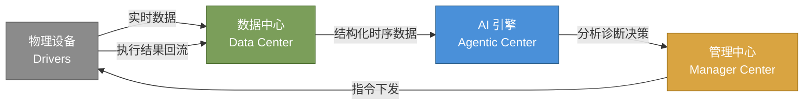

# IoT DC3：AI 时代的 IoT 平台，为什么需要重新定义？

> 状态: 这是一份项目定位和对外叙事草案，保留在 `Superpowers` 中供维护者打磨表达。公开 README 和文档首页应使用更克制、可验证的描述。

过去十年，IoT 平台的核心命题是"把设备连上来"。这个命题已经解决了。Modbus、MQTT、OPC UA、PLC S7——协议适配不再稀缺，市面上能连设备的平台太多了。

AI 时代真正的瓶颈转移到了两个更深的问题上：

**数据困在设备里，AI 吃不到**
设备数据散落在各个网关、PLC、SCADA 里，格式各异、时序混乱、没有语义标注。训练一个产线异常检测模型，80% 的时间花在清洗和对接上，而不是建模。

**AI 只能看，不能动**
大多数 IoT 平台的 AI 方案长这样：数据流到一个外挂的分析服务 → 生成一份报表 → 人工看完 → 再去另一个系统手工改参数。AI 只能"
建议"，不能"行动"。

IoT DC3 要解决的就是这两个问题。它不是又一个能连设备的平台，而是一个**以 AI 可消费的方式组织数据、以 AI 可闭环的方式连接物理世界
**的调度中枢。

---

## 三层叙事：Connects → Collects → Orchestrates

### 第一层：Connects（设备连接，入场券）

设备接入是基座，不是差异点。IoT DC3 提供 SDK 驱动的协议适配层，覆盖 Modbus TCP、MQTT、OPC DA/UA、PLC S7、CoAP
以及虚拟驱动，支持南向数据采集和北向指令执行。

这一层市面上大部分平台都能做，不再展开。

### 第二层：Collects（以 AI 可消费为标准组织数据）

这一层是目前最大的断层。

设备数据天然是"脏"的——采样频率不一致、单位不统一、缺失值没有标记、点位名称是 PLC 工程师随手写的编号。直接把这些原始数据喂给
AI，就是在训练模型识别脏数据，而不是业务问题。

IoT DC3 在这一层做的事情：

- **位号模板**：将物理点位映射为带语义标签的结构化数据（温度、压力、产量），而不是裸的 `Register 40001`
- **时序治理**：统一写入和查询入口，保证数据的时间一致性，满足 AI 模型对时序精度的要求
- **多租户隔离**：租户级数据命名空间，确保训练数据不会跨客户泄漏
- **数据就绪输出**：通过标准化的 `PointValue` 接口暴露时序数据，AI 消费者不需要理解底层协议

一句话：AI 需要的是"干净、标签化、时序对齐的数据集"。IoT DC3 在数据采集层就把这件事做了。

### 第三层：Orchestrates（AI 闭环，从分析到执行）

这是 IoT DC3 差异化的核心。

大多数"AI + IoT"的架构长这样——一条单向流水线：

```
设备 → 采集 → 存储 → 外挂 AI 服务 → 报表 → 人工决策
```

IoT DC3 的架构是一条闭环回路：



闭环意味着四件事：

1. **AI 分析数据** —— Agentic Center 消费标准化的时序数据，运行异常检测、趋势预测、根因分析
2. **AI 做出判断** —— 判断是可执行的动作（"这台电机的轴承在 72 小时内需要更换，先降速到 80%"），而不是模糊的建议（"
   建议关注电机健康度"）
3. **指令回写设备** —— 通过 Manager Center 下发指令，经过 Driver 层真正到达物理设备、修改运行参数
4. **结果回流学习** —— 执行后的数据回流到 Data Center，AI 对比预期和实际效果，持续迭代

---

## 对比：IoT DC3 和大多数方案的差异

|             | 传统 IoT 平台 | 纯 AI 框架    | IoT DC3              |
|-------------|-----------|------------|----------------------|
| 设备连接        | ✓         | ✗          | ✓                    |
| 数据采集        | ✓         | ✗          | ✓ 以 AI 可消费标准组织       |
| AI 分析       | 外挂/独立服务   | ✓          | ✓ 原生 Agentic Center  |
| 闭环执行        | ✗ 需要人工操作  | ✗ 无法触及物理设备 | ✓ 指令回写 + 结果回流        |
| 完全开源        | 部分（核心闭源）  | 部分（企业版收费）  | ✓ AGPL 全栈开源          |
| 对 AI 消费者的接口 | 无         | HTTP SDK   | `PointValue` 标准化时序接口 |
| 部署形态        | 云/边       | 云          | 云 + 边 + 混合           |

---

## AI-Ready 在 IoT DC3 中意味着什么

它不是一句口号。具体来说三个层面的能力已经内建：

**数据就绪（Data-Ready）**
时序数据从写入的那一刻起就具备语义标注、时间戳一致性和租户隔离，不需要额外的 ETL 管道来"整理"数据。AI 模型通过标准接口直接消费。

**行动就绪（Action-Ready）**
平台原生理解设备指令模型。AI 的输出不是文本或图表，而是可以直接下发给设备的动作——调整参数、切换状态、触发停机。所有指令经过权限校验和安全签名。

**进化就绪（Evolution-Ready）**
闭环架构保证每一次 AI 决策的结果都会回流。这意味着模型上线后不是一成不变的——它能看到自己决策的实际效果，持续优化。这是一个活的系统，不是一份死的报告。

---

## 一句话总结

> IoT DC3 connects devices, collects data, and orchestrates AI — all within a single open-source distributed platform.
> From industrial protocols to intelligent automation, it provides the full digital backbone for the next generation of
> IoT systems.

**物理世界产生数据，AI 产生行动，IoT DC3 做中间那个闭环。**
