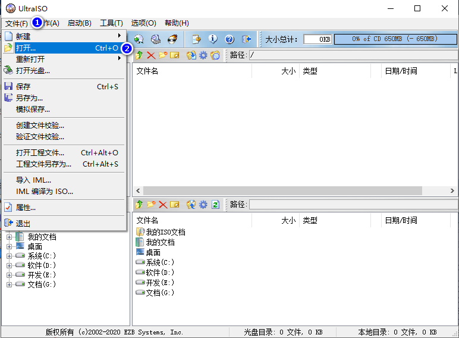
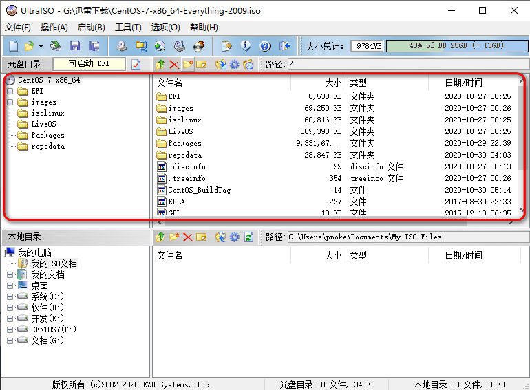
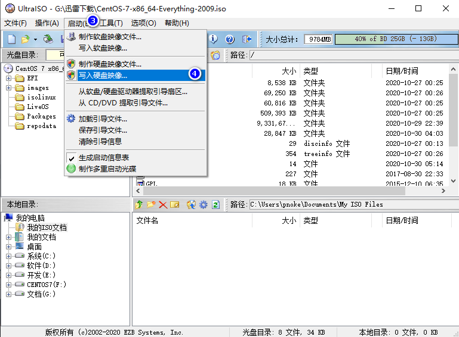
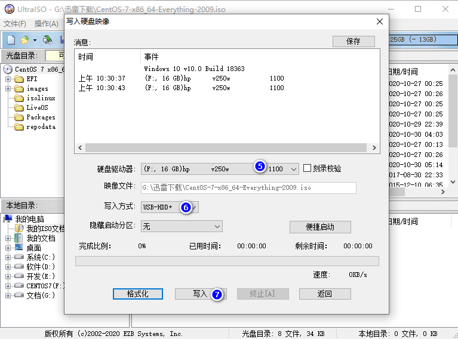
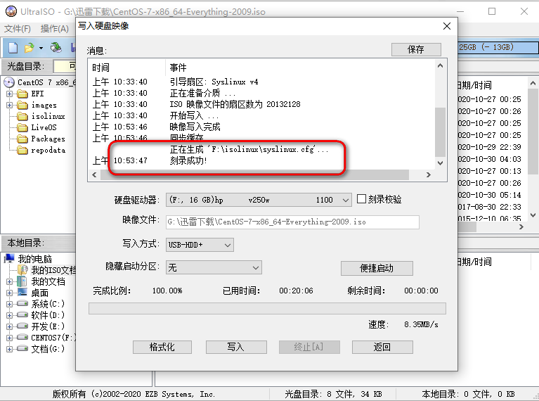

### 1.安装UltraISO

> **下载地址**：[https://cn.ultraiso.net/uiso9_cn.exe](https://cn.ultraiso.net/uiso9_cn.exe)
>
> **激活**：
>
> - 注册名：Guanjiu    
> - 注册码：A06C-83A7-701D-6CFC

### 2.下载 Centos7 镜像

> 以下载最新 centos7 镜像为例
>
> **下载地址**：[https://www.centos.org/centos-linux/](https://www.centos.org/centos-linux/)
>
> **版本**：以实际机器类型为主，例如x64架构，下载 `CentOS-7-x86_64-Everything-2009.iso`镜像

### 3.制作启动U盘

> **请将 U盘 安装以下配置进行格式化**
>
> - 文件系统：FAT32（默认）
> - 至少10G以上
> - 重要数据请提前备份好

插入U盘，启动UltraISO，然后操作步骤，如图所示：

- **3.1** 选择 '**文件**' -> '**打开**'，选择已经下载的 '**CentOS-7-x86_64-Everything-2009.iso**' 镜像

- **3.2** 选择 '**启动**' -> '**写入硬盘映像...**'
  - '**硬件驱动器**' 选择已经插入的 '**U盘**' 
  - '**写入方式**' 选择 '**USB-HDD+**'
  - 确认无误之后，点击 '**写入**'，该过程非常漫长，耐心等待完成即可

### 4.安装 Centos7 系统

> 将制作好的 `Centos7` 启动 `U 盘` 插入到待安装的机器上，进入`BIOS` 设置从 `U盘` 启动，即可开始安装