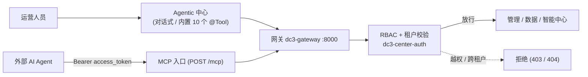

# AI

IoT DC3 把大语言模型接进了运营流程，让模型不只"看数据"，还能"动设备"。AI 栏目覆盖两种让 LLM 驱动操作的方式，区别在于谁来发起、怎么约束：

- **Agentic 中心**——平台内建的对话式 AI 辅助运营。基于 Spring AI，内置 10 个 `@Tool`，通过 Tool-Calling 让 LLM
  查设备、读写位号、执行命令；兼容 OpenAI API 标准，可接 GPT、Claude、DeepSeek、通义千问等主流模型。适合想要一个有界面、可多轮对话的
  AI 运营助手。
- **MCP**——把平台工具安全暴露给外部 AI Agent。网关在 `POST /mcp` 提供 JSON-RPC 2.0 的 MCP Resource Server，工具目录由四个中心的
  OpenAPI 自动聚合（约 150+ 个），走 OAuth 2.1 + 工具白名单 + 风险分级。适合自己搭 Agent、让模型自主决策用哪个工具。

- **为什么选 Spring AI** — DC3 AI 辅助运维背后的设计决策。详见 [为什么选 Spring AI](./spring-ai-deep-dive)
  ，涵盖架构深潜、工具调用机制和技术路线图。

> 你在这里：已经[跑通过一个设备](../operation/device-onboarding)
> ，想让模型帮你查询、分析、甚至下发命令。下一步选 [Agentic 中心](./agentic)、[AI Agent / MCP 集成](./mcp)
> 或 [为什么选 Spring AI](./spring-ai-deep-dive)。想用脚本而非 AI
> 自动化，见 [自动化（dc3 CLI）](../automation/cli)。

## 两种方式，同一道门

两种 AI 接入的差异不在"能做什么"，而在发起方与约束方式。但无论哪种，平台对外只有一个 HTTP 入口——网关 `dc3-gateway`（`8000`
）：Agentic 的对话、MCP 的工具调用最终都走这道门，再由网关注入主体上下文、下沉到 `dc3-center-auth` 做 **RBAC 权限校验**与*
*租户隔离**。

换句话说：AI 拿不到比对应账号更多的权限，跨租户的数据照样看不到（返回 404 而非数据）。README 反复强调的"数据库、缓存、API
全链路租户级隔离"与"JWT + Spring Security + RBAC"，对这两条路一视同仁。

两种接入的鉴权机制不同，但终点一致——进业务服务前都要过 `@PreAuthorize` 的权限点与租户边界：

- **Agentic 中心**用登录用户的会话身份发起，Tool-Calling 调用的仍是平台业务 API，权限随当前用户走。
- **MCP** 用 OAuth 2.1 颁发的短时 JWT（默认 15 分钟），网关每次调用都重新 introspect 并校验该 MCP 连接是否启用，再用
  `tools/list` 的三层过滤（RBAC ∩ 连接白名单 ∩ 风险策略）决定 Agent 到底看得见、调得动哪些工具。

## 延伸阅读

- [Agentic 中心](./agentic) — 对话式 AI 运营、10 个内置工具、会话持久化与高风险确认
- [AI Agent / MCP 集成](./mcp) — OAuth 2.1 + MCP，把工具安全接给外部 Agent
- [为什么选 Spring AI](./spring-ai-deep-dive) — DC3 选用 Spring AI 的架构考量、工具调用原理与路线图
- [自动化（dc3 CLI）](../automation/cli) — 不用 AI，用命令行脚本驱动平台
- [数据智能与 AIoT](../foundations/aiot) — 物联网数据分析与大模型结合的全景

