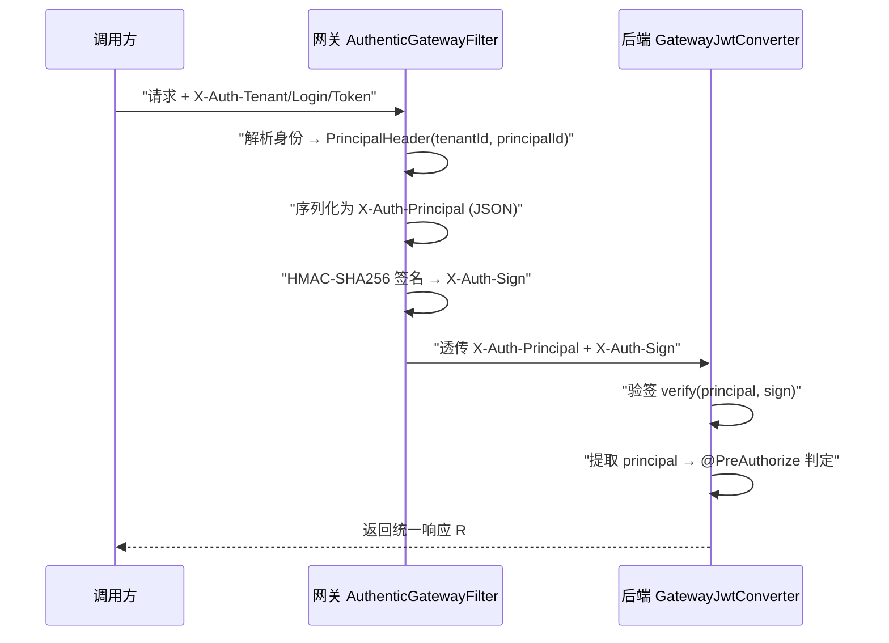
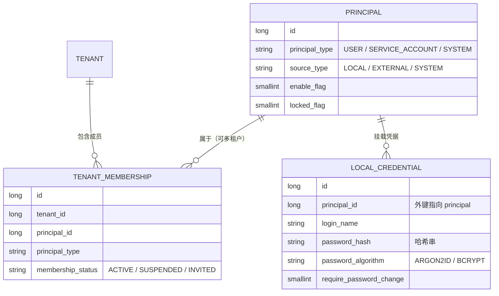
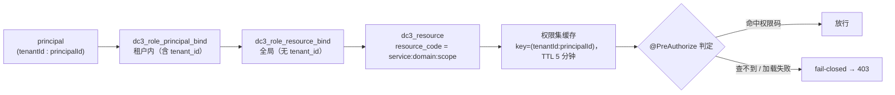

# 鉴权 · 租户 · RBAC

平台对外只有网关一个入口，但每一次受保护的调用，背后都要回答三个问题：你是谁、你属于哪个租户、你能不能做这件事。这页讲清登录如何换取令牌、网关如何把身份签名后透传给后端、身份模型怎么组织，以及
RBAC 与租户隔离如何协同把"越权"和"跨租户"两类风险一起封死。读完你能看懂一次请求从 `X-Auth-Token` 到 `@PreAuthorize`
的完整鉴权链路，并知道生产环境哪些配置必须先到位。

> 你在这里：已理解 [核心概念](../introduction/concepts)
> 里的租户边界，想知道它在鉴权层如何落实。配套看 [服务与拓扑](./services) 与 [领域模型](./domain-model)。

## 为什么把鉴权拆成"网关签名 + 后端验签"

中心服务之间用 gRPC facade 互联，每个后端服务（管理、数据、智能）都有自己的 HTTP
端口，只是默认不对外映射。这带来一个隐患：任何能直连后端端口的调用方，只要自己伪造一个"我是租户 A 的管理员"
的请求头，后端若无条件信任，就被冒充了。

IoT DC3 的解法是把"认证身份"和"信任身份"分开：

- **认证**只在网关 `dc3-gateway` 做一次。网关拿前端传来的 `X-Auth-Tenant` / `X-Auth-Login` / `X-Auth-Token`
  去鉴权中心核验，解析出真实的 principal（租户 ID + 身份 ID）。
- **信任**靠一段 HMAC-SHA256 签名传递。网关把解析出的身份序列化成 `X-Auth-Principal`（JSON），再用共享密钥对它签名得到
  `X-Auth-Sign`，一并透传给后端。后端只信任"带正确签名"的身份头，验签不过就当匿名处理。

这样后端不必重复一遍登录校验，又不会被裸的伪造头骗到——签名是只有网关和后端共享的密钥才能产生的。

## 登录与令牌签发

登录是两步握手：先取一次性盐，再用盐把密码哈希后换令牌。盐的作用是避免密码明文或固定哈希在链路上重放。

<AuthFlowDiagram lang="zh" />

两个端点都公开、无需鉴权：

- `POST /api/v3/auth/token/salt`：传 `tenant`、`name`，先确认租户存在，返回一个随机盐（UUID 形态），响应文案建议 **5 分钟内使用
  **（服务端不存储盐、不强制过期，"5 分钟"只是客户端使用提示）。
- `POST /api/v3/auth/token/generate`：传 `tenant`、`name`、`salt`、**明文 `password`**（盐不参与密码哈希，仅用于与服务端密钥拼接给
  token 签名），校验通过返回 access token，**有效期
  12 小时**（`TOKEN_CACHE_TIMEOUT = 12` 小时）。

`generateToken` 内部按固定顺序逐项校验，任一不过都返回同一个"无可用认证"错误，不泄露是哪一步失败：

1. **租户**：`tenantCode` 必须解析到存在的租户。
2. **凭据**：按 `loginName` 找到 `dc3_local_credential`。
3. **成员关系**：该凭据的 `principalId` 必须是该租户的成员（查 `dc3_tenant_membership`）。
4. **盐**：盐不能为空。
5. **密码**：按存储哈希记录的算法分派校验（`ARGON2ID` 或 `BCRYPT`）；默认 seed 用户 `dc3` 的口令以
   BCrypt（cost=12）存储，故黄金路径登录实际走 BCrypt 校验。只有新口令 `encode()` 才优先 Argon2id（不可用时回退
   bcrypt）。失败会记录一次失败登录。
6. **密码过期 / 强制改密**：`password_expire_time` 已过或 `require_password_change=1` 时，抛"需改密"而非签发令牌。

全部通过后才用 `KeyUtil.generateToken(principalId, salt, tenantId)` 签出 JWT——令牌绑定的是 **principal_id + tenant_id**
，不是用户名。注销时把 `(tenantCode:principalId)` 写入 Caffeine 注销名单（denylist），后续带旧令牌的请求即便签名合法，也会因签发时间落在注销点之前而被判失效。

```bash [curl 登录黄金路径]
# 1) 取盐
curl -s -X POST http://localhost:8000/api/v3/auth/token/salt \
  -H 'Content-Type: application/json' \
  -d '{"tenant":"default","name":"dc3"}'
# 返回示例（建议 5 分钟内使用）："a1b2c3d4-...-e5f6"

# 2) 用盐哈希密码后换令牌
curl -s -X POST http://localhost:8000/api/v3/auth/token/generate \
  -H 'Content-Type: application/json' \
  -d '{"tenant":"default","name":"dc3","salt":"a1b2c3d4-...-e5f6","password":"<hashed>"}'
# 返回示例（12 小时有效）：JWT 字符串

# 3) 之后所有受保护请求都带三个头
curl -s -X POST http://localhost:8000/api/v3/manager/device/add \
  -H 'X-Auth-Tenant: default' \
  -H 'X-Auth-Login: dc3' \
  -H 'X-Auth-Token: <token>' \
  -H 'Content-Type: application/json' \
  -d '{"deviceName":"...","driverId":...,"profileId":...}'
```

## 网关请求与 HMAC 签名透传

拿到令牌之后，每次受保护调用都带 `X-Auth-Tenant` / `X-Auth-Login` / `X-Auth-Token` 三个头到网关。网关的
`AuthenticGatewayFilter` 负责把这三个头换成一段可被后端信任的、带签名的身份。



网关侧（`AuthenticGatewayFilter`）：身份解析是阻塞式 gRPC 调用，整体放到 `boundedElastic` 线程池执行，避免占住 Netty 事件循环。解析出
`PrincipalHeader` 后序列化为 `X-Auth-Principal`；若 HMAC 已启用，再写入 `X-Auth-Sign`；*
*若未启用，则主动删除任何入站的 `X-Auth-Sign` 头**，防止下游被客户端自带的假签名诱骗。

后端侧（`GatewayJwtConverter`）：

- 没有 `X-Auth-Principal` → 按匿名继续。
- HMAC 启用时，用同一密钥对 principal 载荷重算 HMAC，与 `X-Auth-Sign` 做**常量时间比对**，不符即拒。
- 验签通过后解析 principal，缺 `tenantId` 或 `principalId` 一律拒；随后据此加载权限集，交给 `@PreAuthorize` 判定。

签名用的共享密钥来自 `dc3.auth.hmac.secret`（或环境变量 `AUTH_HMAC_SECRET`）。这把密钥的缺省行为按环境分级——开发宽松、生产严格：

::: danger HMAC 生产 fail-fast
在 `pre` / `pro` 环境下，`AUTH_HMAC_SECRET` 为空、或仍等于默认值 `io.github.pnoker.dc3`，服务**启动即失败**（抛
`IllegalStateException`）。判定逻辑见 `HmacAuthConfig.isProtectedEnvironment()`：检查 `spring.profiles.active` 与
`spring.env`，命中 `pre`/`pro` 即进入强校验。生产部署前务必把它设成强随机值。
:::

::: warning 开发/测试环境密钥为空只告警
非保护环境下密钥为空时，`HmacAuthSigner` 不会报错，而是禁用签名并打印一条醒目的 WARNING：此时后端**无条件信任**
`X-Auth-Principal`。本地自测可以接受，但任何对外可达的部署都不应停在这个状态。
:::

## 身份模型：principal 是根

很多平台把"用户"当作鉴权的根对象，结果服务账号、系统身份只能硬塞进用户表。IoT DC3 反过来——根身份是 **`dc3_principal`**
，用户只是其中一种类型。



- **`dc3_principal`** 是统一身份表，`principal_type` 取 `USER`（人）、`SERVICE_ACCOUNT`（服务账号）、`SYSTEM`（系统身份）三种之一。
- **凭据挂在 principal 上**：`dc3_local_credential.principal_id` 指向 principal，而不是某个 `user_id`。密码哈希默认
  Argon2id（也支持 BCRYPT）。这意味着同一身份模型可以承载人和机器两类调用方。
- **租户成员关系是显式的**：身份"属于哪个租户"不写死在身份上，而是由 `dc3_tenant_membership` 一行一行声明。唯一索引建在
  `(tenant_id, principal_id)`，所以**一个 USER 可以属于多个租户**（多行），登录时由 `name + tenant` 一起定位是哪一段成员关系；
  **SERVICE_ACCOUNT 按设计单租户**。

::: info 外部身份（identity provider）尚未实现
`dc3_identity_provider`（OIDC/SAML 等外部 IdP 配置）与 `dc3_external_identity`（外部身份与本地 principal 的绑定）两张表已在
`02-iot-dc3-auth.sql` 中建好，`principal.source_type` 也预留了 `EXTERNAL` 取值，但对应的**登录端点未实现、处于关闭状态**
。当前可用的登录路径只有上面的本地凭据（`POST /api/v3/auth/token/salt` + `/api/v3/auth/token/generate`）。
:::

## RBAC：从身份到资源码

验签拿到 principal 之后，要决定它"能做什么"。IoT DC3 用经典的"主体—角色—资源"三段绑定，但刻意把两段的作用域分开：角色归属是*
*租户内**的，资源授权是**全局**的。



链路是：`dc3_role_principal_bind`（带 `tenant_id`，决定这个 principal 在该租户内有哪些角色）→ `dc3_role_resource_bind`（无
`tenant_id`，把角色映射到资源）→ `dc3_resource`
（资源即权限码）。把角色归属做成租户内、资源做成全局，意味着同一个角色定义可在多个租户复用，而"谁在哪个租户里是这个角色"互不串台。

资源码是三段式 `{spring.application.name}:{domain}:{scope}`，由 `@perm.can` 在运行时按所在服务拼成——例如
`DeviceController` 上的 `@perm.can('device', 'add')` 实际校验的字符串是 `dc3-center-manager:device:add`，
`PointCommandController` 上的 `@perm.can('point_command', 'list')` 校验 `dc3-center-data:point_command:list`。注意 seed
数据并未为每个 API 级权限单独建行，默认管理员的资源码是通配 `*`，覆盖全部接口。

权限解析由 `AuthPermissionProvider` 完成，并带一层短缓存：

- 缓存键是 **`(tenantId:principalId)`**，TTL **5 分钟**（`CACHE_TTL_MS = 300_000`）。换言之改了授权，最长 5 分钟后才对在途会话生效。
- 解析时把该 principal 在该租户下的所有资源码收集成一个集合；`@PreAuthorize` 判断时命中具体权限码或通配权限即放行。

最关键的是失败语义——**fail-closed**：

::: danger 查不到权限 = 拒绝，不是放行
`GatewayJwtConverter` 在权限加载发生瞬时故障时，仍会创建一个"已认证但权限为空"的令牌（authorities 为空集）。这是有意的"
失败即关闭"：调用方被当作已登录但无任何权限，任何 `@PreAuthorize` 守卫返回 **403**，而不是把一次后端抖动伪装成 401
或意外放行。权限查不到时默认无权，绝不默认有权。
:::

## 租户隔离：接口层校验

RBAC 决定"能不能做这类操作"，租户隔离决定"能不能碰这条数据"。两者正交，缺一不可——有 `device:get` 权限不代表你能 get
别家租户的设备。隔离落在接口层（数据库查询层当前不做自动租户裁剪，`MybatisPlusConfig` 只注册了分页插件）：

**控制器层 `BaseController.requireTenant()`**：按 ID 查到实体后，比对实体的 `tenantId` 与调用方租户。不一致（或实体不存在）就抛
`NotFoundException`，对外返回 **404**——刻意用"不存在"而非"无权限"，避免泄露"某个跨租户资源是否存在"。批量查询走
`filterTenant()`，把不属于本租户的条目直接剔除。

::: warning 没有数据库层的自动租户兜底
不要以为忘了写租户条件也会被 SQL 层补上——当前实现**没有** MyBatis-Plus 租户行拦截器，隔离完全靠控制器层的
`requireTenant` / `filterTenant`。新增单条或批量查询时，务必主动调用这两个方法带上租户校验，否则查询不会自动按租户裁剪。
:::

```java
// 控制器层：按 ID 查到的实体若不属于本租户，返回 404 而非 403
default <T extends TenantOwned> T requireTenant(Long tenantId, T entity) {
    if (Objects.isNull(entity) || !Objects.equals(tenantId, entity.getTenantId())) {
        throw new NotFoundException("Resource does not exist");
    }
    return entity;
}
```

::: tip 新增查询时保持租户作用域
任何新增的查询、gRPC 请求或缓存键都必须带租户上下文：查询保留 `tenantId`、缓存键纳入租户、跨服务取数前先校验归属。除非数据模型明确定义为全局记录，否则不要写
`tenant_id IS NULL` 这类绕过条件。
:::

## 约束与边界一览

把上面散落的硬约束集中一处，便于部署前核对：

| 项         | 取值 / 行为                                                               | 来源                               |
|-----------|-----------------------------------------------------------------------|----------------------------------|
| 盐有效期      | 建议客户端 5 分钟内使用（服务端不强制过期）                                               | `POST /api/v3/auth/token/salt`   |
| 令牌有效期     | 12 小时                                                                 | `TOKEN_CACHE_TIMEOUT=12` 小时      |
| JWT 绑定    | `principal_id` + `tenant_id`                                          | `generateToken`                  |
| HMAC 密钥   | `AUTH_HMAC_SECRET` / `dc3.auth.hmac.secret`，默认 `io.github.pnoker.dc3` | `HmacAuthConfig`                 |
| HMAC 生产校验 | `pre`/`pro` 下为空或等于默认值即启动失败                                            | `HmacAuthConfig`                 |
| 权限缓存      | key=`(tenantId:principalId)`，TTL 5 分钟                                 | `AuthPermissionProvider`         |
| 权限失败语义    | fail-closed → 空权限 → 403                                               | `GatewayJwtConverter`            |
| 跨租户 ID 查询 | 返回 404（非 403）                                                         | `BaseController.requireTenant()` |
| 外部身份登录    | 表已建、端点未实现/关闭                                                          | `02-iot-dc3-auth.sql`            |

## 延伸阅读

- [服务与拓扑](./services) — 网关、四个中心与驱动如何分布，端口与启动顺序
- [领域模型](./domain-model) — DO/BO/VO 分层、`TenantOwned` 与租户字段如何贯穿实体
- [API 文档](../development/api-documentation) — OpenAPI、鉴权头与 CRUD 动词约定
- [物联网安全](../foundations/security) — 设备/通信/平台/数据安全的体系化视角
