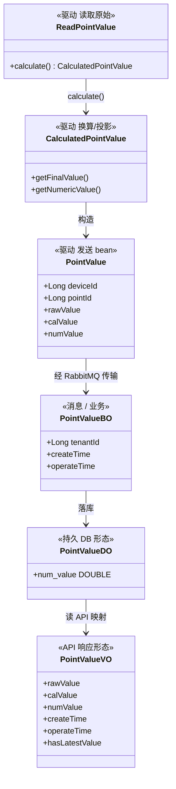
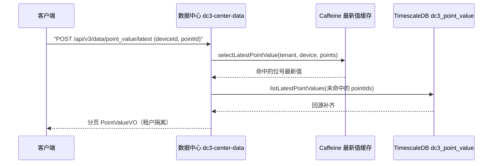

# 数据平面：位号值如何落库

设备侧采到的原始寄存器值，要经过驱动归一、消息总线、数据中心，最终写进时序库并对外可查。这页追踪一条位号值的完整旅程：用到的交换机与队列、消费者怎么持久化、模型变换经过哪几层、以及读取最新值时缓存如何命中。读完你能看懂一条值"
从设备到 API"的每一跳，并知道做聚合查询时的硬约束。

> 你在这里：已理解 [核心概念](../introduction/concepts) 里的位号(Point)与位号值(PointValue)
> ，想看数据怎么流。反向的读写命令请看 [命令平面](./command-plane)。

## 一条值的旅程

数据流是**南向到北向**的单向链路。驱动周期性采集，把每个位号的一次采集封装成一个 `PointValue` 对象，经
`DriverSenderService.pointValueSender()` 发往 RabbitMQ 的值交换机；数据中心 `dc3-center-data` 监听队列、消费消息、写入
TimescaleDB，同时把最新值塞进本地 Caffeine 缓存供热点读取。整条链路是**异步**的——驱动发出后不等数据中心确认落库，靠消息总线的持久投递与手动
ack 保证不丢。

<DataPlaneDiagram lang="zh" />

驱动用的路由键是 `dc3.r.value.point.` 加上自己的服务名（`driverProperties.getService()`，例如 `dc3-driver-virtual`
实例配的服务名），数据中心的队列用通配绑定 `dc3.r.value.point.*` 收下所有驱动的值。发送时 `pointValueSender()` 会从
`DriverMetadata` 注入 `driverId` 与 `tenantId`（若消息里没带），并用 `PointValueCorrelation`（携带随机 UUID + deviceId +
pointId）作为关联数据，配合 publisher confirms 跟踪投递结果。

## RabbitMQ 拓扑：值交换机、位号队列、死信

值通道是一个 **topic 交换机** `dc3.e.value`，下挂一条**持久队列** `dc3.q.value.point`。队列声明在数据中心的
`DataTopicConfig`：

```java
QueueBuilder.durable(RabbitConstant.QUEUE_POINT_VALUE)   // dc3.q.value.point
    .ttl(604800000)                                       // 7 天 = 604800000 ms
    .deadLetterExchange(RabbitConstant.TOPIC_EXCHANGE_POINT_VALUE_DEAD) // dc3.e.point_value_dead
    .deadLetterRoutingKey("#")
    .build();
```

三个要点：

- **持久 + 7 天 TTL**：队列 `durable`，消息发布时被强制设为 `PERSISTENT`（`RabbitConfig` 的 `BeforePublishPostProcessor`
  统一打 `MessageDeliveryMode.PERSISTENT`）。一条消息在队列里最多停 7 天（`604800000` ms），超时未被消费即进死信。
- **死信兜底**：超时或被 `reject` 的消息流向死信交换机 `dc3.e.point_value_dead`（死信队列 `dc3.q.point_value_dead`
  ），不会静默丢失，可另行排查。
- **通配绑定**：队列以 `dc3.r.value.point.*` 绑定到 `dc3.e.value`，一条队列收下全部驱动实例的位号值。

::: info 交换机/队列名带环境前缀
`RabbitConstant` 里 `dc3.e.value`、`dc3.q.value.point` 等常量在装配时会拼上一个环境 `tag` 前缀。本文用的是去前缀后的稳定后缀名，便于在
RabbitMQ 管理台按名检索。
:::

## 消费者：PointValueReceiver 如何落库

数据中心的 `PointValueReceiver` 用 `@RabbitListener(queues = "#{pointValueQueue.name}")` 监听位号队列，反序列化成
`PointValueBO`（JSON 经 `JacksonJsonMessageConverter`）。它走的是**手动 ack**：

- **校验**：`pointValueBO` 为空或缺 `deviceId` → `RabbitAckUtil.reject`（`basicReject` 不重回队列）→ 进死信。
- **持久化**：根据入站速率二选一——速率低于 `POINT_BATCH_SPEED`（默认 100）时调用 `pointValueService.save(pointValueBO)` *
  *即时落库**；速率超过阈值时改交 `PointValueJob` **批处理**。速率由 `speed = count / interval` 算出，
  `POINT_BATCH_INTERVAL`（默认 `5`，单位**秒**，Quartz `IntervalUnit.SECOND`）是这里的除数而非刷新间隔。`PointValueJob` 由
  Quartz 定时触发，每次把整个累积缓冲一次性刷出，与缓冲大小无关——没有"批量大小触发"，也没有"谁先到谁先刷"。
- **确认**：成功 → `RabbitAckUtil.ack`；处理抛异常 → `RabbitAckUtil.nack(requeue=true)` 重回队列重试。

::: info 消费者并发是默认档，非高吞吐档
`PointValueReceiver` 没有显式指定 `containerFactory`，因此用默认监听容器工厂：`concurrentConsumers=2`、
`maxConcurrentConsumers=8`、`prefetchCount=10`、`AcknowledgeMode.MANUAL`。`RabbitConfig` 另提供了一个高吞吐工厂
`highThroughputRabbitListenerContainerFactory`（`concurrent=4`、`max=32`、`prefetch=100`），但当前没有监听器 opt-in。需要更高吞吐时给
`@RabbitListener` 显式加 `containerFactory="highThroughputRabbitListenerContainerFactory"`。以代码为准：
`dc3-common-rabbitmq/.../RabbitConfig.java`。
:::

`pointValueService.save()` 内部做两件事：先把值写进本地 Caffeine 最新值缓存（`PointValueLocalCache`，key =
`REAL_TIME_VALUE_KEY_PREFIX + tenantId + "." + deviceId + "." + pointId`，点号分隔且带前缀）与时序库，再立即交给告警引擎评估。

## 模型变换：六个面孔，分属不同层

同一条"位号值"在链路上换了六次外衣，每一层各有职责与序列化形态。**最容易混淆的是 `PointValue` 与 `PointValueBO` 不是同一个类
**——前者是驱动侧的发送 bean，后者是消息/业务侧的对象，分属不同层。



逐层说明：

- **`ReadPointValue`**（驱动）：驱动协议层 `read()` 返回的原始读数，带 device/point 上下文。
- **`CalculatedPointValue`**（驱动）：对原始值做线性换算/投影（`baseValue`/`multiple` 等）后的结果，同时算出 `finalValue`
  （工程值字符串）与 `numericValue`（数值投影，可能为空）。
- **`PointValue`**（驱动发送 bean）：`new PointValue(readPointValue)` 内部触发 `calculate()`，填入 `rawValue`/`calValue`/
  `numValue` 与 `createTime`（采集时刻），这就是发往 RabbitMQ 的载荷。
- **`PointValueBO`**（消息/业务）：数据中心从队列反序列化得到的对象，承载 `tenantId`、`createTime`、`operateTime`，是落库与告警评估的输入。
- **`PointValueDO`**（持久）：写入 `dc3_point_value` 的数据库形态，`num_value` 为可空 `DOUBLE`。
- **`PointValueVO`**（API）：读接口返回给客户端的形态，对外暴露 `deviceId`/`pointId`/`rawValue`/`calValue`/`numValue`/
  `createTime`/`operateTime`/`hasLatestValue`/`driverId`/`tenantId`。

## 存储：dc3_point_value 是 TimescaleDB 超表

值落在 TimescaleDB **hypertable** `dc3_history.dc3_point_value`（位于 `dc3_history` schema；`search_path` 含
`dc3_history, public`，故正文与查询里常简写为 `dc3_point_value`）。它按两维分区——时间维 `create_time` 每 **1 天**一个
chunk，设备维 `device_id` **16** 个哈希桶：

```sql
SELECT create_hypertable('dc3_point_value', by_range('create_time', INTERVAL '1 day'));
SELECT add_dimension('dc3_point_value', by_hash('device_id', 16));
```

为控制存储与查询成本，这张超表还配了两条数据生命周期策略：

```sql
-- 7 天前的 chunk 自动压缩（按 tenant/device/point 分段、create_time 排序）
ALTER TABLE dc3_point_value SET (timescaledb.compress,
    compress_segmentby='tenant_id,device_id,point_id', compress_orderby='create_time DESC');
SELECT add_compression_policy('dc3_point_value', INTERVAL '7 days');
-- 超过 180 天的数据自动清理
SELECT add_retention_policy('dc3_point_value', INTERVAL '180 days');
```

::: tip 压缩与保留默认开启
7 天后压缩能显著降低磁盘占用（压缩后的 chunk 仍可查询，只是写入受限）；180 天保留策略会自动 drop 超期
chunk。业务需要更长留存时，在部署侧调整这两条策略的间隔。
:::

关键列与索引：

| 列              | 类型                        | 说明                                    |
|----------------|---------------------------|---------------------------------------|
| `raw_value`    | `TEXT NOT NULL`           | 设备采到的原始值                              |
| `cal_value`    | `TEXT NOT NULL`           | 换算/投影后的值                              |
| `num_value`    | `DOUBLE PRECISION` **可空** | `cal_value` 的数值投影；非数值/JSON 载荷为 `NULL` |
| `create_time`  | `TIMESTAMPTZ NOT NULL`    | **采集时刻**（驱动侧 acquisition）             |
| `operate_time` | `TIMESTAMPTZ NOT NULL`    | **落库时刻**（数据中心 persist）                |

主时序索引 `idx_point_value_ts_lookup` 为 `(tenant_id, device_id, point_id, create_time DESC)`，租户隔离的最新值与时间窗扫描都走它；另有一个
**部分索引** `idx_point_value_num_time ... WHERE num_value IS NOT NULL`，专为数值聚合服务。

::: warning create_time 与 operate_time 是两个时刻
`create_time` 是驱动采集到该值的时间，`operate_time` 是数据中心把它写进库的时间。两者刻意分开——它们的差值就是"采集→落库"
管线延迟，仪表盘用它衡量链路时延。落库时 `save()` 总会重写 `operate_time` 为当前时间，`create_time` 缺失才补当前时间。
:::

::: danger num_value 可空：聚合查询必须 num_value IS NOT NULL
`dc3_point_value.num_value` 对非数值或 JSON 载荷为 `NULL`。任何 `AVG`/`SUM`/`MAX`/`MIN` 等聚合都**必须**加
`WHERE num_value IS NOT NULL`，否则把字符串型位号的空值混进来，结果会偏差。部分索引 `idx_point_value_num_time` 也只覆盖
`num_value IS NOT NULL` 的行——不加这个谓词还会错过索引。
:::

## 消息可靠性与落库后的告警

数据平面的不丢保证来自三处叠加，均在共享 `RabbitConfig` 里统一装配：

- **持久投递**：发布前置处理器把每条消息标 `PERSISTENT`，配合 `durable` 队列，broker 重启不丢。
- **手动 ack**：消费者处理成功才 `ack`；异常 `nack(requeue=true)` 重试，校验失败 `reject` 进死信——绝不静默吞消息。
- **publisher confirms**：`rabbitTemplate` 注册了 confirm 回调，NACK 时打错误日志；关联数据 `PointValueCorrelation`
  让你能把一次确认对回具体的 device/point。

值一旦落库，`PointValueServiceImpl.save()` 紧接着调用 `alarmRuleTriggerService.processPointValue(pointValueBO)`，**同步**
对这条值做告警规则评估——不是另起一条延迟链路。规则、状态机与通知渠道见 [告警与通知](../operation/alarms)。

## 读取最新值：先查缓存，未命中回源时序库

写路径把最新值同时塞进 Caffeine；读路径就先吃这层缓存。`POST /api/v3/data/point_value/latest` 进
`PointValueServiceImpl.latest()`：先用 `pointValueLocalCacheService.selectLatestPointValue(tenantId, deviceId, pointIds)`
批量查缓存，把缓存未命中的 pointId 收集起来，再一次性回源 TimescaleDB（`repositoryService.listLatestPointValues`）补齐。



历史区间查询 `POST /api/v3/data/point_value/list` 不走缓存，直接 `repositoryService.listPagePointValue(query)` 扫时序库，按
`startTime`/`endTime` 过滤。两个读接口都受 `@PreAuthorize("@perm.can('point_value', 'list')")` 保护，返回
`分页 PointValueVO`，且查询经 `PointValueQuery` 强制带租户上下文——跨租户拿不到别人的数据。

## 怎么做：读最新值与历史

两条读接口都经网关 `dc3-gateway`（:8000）转发，受保护接口要带 `X-Auth-Tenant` / `X-Auth-Login` / `X-Auth-Token`
三个鉴权头（取盐+发令流程见 [快速开始](../quickstart/)）。

::: code-group

```bash [最新值 curl]
curl -X POST http://localhost:8000/api/v3/data/point_value/latest \
  -H "X-Auth-Tenant: default" \
  -H "X-Auth-Login: <login>" \
  -H "X-Auth-Token: <token>" \
  -H "Content-Type: application/json" \
  -d '{"deviceId": 1024, "pointId": 2048, "current": 1, "size": 10}'
```

```bash [历史区间 curl]
curl -X POST http://localhost:8000/api/v3/data/point_value/list \
  -H "X-Auth-Tenant: default" \
  -H "X-Auth-Login: <login>" \
  -H "X-Auth-Token: <token>" \
  -H "Content-Type: application/json" \
  -d '{"deviceId": 1024, "pointId": 2048, "current": 1, "size": 50,
       "startTime": "2026-06-22T00:00:00", "endTime": "2026-06-22T23:59:59"}'
```

:::

响应是分页的 `PointValueVO`，每项给出位号最新（或区间内）一条值的形态：

```json
{
  "code": "200",
  "data": {
    "current": 1,
    "size": 10,
    "total": 1,
    "records": [
      {
        "deviceId": 1024,
        "pointId": 2048,
        "rawValue": "23.5",
        "calValue": "23.5",
        "numValue": 23.5,
        "hasLatestValue": true,
        "createTime": "2026-06-22T08:30:00",
        "operateTime": "2026-06-22T08:30:01"
      }
    ]
  }
}
```

::: tip 字段名以实际响应为准
上面是示例值。`PointValueVO` 的对外字段（如 `rawValue`/`calValue`/`numValue`/`createTime`/`operateTime`）由 MapStruct
builder 从 `PointValueDO` 映射，做集成时以网关实际返回的 JSON 为准。
:::

## 约束与边界

- **聚合必带 `num_value IS NOT NULL`**：见上文 danger，这是数值统计正确性的硬前提。
- **`PointValue` ≠ `PointValueBO`**：跨层时别把驱动发送 bean 当成业务对象互用，二者字段集与序列化场景不同。
- **消费者并发是默认档**：位号队列当前跑在默认监听工厂（prefetch=10、并发 2–8）；高吞吐工厂存在但未启用，需要时显式 opt-in。
- **租户隔离在接口层强制**：读接口经 `PointValueQuery` 带租户上下文，数据中心取数后由控制器层 `requireTenant` /
  `filterTenant` 校验，跨租户访问取不到数据。
- **死信不等于丢失**：超时或被 reject 的值进 `dc3.e.point_value_dead`，排障时去死信队列找。

## 延伸阅读

- [命令平面](./command-plane) — 反向的读写命令如何下发、回执与查询状态
- [领域模型](./domain-model) — Point / PointValue 的 DO/BO/VO 分层与字段细节
- [告警与通知](../operation/alarms) — 落库后告警规则如何评估、通知如何投递
- [时序数据与流处理](../foundations/data-pipeline) — 时序数据库与流处理的通用原理
