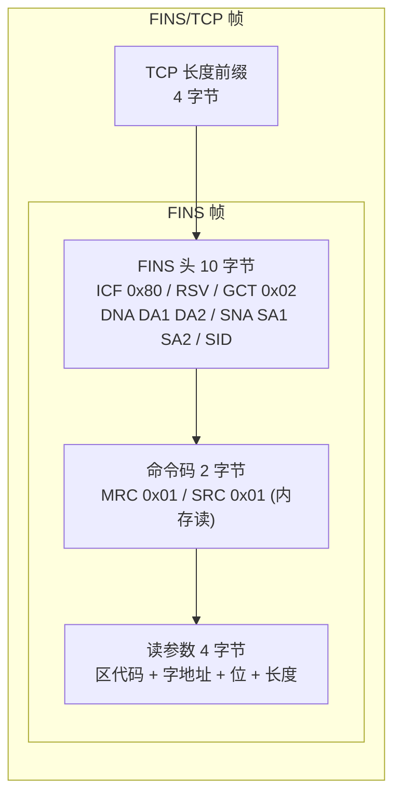

# FINS 驱动

`dc3-driver-fins` 把欧姆龙（Omron）PLC 通过 FINS 协议接入 IoT DC3：作为 FINS 客户端主动 TCP 连接 PLC，按[位号](../introduction/concepts/point)上配置的内存区与字地址周期性采数，并支持向内存区写值的命令。读完本页你能完成一台 Omron PLC 的接入，并清楚当前实现支持到哪一步。

- **驱动名 / code**：`Omron FINS Driver` / `FinsDriver`
- **类型**：`DRIVER_CLIENT`（主动连 PLC）

## 协议背景

FINS（Factory Interface Network Service）是欧姆龙 PLC 的原生通信协议，CP/CJ/CS 等系列广泛在用。它把 PLC 的内存按用途划分为若干**内存区（Memory Area）**，每个区以"字"（16 位）为寻址单位；上位机通过发送内存读/写命令帧，按内存区代码 + 字地址访问数据。FINS 可承载在 UDP、TCP、以太网或欧姆龙专用总线上，本驱动使用 **FINS/TCP**——在每个 FINS 帧前加 4 字节长度前缀。

在[物联网四层架构](../foundations/fieldbus)中，FINS 属于**网络层**：它定义了车间内设备如何被寻址、命令如何编码、字节如何在链路上传输。IoT DC3 在它之上做归一化，把"读 `D100` 这个字"翻译成统一的[位号值](../introduction/concepts/point-value)。

::: tip 先认识几个 FINS 概念
**内存区（Memory Area）**：PLC 里按用途划分的数据区——`D`（数据存储区，最常用）、`W`（工作区）、`H`（保持区）、`C`（计数器区）。本驱动把它们映射到 FINS 区代码：`D`=0x82、`W`=0xB1、`H`=0xB0、`C`=0x83。
**字地址（Word Address）**：内存区内以"字"（16 位）为单位的偏移，如 `D100` 就是 D 区第 100 个字。
**节点/单元号（Node/Unit）**：FINS 网络里寻址 PLC 用的源/目的地址，单台直连场景一般保持默认。
:::

### 一帧 FINS 读命令如何拼装

驱动不依赖第三方协议库，而是手工按字节拼装 FINS 帧。读 1 个字的请求帧由 4 字节 TCP 长度前缀 + 10 字节 FINS 头 + 2 字节命令码 + 4 字节读参数组成：

响应帧在 FINS 头与命令码之后带 2 字节**结束码（end code）**：非 0 表示 PLC 拒绝或出错，驱动据此抛出 `ReadPointException`；为 0 时数据从第 14 字节开始，按 `dataType` 解码（见下文的实现状态说明）。

## 属性配置

FINS 的接入参数分两类：连到哪台 PLC 由设备级的 **driver 属性**决定；每个位号读/写哪个字由 **point/command 属性**决定。下面三张表的字段都来自驱动的 `application.yml`，表格前的散文说明每个属性的作用与取值来源。

### 驱动配置（设备级 `driver-attribute`）

接入一台 FINS PLC 时，在[设备](../introduction/concepts/device)上填这些[属性](../introduction/concepts/attribute-config)。`host`/`port` 指向 PLC；`sourceNode`/`destNode`/`sourceUnit`/`destUnit` 是 FINS 帧头里的源/目的寻址字节，单台直连按默认即可；`timeout` 同时用作 TCP 连接超时与读超时（`setSoTimeout`）。

| 属性 | code | 类型 | 默认值 | 说明 |
|---|---|---|---|---|
| Host | `host` | STRING | `127.0.0.1` | PLC 主机地址 |
| Port | `port` | INT | `9600` | FINS 端口（标准 9600）|
| Protocol | `protocol` | STRING | `TCP` | 传输协议（驱动固定走 FINS/TCP）|
| Source Node | `sourceNode` | INT | `1` | FINS 源节点号 |
| Dest Node | `destNode` | INT | `2` | FINS 目的节点号 |
| Source Unit | `sourceUnit` | INT | `0` | FINS 源单元号 |
| Dest Unit | `destUnit` | INT | `0` | FINS 目的单元号 |
| Timeout | `timeout` | INT | `5000` | 连接 / 请求超时（毫秒）|

### 位号配置（`point-attribute`）

每个采集[位号](../introduction/concepts/point)上填读取目标。`memoryArea` + `address` 共同定位到一个字（如 `memoryArea=D`、`address=100` 对应欧姆龙习惯写法的 `D100`）；`dataType` 声明解码方式；`bitPosition` 是字内位偏移。

| 属性 | code | 类型 | 默认值 | 说明 |
|---|---|---|---|---|
| Memory Area | `memoryArea` | STRING | `D` | 内存区，`D`/`W`/`H`/`C` |
| Address | `address` | INT | `0` | 内存区内的字地址 |
| Data Type | `dataType` | STRING | `UINT16` | `INT16`/`UINT16`/`INT32`/`UINT32`/`FLOAT`/`STRING`/`BCD` |
| Bit Position | `bitPosition` | INT | `0` | 字内位偏移（当前读路径未使用，固定按 `0` 处理）|

::: warning 当前读路径只读 1 个字，`dataType` 不决定读几个字
读取时固定只读 **1 个字（2 字节）**，与 `dataType` 无关。因此**只有 `INT16`/`UINT16` 能正确读出**；`INT32`/`UINT32`/`FLOAT` 的 `decodeValue` 会调用 `getInt()`/`getFloat()` 从 2 字节缓冲读 4 字节，触发 BufferUnderflow，当前实际读不出值；`STRING`/`BCD` 也只能拿到 2 字节。这些是已声明、待补的协议语义。驱动按大端序（Big-Endian）解码读回的字节；位号的数据类型（[Point](../introduction/concepts/point) 的 `pointTypeFlag`）应与这里的 `dataType` 对得上。
:::

### 写命令配置（`command-attribute`）

可写位号还需在写命令上填目标位置与写入类型，字段含义同位号配置。

| 属性 | code | 类型 | 默认值 | 说明 |
|---|---|---|---|---|
| Memory Area | `memoryArea` | STRING | `D` | 内存区，`D`/`W`/`H`/`C` |
| Address | `address` | INT | `0` | 内存区内的字地址 |
| Data Type | `dataType` | STRING | `UINT16` | 写值数据类型 |

### 采集与健康调度

这些节奏由 `application.yml` 的 `schedule`/`health` 段固定，接入时无需在设备上重填：

- **采集周期**：默认 cron `0/30 * * * * ?`（每 30 秒读一轮）。
- **自定义任务**：默认 cron `0/5 * * * * ?`，但 FINS 驱动的 `schedule()` 为空实现——该调度位保留、当前不做任何事。
- **健康/在线**：设备健康检查默认 cron `0/15 * * * * ?`，租约超时 `45 秒`。驱动以 TCP 连接是否存活判定在线（`socket.isConnected() && !socket.isClosed()`），连接断了会尝试重连，重连失败即判离线；在线状态机制见[设备](../introduction/concepts/device)。

## 故障排查

::: warning address 是字地址，不是带区前缀的写法
`address` 只填内存区内的数字偏移。要读欧姆龙习惯写法的 `D100`，应填 `memoryArea=D`、`address=100`，**不要**把 `D100` 整体填进 `address`。区由 `memoryArea` 单独指定。`memoryArea` 只识别 `D`/`W`/`H`/`C`，其它值会被静默当作 `D`（0x82）处理。
:::

- **连不上 / 一直离线**：先确认 PLC 已启用 FINS/TCP 且端口为 `9600`（驱动只走 TCP，不会回退 UDP）。连接失败时驱动记 `Driver FINS connection failed` 日志并把该设备置为离线，下个健康检查周期会重试。检查 `host`、网络可达性、PLC 侧是否限制了客户端连接数。
- **读到的值不对 / 报 BufferUnderflow**：多半是 `dataType` 配成了 `INT32`/`UINT32`/`FLOAT`/`STRING`/`BCD`——当前读路径只取 1 个字（2 字节），仅 `INT16`/`UINT16` 可用。多字类型属待补实现，请先用 16 位类型验证链路。
- **endCode 非 0**：响应帧第 12–13 字节是 FINS 结束码，非 0 表示 PLC 拒绝（如地址越界、内存区不存在、权限不足）。驱动会抛 `FINS command failed, endCode=0x...`，按 FINS 手册查该码含义并核对 `memoryArea`/`address` 是否落在 PLC 实际内存范围内。
- **写浮点写进去是错的**：写命令对 `INT32`/`UINT32`/`FLOAT` 都按 `Integer.parseInt` 解析后写 4 字节大端整数，**不会**把 `12.5` 当浮点编码。写浮点前需自行把目标值转成整数位模式下发，或确认 PLC 侧期望的就是整数。
- **超时频繁**：`timeout` 同时管连接与读（默认 5000ms）。链路抖动或 PLC 响应慢时适当调大；注意每次读写异常都会主动关闭并移除该设备的缓存连接，下次访问重建。
- **节点号寻址失败**：跨网关/路由的 FINS 场景需要正确的 `sourceNode`/`destNode`（帧头里只写了 1 字节节点号，网络地址 DNA/SNA 固定 0）。单台直连保持默认 `1`/`2` 即可；多级网络请按现场 FINS 路由表填。

## 在 IoT DC3 中如何落地

- **dc3.driver.code**：`FinsDriver`（稳定路由标识，注册、命令分发都靠它，不要随意改）。
- **读能力**：✓ 已落地——周期轮询单字读取，`INT16`/`UINT16` 可用。
- **写能力**：✓ 已落地——`INT16`/`UINT16`/`STRING` 可正常写；32 位/浮点按整数编码（见上文故障排查）。
- **订阅/上报能力**：— 不提供。FINS 是主动轮询型，驱动不监听设备推送，与[驱动能力矩阵](./matrix)中标注一致。

::: warning 多字数据类型尚未落地
读路径固定只读 1 个字，`INT32`/`UINT32`/`FLOAT`/`STRING`/`BCD` 的解码分支虽已写好，但因为只取到 2 字节而无法正确产出值；写路径的 32 位/浮点按整数编码。当前**可用范围是 16 位整数（含 STRING 写）**，多字类型属设计已规划、实现待补，请勿当作已支持。
:::

::: tip 一个驱动实例可接多台 PLC
同一个 FINS 驱动进程可服务多台设备，每台设备各自维护一条 TCP 连接（`clientMap` 按设备 ID 缓存）。多台 PLC 用各自的 `host`、`destNode` 区分；设备被删除或更新时，驱动通过元数据事件销毁对应连接。
:::

### 最小接入示例

把 IP `192.168.1.20:9600` 的一台欧姆龙 PLC 接进来，采集 `D100` 的一个 16 位整数：

1. 选 `Omron FINS Driver` 创建[设备](../introduction/concepts/device)，driver 属性填 `host=192.168.1.20`、`port=9600`，其余（`protocol`、节点/单元号、`timeout`）保持默认。
2. 给设备绑定的[物模型](../introduction/concepts/profile)加一个[位号](../introduction/concepts/point)（`pointTypeFlag=INT`、`READ_ONLY`），point 属性填 `memoryArea=D`、`address=100`、`dataType=INT16`。
3. 启动驱动，30 秒内就能在[位号值](../introduction/concepts/point-value)里看到 `D100` 的采集值。

## 延伸阅读

- [驱动总览](./index) — 按类别挑选协议，进入各驱动页
- [驱动能力矩阵](./matrix) — 各驱动读/写/订阅能力一览
- [设备接入](../operation/device-onboarding) — 一次完整的接入流程
- [工业总线与协议](../foundations/fieldbus) — FINS 所属的网络层：寻址、字节序、轮询模型
