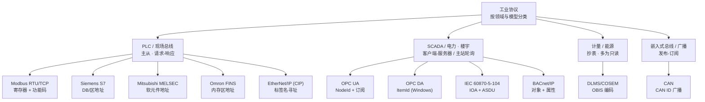

# 工业总线与协议

工业现场的设备说着几十种互不相通的"方言"——PLC
用厂商私有协议、电表用计量标准、楼宇用自控总线。这一章讲清这些协议各自解决什么问题、按什么模型通信、怎么寻址一个数据点，以及选型时该权衡什么。读完你能看懂一台现场设备的协议参数（寄存器地址、字节序、功能码），并知道
IoT DC3 怎么把它们统一成位号值。

> 你在这里：网络层的"工业有线侧"。无线与轻量物联网协议见[IoT 协议与无线网络](./iot-protocols)
> ，上游的物理量从哪来见[传感与测量](./sensing)。

## 这一层是什么 / 为什么存在

把一个温度从传感器送到平台，物理量先被变送器变成电信号、再被采集设备数字化，最后要通过某种**协议**
在网络上传输。工业协议就是这"最后一公里"的语言规约：它规定字节怎么排、地址怎么编、一问一答还是订阅推送、谁主动谁被动。

这些协议为什么这么多、这么乱？因为它们诞生于不同年代、不同行业、不同厂商的封闭生态：

- **历史包袱**。Modbus 1979 年为 PLC 串口通信而生，至今仍是现场最常见的协议；OPC DA 绑定 Windows COM/DCOM，是 PC
  时代的产物；后来才有跨平台的 OPC UA。
- **厂商壁垒**。Siemens 的 S7、Mitsubishi 的 MELSEC（MC 协议）、Omron 的 FINS、Rockwell 的 EtherNet/IP——各家 PLC
  都有自己的私有协议，互不兼容，绑定客户。
- **行业标准**。电力调度有 IEC 60870-5-104，楼宇自控有 BACnet，公用事业计量有 DLMS/COSEM，汽车与嵌入式有
  CAN——每个行业按自己的需求立了标准。

结果是：同一个"读一个数值"的动作，在不同协议里寻址方式、报文格式、数据类型表示全不一样。这一层的价值，就是理解这些差异背后的*
*共性模型**——一旦看穿它们都是"在某个寻址空间里读/写一个值"，异构就不再可怕。

## 关键技术与权衡

抛开语法细节，工业协议的差异集中在四个维度：**通信模型、寻址方式、字节序与数据类型、轮询节奏**。理解这四点，任何陌生协议都能快速上手。

### 三种通信模型

- **主从（Master/Slave）/ 请求-响应**。一个主站轮流向从站发请求、等应答；从站不会主动说话。Modbus、IEC
  104（客户端发总召唤）、S7、MELSEC、FINS 基本都是这个模型。简单、确定，但主站不问就拿不到数据，实时性受轮询周期限制。（Modbus
  即典型主从协议——主站发请求、从站应答，见《物联网之魂：物联网协议与物联网操作系统》孙昊等，机械工业出版社·2019，第 1 章 1.14.2
  节，p165）
- **客户端-服务器（Client/Server）**。比主从更对称：OPC UA 客户端可以浏览服务端的地址空间、按需读写，还能**订阅**
  ——服务端在值变化时主动推送，省去无谓轮询。功能强但握手与会话开销大。（C/S 请求-响应是 Web
  协议的基础模型——客户端发请求、服务端应答，见《物联网之魂：物联网协议与物联网操作系统》孙昊等，机械工业出版社·2019，第 1 章
  1.6.1–1.6.2 节，p49、p51）
- **发布-订阅（Pub/Sub）**。CAN 把带 ID 的帧广播到总线，接收方按 ID
  过滤;MQTT（见无线侧）按主题订阅。没有中心轮询，天然适合多接收方、事件驱动的场景。（发布/订阅模型将发布者与使用者分离，由代理按主题路由消息，见《物联网之魂：物联网协议与物联网操作系统》孙昊等，机械工业出版社·2019，第
  1 章 1.13.2 节，p155）

### 寻址：寄存器 vs 标签 vs 对象

"读哪个点"在不同协议里是完全不同的概念：

- **数字地址（寄存器/IOA/OBIS）**。Modbus 用功能码 + 0
  基偏移定位线圈/寄存器（其标准功能码按读/写归纳通信任务，见《物联网之魂：物联网协议与物联网操作系统》孙昊等，机械工业出版社·2019，第
  1 章 1.14.2 节，p165）；IEC 104 用信息对象地址 IOA 定位遥测遥信；DLMS 用
  6 段 OBIS 编码（如 `1.0.1.8.0.255` = 总有功电能）定位 COSEM 对象。地址是数字，靠工程约定对齐。
- **符号标签（Tag/Item）**。EtherNet/IP（CIP）按标签名寻址：PLC 里的变量叫 `Motor_Speed`，驱动按名字读写，不关心物理地址；OPC 按
  NodeId/ItemId 寻址。可读性好，但名字必须逐字一致。
- **对象 + 属性**。BACnet 把每个量建模为对象（如 Analog Input #1）+ 属性（Present_Value）；DLMS 的 COSEM 对象也有带编号的属性（属性
  2 = 当前值）。

### 字节序与数据类型

工业设备多为大端（Big-Endian），但一个 32 位 `FLOAT` 跨两个 16 位寄存器时，**寄存器顺序**还可能颠倒（ABCD / CDAB / BADC /
DCBA 四种排法），这是 Modbus 现场最常见的坑。协议本身往往只搬运字节，**怎么解释这串字节由配置决定**：是 16 位整数还是 32
位浮点、低字节在前还是高字节在前、要不要乘系数加偏移。配错字节序，浮点会读成一个无意义的大数。

### 轮询机制

主从协议靠定时轮询取数：周期太短压垮设备和总线，太长则实时性差。订阅型协议（OPC
UA、CAN、MQTT）能改善这点——值变才推。工程上常按点位重要性分组轮询：关键量高频、辅助量低频。

下图把本章协议按**应用领域**归类，每类对应一种典型的通信模型与寻址方式：

::: tip 没有"最好"的协议，只有"最合适"的
选型先看设备本身支持什么——多数现场设备协议是固定的、由厂商决定，你只能适配。能选时再权衡：要跨厂商互操作选 OPC
UA；要省带宽、事件驱动选订阅型；纯抄表选 DLMS；轻量、低成本嵌入选 Modbus 或 CAN。
:::

## 工程要点

- **协议端口各不相同，别张冠李戴**。Modbus TCP 是 `502`，EtherNet/IP 是 `44818`，IEC 104 是 `2404`，DLMS TCP 常见 `4059`
  。沿用错端口连不上。
- **地址是工程约定，接入前必须核对**。Modbus 的 `offset` 是 0 基协议地址（"40001"应填 `offset=0`，不是 `40001`）；IEC 104 的
  COT/CA/IOA 字节长度必须与对端一字不差，否则整条报文解析错位；CIP 的标签名区分大小写、必须逐字一致。
- **数据类型与字节序要和设备对齐**。位号的数据类型决定怎么拼字节：多寄存器的 32 位浮点要选对寄存器顺序；CAN 帧载荷要按
  `dataOffset`/`dataLength`/`byteOrder` 切分。把 `REAL` 配成 `DINT`，浮点字节会被当整数解析出无意义大数。
- **读写要分清功能码/服务**。Modbus 读用 `01/02/03/04`、写用 `05/06/15/16`；很多协议读写是不同的服务，可写位号要单独配置写命令。
- **失败要"显性失败"，不要伪造成功**。设备不可达或解析失败时，正确做法是记录失败并退避，而不是回显缓存值或假装写成功——后者会让上层基于错误数据决策。

## 在 IoT DC3 中如何落地

面对这么多异构协议，IoT DC3 的策略是：**每种协议一个[协议驱动](../drivers/)，把协议层差异收敛在驱动内，对上统一成带语义的位号值
**。无论底层是 Modbus 寄存器、CIP 标签还是 OBIS 编码，落到平台都是同一个[位号 Point](../introduction/concepts/point)
的[位号值 PointValue](../introduction/concepts/point-value)，上层的存储、查询、告警、AI 完全无需关心协议细节。

DC3 共内置 **28 个驱动**，本章涉及的工业协议大多有对应驱动：

- [Modbus TCP](../drivers/modbus-tcp) / [Modbus RTU](../drivers/modbus-rtu) — 以太网 / 串口 Modbus 主站
- [OPC UA](../drivers/opc-ua) / [OPC DA](../drivers/opc-da) — OPC 统一架构客户端 / 经典数据访问
- [S7](../drivers/plcs7) — 西门子 PLC
- [MELSEC](../drivers/melsec) — 三菱 PLC（MC 协议）
- [FINS](../drivers/fins) — 欧姆龙 PLC
- [BACnet/IP](../drivers/bacnet-ip) — 楼宇自控
- [SNMP](../drivers/snmp) — 网络设备监控
- [EtherNet/IP](../drivers/ethernet-ip)、[IEC 104](../drivers/iec104)、[DLMS](../drivers/dlms)、[CAN](../drivers/can) —
  罗克韦尔 CIP / 电力 SCADA / 智能电表 / 控制器局域网

### 协议参数即驱动属性，设备实例填值

本章讲的每个协议参数，在 DC3 里都落成驱动声明的**属性**，由设备实例为其填**配置值**
——这套机制见[属性与配置](../introduction/concepts/attribute-config)。以 Modbus TCP 为例：驱动级属性 `host`/`port`
标识从站，位号级属性 `slaveId`/`functionCode`/`offset` 定位寄存器，写命令属性指定写功能码与值模板。换成 EtherNet/IP，位号属性就变成
`tagName`/`tagType`；换成 DLMS，则是 `logicalName`（OBIS）/`attributeId`。前文说的字节序、寄存器顺序，也都体现为相应位号属性。

也就是说，本章的协议知识不是抽象理论——它直接对应你在 DC3 接入设备时要填的每一个字段。读懂协议，就读懂了驱动的属性表。

::: warning 部分驱动当前为协议骨架（WIP）
并非所有驱动都已完成协议层
I/O。[EtherNet/IP](../drivers/ethernet-ip)、[IEC 104](../drivers/iec104)、[DLMS](../drivers/dlms)、[CAN](../drivers/can) 当前为
**骨架实现**：属性表、采集周期、寻址语义已就位且可照填，但实际协议收发的完成度各不相同——

- [IEC 104](../drivers/iec104)、[DLMS](../drivers/dlms)：`read()`/`write()` 直接显式抛"未实现"异常快速失败（由 SDK
  记录失败并退避，而非伪造成功），协议 I/O 尚未编写。
- [EtherNet/IP](../drivers/ethernet-ip)：上层流程（按标签取数、编解码、套接字连接）已就位，但 CIP 协议组帧（`RegisterSession`/
  `ForwardOpen`/封装帧）尚未补全。
- [CAN](../drivers/can)：`read()`/`write()` 通过 `ProcessBuilder` 调 Linux `can-utils`（`candump`/`cansend`
  ）已能实际收发，但字节切分/类型转换（`dataOffset`/`dataLength` 等）与原生 SocketCAN I/O 尚未补齐，写路径的 `data`
  模板当前也未真正接通。

把它们当作接入对应协议的**起点模板**，而非生产可用成品。各驱动页的实现状态以页内标注为准。
:::

::: info Modbus/OPC UA/S7/BACnet 等为可用驱动
[Modbus TCP](../drivers/modbus-tcp)、[Modbus RTU](../drivers/modbus-rtu)、[OPC UA](../drivers/opc-ua)、[OPC DA](../drivers/opc-da)、[S7](../drivers/plcs7)、[MELSEC](../drivers/melsec)、[BACnet/IP](../drivers/bacnet-ip)、[SNMP](../drivers/snmp)
等已实现协议层读写；[FINS](../drivers/fins) 可用但当前读路径仅支持 16 位类型（详见其驱动页）。接入前以各驱动页的属性表与说明为准。
:::

## 参考文献

1. 孙昊 等. 物联网之魂：物联网协议与物联网操作系统[M]. 北京：机械工业出版社，2019. ISBN 978-7-111-62931-3.（第 1 章 1.14.2 节
   基于现场总线的协议转换器 p165 — 主从模型/Modbus 功能码；1.6.1–1.6.2 节 HTTP 协议 p49、p51 — 客户端-服务器模型；1.13.2 节
   发布和订阅模型 p155 — 发布-订阅模型）

## 延伸阅读

- [IoT 协议与无线网络](./iot-protocols) — 网络层的无线侧：MQTT、CoAP、LwM2M、NB-IoT
- [传感与测量](./sensing) — 协议搬运的值从哪来：传感器、变送、量程与精度
- [物联网技术总览](./) — 四层参考架构与本部分的阅读地图
- [设备接入与驱动](../drivers/) — 28 个驱动如何把异构设备统一接进来
- [属性与配置](../introduction/concepts/attribute-config) — 协议参数如何成为驱动属性、由设备实例填值
