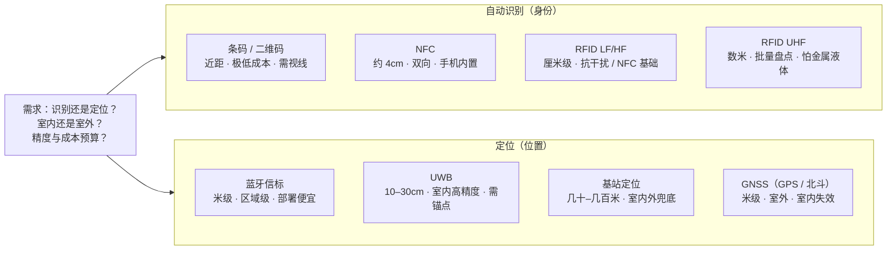
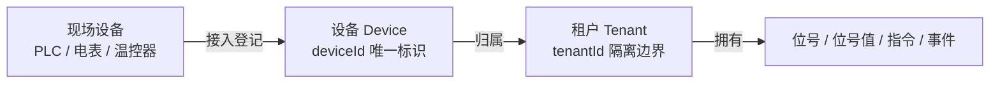

# 自动识别与定位

物联网的第一步，是让物理世界里的每一个物、每一个位置都能被机器"认出来"。这一章讲感知层里两类不靠传感器测物理量、而靠**身份**
和**坐标**说话的技术：自动识别——条码、RFID、NFC，回答"这是什么、是哪一个"；定位——GNSS、基站、UWB、蓝牙信标，回答"它在哪里"
。读完你会清楚每种技术的频段、距离、成本边界，以及"给每个物一个身份"的思想在 IoT DC3 里如何落到 `deviceId` 与 `tenantId` 上。

> 你在这里：感知层已用[传感与测量](./sensing)把物理量变成信号；这一章补上"身份与位置"
> 这条平行的感知支线。下一步可看[工业总线与协议](./fieldbus)，了解这些数据怎么被现场总线传出去。

## 这一层是什么 / 为什么存在

传感器解决"物理量是多少"，识别与定位解决"这是谁、它在哪"。两者都属感知层，但产生的不是连续的模拟量，而是**离散的标识符**和*
*空间坐标**——它们是把现实世界对象映射成数字记录的"主键"和"地址"。

为什么需要单独一类技术？因为一台机器面对成千上万个物理对象时，没有身份就无法区分、无法追踪、无法绑定历史数据。一箱货物从出厂到上架，要被几十个节点扫到；一台叉车在仓库里穿行，要被系统持续知道位置。识别给对象一个
**稳定的名字**，定位给对象一个**实时的坐标**，二者合起来，物理世界才真正"可寻址"。

这类技术的共同特征是：信息密度低（往往只是一个编号）、读取速度快、单点成本要足够低以便规模化铺设。正因如此，它们的工程取舍几乎都围绕一个三角——
**作用距离、信息容量、单件成本**——展开。距离要远就得加功率或加电池，容量要大就得加芯片，而规模化又逼着成本压到极致。理解这个三角，就理解了下面每一种技术的定位。

## 关键技术与权衡

先看自动识别。**条码（一维码）**
是最便宜的身份载体：黑白条纹编码十几位数字，一张纸、一滴墨就能承载，但容量小、必须近距离对准光学扫描、被污损就读不出。**
二维码（QR / DataMatrix）**在两个维度上编码，容量跃升到上千字节，还自带纠错，破损一部分仍可恢复，因此从支付到设备铭牌广泛使用——但它仍是光学识别，需要视线可达。

**RFID**用无线电波取代光学，最大价值是**无需视线、可批量读**。按频段分三档（LF 30 kHz–300 kHz、HF 3 MHz–30 MHz、UHF 300
MHz–3000 MHz，见《物联网：射频识别（RFID）核心技术教程》黄玉兰编著，人民邮电出版社·2016，第 4 章 4.1.1，PDF p67）：**低频 LF（约 125
kHz）**
穿透性好、抗金属液体干扰，但读距仅几厘米、速率低，多用于动物芯片、门禁（LF 常用 125 kHz/135
kHz，可穿透水、有机组织和木材，典型应用含动物识别、电子闭锁防盗，见上书第 4 章 4.1.4，PDF p70–71）；**高频 HF（13.56
MHz）**读距十几厘米、速率适中，是 NFC
的物理基础（13.56 MHz 为全球 ISM 频段，对应 ISO/IEC 14443、ISO/IEC 15693、ISO/IEC 18000-3 等标准，见上书第 4 章 4.1.4，PDF
p71）；**超高频 UHF（860–960 MHz）*
*读距可达数米、支持几百个标签同时盘点，是仓储物流批量识别的主力，但易受金属和液体反射干扰（860–960 MHz 是 EPC Gen2
标准规定的读写器与标签通信频率，见上书第 4 章 4.1.4，PDF p72）。按供电方式又分两类：**无源标签**
没有电池，靠读写器发射的电磁场感应取电，便宜（可低至几分钱）、寿命近乎无限，但读距受限；**有源标签**
自带电池主动发射，读距可达几十米、能附带传感数据，但贵、有寿命（微波标签可分有源、无源，另有半无源标签用钮扣电池供电、读距较远，见上书第
2 章 2.2，PDF p34）。一套 RFID 系统总是**读写器（Reader）**加**标签（Tag）**
：读写器供能并收发，标签携带 ID 并响应（电感耦合多用于无源标签、从读写器近场取电；电磁反向散射读距一般大于 1 m、典型 4–7 m、最大
10 m 以上，见上书第 4 章 4.1.4，PDF p70–71）。

**NFC**本质是 13.56 MHz HF RFID 的近距子集（读距通常 4 cm
内），特点是点对点、双向、可主动可被动，且已内置在几乎每一部手机里——这让它成为"碰一碰"配网、移动支付、电子名片的事实标准。

再看定位。**GNSS（全球卫星导航）**是室外定位的基石，靠测量多颗卫星信号到达的时间差解算三维坐标，代表系统有美国 **GPS** 和中国
**北斗（BDS）**（北斗系统全球范围 95% 置信度下水平 10 m、高程 10 m，地基增强可至实时厘米级、后处理毫米级，见上书前言，PDF
p10–11），现代芯片多为多系统兼容，精度米级、差分增强后可达厘米级（GPS 基本原理为"测时−测距"，PRN 码单点定位精度 5–10
m，伪距/载波相位差分可达亚米级、厘米级甚至毫米级，见《北斗卫星导航系统应用》王博、刘向升、张存杰编，电子工业出版社·2020，第 1 章
1.1.2，PDF p22）——但卫星信号穿不透屋顶，**室内基本失效**（卫星信号到达地面已极微弱，易受高大建筑物、树木等遮挡导致精度下降，见上书第
1 章 1.1.2，PDF p23），且首次定位耗时、功耗较高。
**基站定位**借蜂窝网络的小区信息估算位置，无需额外硬件、室内外都能用，但精度只到几十米到几百米，适合粗略定位和兜底。**
UWB（超宽带）**用纳秒级窄脉冲测飞行时间，室内精度可达 **10–30 厘米**
，是高精度室内定位（人员、资产、机器人）的领先方案，代价是需要预先部署锚点基站、成本较高。**蓝牙信标（Beacon）**
周期广播信号，接收端按信号强度（RSSI）估距，部署便宜、手机即可接收，但 RSSI 受环境干扰大，精度通常只到米级，适合区域级（"
在哪个展区"）而非精确定位。

把这两组技术放进"距离—成本"的取舍平面，脉络就清楚了：

::: tip 没有"最好"，只有"最合适"
仓库批量盘点选 UHF RFID，户外车辆调度选 GNSS，室内人员精确追踪选 UWB，移动端轻配网选 NFC。同一个场景常常组合使用——例如 UWB
实时定位 + 二维码资产登记。
:::

## 工程要点

落地这类系统时，反复踩到的坑往往不在"选哪种技术"，而在物理与工程细节。

**介质与环境**决定成败。UHF RFID
在金属货架、液体容器上读不准，需要专用抗金属标签或调整天线极化；条码在油污、高温、户外暴晒环境下会失效，工业现场常改用激光打标或金属铭牌二维码。选型前必须按真实工况验证读取率，而非看实验室参数。

**频段即合规**。RFID/UWB 工作在受管制的无线电频段，不同国家划分不同（如 UHF RFID 欧洲 865–868 MHz、北美 902–928 MHz、中国
920–925 MHz——我国规划 840–845 MHz 及 920–925 MHz 用于 RFID，见《物联网：射频识别（RFID）核心技术教程》黄玉兰编著，人民邮电出版社·2016，第
4 章 4.1.4，PDF p72），跨区域部署要确认设备频段与发射功率合规，否则会干扰他人或被禁用。

**标识体系要全局唯一**。光有一个芯片不够，编号必须在足够大的范围内不重复才有意义。业界为此建立了编码标准，最典型的是 *
*EPC（Electronic Product Code）**——一套用于 RFID 标签的全球统一对象编码体系，把"厂商 + 商品 + 序列号"
编进一个标识里，让每一件单品（而不只是每一类商品）都有独一无二的身份（EPC
由版本号加域名管理者、对象分类代码、序列号三段组成，分别描述厂商、物品分组和唯一标识每一个物品，见《物联网：射频识别（RFID）核心技术教程》黄玉兰编著，人民邮电出版社·2016，第
3 章 3.1.3，PDF p50）。EPC 的思想正是物联网标识的缩影：**先有全局唯一的
ID，物才能被全网追踪**（EPCglobal 网络以发现服务模块支撑物品寻迹、跟踪与监控，其唯一识别标准基于 RFID 技术，见《物联网 RFID
多领域应用解决方案》拉纳辛哈等著，唐朝伟等译，机械工业出版社·2013，第 9 章，PDF p159、p175）。

**精度与成本要按需匹配**。不要为"在哪个房间"的需求上 UWB，也不要指望蓝牙信标做到厘米级。定位精度每提高一个数量级，硬件与部署成本往往跳一个台阶；先问清业务到底需要多准，再选技术。

::: warning 读不到 ≠ 不存在
RFID/扫码都有漏读率，定位都有误差。系统设计上必须容忍"暂时读不到"
——用多次重读、多点冗余、超时与状态机来兜底，而不是假设每次读取都成功。这一点与传感采集的"可能缺值"是同一类工程现实（RFID
主要采用时分多路接入，冲突分标签冲突与读写器冲突两类；HF 标签多用 ALOHA 算法，UHF
多用树型搜索等确定性方案，见《物联网：射频识别（RFID）核心技术教程》黄玉兰编著，人民邮电出版社·2016，第 10 章 10.1.2，PDF p213）。
:::

## 在 IoT DC3 中如何落地

物联网识别技术的核心思想——**给每个物一个全局唯一、可归属的身份**——在 IoT DC3 里有直接对应，只不过 DC3 处在更上层：它不直接读
RFID 标签或扫码（那是现场设备/采集终端的事），而是为接入平台的每一个对象建立**数字身份与归属边界**。

DC3 用 **`deviceId` 唯一标识**一个[设备 Device](../introduction/concepts/device)。现场一台具体的机器——一台
PLC、一块电表、一个温控器——在平台里就对应一个 `Device`，由它的 `deviceId`
在整个系统中被稳定地寻址、绑定历史数据、关联指令与事件。这与"给每个物一个身份"的标识思想一脉相承：EPC 给每件商品一个全网唯一编号，
`deviceId` 给每台接入设备一个平台内唯一标识；只是 DC3 的身份是软件层登记的，不依赖某种特定的物理标签技术。

DC3 用 **[租户 Tenant](../introduction/concepts/tenant)（`tenantId`）划定归属与隔离边界**。每一条业务记录都带一个
`tenantId`，平台据它把数据切成互不串台的几份——A 公司的设备、位号、数据，B 公司看不见。如果说 `deviceId` 回答"这是哪一个设备"，
`tenantId` 就回答"这个设备归谁、谁能看见它"。识别技术里"身份 + 归属"的二元结构（一个 EPC 编号 + 它属于哪个厂商前缀），在 DC3
里正是 `deviceId + tenantId` 的组合。

::: info DC3 不做"RFID 标签管理"
DC3 的身份模型是平台层的设备登记与租户隔离，并不内置 RFID 标签发卡、读卡器管理或扫码出入库这类现场识别功能。本章把识别技术与
DC3 放在一起，是为了点明二者**共享的标识思想**（全局唯一 ID + 归属边界），而非声称 DC3 提供这些现场能力。若现场用
RFID/扫码采集，它们通过协议驱动以普通数据接入，仍归到某个 `deviceId` 与 `tenantId` 之下。
:::

一句话收束：识别与定位让物理世界**可寻址**，DC3 让接入平台的每个对象**可寻址且可归属**——前者是物联网的入口，后者是平台治理这些对象的起点。

## 参考文献

1. 黄玉兰. 物联网：射频识别（RFID）核心技术教程[M]. 北京: 人民邮电出版社, 2016.
2. 拉纳辛哈 (Ranasinghe, D. C.), 等. 物联网 RFID 多领域应用解决方案[M]. 唐朝伟, 邵艳清, 王恒, 译. 北京: 机械工业出版社,
    2013. (国际信息工程先进技术译丛)
3. 王博, 刘向升, 张存杰. 物联网与北斗应用[M]. 北京: 电子工业出版社, 2020.

## 延伸阅读

- [传感与测量](./sensing) — 感知层的另一半：用传感器把物理量变成可计算的信号
- [工业总线与协议](./fieldbus) — 识别与传感产生的数据，如何经现场总线被传出去
- [物联网技术总览](./) — 回到四层参考架构，看识别与定位在全局中的位置
- [设备 Device](../introduction/concepts/device) — `deviceId` 如何在 DC3 里唯一标识一台现场设备
- [租户 Tenant](../introduction/concepts/tenant) — `tenantId` 如何划定数据归属与隔离边界
