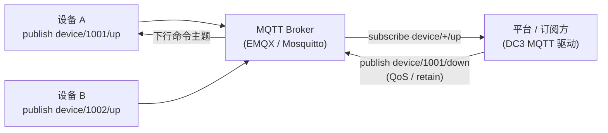
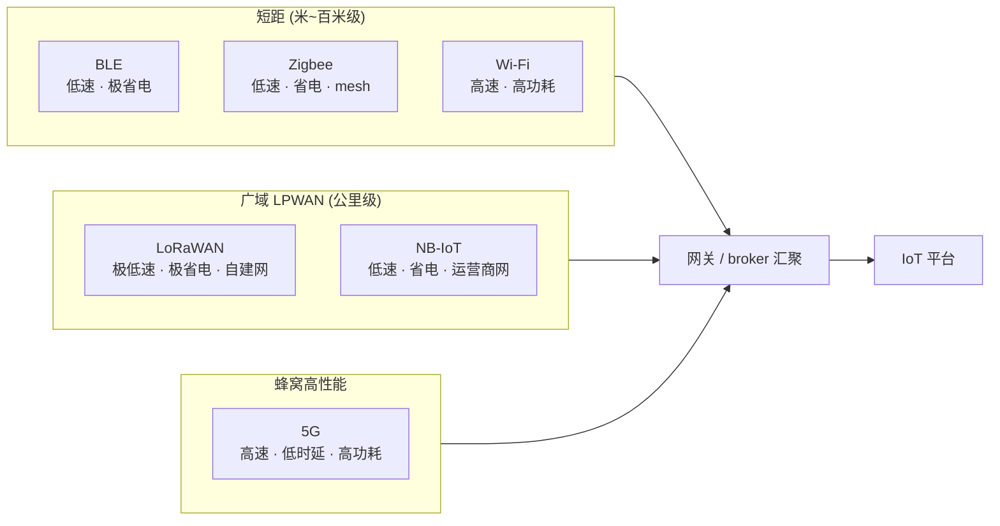

# IoT 协议与无线网络

工业总线把车间里的设备连起来，但更广阔的物联网——电池供电的传感器、远在郊野的水表、跑在公网上的智能硬件——靠的是另一套"
轻、省、远"的协议与无线技术。这一章讲清网络层在 IoT 这一侧的两个面：上层的**应用层消息协议**（MQTT、CoAP、LwM2M、HTTP、AMQP）与下层的
**无线与广域接入**（BLE、Zigbee、LoRa/LoRaWAN、NB-IoT、5G），以及它们之间"功耗—带宽—距离—成本"的权衡。读完你能为一类设备选对协议栈，并知道这些选择在
IoT DC3 里落到哪个驱动上。

> 你在这里：上一章[工业总线与协议](./fieldbus)讲的是现场近端的确定性通信；这一章往外走一层，进入面向海量、低功耗、远距离终端的
> IoT 协议世界。

## 这一层是什么 / 为什么存在

回到[四层参考架构](./)：网络层负责"把感知层产生的信号可靠地送出去"
。工业总线解决的是工厂围墙之内、线缆可达、强实时的连接；而物联网的另一半场景完全不同——设备数量动辄成千上万、分散在广域、靠电池供电、带宽以
KB 计、还经常隔着不可靠的无线链路和公网。在这种约束下，传统的"主站轮询每台设备"模型既费电又不 scalable。

于是 IoT 协议演化出两条主线。一条是**应用层消息协议**：它们定义"一条消息长什么样、怎么投递、可靠到什么程度"，运行在 TCP/UDP
之上，与底层用什么无线无关。MQTT 用发布/订阅把设备与平台解耦，CoAP 把 HTTP 的请求/响应模型压缩到 UDP 上的几十字节，LwM2M 在
CoAP 之上叠加了设备管理的对象模型，HTTP/REST 则因通用而仍被大量上游系统采用。另一条是**无线与广域接入**：它们决定"
信号怎么在空中传"，从几米的 BLE 到几公里的 LoRa，再到运营商网络的 NB-IoT 与 5G。

两条线正交：同一个 MQTT 报文，可以跑在 Wi-Fi 上，也可以跑在 NB-IoT 蜂窝链路上。理解网络层，关键就是把"消息怎么组织"和"
信号怎么传输"这两件事分开看，再按场景把它们组合起来。

## 关键技术与权衡

### 应用层协议：消息怎么组织与投递

**MQTT** 是物联网事实上的消息总线。它的核心是**发布/订阅（pub/sub）**模型：设备不直接和平台对话，而是把消息**发布**到一个*
*主题（topic）**，平台**订阅**这些主题就能收到——双方通过中间的 **broker**（消息中转服务器，如 EMQX、Mosquitto、RabbitMQ 的 MQTT
插件）解耦，互不需要知道对方地址，也无需同时在线。这种"被订阅推送、而非被轮询"的语义，正是海量设备场景下省电、可横向扩展的关键。

MQTT 用三档 **QoS（服务质量）**描述投递保证，发布与订阅两端各自声明、按较弱一方生效：

- **QoS 0（最多一次）**：发出即忘，不确认、不重传。最省，丢了就丢了，适合高频、可容忍丢点的遥测。
- **QoS 1（至少一次）**：要求接收方回 `PUBACK`，未确认则重发——保证不丢，但**可能重复**，下游需幂等。
- **QoS 2（恰好一次）**：四次握手（`PUBREC`/`PUBREL`/`PUBCOMP`）确保不丢不重，最可靠也最重，适合不可重复的关键命令。

> MQTT 提供"至多一次、至少一次、只有一次"三档 QoS 机制，运行在 TCP 之上并支持 TLS，业务可按场景在这三档投递保证中选用（见《物联网之魂：协议与物联网操作系统》孙昊 等，机械工业出版社·2019，第 1 章 1.4.3 MQTT 协议（低带宽），p41）。

另两个常用机制：**retain（保留消息）**让 broker 为每个主题缓存"最后一条"
消息，新订阅者一连上就立刻收到当前值，而不必干等下一次上报，很适合"状态类"主题；**LWT（遗嘱消息）**让设备在异常掉线时由 broker
代发一条预设消息，平台据此感知离线。

版本上，业界长期以 **MQTT 3.1.1** 为主流；**MQTT 5.0** 进一步加入了原因码（reason
code，让错误更可诊断）、用户自定义属性、请求/响应模式、共享订阅（多个消费者负载均衡分担同一主题）等增强。选型时先确认设备固件与
broker 双方都支持目标版本——能力以两端取交集为准，单边支持 5.0 并不会自动启用其特性。

下图是 MQTT 发布/订阅的基本拓扑——设备与平台都只和 broker 打交道：

**CoAP（受限应用协议）**走另一条路：它保留 HTTP 熟悉的**请求/响应 + 方法（GET/PUT/POST/DELETE）+ 资源路径**模型，但把报文压到几十字节、跑在
**UDP** 上（默认端口 `5683`，加密用 DTLS 的 CoAPS `5684`）。无连接的 UDP 省去了 TCP 握手与保活开销，对电池供电、偶尔醒来上报一次的终端极友好；代价是可靠性要靠
CoAP 自己的 CON/NON 确认机制补回来。CoAP 还支持 **Observe**（观察）扩展，让客户端"订阅"一个资源、由服务端在值变化时推送，弥补纯请求/响应的不足。

> CoAP 是面向无线传感网的应用层协议，建立在 UDP 之上以减少开销、支持组播，并提供 GET/PUT/POST/DELETE 等方法与 URI 访问服务端资源（见《物联网之魂：协议与物联网操作系统》孙昊 等，机械工业出版社·2019，第 1 章 1.4.2 CoAP 协议，p39–40）。

**LwM2M（轻量级 M2M）**不是另起炉灶，而是**架在 CoAP 之上**，补齐了 CoAP 缺的"设备管理"那一层。它把设备能力抽象成一棵**对象树
**：`Object`（如 `3303`=温度）/`Object Instance`（同类的多个实例）/`Resource`（如 `5700`=传感器读数），访问一个值就是给出
`/<objectId>/<objectInstanceId>/<resourceId>` 路径。固件升级、远程配置、订阅上报都被标准化进这套模型，因此 LwM2M
在电信级、需要远程运维的终端（NB-IoT 模组、智能表计）里很常见。

**HTTP/REST** 在 IoT 里仍有一席之地：它不为受限设备设计、报文头臃肿、保活成本高，因此**不适合**电池终端高频上报；但它通用、调试方便、几乎所有上游系统都讲
REST，所以大量"从第三方平台 API、从带 RESTful 接口的网关取数"的场景仍用它。**AMQP** 则定位在另一端——它是面向企业消息中间件的可靠队列协议（RabbitMQ
即其实现），报文与状态机比 MQTT 重，一般用于**平台与后端之间**的可靠消息流转，而非直连受限终端。

简言之：高频遥测、海量设备解耦选 MQTT；极受限、偶发上报选 CoAP；要远程管理设备选 LwM2M；对接现成 REST 接口用 HTTP；后端可靠队列用
AMQP。

### 无线与广域接入：信号怎么传

应用层协议解决"消息长什么样"，但消息终究要落到一段物理链路上。无线技术的选型本质是一道**多目标权衡**
：传得越远往往越费电或越慢，省电的往往牺牲带宽，免费频段省钱但易拥塞。把主流技术按"覆盖距离"
分三档铺开，能直观看出各自的生态位——同一档内再按速率与功耗细分：

把权衡量化成一张参考表，按场景倒推选型时更直观：

| 技术      | 覆盖距离          | 速率 | 功耗 | 频段          | 典型场景         |
|---------|---------------|----|----|-------------|--------------|
| BLE     | 十米级           | 低  | 极低 | 2.4 GHz 免授权 | 可穿戴、信标、近场配网  |
| Zigbee  | 十~百米（mesh 可扩） | 低  | 低  | 2.4 GHz 免授权 | 智能家居/楼宇低速设备  |
| LoRaWAN | 数公里           | 极低 | 极低 | Sub-GHz 免授权 | 远程抄表、农业环境监测  |
| NB-IoT  | 广域（运营商）       | 低  | 低  | 授权频段        | 计量、井盖、固定低频上报 |
| 5G      | 广域（运营商）       | 高  | 高  | 授权频段        | 视频、AGV、远程控制  |

- **BLE（低功耗蓝牙）**：典型十米级、低速、极省电，靠纽扣电池可跑数月到数年。适合可穿戴、信标、近场传感与配网，常需手机或网关做中继接入互联网。
- **Zigbee**：基于 IEEE 802.15.4 的短距**自组网（mesh）**，节点可互相中继扩大覆盖，省电、适合智能家居/楼宇里大量低速设备；通过协调器/网关汇聚后再上联。
- **LoRa / LoRaWAN**：**LPWAN（低功耗广域网）**代表。LoRa 是物理层调制（远距、抗干扰），LoRaWAN 是其上的网络协议。工作在免授权
  Sub-GHz 频段，城区可达数公里、郊野更远，速率极低（几百 bps 到几十 kbps），终端极省电——典型"广覆盖、低速率、自建网"
  场景，如远程抄表、农业与环境监测。（LoRa 之名源于 Long Range，由 Semtech 公司采用并推广，是 LPWAN 中的关键一员，见《5G物联网及NB-IoT技术详解》江林华编著，电子工业出版社·2018，第 2 章 2.5.2 LoRaWAN，p71）
- **NB-IoT（窄带物联网）**：运营商蜂窝 LPWAN，跑在授权频段、由电信网络承载，覆盖与穿透好（地下室、井盖）、终端省电、海量连接，但速率低、时延较高。无需自建基站，适合广域、固定、低频上报的计量类终端，常与
  LwM2M/CoAP 搭配。（NB-IoT 属低功耗广域网 LPWAN，其设计针对物联网终端"懒、静止、上行为主"的特点，以低速率与传输延迟上的折中换取覆盖增强、功耗降低与成本减少，见《物联网之魂：协议与物联网操作系统》孙昊 等，机械工业出版社·2019，第 1 章 1.12.3 NB-IoT 节能原理，p119）
- **5G**：高带宽、低时延、海量连接三位一体，覆盖从增强移动宽带到工业控制级的
  uRLLC。能力最强但功耗、模组与资费也最高，适合视频、AGV、远程控制等对带宽/时延敏感的高价值场景，而非纽扣电池传感器。

把权衡浓缩成一句话：**没有"最好"的无线，只有"最匹配"的无线**——先定场景的距离、上报频率、电池预算与单点成本，再倒推选型。

## 工程要点

- **协议与无线解耦**：选型分两步——先按消息模型选应用层协议（pub/sub 还是请求/响应、是否要设备管理），再按物理约束选无线/接入。二者正交，别混为一谈。
- **QoS 不是越高越好**：QoS 2 的四次握手在弱网/海量设备下会显著放大开销与时延。多数遥测用 QoS 0/1 足矣，把"恰好一次"
  留给真正不可重复的关键命令；用 QoS 1 时务必让下游**幂等**。
- **UDP 协议先查防火墙**：CoAP/LwM2M 走 UDP，连不通常是 UDP 端口（`5683`/`5684`）被防火墙挡、或 NAT 映射失效，而非应用配置错——排错先验链路。
- **被动接收 ≠ 没数据时也"在线"**：pub/sub 与 Observe 是设备主动推。平台侧的"在线"判断要靠租约/保活/LWT，而不是"采集周期"
  ；长时间没收到不代表链路一定断，但也别默认它还活着。
- **省电要省在链路上**：终端功耗大头常在无线收发与保活握手，而非 MCU 计算。降功耗优先减少上报频率、用更省的
  QoS、开启长休眠/DRX，而非优化业务逻辑。
- **公网必加密**：跑在公网/蜂窝上的 MQTT、CoAP 要分别启用 TLS（`8883`）、DTLS（`5684`），并做好设备身份（证书/PSK）与主题级授权，避免被仿冒或越权订阅。

### 网络融合趋势

早期物联网是"协议孤岛"——每种设备一套私有协议、一个专用网关。趋势正在收敛：应用层向 **MQTT + CoAP/LwM2M** 两强格局集中（MQTT
管高频遥测、CoAP/LwM2M 管受限与管理）；接入侧 **LPWAN（NB-IoT/LoRa）与 5G** 互补分层，覆盖从"广而省"到"快而强"的全谱。平台侧则用
**统一的协议适配层**把这些异构接入归一成同一套数据模型——这正是 IoT DC3 驱动层在做的事。

## 在 IoT DC3 中如何落地

DC3 把上述"轻协议"各自实现为一个独立的**协议[驱动](../drivers/)**（`dc3-driver-*`
），启动时把自己和可接受的[属性配置](../introduction/concepts/attribute-config)
注册到管理中心，再按[位号](../introduction/concepts/point)采数、按[指令](../introduction/concepts/command)
写值。本章涉及的应用层协议对应四个驱动：

- **[MQTT 驱动](../drivers/mqtt)**（`dc3-driver-mqtt`）：类型为 `DRIVER_SERVER`——它**作为服务端订阅 MQTT 主题、被动接收**
  设备上报，而不是主动轮询。下行有两条路径：位号 `write()` 按 `commandTopic`/`commandQos` 直接 publish 原始值；命令
  `execute()` 才用命令属性 `payloadTemplate` 渲染报文后再发出。连哪个 broker 由部署环境变量 `MQTT_BROKER_HOST` /
  `MQTT_BROKER_PORT` 决定，因此该驱动**没有设备级 driver 属性**；MQTT 侧可配合 **EMQX** 这类 broker，docker-compose 栈默认注入
  RabbitMQ 的 MQTT 插件（`dc3-rabbitmq:1883`；dev profile 的 YAML 端口回退为 `2883`）。
- **[CoAP 驱动](../drivers/coap)**（`dc3-driver-coap`）：类型 `DRIVER_CLIENT`，基于 Eclipse Californium 主动连设备——读对位号
  `readPath` 发 GET、写对 `writePath` 发 PUT，走 UDP `5683`；采集周期 base 配置默认 30 秒，dev profile（默认激活）覆盖为 5 秒。
- **[LwM2M 驱动](../drivers/lwm2m)**（`dc3-driver-lwm2m`）：内嵌一个基于 Eclipse Leshan 的 LwM2M 服务端，设备用 `endpoint`
  名注册上来，按位号的 `objectId/objectInstanceId/resourceId` 三段路径读写资源。
- **[HTTP 驱动](../drivers/http)**（`dc3-driver-http`）：类型 `DRIVER_CLIENT`，用 `WebClient` 周期调 REST 端点、按
  `responsePath` 从 JSON 响应取值。

::: warning MQTT 驱动是"订阅被动到达"语义
`dc3-driver-mqtt` 的 `read()` 不会主动返回采集值——定时读取默认关闭（`schedule.read.enable=false`），位号值是设备 publish 后
**经订阅被动收下**的。若长时间收不到值，先确认设备端是否真的在往订阅主题发布、主题字符串两端是否完全一致，而不是去查"
采集周期"。
:::

::: warning MQTT / LwM2M 驱动当前为骨架实现
源码中 `dc3-driver-mqtt` 的 `read()` 是参考桩、`health()` 恒返回在线，`dc3-driver-lwm2m` 的类注释亦标注 "work-in-progress
skeleton"，协议级 I/O 尚未完整实现。请把它们当作接入模板与配置参考，而非生产就绪驱动；具体以各[驱动页](../drivers/)与源码为准。
:::

至于本章下半部分的**无线/接入技术**（BLE、Zigbee、LoRa、NB-IoT、5G），它们属于物理链路层：DC3 不直接"讲空口"，而是接在它们之上。BLE
与 Zigbee 各有对应驱动（见[驱动总览](../drivers/)的"物联网/无线"分组）；LoRa/NB-IoT/5G 终端通常先汇聚到一个 broker 或 REST
网关，再由 DC3 的 MQTT/CoAP/HTTP 驱动统一接入——即上文"统一协议适配层"在产品里的具体形态。

## 参考文献

1. 孙昊 等. 物联网之魂：协议与物联网操作系统[M]. 北京：机械工业出版社，2019. ISBN 978-7-111-62931-3.（第 1 章 1.4.2 CoAP 协议 p39–40、1.4.3 MQTT 协议 p41、1.12.3 NB-IoT 节能原理 p119）
2. 江林华. 5G物联网及NB-IoT技术详解[M]. 北京：电子工业出版社，2018. ISBN 978-7-121-33831-1.（第 2 章 2.5.2 LoRaWAN p71、2.3 物联网技术分类 p58）
3. 黄宇红，杨光 主编. NB-IoT物联网技术解析与案例详解[M]. 北京：机械工业出版社，2018. ISBN 978-7-111-60888-2.（第 1 章 1.3 典型物联网技术对比，表 1.2：带宽/覆盖/功耗/速率四维横向对比 p5）

## 延伸阅读

- [工业总线与协议](./fieldbus) — 现场近端、确定性强的另一半网络层
- [边缘与云架构](./edge-cloud) — 协议接入之上，数据如何在边与云之间分工
- [物联网技术总览](./) — 四层参考架构与 DC3 全景对照
- [MQTT 驱动](../drivers/mqtt) — 发布/订阅、QoS、broker 在 DC3 里的落地
- [设备接入与驱动](../drivers/) — 28 个协议驱动如何把异构设备接进来
