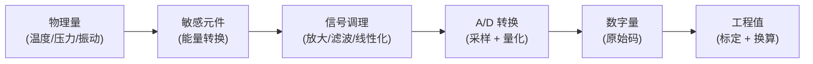

# 传感与测量

感知层是物联网的"皮肤与神经末梢"
——它把温度、压力、振动这些看不见摸不着的物理量，变成机器能读的数字。这一章讲清传感器怎样把物理世界编码成电信号、有哪些常见门类与关键指标、信号要经过哪些调理才能送进处理器，以及这些物理量最终如何在
IoT DC3 里被建模成可读写的[位号 Point](../introduction/concepts/point)。

> 你在这里：四层参考架构的最底层。读完可继续看[自动识别与定位](./identification)，或回到[物联网技术总览](./)。

## 这一层是什么 / 为什么存在

数字系统只会处理数字，而真实世界全是连续变化的物理量。这中间需要一座桥：**传感器**。它的本质是一个**能量转换器**
——把某种物理量（温度、力、光强、位移……）转换成一个便于测量的电学量（电压、电流、电阻、电容、频率）。没有这一步，再强的算力也"看不见"
现场。

感知层之所以单独成层，是因为它有一组别处不具备的约束：它直接面对物理世界的噪声、非线性、温漂与老化，输出的是**带误差的模拟量
**而非干净的数字。把这些误差控制好、把模拟量可靠地数字化，是这一层的全部职责。它向上只交付一件东西：**一个带单位、带量程、可信的数字读数
**。在 DC3 里，这个读数就是一个[位号](../introduction/concepts/point)的取值。

国家标准 GB/T 7665—2005 把传感器定义为"
能感受被测量并按照一定的规律转换成可用输出信号的器件或装置，通常由敏感元件和转换元件组成"
（见《物联网与传感器技术》范茂军主编，机械工业出版社·2012，第5章 5.1.1，PDF p124）。按转换原理，传感器大致分几族，理解分类有助于选型时判断它的脾气：

- **电阻型**：物理量改变电阻。热电阻（PT100）测温、应变片测力与压力、光敏电阻测光。线性较好，但需激励电流、自热会引入误差。
- **电容/电感型**：物理量改变电容或电感。电容式测位移、湿度、液位；电感式（LVDT）测位移。非接触、寿命长，但对寄生参数敏感。
- **压电型**：受力产生电荷，**只能测动态量**（振动、冲击、声）。带宽高，但无法测静态力。
- **热电型**：温差产生电动势（热电偶），量程极宽（可达上千度），但需冷端补偿。
- **半导体/光电型**：PN 结、霍尔元件、光电二极管，把温度、磁场、光照转成电信号，是 MEMS 与片上集成的基础。

## 关键技术与权衡

一颗传感器从感受物理量到交出数字，要走完一条固定的链路：**敏感元件**先把物理量变成微弱的电学量，**信号调理**
把它放大、滤波、线性化到合适范围，**A/D 转换（ADC）**再把连续的模拟电压量化成离散的数字码（见《物联网之源：信息物理与信息感知基础》李同滨等，机械工业出版社·2018，第6章
6.1，PDF p275）。这条链路的每一跳都决定最终读数的质量。



**信号调理**是模拟世界的"预处理"。敏感元件输出常常只有毫伏级、阻抗很高、还混着噪声，无法直接喂给
ADC。调理电路要做：放大（仪表放大器抬升幅度）、滤波（抗混叠低通滤掉高频噪声）、电平搬移（对齐 ADC
输入区间）、激励（给电阻型传感器供恒流/恒压），以及对桥式电路做差分以抑制共模干扰。调理做得好不好，往往比 ADC 位数更影响精度。

**A/D 转换**有两个独立维度，别混为一谈。ADC
转换电路的基本指标包括分辨率、转换速率、量化误差、偏移误差、满刻度误差和线性度等（见《物联网之源：信息物理与信息感知基础》李同滨等，机械工业出版社·2018，第4章
4.2，PDF p190）：

- **采样率**决定时间分辨率。按奈奎斯特定理，采样率必须高于信号最高频率的两倍，否则发生**混叠**——高频假装成低频，无法事后挽救。测振动要几
  kHz 甚至更高，测室温每分钟一次就够。
- **量化位数**决定幅度分辨率。分辨率（Resolution）指数字量变化为一个最小量时模拟信号的变化量，定义为满刻度与 2^n
  的比值，通常以数字信号的位数来表示（同上，PDF p190）。12 位把量程切成 4096 份，16 位切成 65536
  份。位数越高分辨越细，但也越贵、越慢、越受噪声限制（有效位数
  ENOB 常低于标称位数）。

选型与评估传感器，看的是下面这组指标，它们之间几乎总是相互制约。其中灵敏度（稳态下输出量变化值与相应被测变化值之比）、重复性（相同条件下多次测量结果的一致性）、分辨力（规定测量范围内能检测出的被测量最小变化量）、漂移（一定时间间隔内与被测量无关的不希望的变化量，含零点漂移与灵敏度漂移）等静态特性指标的定义，见《物联网与传感器技术》范茂军主编，机械工业出版社·2012，第5章
5.1.2，PDF p125–p126：

| 指标                | 含义          | 工程上的权衡            |
|-------------------|-------------|-------------------|
| 量程 (Range)        | 能测的物理量上下限   | 量程越宽，同等位数下分辨越粗    |
| 精度 (Accuracy)     | 读数与真值的接近程度  | 高精度器件单价显著上升       |
| 分辨率 (Resolution)  | 能分辨的最小变化    | 受 ADC 位数与噪声地板共同限制 |
| 采样率 (Sample Rate) | 单位时间采样次数    | 越高越占带宽、功耗、存储      |
| 线性度 (Linearity)   | 输出与输入成正比的程度 | 非线性需查表/多项式校正      |
| 漂移 (Drift)        | 随时间/温度的缓慢偏移 | 决定多久要重新标定一次       |

::: warning 精度 ≠ 分辨率
分辨率高不代表准。一支能显示到 0.001℃ 的温度计，若没标定，绝对误差可能有 2℃。**分辨率是"看得多细"，精度是"看得多对"**
，两者要分开评估。
:::

::: tip 标定（Calibration）是工程值可信的前提
出厂参数会随时间漂移。标定就是在明确传感器输出与输入关系的前提下，利用标准器具对传感器进行标定，且需要使用标准量值传递系统中至少高一级的标准装置进行检定（见《物联网之源：信息物理与信息感知基础》李同滨等，机械工业出版社·2018，第6章
6.4.4，PDF p308）。标定就是用已知标准量去测传感器、记录偏差并建立修正关系（零点 + 斜率，必要时整条曲线）。在 DC3
里，最常见的线性修正直接落在位号的换算参数上（见下文）。
:::

**MEMS（微机电系统）** 是把敏感结构和电路一起做在硅片上的技术，用半导体工艺批量制造微米级的可动结构。它让传感器变得极小、极廉、极省电——今天手机里的加速度计、陀螺仪、麦克风、气压计几乎都是
MEMS。代价是单颗精度与长期稳定性通常不及传统工业级器件，因此工业现场仍是 MEMS 与传统传感器按场景共存。

## 工程要点

- **先定量程再谈分辨率**。量程是被测对象决定的硬约束；在固定量程下，靠提高 ADC 位数换分辨率，但别忘了噪声地板才是真正的下限。
- **采样率服从信号，不服从习惯**。测什么物理量、它变化多快，决定采样率与是否需要抗混叠滤波。过采样再抽取，常比一味堆位数更划算。
- **线性化与标定要留出位置**。非线性传感器（热电偶、热敏电阻）必须做曲线校正；线性器件也要做零点与斜率标定。把"原始码 →
  工程值"的换算固化下来，现场才好维护。
- **漂移决定运维节奏**。器件手册里的温漂、时漂直接换算成"多久复标一次"，写进运维计划，而不是等读数明显跑偏才补救。
- **执行器是感知的镜像**。如果说传感器把物理量变成电信号（输入），**执行器（Actuator）**
  就是反向的能量转换器，把电信号变回物理动作（输出）：电机转动、阀门开合、继电器通断、加热器升温。一个完整的控制回路是"
  传感→决策→执行→再传感"的闭环——感知层既要读得准，也要写得动。在 DC3 里，读对应只读位号，写对应可写位号，二者由同一套位号模型统一表达。

## 在 IoT DC3 中如何落地

物理世界的"一个量"，在 DC3 里被抽象为**一个位号**。这套建模分三层，正好对应"类型—模板—实例"：

- [物模型 Profile](../introduction/concepts/profile) 是**一类设备的能力模板**。给"温湿度传感器 ZS-100"建一个
  Profile，把它共有的能力定义一次，所有同型号设备复用。
- [位号 Point](../introduction/concepts/point) 是 Profile 下**一个具体的测点**。每个被采集或被写入的物理量对应一个位号，它带着这个量的全部元数据：数据类型
  `pointTypeFlag`、读写能力 `rwFlag`、工程单位 `unit`、换算参数 `multiple`/`baseValue`/`valueDecimal`。
- [设备 Device](../introduction/concepts/device) 是**现场一台实物**，通过 `profileId` 绑定一个 Profile，从而继承它的全部位号。

于是本章讲的物理概念在 DC3 里有了精确落点：

- **单位与量程** → 位号的 `unit` 字段（如 `℃`、`kPa`），描述这个量是什么。
- **读 vs 写（传感器 vs 执行器）** → 位号的 `rwFlag`：传感器读数配 `READ_ONLY`，可控点（执行器、设定值）配 `READ_WRITE` 或
  `WRITE_ONLY`。一个位号能不能被写，唯一由 `rwFlag` 决定。
- **标定与线性换算** → 位号把驱动采到的**原始码**换算成**工程值**，公式与本章信号链的最后一跳完全对应：

```text
工程值 = 原始值 × multiple + baseValue   （再按 valueDecimal 保留小数）
```

例：一个温度变送器寄存器读数 `2531`，配 `multiple=0.01`、`baseValue=0`、`unit=℃`、`valueDecimal=2`，换算后这个位号的取值就是
`25.31 ℃`。这正是把传感器线性标定参数沉淀进模型的方式。

::: info 一个温度读数 = 一个位号的取值
现场一支温度传感器此刻 25.3℃，在 DC3 里就是它所属设备上那个温度位号的一条[位号值](../introduction/concepts/point)
。物理量经传感→调理→ADC→换算，最终落成的就是这一个数。本章对字段含义的描述以位号概念页与源码为准。
:::

这样，感知层的工程细节（敏感原理、调理、ADC、标定）被收敛成几个稳定的位号属性；上层服务无需关心传感器型号，只面对"
一个带单位、带读写能力、已换算到工程值的数字量"。物理世界的复杂度，到位号这一层被一次性吸收。

## 参考文献

1. 范茂军. 物联网与传感器技术[M]. 北京: 机械工业出版社, 2012.
2. 李同滨, 等. 物联网之源: 信息物理与信息感知基础[M]. 北京: 机械工业出版社, 2018.

## 延伸阅读

- [自动识别与定位](./identification) — 感知层的另一半：身份与位置的获取
- [物联网技术总览](./) — 四层参考架构与本层的定位
- [位号 Point](../introduction/concepts/point) — 物理量在 DC3 中的落点：类型、读写、单位、换算
- [物模型 Profile](../introduction/concepts/profile) — 一类设备的能力模板，聚合全部位号
- [设备 Device](../introduction/concepts/device) — 现场实物的镜像，绑定 Profile 继承位号
