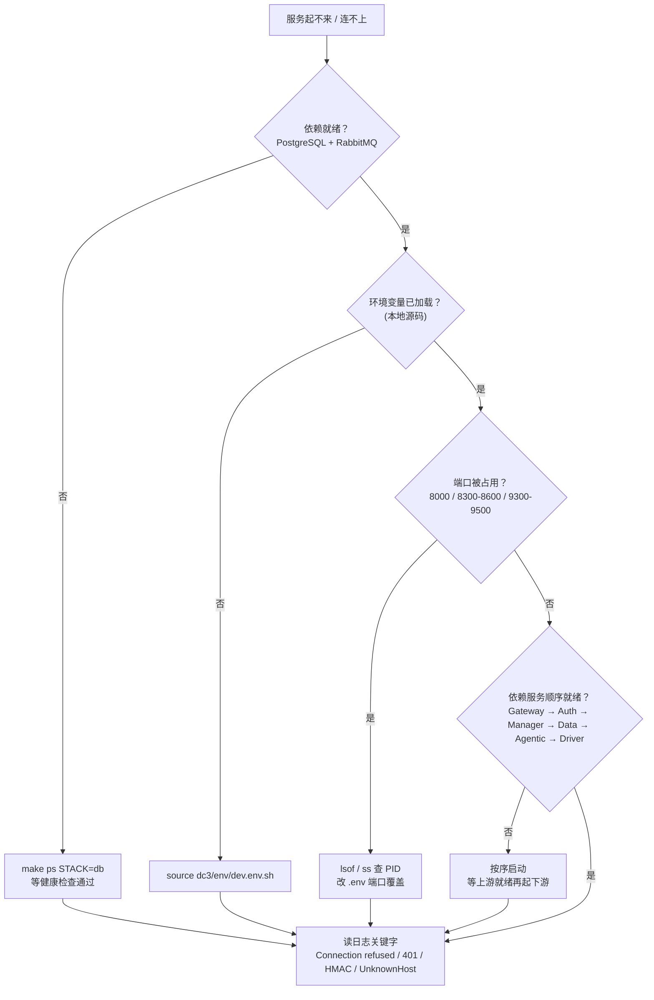

# 故障排查

这页帮你在本地起不来、连不上、被拒绝时快速定位：每条问题都按 **症状 → 根因 → 定位** 展开，不只给解法，还告诉你"
为什么会这样、该读哪条日志、该看哪个端口"。读完你能独立判断卡在依赖、环境变量、端口还是鉴权上。

> 你在这里：多半是在跟着[从源码本地开发](../quickstart/)或起容器栈，遇到了启动或连接报错。先按下面的决策流程把问题归类，再跳到对应小节。除非特别说明，命令都在
`iot-dc3/` 目录执行。

## 先把问题归类：排障决策流程

绝大多数"起不来 / 连不上"都能归到五类：依赖未就绪、环境变量没加载、端口被占、依赖服务启动顺序错、以及鉴权链路问题。按下图自上而下排除，比逐个猜测快得多——平台对外只有网关一个
HTTP 入口（`8000`），中心服务靠 gRPC facade 互联、驱动与数据中心靠 RabbitMQ 解耦，所以一旦底层依赖（PostgreSQL /
RabbitMQ）没起，上层会连环失败。



这条决策链的顺序不是随意的：变量没加载会让所有连接指向错误主机，端口占用会让进程在绑定阶段就退出，而依赖服务的启动顺序决定了
gRPC facade 和驱动注册能否成功。把前四关排掉之后，剩下的几乎都能在日志关键字里看到根因。

## 依赖未就绪：PostgreSQL / RabbitMQ 连不上

**症状**：应用启动日志反复打印 `Connection refused`、`Connection to localhost:35432 refused`，或 RabbitMQ 报
`Channel shutdown` / `vhost not found`；中心服务起来后又退出。

**根因**：PostgreSQL 或 RabbitMQ 容器尚未启动、健康检查未通过，或本地源码运行时连接参数指向了错误的主机/端口。关键陷阱是 *
*host 与容器内地址不同**：容器内服务之间用 `dc3-postgres:5432`、`dc3-rabbitmq:5672`，而宿主机上的本地 Java 进程要走对外发布端口
`localhost:35432`、`localhost:35672`。

**定位与处理**：先确认依赖栈在跑、且发布端口与应用变量一致。

::: code-group

```bash [make]
make ps STACK=db        # 看 postgres / rabbitmq 容器是否 healthy
make config STACK=db    # 打印生效的 compose 配置，核对发布端口
make logs STACK=db      # 跟随依赖容器日志（最近 200 行）
```

```bash [podman]
podman ps               # 列出运行中的容器与端口映射
podman exec dc3-postgres psql -U dc3 -d dc3 -c "select 1"   # 直连验证库可用
```

:::

确认容器 `healthy` 后，本地源码运行**必须先加载环境变量**，让连接指向 Compose 发布到 localhost 的依赖：

```bash
source dc3/env/dev.env.sh
```

RabbitMQ 单独排查时，核对这几个变量与容器实际一致（默认值见 [环境变量详解](../quickstart/environment)）：`RABBITMQ_HOST`、
`RABBITMQ_PORT`（本地 `35672`，容器内 `5672`）、`RABBITMQ_USERNAME`、`RABBITMQ_PASSWORD`、`RABBITMQ_VIRTUAL_HOST`（默认 `dc3`
）。vhost 不一致会直接表现为连接建立后立刻 `Channel shutdown`。

::: tip 为什么先等健康检查
中心服务在启动早期就要建立数据库连接池与 RabbitMQ 通道。若依赖还在初始化（PostgreSQL 首次启动会跑 7 个 initdb
脚本建表与种子数据），过早启动的上层服务会因连接失败而退出。等 `make ps STACK=db` 显示 healthy 再起上层，能省掉一轮无谓的重启。
:::

## 环境变量没加载：连接指向错误主机

**症状**：依赖容器明明在跑，本地源码却连不上，或连到了非预期的主机/端口；改了根目录 `.env` 却对本地 Java 进程"不生效"。

**根因**：根目录 `.env` **只服务 Docker Compose**，不会自动注入到本地 Java 进程。本地用 IDE 或命令行直接跑 jar 时，必须显式加载
`dc3/env/dev.env(.sh)`，它把连接指向 Compose 发布在 localhost 上的依赖端口。三个文件分工不同：

| 文件                   | 给谁用             | 作用                                  |
|----------------------|-----------------|-------------------------------------|
| 根目录 `.env`           | Docker Compose  | 镜像仓库、标签、发布端口；**不注入本地 Java**         |
| `dc3/env/dev.env`    | IDE（EnvFile 插件） | 本地 Java 运行，无 `export`               |
| `dc3/env/dev.env.sh` | Shell           | 本地 Java 运行，带 `export`，用 `source` 加载 |

**处理**：命令行/脚本启动前先 `source dc3/env/dev.env.sh`；IDE 里用 EnvFile 插件挂 `dc3/env/dev.env`。完整变量目录、host
与容器内地址的对应关系，见 [环境变量详解](../quickstart/environment)。

## 端口被占用：进程绑定阶段就退出

**症状**：启动失败，日志含 `Address already in use` / `Web server failed to start. Port 8400 was already in use`，提示
`8000`、`8300`、`8400`、`8500`、`8600`、`9300`、`9400`、`9500` 等端口已占用。

**根因**：同一端口被上一轮没退干净的进程、或别的程序占用。这些端口分别对应网关 HTTP（`8000`）、四个中心 HTTP（Auth `8300` /
Manager `8400` / Data `8500` / Agentic `8600`）和三个 gRPC 端口（Auth `9300` / Manager `9400` / Data `9500`）。

**定位（跨操作系统）**：先查是谁占了端口，拿到 PID 再决定是结束它还是换端口。

::: code-group

```bash [macOS / Linux (lsof)]
lsof -i :8400 -sTCP:LISTEN    # 列出监听 8400 的进程与 PID
kill <PID>                    # 确认是残留进程后再结束
```

```bash [Linux (ss)]
ss -ltnp 'sport = :8400'      # 显示监听 8400 的进程（含 PID）
```

```bash [Linux (netstat)]
netstat -ltnp | grep ':8400'  # 旧系统用 netstat 同样能查到 PID
```

```powershell [Windows (PowerShell)]
Get-NetTCPConnection -LocalPort 8400 -State Listen | Select-Object OwningProcess
Stop-Process -Id <PID>        # 核实后结束占用进程
```

:::

**处理**：若端口被合法程序占用、不便结束，就改用环境变量或根目录 `.env` 覆盖端口，让 DC3 服务避开冲突。常用覆盖变量：

- `DC3_GATEWAY_PORT`、`DC3_AUTH_PORT`、`DC3_MANAGER_PORT`、`DC3_DATA_PORT`、`DC3_AGENTIC_PORT`（Compose 发布端口）
- `SERVER_PORT`、`GRPC_SERVER_PORT`（单服务本地运行时覆盖该进程的 HTTP / gRPC 端口）

::: warning 本地同时跑多个服务时
`SERVER_PORT` / `GRPC_SERVER_PORT` 是**单进程级**覆盖。只在本地单独起某个服务、需要避让默认端口时设置；多服务并行时要分别赋不同值，否则它们会互相抢同一个端口。
:::

## 启动顺序错：依赖服务尚未就绪

**症状**：驱动注册失败、gRPC 调用报 `UNAVAILABLE`，或中心服务起来后因拿不到下游而异常。

**根因**：中心服务之间通过 gRPC facade 协作，驱动启动时要向管理中心注册并依赖 RabbitMQ。若上游还没就绪就起下游，连接会失败。正确的启动次序是
**Gateway → Auth → Manager → Data → Agentic → Driver**。

**定位与处理**：

1. 按 Gateway → Auth → Manager → Data → Agentic → Driver 顺序启动，每起一个等它就绪再起下一个。
2. 本地源码运行确认已 `source dc3/env/dev.env.sh`。
3. 查看管理中心与驱动日志，确认 gRPC 目标地址（`CENTER_MANAGER_HOST` 等，默认 `localhost`）可达。
4. 确认 `dc3.driver.code` 唯一且稳定——编码重复会让注册被拒。

::: danger 驱动编码不可随意改
`dc3.driver.code` 是驱动的稳定路由标识，数据中心据此把命令路由回对应驱动实例。一旦上线就不要改动；改了会导致已绑定该驱动的设备命令无法送达。
:::

## 鉴权失败：401 / 403 与 HMAC

**症状**：通过网关访问受保护接口返回 `401`（未认证）或 `403`（无权限）。

**根因**：请求没有携带有效 token，或租户/登录名/token 三件套不齐。平台登录是两步：先取盐、再用盐哈希密码换 token；后续每个受保护请求要带上
`X-Auth-Tenant`、`X-Auth-Login`、`X-Auth-Token` 三个请求头。

**定位与处理**：先走登录拿 token，再带头访问。下面是黄金路径的真实接口（示例值需替换为你环境的实际值）：

```bash
# 1) 取盐（公开端点，建议 5 分钟内使用）
curl -X POST http://localhost:8000/api/v3/auth/token/salt \
  -H 'Content-Type: application/json' \
  -d '{"tenant":"default","name":"dc3"}'

# 2) 用盐哈希密码后换 token（12 小时有效）
curl -X POST http://localhost:8000/api/v3/auth/token/generate \
  -H 'Content-Type: application/json' \
  -d '{"tenant":"default","name":"dc3","salt":"<上一步返回的盐>","password":"<用盐哈希后的密码>"}'

# 3) 带三件套访问受保护接口
curl -X POST http://localhost:8000/api/v3/data/point_value/latest \
  -H 'X-Auth-Tenant: default' \
  -H 'X-Auth-Login: dc3' \
  -H 'X-Auth-Token: <上一步返回的 token>' \
  -H 'Content-Type: application/json' \
  -d '{"current":1,"size":10}'
```

若 401 集中出现在网关到后端这一跳（而非用户 token 问题），多半与 HMAC 签名有关。网关会用 `AUTH_HMAC_SECRET` 对注入的
`X-Auth-Principal` 做 HMAC-SHA256 签名，后端校验签名后才信任 principal。Swagger UI
的认证方式见 [API 文档](../development/api-documentation)。

::: danger 生产/预发环境 HMAC 会 fail-fast
当 Spring profile（或 `spring.env`）命中 `pre` 或 `pro` 时，若 `AUTH_HMAC_SECRET` 为空、或仍是默认弱密钥
`io.github.pnoker.dc3`，服务会在启动时直接抛 `IllegalStateException` 拒绝启动。这是有意为之的安全闸门：上 `pre`/`pro` 前*
*必须**把 `AUTH_HMAC_SECRET` 与 `DC3_SECURITY_KEY` 换成强随机值，且不得记录或硬编码。
:::

## pre/pro profile 本地起不来

**症状**：用 `pre` / `pro` profile 在本地启动时连接报错（`UnknownHostException` / `Connection refused`），或服务直接
fail-fast 退出。

**根因**：`pre` / `pro` 面向容器栈部署，连接参数默认指向容器主机名而非 localhost：数据源 `POSTGRES_HOST` 默认
`dc3-postgres`、`RABBITMQ_HOST` 默认 `dc3-rabbitmq`、gRPC 通道用 `static://${CENTER_AUTH_HOST:dc3-center-auth}:9300`
这类容器内地址。本地没有这些主机名解析，连接自然失败。叠加 HMAC 安全闸门：`pre` / `pro` 下 `AUTH_HMAC_SECRET` 为空或仍是默认弱密钥时服务会
fail-fast 拒绝启动（见上一节）。

**处理**：本地源码调试一律用 `dev` profile——它把连接指向 Compose 发布到 localhost 的依赖端口。只有在真正验证容器部署形态时才用
`pre` / `pro`，并确保容器主机名可解析、HMAC / 安全密钥按生产要求配置就位。

## 构建与镜像类问题

下面几类不属于运行时连接，而是构建/打包阶段，单独归一处。

**Maven 构建很慢**——根因是并行度或堆内存没生效。仓库已配默认参数：`.mvn/maven.config` 含 `-T 1C`、`.mvn/jvm.config` 含
`-Xms512m -Xmx1024m`。仍慢可适当加大堆内存或减少本机后台 CPU 占用。

**Java 版本错误**——出现 `unsupported class file major version` 或 Maven Enforcer 报错，根因是项目要求 JDK 21。用下面两条确认
**Maven 实际使用的 Java** 也是 21（两者可能不一致）：

```bash
java -version
mvn -version
```

**Docker 镜像构建失败**——根因多为镜像内 Maven 打包失败或依赖未提前构建。先在宿主机确认 Maven 通过，再构建镜像：

```bash
make package
make build STACK=db
```

**镜像源不符合预期**——根因是镜像仓库选择。用 `REGISTRY` 切换：`global` 走默认仓库（Docker Hub `pnoker`），`cn`
走中国大陆镜像（Aliyun）。

```bash
make up STACK=db REGISTRY=global   # 默认仓库
make up STACK=db REGISTRY=cn       # 大陆镜像
```

## 想更快调试

把 Auth、Manager、Data 的能力放进单个 JVM，用 `dc3-center-single` 起一个进程，省去多服务间的启动协调：

```bash
source dc3/env/dev.env.sh
java -jar dc3-center/dc3-center-single/target/dc3-center-single.jar
```

::: info 单进程仅供本地调试
单 JVM 模式方便本地快速验证，**不代表生产部署形态**——生产仍是网关 + 四中心 + 驱动的分布式拓扑。
:::

## 延伸阅读

- [从源码本地开发](../quickstart/) — 本地起依赖、加载环境变量、跑通第一个驱动的完整步骤
- [环境变量详解](../quickstart/environment) — host 与容器内地址对应、端口与连接变量的完整目录
- [服务与拓扑](../architecture/services) — 网关、四中心与驱动如何编排，理解启动顺序背后的依赖关系
- [API 文档](../development/api-documentation) — Swagger UI 与鉴权头的使用方式
