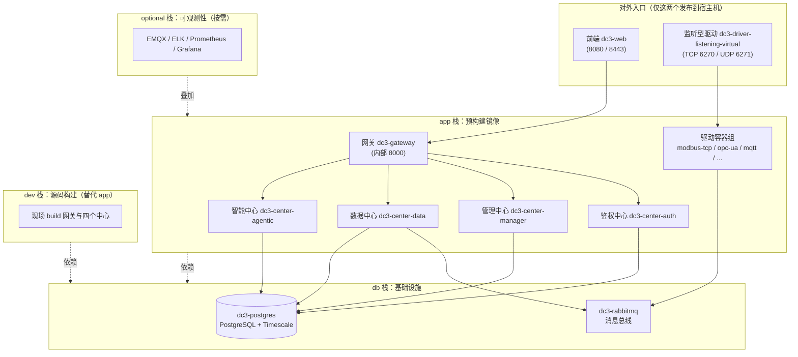

# 部署模式与镜像源

IoT DC3 用四个 Compose 栈拼出完整环境：`db` 起依赖、`dev` 从源码构建、`app` 拉预构建镜像、`optional` 叠可观测性。这页讲清每个栈的用途、
`make` 生命周期命令、以及镜像从哪个仓库拉、对外暴露哪些端口——读完你能挑对栈、选对镜像源、知道生产上该锁哪些口。

> 你在这里：准备真正把平台跑起来。想先备齐环境变量看 [环境变量详解](../quickstart/environment)
> ；想从源码本地开发看 [快速开始](../quickstart/)。

## 四个 Compose 栈各司其职

平台没有"一个大 compose 包打天下"，而是按职责切成四个栈，分别对应 `dc3/` 下四个 Compose 文件。它们叠加使用：依赖层先起，应用层再起，可观测层按需加。

- **`db`**（`docker-compose-db.yml`）：基础设施层，只有两个容器——`dc3-postgres`（PostgreSQL +
  AGE/TimescaleDB/pgvector，承载元数据、时序值、告警、Agentic 会话）和 `dc3-rabbitmq`（数据流/命令流的消息总线）。任何应用栈都依赖它先就绪。
- **`dev`**（`docker-compose-dev.yml`）：源码构建栈，从本地 `Dockerfile` 现场 `build` 出 `dc3-gateway`
  与四个中心（auth/manager/data/agentic）等。给改后端代码、要本地调试的人用；前端不在此栈内，单独 `pnpm dev` 起。
- **`app`**（`docker-compose.yml`）：预构建镜像栈，直接拉远端镜像跑，含前端 `dc3-web`、网关、四个中心、以及一组驱动容器。给评估、演示、生产部署用——不编译、起得快。
- **`optional`**（`docker-compose-optional.yml`）：可观测性与可选依赖栈，含
  EMQX、Elasticsearch/Logstash/Kibana、Prometheus、Grafana、APM 及若干
  exporter。按需叠加，不影响核心链路。详见 [可观测性](./observability)。

::: info dev 与 app 的取舍
要改 Java 代码就用 `dev`（现场构建，改完重 build）；只想把平台跑起来评估或上生产就用 `app`（拉镜像，最快）。两者用的是同一套
`db`/`optional` 依赖栈。
:::

## 部署拓扑：谁对外、谁只在内网

下图给出四栈如何叠加，以及 ingress 边界——**生产形态（app 栈）只有 `dc3-web` 和 `dc3-driver-listening-virtual` 发布到宿主机
**，网关与四个中心都在内部 `dc3net` 网络里，靠前端反代或内部调用访问，不直接对外。



::: danger 对外入口只有 web 与 listening-virtual
在 `app`（生产）栈里，只有 `dc3-web`（8080/8443）和 `dc3-driver-listening-virtual`（TCP 6270 / UDP 6271）发布到宿主机端口；网关
8000、四个中心的 HTTP/gRPC 端口、数据库、消息队列**一律只在内部网络**，不要额外暴露到公网。

注意 `dev` 栈为方便调试会额外发布网关 8000 与各中心 HTTP 端口（8300/8400/8500/8600）及 auth/manager/data 对应的
gRPC（9300/9400/9500，agentic 无 gRPC server），这是开发便利，**不要照搬到生产**。所有发布默认绑定 `DC3_BIND_HOST=127.0.0.1`
（仅本机），需要跨机访问才改成 `0.0.0.0`，且改之前先收敛端口。
:::

## make 生命周期：一套命令操作任意栈

所有栈共用同一组 `make` 目标，靠变量选择"对哪个栈、哪些服务、用哪个镜像源"。命令都在 `iot-dc3/` 目录下跑。

核心生命周期目标：

- `make build` — 构建镜像（`dev` 栈现场编译；`app` 栈一般无需 build）
- `make up` — 启动（`-d` 后台）
- `make down` — 停止并移除容器（保留数据卷）
- `make config` — 渲染并校验 Compose 配置，不实际启动
- `make logs` — 跟随日志（`-f --tail=200`）
- `make reset` — ⚠️ down + **删除数据卷**，需显式确认（见下方 danger）

选择"操作哪个栈、哪些服务"的变量：

| 变量         | 默认               | 作用                                                     |
|------------|------------------|--------------------------------------------------------|
| `STACK`    | `dev`            | 选栈：`db` / `dev` / `app` / `optional`                   |
| `SERVICES` | （空=全部）           | 只操作指定服务，空格分隔，如 `SERVICES="gateway agentic"`            |
| `GROUP`    | （空）              | 预定义服务组：`center`（四个中心）/ `core`（中心 + 网关）/ `drivers`（驱动组） |
| `COMPOSE`  | `podman compose` | 容器运行时（本仓库统一用 podman）                                   |

`GROUP` 是 `SERVICES` 的快捷写法——`center` 展开为 `auth manager data agentic`，`core` 再加 `gateway`，`drivers` 展开为内置驱动集合。
`SERVICES` 与 `GROUP` 可叠加。

::: code-group

```bash [起完整环境]
# 依赖 → 可观测性 → 源码构建栈
make up STACK=db
make up STACK=optional
make up STACK=dev
```

```bash [只起部分服务]
make up STACK=db
make up SERVICES="gateway agentic"   # 只起网关 + 智能中心
make up GROUP=core                    # 起四个中心 + 网关
make logs SERVICES="gateway agentic"  # 只看这两个的日志
```

```bash [校验与下线]
make config STACK=app                 # 只渲染配置，不启动
make down STACK=dev                   # 停 dev 栈，保留数据
```

:::

::: danger reset 会删数据卷
`make reset` 会执行 down 并**删除数据卷**——PostgreSQL 里的元数据、时序值、告警全部丢失。它带硬性闸门：必须显式
`CONFIRM_RESET_VOLUMES=true` 才会执行，否则直接拒绝。

```bash
make reset STACK=db CONFIRM_RESET_VOLUMES=true
```

生产环境慎用。删卷后下次起库会重新跑一遍 initdb 种子脚本（见末节）。
:::

## 镜像源：REGISTRY 选仓库，DC3_IMAGE_TAG 选版本

镜像从哪个仓库拉由 `REGISTRY` 决定，它在 `make` 层把 `DC3_IMAGE_REGISTRY`（Compose 实际读的命名空间）解析出来：

| `REGISTRY` | 解析出的 `DC3_IMAGE_REGISTRY`                       | 适用                |
|------------|-------------------------------------------------|-------------------|
| `auto`（默认） | 读环境/`.env` 里的 `DC3_IMAGE_REGISTRY`，未设则 `pnoker` | 自定义私有仓库或沿用 `.env` |
| `global`   | `pnoker`（Docker Hub）                            | 海外/通用网络           |
| `cn`       | `registry.cn-beijing.aliyuncs.com/dc3`（阿里云）     | 中国大陆，拉取更快         |

传入其它值会直接报错 `Unsupported REGISTRY`。镜像版本由 `DC3_IMAGE_TAG`（默认 `2026.6`）统一控制——所有服务与依赖镜像共用同一个
tag，生产建议钉死具体版本而非 `latest`。

::: code-group

```bash [Docker Hub（global）]
make up STACK=db REGISTRY=global
make up STACK=app REGISTRY=global
```

```bash [阿里云（cn，国内更快）]
make up STACK=db REGISTRY=cn
make up STACK=app REGISTRY=cn
```

:::

举例：在 `cn` 下，网关镜像解析为 `registry.cn-beijing.aliyuncs.com/dc3/dc3-gateway:2026.6`；在 `global` 下则是
`pnoker/dc3-gateway:2026.6`。完整镜像清单见末节折叠的命令参考。

::: warning Makefile 用 REGISTRY，Compose 用 DC3_IMAGE_REGISTRY
两个名字别混。`REGISTRY=auto|global|cn` 是 `make` 的选择器，它负责把对应的 `DC3_IMAGE_REGISTRY` 命名空间注入 Compose；直接跑
`podman compose` 时要自己设 `DC3_IMAGE_REGISTRY`。
:::

## 起栈后：种子数据与对外验证

`app`/`dev` 栈起来后，平台已可用。验证对外入口最直接的方式是走前端 `dc3-web`（默认 `http://127.0.0.1:8080`）。若要从命令行打
API，需经网关——但网关在 `app` 栈不对外，通常在 `dev` 栈（发布 8000）下验证。登录是两步：先 `POST /api/v3/auth/token/salt` 取盐，再
`POST /api/v3/auth/token/generate` 换取 12 小时有效的 token，后续请求带上 `X-Auth-Tenant` / `X-Auth-Login` /
`X-Auth-Token` 三个鉴权头。

```bash
# 仅在网关对外的 dev 栈下可用；值均为示例，按你的租户/账号替换
# 1) 取盐（公开）
curl -s -X POST http://127.0.0.1:8000/api/v3/auth/token/salt \
  -H 'Content-Type: application/json' \
  -d '{"tenant":"default","name":"dc3"}'
# → 返回盐字符串（示例；建议 5 分钟内使用）

# 2) 用盐对密码哈希后换取 token（公开），返回 12 小时有效的访问令牌
curl -s -X POST http://127.0.0.1:8000/api/v3/auth/token/generate \
  -H 'Content-Type: application/json' \
  -d '{"tenant":"default","name":"dc3","salt":"<上一步返回>","password":"<哈希后密码>"}'
```

数据库首次在**空数据卷**上启动时，`dc3-postgres` 入口会按文件名顺序执行 `initdb` 下的 **7 个种子脚本**，一次性建好库结构与基础数据：

| 顺序 | 脚本                          | 内容                    |
|----|-----------------------------|-----------------------|
| 00 | `00-iot-dc3-extensions.sql` | 启用扩展                  |
| 01 | `01-iot-dc3-common.sql`     | 公共表                   |
| 02 | `02-iot-dc3-auth.sql`       | 菜单、资源、用户、角色、OAuth/MCP |
| 03 | `03-iot-dc3-data.sql`       | 运行时数据：告警、通知、规则        |
| 04 | `04-iot-dc3-manager.sql`    | 实体管理：设备、驱动、位号、模板      |
| 05 | `05-iot-dc3-history.sql`    | 时序超表（hypertable）      |
| 06 | `06-iot-dc3-agentic.sql`    | 会话、消息、附件              |

::: warning 种子脚本只在空库首次跑
这些脚本仅在数据卷为空时执行一次。卷里已有数据时不会重跑，改了 SQL 也不会自动生效——要重新种子，得先
`make reset ... CONFIRM_RESET_VOLUMES=true` 清卷（会丢数据）。
:::

::: danger 生产 secrets 必须随机
`.env.example` 里的 `DC3_SECURITY_KEY`、`AUTH_HMAC_SECRET`，以及 `POSTGRES_PASSWORD` / `RABBITMQ_PASSWORD`（默认
`dc3dc3dc3`）都是**公开的弱默认值**，仅供本地。生产部署前必须替换为强随机值。

其中 `AUTH_HMAC_SECRET` 带 fail-fast 保护：当 Spring profile 命中 `pre` 或 `pro`、而密钥为空或仍等于默认
`io.github.pnoker.dc3` 时，服务启动直接抛 `IllegalStateException`
拒绝起来。各密钥含义见 [环境变量详解](../quickstart/environment)。
:::

## 完整命令与镜像参考

下面折叠的是 `dc3/doc/USAGE.md` 的完整原文，列出所有 `make` 快捷命令与每个服务在 Docker Hub / 阿里云两套仓库的镜像坐标，作为操作时的速查表。

::: details 展开完整命令与镜像清单
<!--@include: ../../../dc3/doc/USAGE.md-->
:::

## 延伸阅读

- [环境变量详解](../quickstart/environment) — 每个 `DC3_*` / 运行时变量的默认值、作用域与生产取值
- [可观测性](./observability) — `optional` 栈里 EMQX/ELK/Prometheus/Grafana 怎么接、看什么
- [从源码本地开发](../quickstart/) — 用 `dev` 栈 + IDE 起后端、`pnpm dev` 起前端的本地开发流程
