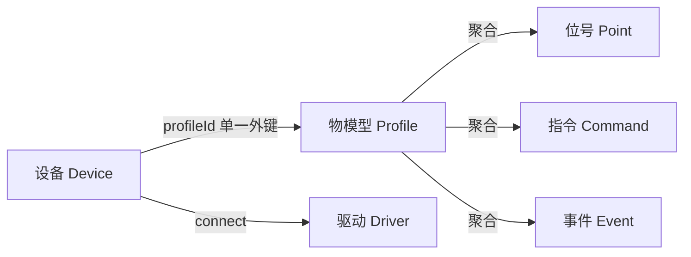
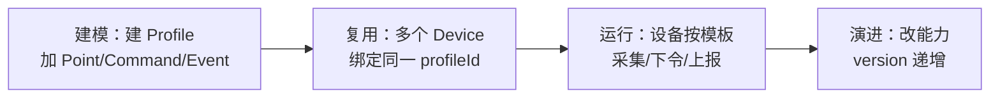

# 物模型（模板） Profile (Thing Model)

> **物模型是"一类设备的能力模板"**——它把同型号设备共有的[位号](./point)、[指令](./command)、[事件](./event)聚合在一起，描述"这类设备能采什么、能控什么、会报什么"。一个[设备](./device)恰好归属一个物模型，多个设备可以复用同一个物模型。

## 它是什么 / 为什么需要

想象你接入 100 台同型号的温湿度传感器。如果每台都单独配置"温度位号、湿度位号、校准指令、故障事件"，那就是 100 份重复劳动，改一处要改 100 次。物模型解决的正是这件事：**把能力定义抽出来沉淀成一份模板**，设备实例只引用它。

类比产品和实物：物模型像"产品说明书 / 出厂规格"，设备像"按这份规格出厂的一台台实物"。说明书写一遍，实物可以造很多台。DC3 在领域语言里把这份模板叫 `Profile`，而不是行业通用的 `Product` / `ThingModel`——名字不同，承担的正是物模型中"产品 / 物模型"的角色（见[设计哲学](../../architecture/domain-model)）。

**容易混淆的三组概念：**

- **物模型 vs 设备**：物模型是"类"（定义一遍），设备是"实例"（接入多台）。位号"温度"定义在物模型上，而"3 号传感器此刻的温度 = 25.3℃"这一[位号值](./point-value)是设备的运行态数据。
- **物模型 vs 驱动**：物模型描述"设备有哪些能力"（业务语义），[驱动](./driver)描述"用什么协议怎么连"（连接方式）。同一个物模型可以配不同驱动，二者正交。
- **聚合 vs 拥有**：物模型不"存"位号 / 指令 / 事件的数据，它只是它们的**归属根**——`Point`、`Command`、`Event` 都通过 `profileId` 挂回物模型。

## 关键字段

物模型 `ProfileBO`（表 `dc3_profile`）：

| 字段 | 类型 | 含义 |
|---|---|---|
| `profileName` | String | 物模型名称（展示用）|
| `profileCode` | String | 物模型编码，同租户下唯一，作为模型标识 |
| `profileShareFlag` | ProfileShareTypeEnum | 共享范围，见下 |
| `profileTypeFlag` | ProfileTypeEnum | 创建来源，见下 |
| `version` | Integer | 模型版本，可查询、由人工设置 |
| `profileExt` | ProfileExt (JSON) | 弱结构化扩展字段（设计上可承载 `category`、`tags` 等内容）|
| `enableFlag` | EnableFlagEnum | 启停状态 |
| `tenantId` | Long | 归属的[租户](./tenant)|

::: tip 物模型不直接持有子能力的字段
`ProfileBO` 上看不到位号 / 指令 / 事件列表——它们是独立实体，靠各自的 `profileId` 外键挂回来。查"这个物模型有哪些能力"要分别查 `Point` / `Command` / `Event`，而不是读 `ProfileBO` 的某个字段。
:::

## 枚举

**共享范围 `profileShareFlag`（`ProfileShareTypeEnum`）**——控制这份物模型能被谁复用：

| 枚举 | code | 含义 |
|---|---|---|
| `TENANT` | tenant | 租户内共享，租户下所有设备可引用 |
| `DRIVER` | driver | 驱动内共享，归属某驱动的设备可引用 |
| `USER` | user | 用户私有，仅创建者可见 |

**创建来源 `profileTypeFlag`（`ProfileTypeEnum`）**：

| 枚举 | code | 含义 |
|---|---|---|
| `SYSTEM` | system | 系统内置 |
| `DRIVER` | driver | 驱动创建 |
| `USER` | user | 用户创建 |

## 与其它概念的关系

物模型是[位号](./point)、[指令](./command)、[事件](./event)三类能力的归属根，三者并列地回答"这类设备有什么能力"。[设备](./device)通过 `profileId` **恰好绑定一个**物模型——这是单一外键，不是多对多。设备如何连接由[驱动](./driver)决定，与物模型正交。

## 生命周期

先建物模型并补齐位号 / 指令 / 事件，再让多台同型号设备绑定它；运行期设备按模板采集位号值、接收指令、上报事件；能力变更时递增 `version`。

::: warning 一个设备只能绑一个物模型
早期版本支持设备绑定多个物模型（`dc3_profile_bind` 多对多），现已收敛为 `Device.profileId` 单一外键：**一个设备恰好归属一个物模型**，一个物模型可被多个设备复用。设备的位号集合只来自它 `profileId` 指向的那一个物模型，不会跨物模型混取。
:::

## 示例

为"温湿度传感器 ZS-100"建一个物模型：`profileCode = ZS-100`、`profileShareFlag = TENANT`（租户内共享）、`version = 1`。在它下面定义两个位号（`temperature`、`humidity`）、一条指令（`CALIBRATE` 校准）、一个事件（`SENSOR_FAULT` 传感器故障）。随后接入的 100 台该型号传感器，每台 `Device` 都把 `profileId` 指向这一个物模型即可复用全部能力；下次给温度位号加个 `max` 约束，只改物模型一处，100 台设备同时生效，`version` 升到 2。

## API

物模型管理接口前缀 `/profile`（Manager 服务）：

| 方法 | 路径 | 说明 |
|---|---|---|
| POST | `/profile/add` | 新增物模型 |
| POST | `/profile/update` | 更新物模型元数据 |
| POST | `/profile/delete` | 删除物模型 |
| GET | `/profile/get_by_id` | 按 ID 查询物模型 |
| POST | `/profile/list` | 分页查询物模型 |
| GET | `/profile/list_by_device_id` | 查某设备绑定的物模型 |

## 延伸阅读

- [位号 Point](./point) — 物模型聚合的数据点 / 控制点
- [指令 Command](./command) — 物模型聚合的动作型能力
- [事件 Event](./event) — 物模型聚合的上报能力
- [设备 Device](./device) — 物模型的实例，通过 `profileId` 绑定
- [概念概览](../concepts) — 全部核心概念一览
- [领域模型](../../architecture/domain-model) — Profile 在 DC3 领域语言中的定位
