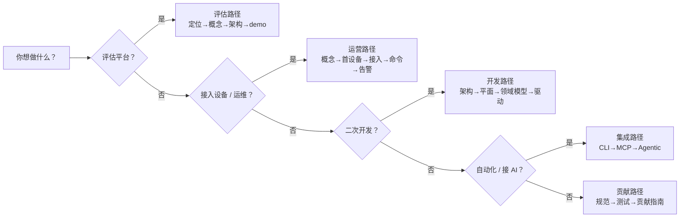

# 按角色选择路径

文档覆盖了从评估到贡献的全过程，但不同角色的最短路径不同。先找到最像你的那一行，照着给的顺序读，少走弯路。

下面这张决策图帮你快速对号入座，每条路径的详细阅读顺序见后续小节。

## 我想先评估这个平台

你关心它是什么、值不值得投入。建议顺序：

1. [平台定位](./) — 解决什么问题、与同类的差异
2. [核心概念](./concepts) — 对象模型与心智模型
3. [系统架构总览](../architecture/) — 一张图看清整体
4. 跑个 demo：按 [快速开始](../quickstart/) 起栈，导入示例数据 `iot-dc3/dc3/dependencies/postgres/demo/iot-dc3-demo.sql` 看真实数据

## 我要接入设备、做日常运营

你是设备接入或运维角色，目标是把设备接上、看到数据、能下命令、能告警：

1. [核心概念](./concepts) — 先分清驱动/模板/设备/位号
2. [第一个设备：端到端](../quickstart/first-device) — 用虚拟驱动跑通整条链路
3. [设备接入](../operation/device-onboarding) — 接入真实协议设备
4. [数据与命令](../operation/data-commands) — 采集、历史查询、读写命令
5. [告警与通知](../operation/alarms) — 配置规则与通知渠道

## 我是后端开发者，要二次开发

你要在平台上扩展能力（最常见是写一个新协议驱动）：

1. [系统架构总览](../architecture/) → [服务与拓扑](../architecture/services)
2. [数据平面](../architecture/data-plane) 与 [命令平面](../architecture/command-plane) — 两条核心链路
3. [领域模型](../architecture/domain-model) — DO/BO/VO、facade 边界、CRUD 动词约定
4. [驱动开发](../development/driver-authoring) — 从 `dc3-driver-virtual` 模板派生新驱动
5. [API 文档](../development/api-documentation) 与 [测试](../development/testing)

## 我要做自动化 / 接 AI

你想把平台能力接给脚本或 AI Agent：

1. [CLI 使用指南](../automation/cli) — 用 `dc3` 命令行操作平台
2. [AI Agent / MCP 集成](../ai/mcp) — 通过 MCP 让智能体安全读写设备
3. [Agentic 中心](../ai/agentic) — 平台内建的会话与工具调用

## 我想参与贡献

欢迎提交驱动、修复和文档改进：

1. [开发概览与规范](../development/) — 编码约定、提交规范
2. [测试](../development/testing) — 本地与 CI 测试门禁
3. [贡献指南](../community/contributing) · [行为准则](../community/code-of-conduct) · [安全策略](../community/security)
