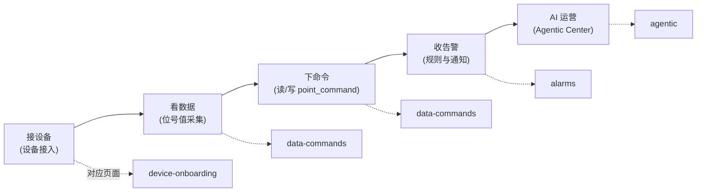

# 操作手册

这页是操作手册的门户：按"接入设备 → 看数据 → 下命令 → 收告警 → AI 运营"
这条主线，告诉你每一步去哪个页面、从哪个入口动手，以及"做对了应该看到什么"。读完你就有了一条可执行的任务路线，而不是一堆零散功能。

> 你在这里：已了解[平台定位](../introduction/)与[核心概念](../introduction/concepts)
> ，准备真正动手。如果本地环境还没起来，先完成 [快速开始](../quickstart/)。

## 一条主线，五个动作

平台的日常使用其实是一条线性任务流：先让一个驱动把现场设备接进来，确认能采到位号值；再下发读/写命令并验证回执；最后让规则引擎把异常变成告警，并可选地交给
Agentic Center 做自然语言运营。每一步都依赖前一步的产物——没有在线的设备，就没有位号值；没有位号值，命令和告警都无从谈起。



图里实线是任务推进顺序，虚线指向承载该动作的文档页。前四步是平台核心功能，第五步（AI 运营）是可选的进阶能力。

## 推荐路径

按下面的顺序走一遍，你会从"理解模型"一直推进到"AI 辅助运营"，每一步都有可验证的产物：

1. 先读 [核心概念](../introduction/concepts)，理清驱动、模板、设备、位号与位号值之间的固定关系——这是后续所有页面术语的底座。
2. 按 [设备接入](./device-onboarding) 完成一次接入（推荐先用 `dc3-driver-virtual` 跑通完整链路，再换真实协议驱动）。
3. 按 [数据与命令](./data-commands) 验证位号值采集、历史查询，以及读/写命令的下发与回执。
4. 按 [告警与通知](./alarms) 配置规则，让设备离线、位号越限、事件上报等异常自动产生告警并通知。
5. 如需接入大模型做自然语言运营，阅读 [Agentic 中心](../ai/agentic)。

### 成功是什么样

每一步都有一个肉眼可判断的"做对了"信号，不要跳过验证就往下走：

::: tip 三个成功信号

- **设备在线**：接入后设备的状态变为在线（心跳租约未过期），而不是一直停留在未知/离线。
- **位号有值**：`POST /api/v3/data/point_value/latest` 能查到该设备位号的最新值，`calValue`/`numValue` 与 `createTime` 非空。
- **命令有回执**：下发读/写命令后，凭返回的命令 ID 查 `GET /api/v3/data/point_command_history/get_by_command_id`，`status`
  为终态（SUCCESS/FAILED 等）、`responseValue` 有结果，而不是一直挂起。
  :::

::: warning 写命令失败不回显
写命令一旦执行失败，命令回执里的 `responseValue` 为 `null`、不会回显设备侧的值。排查时以 `status` 为准，别把"无回显"误判成"
还没执行"。
:::

## 运行入口

平台对外只有 Gateway 一个 HTTP 入口（默认 `8000`，由 `DC3_GATEWAY_PORT` 控制），它聚合 Auth / Manager / Data / Agentic
四个中心的路径，统一做鉴权头提取与租户上下文注入。开发时也可以绕过网关直连某个中心调试，但生产链路一律走网关。

下面这张表是参考索引，具体怎么用见各自的文档页：

| 入口             | 地址 / 说明                                                     | 用途                                                                                   |
|----------------|-------------------------------------------------------------|--------------------------------------------------------------------------------------|
| Gateway API    | `http://localhost:8000/api/v3/...`                          | 唯一对外 HTTP 入口；下文示例的 curl 都打到这里                                                        |
| Swagger UI     | `http://localhost:8000/swagger-ui.html`                     | 开发环境查看网关聚合后的 API（生产环境一般关闭）                                                           |
| 各中心直连调试        | Auth `8300` / Manager `8400` / Data `8500` / Agentic `8600` | 单独调试某个中心时直连其 HTTP 端口，绕过网关                                                            |
| MCP / OAuth 入口 | `POST /mcp`、`GET /.well-known/oauth-protected-resource`     | 供 AI Agent 经 OAuth 2.1 访问 MCP 工具（均在网关根路径，不经 `/api/v3`），见 [Agentic 中心](../ai/agentic) |
| Web UI         | 前端源码在本仓库 `dc3-web/` 目录                                      | 图形化操作界面，后端接口同样通过 Gateway 访问                                                          |

::: info Web UI 与 API 共用同一入口
图形界面位于本仓库 `dc3-web/` 目录，通过 Gateway 调用同一套 API。本手册以 API / curl 为准描述操作，UI 上的对应入口与之一一对应。
:::

## 从登录到一条命令：最小可跑示例

下面用黄金路径的真实接口，演示"拿 token → 下一条读命令"的最小闭环。登录分两步：先取盐，再用加盐后的口令换 token（有效期 12
小时）；之后所有受保护接口都要带上三个鉴权头。示例值（租户、用户名、ID）仅为占位，按你的实际数据替换。

::: code-group

```bash [1. 取盐 + 换 token]
# 取登录盐（公开端点，建议 5 分钟内使用）
curl -s -X POST http://localhost:8000/api/v3/auth/token/salt \
  -H 'Content-Type: application/json' \
  -d '{"tenant":"default","name":"dc3"}'

# 用加盐后的口令换 access token（12 小时有效）
curl -s -X POST http://localhost:8000/api/v3/auth/token/generate \
  -H 'Content-Type: application/json' \
  -d '{"tenant":"default","name":"dc3","salt":"<上一步返回的盐>","password":"<加盐口令>"}'
```

```bash [2. 下一条读命令]
# 带上三个鉴权头，对某设备的某位号发起一次读命令
curl -s -X POST http://localhost:8000/api/v3/data/point_command/read \
  -H 'Content-Type: application/json' \
  -H 'X-Auth-Tenant: <tenantId>' \
  -H 'X-Auth-Login: dc3' \
  -H 'X-Auth-Token: <上一步返回的 token>' \
  -d '{"deviceId":"<deviceId>","pointId":"<pointId>"}'
# 返回值为该命令的 ID（String），用它去 point_command_history 查回执
```

:::

::: warning 命令是异步的，有 10 秒默认时效
读/写命令下发后返回的是命令 ID，执行结果是异步回写的。命令的 `expireAt` 默认是 `now+10s`——超时未被驱动消费即作废。所以"返回命令
ID"只代表已受理，要看真正结果必须凭 ID 查 `point_command_history`。详见 [数据与命令](./data-commands)。
:::

## 延伸阅读

- [核心概念](../introduction/concepts) — 驱动 / 模板 / 设备 / 位号的固定关系与三层配置，先看它再操作
- [设备接入](./device-onboarding) — 第一步：用 virtual 驱动跑通一次完整接入
- [数据与命令](./data-commands) — 第二、三步：位号值采集、历史查询与读/写命令回执
- [告警与通知](./alarms) — 第四步：规则触发告警、通知通道与确认流程
- [Agentic 中心](../ai/agentic) — 可选进阶：自然语言运营、内置工具与 MCP 接入
