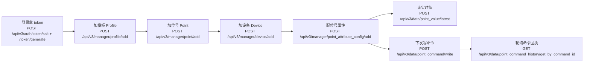

# 第一个设备：端到端

这页带你用平台自带的 **virtual（虚拟）驱动**走通一条完整链路：从登录拿
token，到建模板、建位号、建设备、配属性，再到读实时位号值、下发写命令。每一步都给可复制命令和"你应当看到"，照着做即可。

> 你在这里：已经[起好依赖栈](./)、理清了[核心概念](../introduction/concepts)。读完这页，你将拥有：**一个由 virtual
驱动接入的设备，能看到它产生的实时位号值，并能对可写位号下发写命令。**

## 这条路径长什么样

整条黄金路径是一串前后依赖的 HTTP 调用，全部经过网关 `dc3-gateway`（`:8000`）这唯一入口。前两步换到 token，中间四步在管理中心（Manager
Center）建好元数据，最后几步在数据中心（Data Center）读值与下发命令。先有这张全景图，后面每一步你都知道自己走到哪了。



::: info 约定
下文所有 `id`、token、返回值都是**示例**——你环境里生成的是雪花 ID（一长串数字），请用上一步真实返回的值替换。每个写接口返回的都是平台统一信封
`{ "ok": true, "code": "...", "message": "...", "data": "..." }`。注意 `add` 类接口**只返回成功状态、不回传新建实体的 ID**
——需要 ID 时，调对应的
`list` 接口按名称查回（下文每步都会给出回查命令）。
:::

## 第 0 步：起栈

先把数据库、消息队列和开发栈拉起来。这两条命令分别启动 PostgreSQL + RabbitMQ 依赖，以及网关 + 四个中心 + 驱动的开发栈（virtual
驱动随栈一起启动）。

```bash
make up-db && make up-dev
```

**你应当看到**：`podman ps` 列出 `dc3-postgres`、`dc3-rabbitmq`、`dc3-gateway`、`dc3-center-auth/manager/data/agentic` 以及若干
`dc3-driver-*` 容器处于运行态。网关在 `http://localhost:8000` 可达。

::: tip 用 dc3 CLI 时先指向网关
如果你用 `dc3` CLI，先告诉它网关地址（只需一次）：`dc3 config set gateway http://localhost:8000`。
:::

## 第 1–2 步：登录拿 token

登录分两步：先用租户 + 用户名取**盐（salt，建议 5 分钟内使用）**，再把**明文密码**连同盐一起提交换取**访问 token（12 小时有效）
**。拿到 token
后，后续所有受保护请求都要带三个鉴权头：`X-Auth-Tenant`、`X-Auth-Login`、`X-Auth-Token`。

::: code-group

```bash [curl]
# 1) 取盐
curl -s -X POST http://localhost:8000/api/v3/auth/token/salt \
  -H 'Content-Type: application/json' \
  -d '{"tenant":"default","name":"dc3"}'
# 示例返回：{"ok":true,"code":"...","message":"...","data":"a1b2c3d4e5"}

# 2) 用盐把密码哈希后换 token（哈希算法见鉴权文档，此处 PASSWORD_HASH 为示例）
curl -s -X POST http://localhost:8000/api/v3/auth/token/generate \
  -H 'Content-Type: application/json' \
  -d '{"tenant":"default","name":"dc3","salt":"a1b2c3d4e5","password":"<PASSWORD_HASH>"}'
# 示例返回：{"ok":true,"code":"...","message":"...","data":"<ACCESS_TOKEN>"}
```

```bash [dc3 CLI]
# CLI 封装了取盐 + 哈希 + 换 token 的全过程
dc3 auth login --tenant default --username dc3
# 交互式输入密码；登录后 token 自动保存

# 验证
dc3 auth status
dc3 auth token --header   # 打印 X-Auth-Tenant/X-Auth-Login/X-Auth-Token
```

:::

**你应当看到**：`/api/v3/auth/token/salt` 返回一个非空 salt 字符串；`/api/v3/auth/token/generate` 返回一个长 token
字符串（即上面的 `<ACCESS_TOKEN>`）。CLI 路径下 `dc3 auth status` 显示已登录。

::: warning 后续请求都要带鉴权头
下文 curl 为简洁起见把三个头抽成变量，请先在 shell 里设好（值用你上一步真实拿到的）：

```bash
H_TENANT='X-Auth-Tenant: default'
H_LOGIN='X-Auth-Login: dc3'
H_TOKEN='X-Auth-Token: <ACCESS_TOKEN>'   # 示例
```

:::

## 第 3 步：确认 virtual 驱动已注册

virtual 驱动随 `make up-dev` 启动后，会把自己注册到管理中心。建设备时要用它的 `driverId`，所以先把它查出来。

::: code-group

```bash [curl]
curl -s -X POST http://localhost:8000/api/v3/manager/driver/list \
  -H "$H_TENANT" -H "$H_LOGIN" -H "$H_TOKEN" \
  -H 'Content-Type: application/json' \
  -d '{"page":{"current":1,"size":20}}'
```

```bash [dc3 CLI]
dc3 driver list
```

:::

**你应当看到**：列表里有一个 `driverName` 为 `Virtual Driver`（带空格，来自驱动 `application.yml` 的 `dc3.driver.name`；其
`driverCode` 是路由标识 `VirtualDriver`，模块/服务名是 `dc3-driver-virtual`——三者分属不同字段）的驱动，记下它的 `id` ——
后面记作 `<DRIVER_ID>`（示例：`92010100000000001`）。virtual 是**驱动编写模板**，专用于测试与新驱动起步，无需连任何真实设备即可产生数据。

## 第 4 步：加模板（Profile）

模板描述一类设备有哪些能力。这里建一个最小模板，位号挂在它下面。`profileShareFlag` 用 `TENANT`（租户内共享），`enableFlag` 用
`ENABLE`（启用）。

::: code-group

```bash [curl]
curl -s -X POST http://localhost:8000/api/v3/manager/profile/add \
  -H "$H_TENANT" -H "$H_LOGIN" -H "$H_TOKEN" \
  -H 'Content-Type: application/json' \
  -d '{"profileName":"虚拟温控模板","profileShareFlag":"TENANT","enableFlag":"ENABLE"}'
# 示例返回：{"ok":true,"code":"ADD","message":"Added successfully","data":"Added successfully"}
# add 只回成功状态、不回传 ID。下一步要用 profileId，先按名称查回：
curl -s -X POST http://localhost:8000/api/v3/manager/profile/list \
  -H "$H_TENANT" -H "$H_LOGIN" -H "$H_TOKEN" -H 'Content-Type: application/json' \
  -d '{"profileName":"虚拟温控模板","page":{"current":1,"size":1}}'
# 从 records[0].id 拿到 profileId
```

```bash [dc3 CLI]
dc3 profile create --name "虚拟温控模板"
dc3 profile list --name "虚拟温控模板"   # 查回 profileId
```

:::

**你应当看到**：`add` 返回成功状态（`data` 为提示文案，不是 ID）；用 `profile/list` 按 `profileName`
回查，从 `records[0].id` 拿到模板 ID，记作 `<PROFILE_ID>`（示例：`81010100000000001`）。

::: tip profileShareFlag 取值
`ProfileShareTypeEnum` 为 `TENANT` / `DRIVER` / `USER`，决定该模板在租户内、驱动内还是用户内共享。
:::

## 第 5 步：加位号（Point）

位号是要采集或写入的数据项。**能不能写由位号自己的 `rwFlag` 决定**——这里建一个 `READ_WRITE` 的可写位号，后面才能对它下发写命令。
`pointTypeFlag` 用 `FLOAT`，挂到上一步的模板上，并带单位 `°C`。

::: code-group

```bash [curl]
curl -s -X POST http://localhost:8000/api/v3/manager/point/add \
  -H "$H_TENANT" -H "$H_LOGIN" -H "$H_TOKEN" \
  -H 'Content-Type: application/json' \
  -d '{
        "pointName":"温度",
        "pointTypeFlag":"FLOAT",
        "rwFlag":"READ_WRITE",
        "profileId":"81010100000000001",
        "valueDecimal":2,
        "unit":"°C",
        "enableFlag":"ENABLE"
      }'
# 示例返回：{"ok":true,"code":"ADD","message":"Added successfully","data":"Added successfully"}
# add 不回传 ID。下一步要用 pointId，按 pointName 查回：
curl -s -X POST http://localhost:8000/api/v3/manager/point/list \
  -H "$H_TENANT" -H "$H_LOGIN" -H "$H_TOKEN" -H 'Content-Type: application/json' \
  -d '{"pointName":"温度","page":{"current":1,"size":1}}'
# 从 records[0].id 拿到 pointId
```

```bash [dc3 CLI]
dc3 point create --name "温度" --profile-id "81010100000000001"
dc3 point list --name "温度"   # 查回 pointId
```

:::

**你应当看到**：`add` 返回成功状态；用 `point/list` 按 `pointName` 回查，从 `records[0].id` 拿到位号 ID，记作
`<POINT_ID>`（示例：`82010100000000001`）。

::: tip rwFlag 与 pointTypeFlag 取值
`RwTypeEnum` 为 `READ_ONLY` / `WRITE_ONLY` / `READ_WRITE`；对 `READ_ONLY` 位号下发写命令会被拒绝。`PointTypeEnum` 共 8 个值：
`STRING` / `BYTE` / `SHORT` / `INT` / `LONG` / `FLOAT` / `DOUBLE` / `BOOLEAN`。位号还可带换算（`baseValue` / `multiple`
），把原始值线性变换成工程值。
:::

## 第 6 步：加设备（Device）

设备是绑定了一个模板和一个驱动的具体实例。用上面的 `<DRIVER_ID>` 和 `<PROFILE_ID>` 建设备。

::: code-group

```bash [curl]
curl -s -X POST http://localhost:8000/api/v3/manager/device/add \
  -H "$H_TENANT" -H "$H_LOGIN" -H "$H_TOKEN" \
  -H 'Content-Type: application/json' \
  -d '{
        "deviceName":"虚拟温控设备-01",
        "driverId":"92010100000000001",
        "profileId":"81010100000000001",
        "enableFlag":"ENABLE"
      }'
# 示例返回：{"ok":true,"code":"ADD","message":"Added successfully","data":"Added successfully"}
# add 不回传 ID。下一步要用 deviceId，按 deviceName 查回：
curl -s -X POST http://localhost:8000/api/v3/manager/device/list \
  -H "$H_TENANT" -H "$H_LOGIN" -H "$H_TOKEN" -H 'Content-Type: application/json' \
  -d '{"deviceName":"虚拟温控设备-01","page":{"current":1,"size":1}}'
# 从 records[0].id 拿到 deviceId
```

```bash [dc3 CLI]
dc3 device create --name "虚拟温控设备-01" \
  --driver-id "92010100000000001" \
  --profile-id "81010100000000001"
dc3 device list --name "虚拟温控设备-01"   # 查回 deviceId
```

:::

**你应当看到**：`add` 返回成功状态；用 `device/list` 按 `deviceName` 回查，从 `records[0].id` 拿到设备 ID，记作
`<DEVICE_ID>`（示例：`83010100000000001`）。

## 第 7 步：配置位号属性

驱动在启动时声明了它**有哪些**配置项（属性，Attribute）；这一步是为**这台设备的这个位号**给某个属性填**具体值**
（配置，Config）。这就是把"位号"真正接到驱动采集逻辑上的那一刀。`attributeId` 来自 virtual 驱动注册的属性（可在驱动详情或属性列表里查到），
`configValue` 是给该属性的值。

::: code-group

```bash [curl]
curl -s -X POST http://localhost:8000/api/v3/manager/point_attribute_config/add \
  -H "$H_TENANT" -H "$H_LOGIN" -H "$H_TOKEN" \
  -H 'Content-Type: application/json' \
  -d '{
        "attributeId":"91010100000000001",
        "deviceId":"83010100000000001",
        "pointId":"82010100000000001",
        "configValue":"25.0",
        "enableFlag":"ENABLE"
      }'
# 示例返回：{"ok":true,"code":"ADD","message":"Added successfully","data":"Added successfully"}
# add 不回传 ID。配置写入后即生效，无需单独回查。
```

```bash [dc3 CLI]
# CLI 暂无独立的属性配置子命令，请用上面的 curl
```

:::

**你应当看到**：`add` 返回成功状态（不回传 ID）。配置生效后，virtual 驱动开始为该位号产生值。

::: info attributeId 从哪来
`attributeId` 指向 virtual 驱动在管理中心注册的某个位号属性（`PointAttribute`
）。不同驱动声明的属性不同——这正是[核心概念](../introduction/concepts)里"协议层 Attribute vs 实例层 Config"那条区分。示例
ID 仅作占位，请用你环境里 virtual 驱动真实注册的属性 ID。
:::

## 第 8 步：读实时位号值

值开始产生后，从数据中心读最新位号值。`/point_value/latest` 顶层按 `deviceId` / `pointId` 过滤，分页参数放在嵌套的 `page`
对象（`current` / `size`）里，返回 `Page<PointValueVO>`。

::: code-group

```bash [curl]
curl -s -X POST http://localhost:8000/api/v3/data/point_value/latest \
  -H "$H_TENANT" -H "$H_LOGIN" -H "$H_TOKEN" \
  -H 'Content-Type: application/json' \
  -d '{"deviceId":"83010100000000001","pointId":"82010100000000001","page":{"current":1,"size":10}}'
# 示例返回（PointValueVO 形态）：
# {"ok":true,"data":{"records":[
#   {"deviceId":"83010100000000001","pointId":"82010100000000001",
#    "rawValue":"25.0","calValue":"25.0","numValue":25.0,
#    "hasLatestValue":true,"createTime":"2026-06-22T08:30:00","operateTime":"2026-06-22T08:30:00"}
# ],"total":1,"current":1,"size":10}}
```

```bash [dc3 CLI]
dc3 point read 82010100000000001
```

:::

**你应当看到**：`records` 里至少一条 `PointValueVO`，含 `rawValue`（原始值）、`calValue`（工程值，字符串）、`numValue`
（数值投影，可空）以及采集时间 `createTime`。值随 virtual 驱动持续刷新。

## 第 9 步：下发写命令

最后对这个可写位号下发一次写命令。`/point_command/write` 接 `deviceId` / `pointId` / `value`，**立即返回一个命令
ID（`commandId`）**——它只代表"命令已受理"，不代表"已执行成功"。结果要拿命令 ID 去**轮询**回执接口
`/point_command_history/get_by_command_id`（`commandId` 即上一步返回的命令 ID）。

::: code-group

```bash [curl]
# 1) 下发写命令，立即拿到 commandId
curl -s -X POST http://localhost:8000/api/v3/data/point_command/write \
  -H "$H_TENANT" -H "$H_LOGIN" -H "$H_TOKEN" \
  -H 'Content-Type: application/json' \
  -d '{"deviceId":"83010100000000001","pointId":"82010100000000001","value":"26.5"}'
# 示例返回：{"ok":true,"code":"...","data":"cmd_20260622_a1b2c3d4"}

# 2) 用 commandId 轮询回执
curl -s -X GET 'http://localhost:8000/api/v3/data/point_command_history/get_by_command_id?commandId=cmd_20260622_a1b2c3d4' \
  -H "$H_TENANT" -H "$H_LOGIN" -H "$H_TOKEN"
# 示例返回（PointCommandHistoryVO 形态）：
# {"ok":true,"data":{
#   "commandId":"cmd_20260622_a1b2c3d4","deviceId":"83010100000000001","pointId":"82010100000000001",
#   "requestValue":"26.5","responseValue":"...","status":"...","finishTime":"2026-06-22T08:31:02"}}
```

```bash [dc3 CLI]
# 下发写值
dc3 point write 82010100000000001 --device-id 83010100000000001 --value 26.5
# 轮询回执
dc3 command history cmd_20260622_a1b2c3d4
```

:::

**你应当看到**：写命令立即返回 `commandId`；轮询回执直到 `status` 进入终态。到此，你已经完整走通了"读值 + 写命令"的双向链路。

::: danger 写命令的语义：异步、需轮询、失败不回显值

- 写命令是**异步**的：`/point_command/write` 立即返回 `commandId`，**不**等设备执行完。结果必须用该 ID 轮询
  `/point_command_history/get_by_command_id`。
- 命令有 **TTL**：`PointCommandDTO.expireAt` 默认 `now + 10s`，超时未执行即视为过期。
- **写失败时不回显写入值**：回执的执行结果为失败时不会带回一个"已写入的值"，不要把"拿到 commandId"误当成"写成功"。
- 只有 `rwFlag` 含写权限（`WRITE_ONLY` / `READ_WRITE`）的位号才接受写命令。
  :::

## 延伸阅读

- [设备接入](../operation/device-onboarding) — 把这条最小路径展开成真实驱动的完整接入流程
- [数据与命令](../operation/data-commands) — 采集落库与读写命令在两条平面上的完整机制与回执语义
- [CLI 使用指南](../automation/cli) — `dc3` CLI 的完整命令面与脚本化、AI 接入用法
